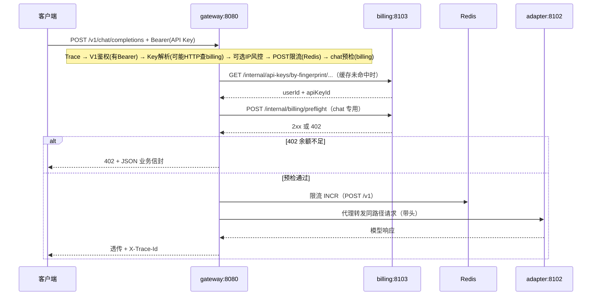
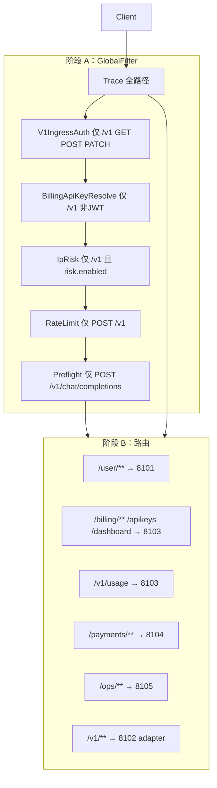

<!-- Generated by SpecStory, Markdown v2.1.0 -->

# 2026-05-14 13:47:46Z

<!-- Cursor IDE Session 75c18f09-fd91-473d-93e9-4cbab1b59800 (2026-05-14 13:47:46Z) -->

_**User**_

我是一个新手，请你带我阅读下当前这个项目

---

_**Agent (default)**_

正在读取项目的关键入口文档与目录结构，便于为你做一份新手友好的导读。


_**Agent (default)**_

<tool-use data-tool-type="read" data-tool-name="read_file_v2">
<details><summary>Tool use: **read_file_v2** • Read file: d:\AIProject\token-charge-system\token-charge-system\AGENTS.md</summary>

</details>
</tool-use>

<tool-use data-tool-type="read" data-tool-name="read_file_v2"><details>
<summary>Tool use: **read_file_v2**</summary>

</details></tool-use>

_**Agent (default)**_

<tool-use data-tool-type="read" data-tool-name="read_file_v2">
<details><summary>Tool use: **read_file_v2** • Read file: d:\AIProject\token-charge-system\token-charge-system\plan.md</summary>

</details>
</tool-use>

<tool-use data-tool-type="read" data-tool-name="read_file_v2"><details>
<summary>Tool use: **read_file_v2**</summary>

</details></tool-use>

_**Agent (default)**_

<tool-use data-tool-type="read" data-tool-name="read_file_v2">
<details><summary>Tool use: **read_file_v2** • Read file: d:\AIProject\token-charge-system\token-charge-system\ARCHITECTURE.md</summary>

</details>
</tool-use>

<tool-use data-tool-type="read" data-tool-name="read_file_v2"><details>
<summary>Tool use: **read_file_v2**</summary>

</details></tool-use>

_**Agent (default)**_

<tool-use data-tool-type="search" data-tool-name="glob_file_search">
<details>
<summary>Tool use: **glob_file_search** • Searched codebase "" • **11** results in **1** directory</summary>

Directory: **d:\AIProject\token-charge-system\token-charge-system** (11 files)

| File |
|------|
| `../.\common\common-mybatis\pom.xml` |
| `../.\billing-service\pom.xml` |
| `../.\ops-console\pom.xml` |
| `../.\adapter-service\pom.xml` |
| `../.\payment-service\pom.xml` |
| `../.\gateway-service\pom.xml` |
| `../.\pom.xml` |
| `../.\user-center-service\pom.xml` |
| `../.\common\common-web\pom.xml` |
| `../.\common\common-core\pom.xml` |
| `../.\common\common-security\pom.xml` |

</details>
</tool-use>

<tool-use data-tool-type="search" data-tool-name="glob_file_search"><details>
<summary>Tool use: **glob_file_search**</summary>

</details></tool-use>

_**Agent (default)**_

<think><details><summary>Thought Process</summary>
I have a clear understanding of the situation. I will now review the documentation and development plan.</details></think>

_**Agent (default)**_

<tool-use data-tool-type="read" data-tool-name="read_file_v2">
<details><summary>Tool use: **read_file_v2** • Read file: d:\AIProject\token-charge-system\token-charge-system\docs\dev-plan.md</summary>

</details>
</tool-use>

<tool-use data-tool-type="read" data-tool-name="read_file_v2"><details>
<summary>Tool use: **read_file_v2**</summary>

</details></tool-use>

_**Agent (default)**_

<tool-use data-tool-type="read" data-tool-name="read_file_v2">
<details><summary>Tool use: **read_file_v2** • Read file: d:\AIProject\token-charge-system\token-charge-system\PROGRESS.md</summary>

</details>
</tool-use>

<tool-use data-tool-type="read" data-tool-name="read_file_v2"><details>
<summary>Tool use: **read_file_v2**</summary>

</details></tool-use>

_**Agent (default)**_

下面按「新手怎么读」的顺序，带你把当前仓库串起来。

---

## 1. 这项目在做什么

这是一个用 **Java / Spring Boot** 搭的 **模型 API 中转平台**：  
开发者用 **API Key** 调统一接口（类似 OpenAI 风格），普通用户以后也能用 **Web 控制台**；背后会接 **多家国内模型供应商**（文档里以 DeepSeek 为首家），并配套 **用户、计费、支付、运营** 等能力。

一句话：**统一入口 → 网关 → 适配各家厂商 → 记账扣费 → 控制台展示**。

---

## 2. 建议的阅读顺序（文档即地图）

仓库把「怎么干」写得很清楚，按这个顺序读最省力：

| 顺序 | 文件 | 作用 |
|------|------|------|
| 1 | `AGENTS.md` | Agent/协作约定：**目录目标、分层规则、提交前要跑什么脚本** |
| 2 | `plan.md` | **产品与 PRD**：用户类型、接口规划、数据表、里程碑（偏「要什么」） |
| 3 | `ARCHITECTURE.md` | **当前工程里的模块表**：各 `*-service`、`common-*`、`console-web` 各干什么 |
| 4 | `docs/dev-plan.md` | **唯一执行路线图**：P0～P8 每阶段验收什么（偏「做到哪一步」） |
| 5 | `PROGRESS.md` | **每阶段实际交付了什么**、路径、怎么验收（和 dev-plan 勾选要对齐） |
| 6 | `docs/architecture/LAYERS.md` | **四层架构**：`presentation` / `application` / `domain` / `infrastructure` 谁依赖谁 |
| 7 | `docs/architecture/整体技术架构.md` | 想鸟瞰系统时读（你最近打开的「技术负债」文档是规划/还债清单，适合第二阶段再读） |

新手容易混淆的两点：**`plan.md` 偏产品全景**；**`ARCHITECTURE.md` + `dev-plan.md` 偏「仓库里已经/将要怎么落地」**。

---

## 3. 仓库目录大致长什么样

和 `AGENTS.md` 里的「目标态」一致，核心就是这些块：

- **`gateway-service/`**：对外网关（鉴权、限流、路由、转发等）
- **`user-center-service/`**：用户注册登录、JWT 等
- **`adapter-service/`**：各家模型厂商协议适配
- **`billing-service/`**：API Key、余额、订单、流水、计价等
- **`payment-service/`**：支付、回调、入账相关
- **`ops-console/`**：运营后台（偏后期阶段）
- **`console-web/`**：C 端前端（Vue 3 + Vite + TS）
- **`common/`**：`common-core`、`common-web`、`common-security`、`common-mybatis` 等共享能力
- **`deploy/`**：Docker Compose、初始化 SQL 等（**真实密钥不进库**）
- **`docs/`**：架构、安全、OpenAPI、TDD 设计文档等
- **`scripts/`**：例如 `check_boundaries.py`（分层边界）、`gc_scan.py`（扫描）

根目录还有 **`pom.xml`**：Maven 多模块，文档写明统一 **JDK 21**、Spring Boot **3.3.x** 等版本。

---

## 4. 代码怎么分层（读 Java 时用这个 lens）

每个 Java 服务里大致四层（详见 `LAYERS.md`）：

1. **`domain`**：业务规则与实体，**不**直接绑 Spring/HTTP/DB 实现细节  
2. **`application`**：用例编排、事务边界  
3. **`infrastructure`**：MyBatis、Redis、调外部 HTTP 等落地  
4. **`presentation`**：Controller、DTO、HTTP 入口  

新手逛代码时：先找 **`presentation` 的 Controller** 看 URL，再跟到 **`application` 的 *ApplicationService**，需要时再下钻 **`domain`** 和 **`infrastructure`**。

---

## 5. 项目进度是怎么记的（P0～P8）

- **`docs/dev-plan.md`**：阶段表（P0 工程地基 → P1 用户认证 → P2 网关+首家供应商 → … → P8 流式与验收等），并有一张 **「能力矩阵」**（例如扣费幂等、乐观锁、网关限流落在哪）。  
- **`PROGRESS.md`**：每个 **Px** 一章，写「做了什么、关键路径、怎么验收、遗留」。

从你本地的 `PROGRESS.md` 开头可见：**P0、P1 已标为完成**；后面还有 P2 及以后各章（你本地文件里会继续写各阶段详情）。读代码前先扫一眼对应 **Px** 章节，能知道「这段代码属于哪条业务线、验收口径是什么」。

---

## 6. 你接下来可以怎么动手（可选）

1. 用 IDE 打开根 **`pom.xml`**，看模块依赖关系。  
2. 挑一个服务，例如 **`user-center-service`**，从 `presentation` 里的用户相关接口一路跟到 `application`。  
3. 本地若跑环境：按 `PROGRESS.md` / `deploy` 里说明起 **MySQL、Redis** 等（具体以文档为准）。  
4. 改结构或加模块前：习惯跑 **`python scripts/check_boundaries.py`**，避免分层违规。

如果你愿意，下一步可以指定一个方向（例如「只讲网关请求从进到出」或「只讲计费一笔扣费怎么走」），我可以按调用链带你精读对应包和类名。

---

_**User**_

OK，那就讲下网关请求从进到出是什么样的

---

_**Agent (default)**_

<think><details><summary>Thought Process</summary>
A request enters the gateway and travels through various processing stages before exiting.</details></think>

_**Agent (default)**_

梳理 `gateway-service` 中请求从进入到转发的完整链路。


_**Agent (default)**_

<tool-use data-tool-type="search" data-tool-name="glob_file_search">
<details>
<summary>Tool use: **glob_file_search** • Searched codebase "" • **15** results in **1** directory</summary>

Directory: **d:\AIProject\token-charge-system\token-charge-system\gateway-service** (15 files)

| File |
|------|
| `../gateway-service\src\main\java\com\tokenhub\gateway\infrastructure\web\IpRiskAndQuotaGatewayFilter.java` |
| `../gateway-service\src\main\resources\application.yml` |
| `../gateway-service\src\main\java\com\tokenhub\gateway\infrastructure\web\BillingApiKeyResolveGatewayFilter.java` |
| `../gateway-service\src\main\java\com\tokenhub\gateway\infrastructure\cache\ApiKeyResolutionCache.java` |
| `../gateway-service\src\main\java\com\tokenhub\gateway\infrastructure\web\BillingPreflightGatewayFilter.java` |
| `../gateway-service\src\main\java\com\tokenhub\gateway\infrastructure\web\ApiKeyRedisRateLimitGatewayFilter.java` |
| `../gateway-service\src\main\java\com\tokenhub\gateway\infrastructure\web\GatewayIngressHeaders.java` |
| `../gateway-service\src\main\java\com\tokenhub\gateway\infrastructure\json\GatewayJsonResponses.java` |
| `../gateway-service\src\main\java\com\tokenhub\gateway\infrastructure\web\TraceGatewayFilter.java` |
| `../gateway-service\src\main\java\com\tokenhub\gateway\infrastructure\web\V1IngressAuthGatewayFilter.java` |
| `../gateway-service\src\main\java\com\tokenhub\gateway\application\package-info.java` |
| `../gateway-service\src\main\java\com\tokenhub\gateway\GatewayApplication.java` |
| `../gateway-service\src\main\java\com\tokenhub\gateway\infrastructure\package-info.java` |
| `../gateway-service\src\main\java\com\tokenhub\gateway\presentation\package-info.java` |
| `../gateway-service\src\main\java\com\tokenhub\gateway\domain\package-info.java` |

</details>
</tool-use>

<tool-use data-tool-type="search" data-tool-name="glob_file_search"><details>
<summary>Tool use: **glob_file_search**</summary>

</details></tool-use>

_**Agent (default)**_

<tool-use data-tool-type="unknown" data-tool-name="semantic_search_full">
<details>
<summary>Tool use: **semantic_search_full**</summary>


Parameters:

```json
{
  "explanation": "",
  "includePattern": "d:\\AIProject\\token-charge-system\\token-charge-system\\gateway-service",
  "query": "Where are Spring Cloud Gateway routes and filters defined?",
  "topK": 10
}
```
Result:

```json
{
  "codeResults": [
    {
      "codeBlock": {
        "contents": "server:\n  port: 8080\n\nspring:\n  application:\n    name: gateway-service\n  data:\n    redis:\n      host: ${REDIS_HOST:127.0.0.1}\n      port: ${REDIS_PORT:6379}\n      connect-timeout: 3s\n  codec:\n    max-in-memory-size: 16MB\n  cloud:\n    gateway:\n      routes:\n        # 更具体的路由须写在 /v1/** 之前\n        - id: billing-v1-usage\n          uri: ${TOKENS_GATEWAY_BILLING_URI:http://127.0.0.1:8103}\n          predicates:\n            - Path=/v1/usage\n        - id: billing-apikeys\n          uri: ${TOKENS_GATEWAY_BILLING_URI:http://127.0.0.1:8103}\n          predicates:\n            - Path=/apikeys,/apikeys/**\n        - id: billing-dashboard\n          uri: ${TOKENS_GATEWAY_BILLING_URI:http://127.0.0.1:8103}\n          predicates:\n            - Path=/dashboard/**\n        - id: billing-account-orders\n          uri: ${TOKENS_GATEWAY_BILLING_URI:http://127.0.0.1:8103}\n          predicates:\n            - Path=/billing/**\n        - id: payment-payments\n          uri: ${TOKENS_GATEWAY_PAYMENT_URI:http://127.0.0.1:8104}\n          predicates:\n            - Path=/payments/**\n        - id: ops-console\n          uri: ${TOKENS_GATEWAY_OPS_URI:http://127.0.0.1:8105}\n          predicates:\n            - Path=/ops/**\n        - id: adapter-v1\n          uri: ${TOKENS_GATEWAY_ADAPTER_URI:http://127.0.0.1:8102}\n          predicates:\n            - Path=/v1/**\n        - id: user-center\n          uri: ${TOKENS_GATEWAY_USER_URI:http://127.0.0.1:8101}\n          predicates:\n            - Path=/user/**\n      # 本版本 Gateway 将 connect-timeout / response-timeout 绑定为 Integer（毫秒）。\n      httpclient:\n        connect-timeout: 15000\n        response-timeout: ${TOKENS_GATEWAY_RESPONSE_TIMEOUT:600000}\n\ntokenhub:\n  gateway:\n    billing-base-url: ${TOKENS_GATEWAY_BILLING_URI:http://127.0.0.1:8103}",
        "detailedLines": [
          {
            "lineNumber": 1,
            "text": "server:"
          },
          {
            "lineNumber": 2,
            "text": "  port: 8080"
          },
          {
            "lineNumber": 3
          },
          {
            "lineNumber": 4,
            "text": "spring:"
          },
          {
            "lineNumber": 5,
            "text": "  application:"
          },
          {
            "lineNumber": 6,
            "text": "    name: gateway-service"
          },
          {
            "lineNumber": 7,
            "text": "  data:"
          },
          {
            "lineNumber": 8,
            "text": "    redis:"
          },
          {
            "lineNumber": 9,
            "text": "      host: ${REDIS_HOST:127.0.0.1}"
          },
          {
            "lineNumber": 10,
            "text": "      port: ${REDIS_PORT:6379}"
          },
          {
            "lineNumber": 11,
            "text": "      connect-timeout: 3s"
          },
          {
            "lineNumber": 12,
            "text": "  codec:"
          },
          {
            "lineNumber": 13,
            "text": "    max-in-memory-size: 16MB"
          },
          {
            "lineNumber": 14,
            "text": "  cloud:"
          },
          {
            "lineNumber": 15,
            "text": "    gateway:"
          },
          {
            "lineNumber": 16,
            "text": "      routes:"
          },
          {
            "lineNumber": 17,
            "text": "        # 更具体的路由须写在 /v1/** 之前"
          },
          {
            "lineNumber": 18,
            "text": "        - id: billing-v1-usage"
          },
          {
            "lineNumber": 19,
            "text": "          uri: ${TOKENS_GATEWAY_BILLING_URI:http://127.0.0.1:8103}"
          },
          {
            "lineNumber": 20,
            "text": "          predicates:"
          },
          {
            "lineNumber": 21,
            "text": "            - Path=/v1/usage"
          },
          {
            "lineNumber": 22,
            "text": "        - id: billing-apikeys"
          },
          {
            "lineNumber": 23,
            "text": "          uri: ${TOKENS_GATEWAY_BILLING_URI:http://127.0.0.1:8103}"
          },
          {
            "lineNumber": 24,
            "text": "          predicates:"
          },
          {
            "lineNumber": 25,
            "text": "            - Path=/apikeys,/apikeys/**"
          },
          {
            "lineNumber": 26,
            "text": "        - id: billing-dashboard"
          },
          {
            "lineNumber": 27,
            "text": "          uri: ${TOKENS_GATEWAY_BILLING_URI:http://127.0.0.1:8103}"
          },
          {
            "lineNumber": 28,
            "text": "          predicates:"
          },
          {
            "lineNumber": 29,
            "text": "            - Path=/dashboard/**"
          },
          {
            "lineNumber": 30,
            "text": "        - id: billing-account-orders"
          },
          {
            "lineNumber": 31,
            "text": "          uri: ${TOKENS_GATEWAY_BILLING_URI:http://127.0.0.1:8103}"
          },
          {
            "lineNumber": 32,
            "text": "          predicates:"
          },
          {
            "lineNumber": 33,
            "text": "            - Path=/billing/**"
          },
          {
            "lineNumber": 34,
            "text": "        - id: payment-payments"
          },
          {
            "lineNumber": 35,
            "text": "          uri: ${TOKENS_GATEWAY_PAYMENT_URI:http://127.0.0.1:8104}"
          },
          {
            "lineNumber": 36,
            "text": "          predicates:"
          },
          {
            "lineNumber": 37,
            "text": "            - Path=/payments/**"
          },
          {
            "lineNumber": 38,
            "text": "        - id: ops-console"
          },
          {
            "lineNumber": 39,
            "text": "          uri: ${TOKENS_GATEWAY_OPS_URI:http://127.0.0.1:8105}"
          },
          {
            "lineNumber": 40,
            "text": "          predicates:"
          },
          {
            "lineNumber": 41,
            "text": "            - Path=/ops/**"
          },
          {
            "lineNumber": 42,
            "text": "        - id: adapter-v1"
          },
          {
            "lineNumber": 43,
            "text": "          uri: ${TOKENS_GATEWAY_ADAPTER_URI:http://127.0.0.1:8102}"
          },
          {
            "lineNumber": 44,
            "text": "          predicates:"
          },
          {
            "lineNumber": 45,
            "text": "            - Path=/v1/**"
          },
          {
            "lineNumber": 46,
            "text": "        - id: user-center"
          },
          {
            "lineNumber": 47,
            "text": "          uri: ${TOKENS_GATEWAY_USER_URI:http://127.0.0.1:8101}"
          },
          {
            "lineNumber": 48,
            "text": "          predicates:"
          },
          {
            "lineNumber": 49,
            "text": "            - Path=/user/**"
          },
          {
            "lineNumber": 50,
            "text": "      # 本版本 Gateway 将 connect-timeout / response-timeout 绑定为 Integer（毫秒）。"
          },
          {
            "lineNumber": 51,
            "text": "      httpclient:"
          },
          {
            "lineNumber": 52,
            "text": "        connect-timeout: 15000"
          },
          {
            "lineNumber": 53,
            "text": "        response-timeout: ${TOKENS_GATEWAY_RESPONSE_TIMEOUT:600000}"
          },
          {
            "lineNumber": 54
          },
          {
            "lineNumber": 55,
            "text": "tokenhub:"
          },
          {
            "lineNumber": 56,
            "text": "  gateway:"
          },
          {
            "lineNumber": 57,
            "text": "    billing-base-url: ${TOKENS_GATEWAY_BILLING_URI:http://127.0.0.1:8103}"
          }
        ],
        "range": {
          "endPosition": {
            "line": 57
          },
          "startPosition": {}
        },
        "relativeWorkspacePath": ".\\gateway-service\\src\\main\\resources\\application.yml",
        "signatures": {}
      },
      "score": 0.5670109987258911
    },
    {
      "codeBlock": {
        "contents": "@Component\npublic class IpRiskAndQuotaGatewayFilter implements GlobalFilter, Ordered {\n\n  private static final DateTimeFormatter DAY_FORMAT = DateTimeFormatter.ofPattern(\"yyyyMMdd\");\n\n  private final ReactiveStringRedisTemplate redis;\n\n  @Value(\"${tokenhub.gateway.risk.enabled:false}\")\n  private boolean enabled;\n\n  @Value(\"${tokenhub.gateway.risk.enforce-allowlist:false}\")\n  private boolean enforceAllowlist;\n\n  @Value(\"${tokenhub.gateway.risk.daily-quota:0}\")\n  private long dailyQuota;\n\n  public IpRiskAndQuotaGatewayFilter(ReactiveStringRedisTemplate redis) {\n    this.redis = redis;\n  }\n\n  @Override\n  public Mono\u003cVoid\u003e filter(ServerWebExchange exchange, @NonNull GatewayFilterChain chain) {\n    if (!enabled) {\n      return chain.filter(exchange);\n    }\n    ServerHttpRequest request = exchange.getRequest();\n    if (HttpMethod.OPTIONS.matches(request.getMethod().name())) {\n      return chain.filter(exchange);\n    }\n    String path = request.getPath().pathWithinApplication().value();\n    if (!path.startsWith(\"/v1/\")) {\n      return chain.filter(exchange);\n    }\n\n    String ip = resolveClientIp(request);\n    return checkIp(ip)\n        .flatMap(decision -\u003e {\n          if (decision == IpDecision.DENY) {\n            return reject(exchange, HttpStatus.FORBIDDEN, \"I403002\", \"IP 已被拒绝\");\n          }\n          if (decision == IpDecision.NOT_ALLOWED) {\n            return reject(exchange, HttpStatus.FORBIDDEN, \"I403003\", \"IP 不在白名单\");\n          }\n          return checkDailyQuota(exchange, chain);\n        });\n  }\n\n  private enum IpDecision {\n    DENY,\n    NOT_ALLOWED,\n    OK\n  }\n\n  private Mono\u003cIpDecision\u003e checkIp(String ip)",
        "detailedLines": [
          {
            "lineNumber": 34,
            "text": "@Component"
          },
          {
            "lineNumber": 35,
            "text": "public class IpRiskAndQuotaGatewayFilter implements GlobalFilter, Ordered {"
          },
          {
            "lineNumber": 36
          },
          {
            "lineNumber": 37,
            "text": "  private static final DateTimeFormatter DAY_FORMAT = DateTimeFormatter.ofPattern(\"yyyyMMdd\");"
          },
          {
            "lineNumber": 38
          },
          {
            "lineNumber": 39,
            "text": "  private final ReactiveStringRedisTemplate redis;"
          },
          {
            "lineNumber": 40
          },
          {
            "lineNumber": 41,
            "text": "  @Value(\"${tokenhub.gateway.risk.enabled:false}\")"
          },
          {
            "lineNumber": 42,
            "text": "  private boolean enabled;"
          },
          {
            "lineNumber": 43
          },
          {
            "lineNumber": 44,
            "text": "  @Value(\"${tokenhub.gateway.risk.enforce-allowlist:false}\")"
          },
          {
            "lineNumber": 45,
            "text": "  private boolean enforceAllowlist;"
          },
          {
            "lineNumber": 46
          },
          {
            "lineNumber": 47,
            "text": "  @Value(\"${tokenhub.gateway.risk.daily-quota:0}\")"
          },
          {
            "lineNumber": 48,
            "text": "  private long dailyQuota;"
          },
          {
            "lineNumber": 49
          },
          {
            "lineNumber": 50,
            "text": "  public IpRiskAndQuotaGatewayFilter(ReactiveStringRedisTemplate redis) {"
          },
          {
            "lineNumber": 51,
            "text": "    this.redis = redis;"
          },
          {
            "lineNumber": 52,
            "text": "  }"
          },
          {
            "lineNumber": 53
          },
          {
            "lineNumber": 54,
            "text": "  @Override"
          },
          {
            "lineNumber": 55,
            "text": "  public Mono\u003cVoid\u003e filter(ServerWebExchange exchange, @NonNull GatewayFilterChain chain) {"
          },
          {
            "lineNumber": 56,
            "text": "    if (!enabled) {"
          },
          {
            "lineNumber": 57,
            "text": "      return chain.filter(exchange);"
          },
          {
            "lineNumber": 58,
            "text": "    }"
          },
          {
            "lineNumber": 59,
            "text": "    ServerHttpRequest request = exchange.getRequest();"
          },
          {
            "lineNumber": 60,
            "text": "    if (HttpMethod.OPTIONS.matches(request.getMethod().name())) {"
          },
          {
            "lineNumber": 61,
            "text": "      return chain.filter(exchange);"
          },
          {
            "lineNumber": 62,
            "text": "    }"
          },
          {
            "lineNumber": 63,
            "text": "    String path = request.getPath().pathWithinApplication().value();"
          },
          {
            "lineNumber": 64,
            "text": "    if (!path.startsWith(\"/v1/\")) {"
          },
          {
            "lineNumber": 65,
            "text": "      return chain.filter(exchange);"
          },
          {
            "lineNumber": 66,
            "text": "    }"
          },
          {
            "lineNumber": 67
          },
          {
            "lineNumber": 68,
            "text": "    String ip = resolveClientIp(request);"
          },
          {
            "lineNumber": 69,
            "text": "    return checkIp(ip)"
          },
          {
            "lineNumber": 70,
            "text": "        .flatMap(decision -\u003e {"
          },
          {
            "lineNumber": 71,
            "text": "          if (decision == IpDecision.DENY) {"
          },
          {
            "lineNumber": 72,
            "text": "            return reject(exchange, HttpStatus.FORBIDDEN, \"I403002\", \"IP 已被拒绝\");"
          },
          {
            "lineNumber": 73,
            "text": "          }"
          },
          {
            "lineNumber": 74,
            "text": "          if (decision == IpDecision.NOT_ALLOWED) {"
          },
          {
            "lineNumber": 75,
            "text": "            return reject(exchange, HttpStatus.FORBIDDEN, \"I403003\", \"IP 不在白名单\");"
          },
          {
            "lineNumber": 76,
            "text": "          }"
          },
          {
            "lineNumber": 77,
            "text": "          return checkDailyQuota(exchange, chain);"
          },
          {
            "lineNumber": 78,
            "text": "        });"
          },
          {
            "lineNumber": 79,
            "text": "  }"
          },
          {
            "lineNumber": 80
          },
          {
            "lineNumber": 81,
            "text": "  private enum IpDecision {"
          },
          {
            "lineNumber": 82,
            "text": "    DENY,"
          },
          {
            "lineNumber": 83,
            "text": "    NOT_ALLOWED,"
          },
          {
            "lineNumber": 84,
            "text": "    OK"
          },
          {
            "lineNumber": 85,
            "text": "  }"
          },
          {
            "lineNumber": 86
          },
          {
            "lineNumber": 87,
            "text": "  private Mono\u003cIpDecision\u003e checkIp(String ip)"
          }
        ],
        "range": {
          "endPosition": {
            "column": 45,
            "line": 86
          },
          "startPosition": {
            "column": 3,
            "line": 32
          }
        },
        "relativeWorkspacePath": ".\\gateway-service\\src\\main\\java\\com\\tokenhub\\gateway\\infrastructure\\web\\IpRiskAndQuotaGatewayFilter.java",
        "signatures": {}
      },
      "score": 0.47414711117744446
    },
    {
      "codeBlock": {
        "contents": "@Component\npublic class BillingApiKeyResolveGatewayFilter implements GlobalFilter, Ordered {\n\n  private final WebClient webClient;\n  private final ApiKeyResolutionCache resolutionCache;\n\n  @Value(\"${tokenhub.gateway.billing-base-url}\")\n  private String billingBaseUrl;\n\n  @Value(\"${tokenhub.gateway.internal-token}\")\n  private String internalToken;\n\n  public BillingApiKeyResolveGatewayFilter(\n      WebClient.Builder webClientBuilder,\n      ApiKeyResolutionCache resolutionCache\n  ) {\n    this.webClient = webClientBuilder.build();\n    this.resolutionCache = resolutionCache;\n  }\n\n  @Override\n  public Mono\u003cVoid\u003e filter(ServerWebExchange exchange, @NonNull GatewayFilterChain chain) {\n    ServerHttpRequest request = exchange.getRequest();\n    if (HttpMethod.OPTIONS.matches(request.getMethod().name())) {\n      return chain.filter(exchange);\n    }\n    if (!HttpMethod.GET.matches(request.getMethod().name())\n        \u0026\u0026 !HttpMethod.POST.matches(request.getMethod().name())\n        \u0026\u0026 !HttpMethod.PATCH.matches(request.getMethod().name())) {\n      return chain.filter(exchange);\n    }\n    String path = request.getPath().pathWithinApplication().value();\n    if (!path.startsWith(\"/v1/\")) {\n      return chain.filter(exchange);\n    }\n\n    String bearer = ApiKeySupport.extractBearer(request.getHeaders().getFirst(HttpHeaders.AUTHORIZATION));\n    if (bearer == null || bearer.isBlank()) {\n      return chain.filter(exchange);\n    }\n    if (looksLikeJwt(bearer)) {\n      return chain.filter(exchange);\n    }\n\n    String fingerprint = ApiKeySupport.sha256HexUtf8(bearer);\n\n    return resolutionCache.get(fingerprint)\n        .flatMap(entry -\u003e {\n          if (entry.negative()) {\n            return rejectUnauthorized(exchange);\n          }\n          return forwardWithResolution(exchange, chain, request, entry.userId(), entry.apiKeyId());\n        })\n        .switchIfEmpty(Mono.defer(() -\u003e resolveFromBilling(exchange, chain, request, fingerprint)));\n  }\n\n  private Mono\u003cVoid\u003e resolveFromBilling",
        "detailedLines": [
          {
            "lineNumber": 25,
            "text": "@Component"
          },
          {
            "lineNumber": 26,
            "text": "public class BillingApiKeyResolveGatewayFilter implements GlobalFilter, Ordered {"
          },
          {
            "lineNumber": 27
          },
          {
            "lineNumber": 28,
            "text": "  private final WebClient webClient;"
          },
          {
            "lineNumber": 29,
            "text": "  private final ApiKeyResolutionCache resolutionCache;"
          },
          {
            "lineNumber": 30
          },
          {
            "lineNumber": 31,
            "text": "  @Value(\"${tokenhub.gateway.billing-base-url}\")"
          },
          {
            "lineNumber": 32,
            "text": "  private String billingBaseUrl;"
          },
          {
            "lineNumber": 33
          },
          {
            "lineNumber": 34,
            "text": "  @Value(\"${tokenhub.gateway.internal-token}\")"
          },
          {
            "lineNumber": 35,
            "text": "  private String internalToken;"
          },
          {
            "lineNumber": 36
          },
          {
            "lineNumber": 37,
            "text": "  public BillingApiKeyResolveGatewayFilter("
          },
          {
            "lineNumber": 38,
            "text": "      WebClient.Builder webClientBuilder,"
          },
          {
            "lineNumber": 39,
            "text": "      ApiKeyResolutionCache resolutionCache"
          },
          {
            "lineNumber": 40,
            "text": "  ) {"
          },
          {
            "lineNumber": 41,
            "text": "    this.webClient = webClientBuilder.build();"
          },
          {
            "lineNumber": 42,
            "text": "    this.resolutionCache = resolutionCache;"
          },
          {
            "lineNumber": 43,
            "text": "  }"
          },
          {
            "lineNumber": 44
          },
          {
            "lineNumber": 45,
            "text": "  @Override"
          },
          {
            "lineNumber": 46,
            "text": "  public Mono\u003cVoid\u003e filter(ServerWebExchange exchange, @NonNull GatewayFilterChain chain) {"
          },
          {
            "lineNumber": 47,
            "text": "    ServerHttpRequest request = exchange.getRequest();"
          },
          {
            "lineNumber": 48,
            "text": "    if (HttpMethod.OPTIONS.matches(request.getMethod().name())) {"
          },
          {
            "lineNumber": 49,
            "text": "      return chain.filter(exchange);"
          },
          {
            "lineNumber": 50,
            "text": "    }"
          },
          {
            "lineNumber": 51,
            "text": "    if (!HttpMethod.GET.matches(request.getMethod().name())"
          },
          {
            "lineNumber": 52,
            "text": "        \u0026\u0026 !HttpMethod.POST.matches(request.getMethod().name())"
          },
          {
            "lineNumber": 53,
            "text": "        \u0026\u0026 !HttpMethod.PATCH.matches(request.getMethod().name())) {"
          },
          {
            "lineNumber": 54,
            "text": "      return chain.filter(exchange);"
          },
          {
            "lineNumber": 55,
            "text": "    }"
          },
          {
            "lineNumber": 56,
            "text": "    String path = request.getPath().pathWithinApplication().value();"
          },
          {
            "lineNumber": 57,
            "text": "    if (!path.startsWith(\"/v1/\")) {"
          },
          {
            "lineNumber": 58,
            "text": "      return chain.filter(exchange);"
          },
          {
            "lineNumber": 59,
            "text": "    }"
          },
          {
            "lineNumber": 60
          },
          {
            "lineNumber": 61,
            "text": "    String bearer = ApiKeySupport.extractBearer(request.getHeaders().getFirst(HttpHeaders.AUTHORIZATION));"
          },
          {
            "lineNumber": 62,
            "text": "    if (bearer == null || bearer.isBlank()) {"
          },
          {
            "lineNumber": 63,
            "text": "      return chain.filter(exchange);"
          },
          {
            "lineNumber": 64,
            "text": "    }"
          },
          {
            "lineNumber": 65,
            "text": "    if (looksLikeJwt(bearer)) {"
          },
          {
            "lineNumber": 66,
            "text": "      return chain.filter(exchange);"
          },
          {
            "lineNumber": 67,
            "text": "    }"
          },
          {
            "lineNumber": 68
          },
          {
            "lineNumber": 69,
            "text": "    String fingerprint = ApiKeySupport.sha256HexUtf8(bearer);"
          },
          {
            "lineNumber": 70
          },
          {
            "lineNumber": 71,
            "text": "    return resolutionCache.get(fingerprint)"
          },
          {
            "lineNumber": 72,
            "text": "        .flatMap(entry -\u003e {"
          },
          {
            "lineNumber": 73,
            "text": "          if (entry.negative()) {"
          },
          {
            "lineNumber": 74,
            "text": "            return rejectUnauthorized(exchange);"
          },
          {
            "lineNumber": 75,
            "text": "          }"
          },
          {
            "lineNumber": 76,
            "text": "          return forwardWithResolution(exchange, chain, request, entry.userId(), entry.apiKeyId());"
          },
          {
            "lineNumber": 77,
            "text": "        })"
          },
          {
            "lineNumber": 78,
            "text": "        .switchIfEmpty(Mono.defer(() -\u003e resolveFromBilling(exchange, chain, request, fingerprint)));"
          },
          {
            "lineNumber": 79,
            "text": "  }"
          },
          {
            "lineNumber": 80
          },
          {
            "lineNumber": 81,
            "text": "  private Mono\u003cVoid\u003e resolveFromBilling"
          }
        ],
        "range": {
          "endPosition": {
            "column": 39,
            "line": 80
          },
          "startPosition": {
            "column": 3,
            "line": 23
          }
        },
        "relativeWorkspacePath": ".\\gateway-service\\src\\main\\java\\com\\tokenhub\\gateway\\infrastructure\\web\\BillingApiKeyResolveGatewayFilter.java",
        "signatures": {}
      },
      "score": 0.43440520763397217
    },
    {
      "codeBlock": {
        "contents": "\u003c?xml version=\"1.0\" encoding=\"UTF-8\"?\u003e\n\u003cproject xmlns=\"http://maven.apache.org/POM/4.0.0\" xmlns:xsi=\"http://www.w3.org/2001/XMLSchema-instance\"\n         xsi:schemaLocation=\"http://maven.apache.org/POM/4.0.0 https://maven.apache.org/xsd/maven-4.0.0.xsd\"\u003e\n  \u003cmodelVersion\u003e4.0.0\u003c/modelVersion\u003e\n\n  \u003cparent\u003e\n    \u003cgroupId\u003ecom.tokenhub\u003c/groupId\u003e\n    \u003cartifactId\u003etoken-hub-platform\u003c/artifactId\u003e\n    \u003cversion\u003e0.1.0-SNAPSHOT\u003c/version\u003e\n    \u003crelativePath\u003e../pom.xml\u003c/relativePath\u003e\n  \u003c/parent\u003e\n\n  \u003cartifactId\u003egateway-service\u003c/artifactId\u003e\n  \u003cname\u003egateway-service\u003c/name\u003e\n  \u003cdescription\u003eReactive edge gateway — routes and cross-cutting ingress\u003c/description\u003e\n\n  \u003cdependencies\u003e\n    \u003cdependency\u003e\n      \u003cgroupId\u003ecom.tokenhub\u003c/groupId\u003e\n      \u003cartifactId\u003ecommon-security\u003c/artifactId\u003e\n    \u003c/dependency\u003e\n    \u003cdependency\u003e\n      \u003cgroupId\u003eorg.springframework.cloud\u003c/groupId\u003e\n      \u003cartifactId\u003espring-cloud-starter-gateway\u003c/artifactId\u003e\n    \u003c/dependency\u003e\n    \u003cdependency\u003e\n      \u003cgroupId\u003eorg.springframework.boot\u003c/groupId\u003e\n      \u003cartifactId\u003espring-boot-starter-webflux\u003c/artifactId\u003e\n    \u003c/dependency\u003e\n    \u003cdependency\u003e\n      \u003cgroupId\u003eorg.springframework.boot\u003c/groupId\u003e\n      \u003cartifactId\u003espring-boot-starter-data-redis-reactive\u003c/artifactId\u003e\n    \u003c/dependency\u003e\n    \u003cdependency\u003e\n      \u003cgroupId\u003eorg.springframework.boot\u003c/groupId\u003e\n      \u003cartifactId\u003espring-boot-starter-actuator\u003c/artifactId\u003e\n    \u003c/dependency\u003e\n    \u003cdependency\u003e\n      \u003cgroupId\u003eio.micrometer\u003c/groupId\u003e\n      \u003cartifactId\u003emicrometer-registry-prometheus\u003c/artifactId\u003e\n    \u003c/dependency\u003e\n    \u003cdependency\u003e\n      \u003cgroupId\u003eorg.springframework.boot\u003c/groupId\u003e\n      \u003cartifactId\u003espring-boot-starter-test\u003c/artifactId\u003e\n      \u003cscope\u003etest\u003c/scope\u003e\n    \u003c/dependency\u003e\n  \u003c/dependencies\u003e\n\n  \u003cbuild\u003e\n    \u003cplugins\u003e\n      \u003cplugin\u003e\n        ",
        "detailedLines": [
          {
            "lineNumber": 1,
            "text": "\u003c?xml version=\"1.0\" encoding=\"UTF-8\"?\u003e"
          },
          {
            "lineNumber": 2,
            "text": "\u003cproject xmlns=\"http://maven.apache.org/POM/4.0.0\" xmlns:xsi=\"http://www.w3.org/2001/XMLSchema-instance\""
          },
          {
            "lineNumber": 3,
            "text": "         xsi:schemaLocation=\"http://maven.apache.org/POM/4.0.0 https://maven.apache.org/xsd/maven-4.0.0.xsd\"\u003e"
          },
          {
            "lineNumber": 4,
            "text": "  \u003cmodelVersion\u003e4.0.0\u003c/modelVersion\u003e"
          },
          {
            "lineNumber": 5
          },
          {
            "lineNumber": 6,
            "text": "  \u003cparent\u003e"
          },
          {
            "lineNumber": 7,
            "text": "    \u003cgroupId\u003ecom.tokenhub\u003c/groupId\u003e"
          },
          {
            "lineNumber": 8,
            "text": "    \u003cartifactId\u003etoken-hub-platform\u003c/artifactId\u003e"
          },
          {
            "lineNumber": 9,
            "text": "    \u003cversion\u003e0.1.0-SNAPSHOT\u003c/version\u003e"
          },
          {
            "lineNumber": 10,
            "text": "    \u003crelativePath\u003e../pom.xml\u003c/relativePath\u003e"
          },
          {
            "lineNumber": 11,
            "text": "  \u003c/parent\u003e"
          },
          {
            "lineNumber": 12
          },
          {
            "lineNumber": 13,
            "text": "  \u003cartifactId\u003egateway-service\u003c/artifactId\u003e"
          },
          {
            "lineNumber": 14,
            "text": "  \u003cname\u003egateway-service\u003c/name\u003e"
          },
          {
            "lineNumber": 15,
            "text": "  \u003cdescription\u003eReactive edge gateway — routes and cross-cutting ingress\u003c/description\u003e"
          },
          {
            "lineNumber": 16
          },
          {
            "lineNumber": 17,
            "text": "  \u003cdependencies\u003e"
          },
          {
            "lineNumber": 18,
            "text": "    \u003cdependency\u003e"
          },
          {
            "lineNumber": 19,
            "text": "      \u003cgroupId\u003ecom.tokenhub\u003c/groupId\u003e"
          },
          {
            "lineNumber": 20,
            "text": "      \u003cartifactId\u003ecommon-security\u003c/artifactId\u003e"
          },
          {
            "lineNumber": 21,
            "text": "    \u003c/dependency\u003e"
          },
          {
            "lineNumber": 22,
            "text": "    \u003cdependency\u003e"
          },
          {
            "lineNumber": 23,
            "text": "      \u003cgroupId\u003eorg.springframework.cloud\u003c/groupId\u003e"
          },
          {
            "lineNumber": 24,
            "text": "      \u003cartifactId\u003espring-cloud-starter-gateway\u003c/artifactId\u003e"
          },
          {
            "lineNumber": 25,
            "text": "    \u003c/dependency\u003e"
          },
          {
            "lineNumber": 26,
            "text": "    \u003cdependency\u003e"
          },
          {
            "lineNumber": 27,
            "text": "      \u003cgroupId\u003eorg.springframework.boot\u003c/groupId\u003e"
          },
          {
            "lineNumber": 28,
            "text": "      \u003cartifactId\u003espring-boot-starter-webflux\u003c/artifactId\u003e"
          },
          {
            "lineNumber": 29,
            "text": "    \u003c/dependency\u003e"
          },
          {
            "lineNumber": 30,
            "text": "    \u003cdependency\u003e"
          },
          {
            "lineNumber": 31,
            "text": "      \u003cgroupId\u003eorg.springframework.boot\u003c/groupId\u003e"
          },
          {
            "lineNumber": 32,
            "text": "      \u003cartifactId\u003espring-boot-starter-data-redis-reactive\u003c/artifactId\u003e"
          },
          {
            "lineNumber": 33,
            "text": "    \u003c/dependency\u003e"
          },
          {
            "lineNumber": 34,
            "text": "    \u003cdependency\u003e"
          },
          {
            "lineNumber": 35,
            "text": "      \u003cgroupId\u003eorg.springframework.boot\u003c/groupId\u003e"
          },
          {
            "lineNumber": 36,
            "text": "      \u003cartifactId\u003espring-boot-starter-actuator\u003c/artifactId\u003e"
          },
          {
            "lineNumber": 37,
            "text": "    \u003c/dependency\u003e"
          },
          {
            "lineNumber": 38,
            "text": "    \u003cdependency\u003e"
          },
          {
            "lineNumber": 39,
            "text": "      \u003cgroupId\u003eio.micrometer\u003c/groupId\u003e"
          },
          {
            "lineNumber": 40,
            "text": "      \u003cartifactId\u003emicrometer-registry-prometheus\u003c/artifactId\u003e"
          },
          {
            "lineNumber": 41,
            "text": "    \u003c/dependency\u003e"
          },
          {
            "lineNumber": 42,
            "text": "    \u003cdependency\u003e"
          },
          {
            "lineNumber": 43,
            "text": "      \u003cgroupId\u003eorg.springframework.boot\u003c/groupId\u003e"
          },
          {
            "lineNumber": 44,
            "text": "      \u003cartifactId\u003espring-boot-starter-test\u003c/artifactId\u003e"
          },
          {
            "lineNumber": 45,
            "text": "      \u003cscope\u003etest\u003c/scope\u003e"
          },
          {
            "lineNumber": 46,
            "text": "    \u003c/dependency\u003e"
          },
          {
            "lineNumber": 47,
            "text": "  \u003c/dependencies\u003e"
          },
          {
            "lineNumber": 48
          },
          {
            "lineNumber": 49,
            "text": "  \u003cbuild\u003e"
          },
          {
            "lineNumber": 50,
            "text": "    \u003cplugins\u003e"
          },
          {
            "lineNumber": 51,
            "text": "      \u003cplugin\u003e"
          },
          {
            "lineNumber": 52,
            "text": "        "
          }
        ],
        "range": {
          "endPosition": {
            "column": 8,
            "line": 51
          },
          "startPosition": {}
        },
        "relativeWorkspacePath": ".\\gateway-service\\pom.xml",
        "signatures": {}
      },
      "score": 0.42744460701942444
    },
    {
      "codeBlock": {
        "contents": "import com.tokenhub.gateway.infrastructure.json.GatewayJsonResponses;\nimport java.net.InetSocketAddress;\nimport java.time.Duration;\nimport java.time.LocalDate;\nimport java.time.format.DateTimeFormatter;\nimport java.util.Objects;\nimport org.springframework.beans.factory.annotation.Value;\nimport org.springframework.cloud.gateway.filter.GatewayFilterChain;\nimport org.springframework.cloud.gateway.filter.GlobalFilter;\nimport org.springframework.core.Ordered;\nimport org.springframework.data.redis.core.ReactiveStringRedisTemplate;\nimport org.springframework.http.HttpMethod;\nimport org.springframework.http.HttpStatus;\nimport org.springframework.http.server.reactive.ServerHttpRequest;\nimport org.springframework.lang.NonNull;\nimport org.springframework.stereotype.Component;\nimport org.springframework.web.server.ServerWebExchange;\nimport reactor.core.publisher.Mono;\n\n/**\n * O-6 网关风控：IP 黑白名单 + 日级别配额（按 apiKeyId 维度）。\n *\n * \u003cul\u003e\n *   \u003cli\u003eIP 黑名单：Redis set {@code risk:ip:deny}（运营配置）。命中即 403。\n *   \u003cli\u003eIP 白名单：Redis set {@code risk:ip:allow}。配置 {@code enforce-allowlist=true} 时仅允许列内 IP；\n *       否则默认放行。\n *   \u003cli\u003e日配额：Redis 计数 {@code rl:daily:{apiKeyId}:{yyyyMMdd}}，超过默认值返回 429。\n * \u003c/ul\u003e\n *\n * \u003cp\u003e顺序：在 {@link BillingApiKeyResolveGatewayFilter}（解析 API Key 后）之后、{@link ApiKeyRedisRateLimitGatewayFilter} 之前。\n */\n@Component\npublic class IpRiskAndQuotaGatewayFilter",
        "detailedLines": [
          {
            "lineNumber": 3,
            "text": "import com.tokenhub.gateway.infrastructure.json.GatewayJsonResponses;"
          },
          {
            "lineNumber": 4,
            "text": "import java.net.InetSocketAddress;"
          },
          {
            "lineNumber": 5,
            "text": "import java.time.Duration;"
          },
          {
            "lineNumber": 6,
            "text": "import java.time.LocalDate;"
          },
          {
            "lineNumber": 7,
            "text": "import java.time.format.DateTimeFormatter;"
          },
          {
            "lineNumber": 8,
            "text": "import java.util.Objects;"
          },
          {
            "lineNumber": 9,
            "text": "import org.springframework.beans.factory.annotation.Value;"
          },
          {
            "lineNumber": 10,
            "text": "import org.springframework.cloud.gateway.filter.GatewayFilterChain;"
          },
          {
            "lineNumber": 11,
            "text": "import org.springframework.cloud.gateway.filter.GlobalFilter;"
          },
          {
            "lineNumber": 12,
            "text": "import org.springframework.core.Ordered;"
          },
          {
            "lineNumber": 13,
            "text": "import org.springframework.data.redis.core.ReactiveStringRedisTemplate;"
          },
          {
            "lineNumber": 14,
            "text": "import org.springframework.http.HttpMethod;"
          },
          {
            "lineNumber": 15,
            "text": "import org.springframework.http.HttpStatus;"
          },
          {
            "lineNumber": 16,
            "text": "import org.springframework.http.server.reactive.ServerHttpRequest;"
          },
          {
            "lineNumber": 17,
            "text": "import org.springframework.lang.NonNull;"
          },
          {
            "lineNumber": 18,
            "text": "import org.springframework.stereotype.Component;"
          },
          {
            "lineNumber": 19,
            "text": "import org.springframework.web.server.ServerWebExchange;"
          },
          {
            "lineNumber": 20,
            "text": "import reactor.core.publisher.Mono;"
          },
          {
            "lineNumber": 21
          },
          {
            "lineNumber": 22,
            "text": "/**"
          },
          {
            "lineNumber": 23,
            "text": " * O-6 网关风控：IP 黑白名单 + 日级别配额（按 apiKeyId 维度）。"
          },
          {
            "lineNumber": 24,
            "text": " *"
          },
          {
            "lineNumber": 25,
            "text": " * \u003cul\u003e"
          },
          {
            "lineNumber": 26,
            "text": " *   \u003cli\u003eIP 黑名单：Redis set {@code risk:ip:deny}（运营配置）。命中即 403。"
          },
          {
            "lineNumber": 27,
            "text": " *   \u003cli\u003eIP 白名单：Redis set {@code risk:ip:allow}。配置 {@code enforce-allowlist=true} 时仅允许列内 IP；"
          },
          {
            "lineNumber": 28,
            "text": " *       否则默认放行。"
          },
          {
            "lineNumber": 29,
            "text": " *   \u003cli\u003e日配额：Redis 计数 {@code rl:daily:{apiKeyId}:{yyyyMMdd}}，超过默认值返回 429。"
          },
          {
            "lineNumber": 30,
            "text": " * \u003c/ul\u003e"
          },
          {
            "lineNumber": 31,
            "text": " *"
          },
          {
            "lineNumber": 32,
            "text": " * \u003cp\u003e顺序：在 {@link BillingApiKeyResolveGatewayFilter}（解析 API Key 后）之后、{@link ApiKeyRedisRateLimitGatewayFilter} 之前。"
          },
          {
            "lineNumber": 33,
            "text": " */"
          },
          {
            "lineNumber": 34,
            "text": "@Component"
          },
          {
            "lineNumber": 35,
            "text": "public class IpRiskAndQuotaGatewayFilter"
          }
        ],
        "range": {
          "endPosition": {
            "column": 40,
            "line": 34
          },
          "startPosition": {
            "column": 48
          }
        },
        "relativeWorkspacePath": ".\\gateway-service\\src\\main\\java\\com\\tokenhub\\gateway\\infrastructure\\web\\IpRiskAndQuotaGatewayFilter.java",
        "signatures": {}
      },
      "score": 0.42130035161972046
    },
    {
      "codeBlock": {
        "contents": "package com.tokenhub.gateway.infrastructure.web;\n\nimport java.util.UUID;\nimport org.springframework.cloud.gateway.filter.GatewayFilterChain;\nimport org.springframework.cloud.gateway.filter.GlobalFilter;\nimport org.springframework.core.Ordered;\nimport org.springframework.http.server.reactive.ServerHttpRequest;\nimport org.springframework.http.server.reactive.ServerHttpResponse;\nimport org.springframework.lang.NonNull;\nimport org.springframework.stereotype.Component;\nimport org.springframework.web.server.ServerWebExchange;\nimport reactor.core.publisher.Mono;\n\n@Component\npublic class TraceGatewayFilter implements GlobalFilter, Ordered {\n\n  public static final String TRACE_HEADER = \"X-Trace-Id\";\n  public static final String TRACE_ATTR = \"gateway.traceId\";\n\n  @Override\n  public Mono\u003cVoid\u003e filter(ServerWebExchange exchange, GatewayFilterChain chain) {\n    ServerHttpRequest request = exchange.getRequest();\n    String incoming = request.getHeaders().getFirst(TRACE_HEADER);\n    String traceId = (incoming == null || incoming.isBlank()) ? UUID.randomUUID().toString() : incoming.trim();\n\n    ServerHttpRequest mutated = request.mutate().header(TRACE_HEADER, traceId).build();\n    exchange.getAttributes().put(TRACE_ATTR, traceId);\n\n    ServerHttpResponse response = exchange.getResponse();\n    response.beforeCommit(() -\u003e {\n      response.getHeaders().set(TRACE_HEADER, traceId);\n      return Mono.empty();\n    });\n\n    return chain.filter(exchange.mutate().request(mutated).build());\n  }\n\n  @Override\n  public int getOrder() {\n    return Ordered.HIGHEST_PRECEDENCE;\n  }\n}",
        "detailedLines": [
          {
            "lineNumber": 1,
            "text": "package com.tokenhub.gateway.infrastructure.web;"
          },
          {
            "lineNumber": 2
          },
          {
            "lineNumber": 3,
            "text": "import java.util.UUID;"
          },
          {
            "lineNumber": 4,
            "text": "import org.springframework.cloud.gateway.filter.GatewayFilterChain;"
          },
          {
            "lineNumber": 5,
            "text": "import org.springframework.cloud.gateway.filter.GlobalFilter;"
          },
          {
            "lineNumber": 6,
            "text": "import org.springframework.core.Ordered;"
          },
          {
            "lineNumber": 7,
            "text": "import org.springframework.http.server.reactive.ServerHttpRequest;"
          },
          {
            "lineNumber": 8,
            "text": "import org.springframework.http.server.reactive.ServerHttpResponse;"
          },
          {
            "lineNumber": 9,
            "text": "import org.springframework.lang.NonNull;"
          },
          {
            "lineNumber": 10,
            "text": "import org.springframework.stereotype.Component;"
          },
          {
            "lineNumber": 11,
            "text": "import org.springframework.web.server.ServerWebExchange;"
          },
          {
            "lineNumber": 12,
            "text": "import reactor.core.publisher.Mono;"
          },
          {
            "lineNumber": 13
          },
          {
            "lineNumber": 14,
            "text": "@Component"
          },
          {
            "lineNumber": 15,
            "text": "public class TraceGatewayFilter implements GlobalFilter, Ordered {"
          },
          {
            "lineNumber": 16
          },
          {
            "lineNumber": 17,
            "text": "  public static final String TRACE_HEADER = \"X-Trace-Id\";"
          },
          {
            "lineNumber": 18,
            "text": "  public static final String TRACE_ATTR = \"gateway.traceId\";"
          },
          {
            "lineNumber": 19
          },
          {
            "lineNumber": 20,
            "text": "  @Override"
          },
          {
            "lineNumber": 21,
            "text": "  public Mono\u003cVoid\u003e filter(ServerWebExchange exchange, GatewayFilterChain chain) {"
          },
          {
            "lineNumber": 22,
            "text": "    ServerHttpRequest request = exchange.getRequest();"
          },
          {
            "lineNumber": 23,
            "text": "    String incoming = request.getHeaders().getFirst(TRACE_HEADER);"
          },
          {
            "lineNumber": 24,
            "text": "    String traceId = (incoming == null || incoming.isBlank()) ? UUID.randomUUID().toString() : incoming.trim();"
          },
          {
            "lineNumber": 25
          },
          {
            "lineNumber": 26,
            "text": "    ServerHttpRequest mutated = request.mutate().header(TRACE_HEADER, traceId).build();"
          },
          {
            "lineNumber": 27,
            "text": "    exchange.getAttributes().put(TRACE_ATTR, traceId);"
          },
          {
            "lineNumber": 28
          },
          {
            "lineNumber": 29,
            "text": "    ServerHttpResponse response = exchange.getResponse();"
          },
          {
            "lineNumber": 30,
            "text": "    response.beforeCommit(() -\u003e {"
          },
          {
            "lineNumber": 31,
            "text": "      response.getHeaders().set(TRACE_HEADER, traceId);"
          },
          {
            "lineNumber": 32,
            "text": "      return Mono.empty();"
          },
          {
            "lineNumber": 33,
            "text": "    });"
          },
          {
            "lineNumber": 34
          },
          {
            "lineNumber": 35,
            "text": "    return chain.filter(exchange.mutate().request(mutated).build());"
          },
          {
            "lineNumber": 36,
            "text": "  }"
          },
          {
            "lineNumber": 37
          },
          {
            "lineNumber": 38,
            "text": "  @Override"
          },
          {
            "lineNumber": 39,
            "text": "  public int getOrder() {"
          },
          {
            "lineNumber": 40,
            "text": "    return Ordered.HIGHEST_PRECEDENCE;"
          },
          {
            "lineNumber": 41,
            "text": "  }"
          },
          {
            "lineNumber": 42,
            "text": "}"
          }
        ],
        "range": {
          "endPosition": {
            "column": 1,
            "line": 41
          },
          "startPosition": {}
        },
        "relativeWorkspacePath": ".\\gateway-service\\src\\main\\java\\com\\tokenhub\\gateway\\infrastructure\\web\\TraceGatewayFilter.java",
        "signatures": {}
      },
      "score": 0.41721001267433167
    },
    {
      "codeBlock": {
        "contents": "@Component\npublic class V1IngressAuthGatewayFilter implements GlobalFilter, Ordered {\n\n  private static final String USER_ID_HEADER = \"X-User-Id\";\n\n  private final SecretKey jwtSigningKey;\n\n  public V1IngressAuthGatewayFilter(@Value(\"${JWT_SECRET:}\") String jwtSecretUtf8) {\n    if (jwtSecretUtf8 == null || jwtSecretUtf8.isBlank()) {\n      this.jwtSigningKey = null;\n    } else {\n      this.jwtSigningKey = JwtSupport.hmacShaKeyFromUtf8(jwtSecretUtf8, 32);\n    }\n  }\n\n  @Override\n  public Mono\u003cVoid\u003e filter(ServerWebExchange exchange, @NonNull GatewayFilterChain chain) {\n    ServerHttpRequest request = exchange.getRequest();\n    if (HttpMethod.OPTIONS.matches(request.getMethod().name())) {\n      return chain.filter(exchange);\n    }\n    if (!HttpMethod.GET.matches(request.getMethod().name())\n        \u0026\u0026 !HttpMethod.POST.matches(request.getMethod().name())\n        \u0026\u0026 !HttpMethod.PATCH.matches(request.getMethod().name())) {\n      return chain.filter(exchange);\n    }\n    String path = request.getPath().pathWithinApplication().value();\n    if (!path.startsWith(\"/v1/\")) {\n      return chain.filter(exchange);\n    }\n\n    String auth = request.getHeaders().getFirst(HttpHeaders.AUTHORIZATION);\n    String bearer = ApiKeySupport.extractBearer(auth);\n    if (bearer == null || bearer.isBlank()) {\n      return unauthorized(exchange, \"缺少 Authorization Bearer\");\n    }\n\n    if (looksLikeJwt(bearer)) {\n      if (jwtSigningKey == null)",
        "detailedLines": [
          {
            "lineNumber": 25,
            "text": "@Component"
          },
          {
            "lineNumber": 26,
            "text": "public class V1IngressAuthGatewayFilter implements GlobalFilter, Ordered {"
          },
          {
            "lineNumber": 27
          },
          {
            "lineNumber": 28,
            "text": "  private static final String USER_ID_HEADER = \"X-User-Id\";"
          },
          {
            "lineNumber": 29
          },
          {
            "lineNumber": 30,
            "text": "  private final SecretKey jwtSigningKey;"
          },
          {
            "lineNumber": 31
          },
          {
            "lineNumber": 32,
            "text": "  public V1IngressAuthGatewayFilter(@Value(\"${JWT_SECRET:}\") String jwtSecretUtf8) {"
          },
          {
            "lineNumber": 33,
            "text": "    if (jwtSecretUtf8 == null || jwtSecretUtf8.isBlank()) {"
          },
          {
            "lineNumber": 34,
            "text": "      this.jwtSigningKey = null;"
          },
          {
            "lineNumber": 35,
            "text": "    } else {"
          },
          {
            "lineNumber": 36,
            "text": "      this.jwtSigningKey = JwtSupport.hmacShaKeyFromUtf8(jwtSecretUtf8, 32);"
          },
          {
            "lineNumber": 37,
            "text": "    }"
          },
          {
            "lineNumber": 38,
            "text": "  }"
          },
          {
            "lineNumber": 39
          },
          {
            "lineNumber": 40,
            "text": "  @Override"
          },
          {
            "lineNumber": 41,
            "text": "  public Mono\u003cVoid\u003e filter(ServerWebExchange exchange, @NonNull GatewayFilterChain chain) {"
          },
          {
            "lineNumber": 42,
            "text": "    ServerHttpRequest request = exchange.getRequest();"
          },
          {
            "lineNumber": 43,
            "text": "    if (HttpMethod.OPTIONS.matches(request.getMethod().name())) {"
          },
          {
            "lineNumber": 44,
            "text": "      return chain.filter(exchange);"
          },
          {
            "lineNumber": 45,
            "text": "    }"
          },
          {
            "lineNumber": 46,
            "text": "    if (!HttpMethod.GET.matches(request.getMethod().name())"
          },
          {
            "lineNumber": 47,
            "text": "        \u0026\u0026 !HttpMethod.POST.matches(request.getMethod().name())"
          },
          {
            "lineNumber": 48,
            "text": "        \u0026\u0026 !HttpMethod.PATCH.matches(request.getMethod().name())) {"
          },
          {
            "lineNumber": 49,
            "text": "      return chain.filter(exchange);"
          },
          {
            "lineNumber": 50,
            "text": "    }"
          },
          {
            "lineNumber": 51,
            "text": "    String path = request.getPath().pathWithinApplication().value();"
          },
          {
            "lineNumber": 52,
            "text": "    if (!path.startsWith(\"/v1/\")) {"
          },
          {
            "lineNumber": 53,
            "text": "      return chain.filter(exchange);"
          },
          {
            "lineNumber": 54,
            "text": "    }"
          },
          {
            "lineNumber": 55
          },
          {
            "lineNumber": 56,
            "text": "    String auth = request.getHeaders().getFirst(HttpHeaders.AUTHORIZATION);"
          },
          {
            "lineNumber": 57,
            "text": "    String bearer = ApiKeySupport.extractBearer(auth);"
          },
          {
            "lineNumber": 58,
            "text": "    if (bearer == null || bearer.isBlank()) {"
          },
          {
            "lineNumber": 59,
            "text": "      return unauthorized(exchange, \"缺少 Authorization Bearer\");"
          },
          {
            "lineNumber": 60,
            "text": "    }"
          },
          {
            "lineNumber": 61
          },
          {
            "lineNumber": 62,
            "text": "    if (looksLikeJwt(bearer)) {"
          },
          {
            "lineNumber": 63,
            "text": "      if (jwtSigningKey == null)"
          }
        ],
        "range": {
          "endPosition": {
            "column": 32,
            "line": 62
          },
          "startPosition": {
            "column": 3,
            "line": 23
          }
        },
        "relativeWorkspacePath": ".\\gateway-service\\src\\main\\java\\com\\tokenhub\\gateway\\infrastructure\\web\\V1IngressAuthGatewayFilter.java",
        "signatures": {}
      },
      "score": 0.40587130188941956
    },
    {
      "codeBlock": {
        "contents": "@Component\npublic class ApiKeyRedisRateLimitGatewayFilter implements GlobalFilter, Ordered {\n\n  private final ReactiveStringRedisTemplate redis;\n\n  @Value(\"${tokenhub.gateway.rate-limit-per-second:60}\")\n  private int perSecond;\n\n  public ApiKeyRedisRateLimitGatewayFilter(ReactiveStringRedisTemplate redis) {\n    this.redis = redis;\n  }\n\n  @Override\n  public Mono\u003cVoid\u003e filter(ServerWebExchange exchange, @NonNull GatewayFilterChain chain) {\n    var request = exchange.getRequest();\n    if (!HttpMethod.POST.matches(request.getMethod().name())) {\n      return chain.filter(exchange);\n    }\n    String path = request.getPath().pathWithinApplication().value();\n    if (!path.startsWith(\"/v1/\")) {\n      return chain.filter(exchange);\n    }\n\n    String apiKeyId = request.getHeaders().getFirst(GatewayIngressHeaders.API_KEY_ID);\n    String userId = request.getHeaders().getFirst(GatewayIngressHeaders.USER_ID);\n    String suffix;\n    if (apiKeyId != null \u0026\u0026 !apiKeyId.isBlank()) {\n      suffix = \"ak:\" + apiKeyId.trim();\n    } else if (userId != null \u0026\u0026 !userId.isBlank()) {\n      suffix = \"uid:\" + userId.trim();\n    } else {\n      return chain.filter(exchange);\n    }\n\n    long sec = Instant.now().getEpochSecond();\n    String key = \"rl:\" + suffix + \":s:\" + sec;\n\n    return redis.opsForValue()\n        .increment(key)\n        .flatMap",
        "detailedLines": [
          {
            "lineNumber": 22,
            "text": "@Component"
          },
          {
            "lineNumber": 23,
            "text": "public class ApiKeyRedisRateLimitGatewayFilter implements GlobalFilter, Ordered {"
          },
          {
            "lineNumber": 24
          },
          {
            "lineNumber": 25,
            "text": "  private final ReactiveStringRedisTemplate redis;"
          },
          {
            "lineNumber": 26
          },
          {
            "lineNumber": 27,
            "text": "  @Value(\"${tokenhub.gateway.rate-limit-per-second:60}\")"
          },
          {
            "lineNumber": 28,
            "text": "  private int perSecond;"
          },
          {
            "lineNumber": 29
          },
          {
            "lineNumber": 30,
            "text": "  public ApiKeyRedisRateLimitGatewayFilter(ReactiveStringRedisTemplate redis) {"
          },
          {
            "lineNumber": 31,
            "text": "    this.redis = redis;"
          },
          {
            "lineNumber": 32,
            "text": "  }"
          },
          {
            "lineNumber": 33
          },
          {
            "lineNumber": 34,
            "text": "  @Override"
          },
          {
            "lineNumber": 35,
            "text": "  public Mono\u003cVoid\u003e filter(ServerWebExchange exchange, @NonNull GatewayFilterChain chain) {"
          },
          {
            "lineNumber": 36,
            "text": "    var request = exchange.getRequest();"
          },
          {
            "lineNumber": 37,
            "text": "    if (!HttpMethod.POST.matches(request.getMethod().name())) {"
          },
          {
            "lineNumber": 38,
            "text": "      return chain.filter(exchange);"
          },
          {
            "lineNumber": 39,
            "text": "    }"
          },
          {
            "lineNumber": 40,
            "text": "    String path = request.getPath().pathWithinApplication().value();"
          },
          {
            "lineNumber": 41,
            "text": "    if (!path.startsWith(\"/v1/\")) {"
          },
          {
            "lineNumber": 42,
            "text": "      return chain.filter(exchange);"
          },
          {
            "lineNumber": 43,
            "text": "    }"
          },
          {
            "lineNumber": 44
          },
          {
            "lineNumber": 45,
            "text": "    String apiKeyId = request.getHeaders().getFirst(GatewayIngressHeaders.API_KEY_ID);"
          },
          {
            "lineNumber": 46,
            "text": "    String userId = request.getHeaders().getFirst(GatewayIngressHeaders.USER_ID);"
          },
          {
            "lineNumber": 47,
            "text": "    String suffix;"
          },
          {
            "lineNumber": 48,
            "text": "    if (apiKeyId != null \u0026\u0026 !apiKeyId.isBlank()) {"
          },
          {
            "lineNumber": 49,
            "text": "      suffix = \"ak:\" + apiKeyId.trim();"
          },
          {
            "lineNumber": 50,
            "text": "    } else if (userId != null \u0026\u0026 !userId.isBlank()) {"
          },
          {
            "lineNumber": 51,
            "text": "      suffix = \"uid:\" + userId.trim();"
          },
          {
            "lineNumber": 52,
            "text": "    } else {"
          },
          {
            "lineNumber": 53,
            "text": "      return chain.filter(exchange);"
          },
          {
            "lineNumber": 54,
            "text": "    }"
          },
          {
            "lineNumber": 55
          },
          {
            "lineNumber": 56,
            "text": "    long sec = Instant.now().getEpochSecond();"
          },
          {
            "lineNumber": 57,
            "text": "    String key = \"rl:\" + suffix + \":s:\" + sec;"
          },
          {
            "lineNumber": 58
          },
          {
            "lineNumber": 59,
            "text": "    return redis.opsForValue()"
          },
          {
            "lineNumber": 60,
            "text": "        .increment(key)"
          },
          {
            "lineNumber": 61,
            "text": "        .flatMap"
          }
        ],
        "range": {
          "endPosition": {
            "column": 16,
            "line": 60
          },
          "startPosition": {
            "column": 3,
            "line": 20
          }
        },
        "relativeWorkspacePath": ".\\gateway-service\\src\\main\\java\\com\\tokenhub\\gateway\\infrastructure\\web\\ApiKeyRedisRateLimitGatewayFilter.java",
        "signatures": {}
      },
      "score": 0.4049181044101715
    },
    {
      "codeBlock": {
        "contents": "@Component\npublic class BillingPreflightGatewayFilter implements GlobalFilter, Ordered {\n\n  private final WebClient webClient;\n\n  @Value(\"${tokenhub.gateway.billing-base-url}\")\n  private String billingBaseUrl;\n\n  @Value(\"${tokenhub.gateway.internal-token}\")\n  private String internalToken;\n\n  public BillingPreflightGatewayFilter(WebClient.Builder webClientBuilder) {\n    this.webClient = webClientBuilder.build();\n  }\n\n  @Override\n  public Mono\u003cVoid\u003e filter(ServerWebExchange exchange, @NonNull GatewayFilterChain chain) {\n    var request = exchange.getRequest();\n    if (!HttpMethod.POST.matches(request.getMethod().name())) {\n      return chain.filter(exchange);\n    }\n    String path = request.getPath().pathWithinApplication().value();\n    if (!\"/v1/chat/completions\".equals(path)) {\n      return chain.filter(exchange);\n    }\n    String userId = request.getHeaders().getFirst(GatewayIngressHeaders.USER_ID);\n    if (userId == null || userId.isBlank()) {\n      return chain.filter(exchange);\n    }\n    final long uid;\n    try {\n      uid = Long.parseLong(userId.trim());\n    } catch (NumberFormatException ex) {\n      return chain.filter(exchange);\n    }\n    String base = trimTrailingSlash(billingBaseUrl);\n    String url = base + \"/internal/billing/preflight\";\n\n    return webClient\n        .post()\n        .uri(url)\n        .header",
        "detailedLines": [
          {
            "lineNumber": 23,
            "text": "@Component"
          },
          {
            "lineNumber": 24,
            "text": "public class BillingPreflightGatewayFilter implements GlobalFilter, Ordered {"
          },
          {
            "lineNumber": 25
          },
          {
            "lineNumber": 26,
            "text": "  private final WebClient webClient;"
          },
          {
            "lineNumber": 27
          },
          {
            "lineNumber": 28,
            "text": "  @Value(\"${tokenhub.gateway.billing-base-url}\")"
          },
          {
            "lineNumber": 29,
            "text": "  private String billingBaseUrl;"
          },
          {
            "lineNumber": 30
          },
          {
            "lineNumber": 31,
            "text": "  @Value(\"${tokenhub.gateway.internal-token}\")"
          },
          {
            "lineNumber": 32,
            "text": "  private String internalToken;"
          },
          {
            "lineNumber": 33
          },
          {
            "lineNumber": 34,
            "text": "  public BillingPreflightGatewayFilter(WebClient.Builder webClientBuilder) {"
          },
          {
            "lineNumber": 35,
            "text": "    this.webClient = webClientBuilder.build();"
          },
          {
            "lineNumber": 36,
            "text": "  }"
          },
          {
            "lineNumber": 37
          },
          {
            "lineNumber": 38,
            "text": "  @Override"
          },
          {
            "lineNumber": 39,
            "text": "  public Mono\u003cVoid\u003e filter(ServerWebExchange exchange, @NonNull GatewayFilterChain chain) {"
          },
          {
            "lineNumber": 40,
            "text": "    var request = exchange.getRequest();"
          },
          {
            "lineNumber": 41,
            "text": "    if (!HttpMethod.POST.matches(request.getMethod().name())) {"
          },
          {
            "lineNumber": 42,
            "text": "      return chain.filter(exchange);"
          },
          {
            "lineNumber": 43,
            "text": "    }"
          },
          {
            "lineNumber": 44,
            "text": "    String path = request.getPath().pathWithinApplication().value();"
          },
          {
            "lineNumber": 45,
            "text": "    if (!\"/v1/chat/completions\".equals(path)) {"
          },
          {
            "lineNumber": 46,
            "text": "      return chain.filter(exchange);"
          },
          {
            "lineNumber": 47,
            "text": "    }"
          },
          {
            "lineNumber": 48,
            "text": "    String userId = request.getHeaders().getFirst(GatewayIngressHeaders.USER_ID);"
          },
          {
            "lineNumber": 49,
            "text": "    if (userId == null || userId.isBlank()) {"
          },
          {
            "lineNumber": 50,
            "text": "      return chain.filter(exchange);"
          },
          {
            "lineNumber": 51,
            "text": "    }"
          },
          {
            "lineNumber": 52,
            "text": "    final long uid;"
          },
          {
            "lineNumber": 53,
            "text": "    try {"
          },
          {
            "lineNumber": 54,
            "text": "      uid = Long.parseLong(userId.trim());"
          },
          {
            "lineNumber": 55,
            "text": "    } catch (NumberFormatException ex) {"
          },
          {
            "lineNumber": 56,
            "text": "      return chain.filter(exchange);"
          },
          {
            "lineNumber": 57,
            "text": "    }"
          },
          {
            "lineNumber": 58,
            "text": "    String base = trimTrailingSlash(billingBaseUrl);"
          },
          {
            "lineNumber": 59,
            "text": "    String url = base + \"/internal/billing/preflight\";"
          },
          {
            "lineNumber": 60
          },
          {
            "lineNumber": 61,
            "text": "    return webClient"
          },
          {
            "lineNumber": 62,
            "text": "        .post()"
          },
          {
            "lineNumber": 63,
            "text": "        .uri(url)"
          },
          {
            "lineNumber": 64,
            "text": "        .header"
          }
        ],
        "range": {
          "endPosition": {
            "column": 15,
            "line": 63
          },
          "startPosition": {
            "column": 3,
            "line": 21
          }
        },
        "relativeWorkspacePath": ".\\gateway-service\\src\\main\\java\\com\\tokenhub\\gateway\\infrastructure\\web\\BillingPreflightGatewayFilter.java",
        "signatures": {}
      },
      "score": 0.3912304937839508
    },
    {
      "codeBlock": {
        "contents": "import com.tokenhub.common.security.apikey.ApiKeySupport;\nimport com.tokenhub.common.security.jwt.JwtSupport;\nimport com.tokenhub.gateway.infrastructure.json.GatewayJsonResponses;\nimport io.jsonwebtoken.Claims;\nimport java.util.Objects;\nimport javax.crypto.SecretKey;\nimport org.springframework.beans.factory.annotation.Value;\nimport org.springframework.cloud.gateway.filter.GatewayFilterChain;\nimport org.springframework.cloud.gateway.filter.GlobalFilter;\nimport org.springframework.core.Ordered;\nimport org.springframework.http.HttpHeaders;\nimport org.springframework.http.HttpMethod;\nimport org.springframework.http.HttpStatus;\nimport org.springframework.http.server.reactive.ServerHttpRequest;\nimport org.springframework.lang.NonNull;\nimport org.springframework.stereotype.Component;\nimport org.springframework.web.server.ServerWebExchange;\nimport reactor.core.publisher.Mono;\n\n/**\n * {@code /v1/**} requires non-empty {@code Authorization: Bearer}; JWT-shaped tokens are verified when {@code JWT_SECRET} is set.\n */\n@Component\npublic class V1IngressAuthGatewayFilter",
        "detailedLines": [
          {
            "lineNumber": 3,
            "text": "import com.tokenhub.common.security.apikey.ApiKeySupport;"
          },
          {
            "lineNumber": 4,
            "text": "import com.tokenhub.common.security.jwt.JwtSupport;"
          },
          {
            "lineNumber": 5,
            "text": "import com.tokenhub.gateway.infrastructure.json.GatewayJsonResponses;"
          },
          {
            "lineNumber": 6,
            "text": "import io.jsonwebtoken.Claims;"
          },
          {
            "lineNumber": 7,
            "text": "import java.util.Objects;"
          },
          {
            "lineNumber": 8,
            "text": "import javax.crypto.SecretKey;"
          },
          {
            "lineNumber": 9,
            "text": "import org.springframework.beans.factory.annotation.Value;"
          },
          {
            "lineNumber": 10,
            "text": "import org.springframework.cloud.gateway.filter.GatewayFilterChain;"
          },
          {
            "lineNumber": 11,
            "text": "import org.springframework.cloud.gateway.filter.GlobalFilter;"
          },
          {
            "lineNumber": 12,
            "text": "import org.springframework.core.Ordered;"
          },
          {
            "lineNumber": 13,
            "text": "import org.springframework.http.HttpHeaders;"
          },
          {
            "lineNumber": 14,
            "text": "import org.springframework.http.HttpMethod;"
          },
          {
            "lineNumber": 15,
            "text": "import org.springframework.http.HttpStatus;"
          },
          {
            "lineNumber": 16,
            "text": "import org.springframework.http.server.reactive.ServerHttpRequest;"
          },
          {
            "lineNumber": 17,
            "text": "import org.springframework.lang.NonNull;"
          },
          {
            "lineNumber": 18,
            "text": "import org.springframework.stereotype.Component;"
          },
          {
            "lineNumber": 19,
            "text": "import org.springframework.web.server.ServerWebExchange;"
          },
          {
            "lineNumber": 20,
            "text": "import reactor.core.publisher.Mono;"
          },
          {
            "lineNumber": 21
          },
          {
            "lineNumber": 22,
            "text": "/**"
          },
          {
            "lineNumber": 23,
            "text": " * {@code /v1/**} requires non-empty {@code Authorization: Bearer}; JWT-shaped tokens are verified when {@code JWT_SECRET} is set."
          },
          {
            "lineNumber": 24,
            "text": " */"
          },
          {
            "lineNumber": 25,
            "text": "@Component"
          },
          {
            "lineNumber": 26,
            "text": "public class V1IngressAuthGatewayFilter"
          }
        ],
        "range": {
          "endPosition": {
            "column": 39,
            "line": 25
          },
          "startPosition": {
            "column": 48
          }
        },
        "relativeWorkspacePath": ".\\gateway-service\\src\\main\\java\\com\\tokenhub\\gateway\\infrastructure\\web\\V1IngressAuthGatewayFilter.java",
        "signatures": {}
      },
      "score": 0.3824329972267151
    },
    {
      "codeBlock": {
        "contents": "import com.tokenhub.gateway.infrastructure.json.GatewayJsonResponses;\nimport java.util.Map;\nimport java.util.Objects;\nimport org.springframework.beans.factory.annotation.Value;\nimport org.springframework.cloud.gateway.filter.GatewayFilterChain;\nimport org.springframework.cloud.gateway.filter.GlobalFilter;\nimport org.springframework.core.Ordered;\nimport org.springframework.http.HttpMethod;\nimport org.springframework.http.HttpStatus;\nimport org.springframework.http.MediaType;\nimport org.springframework.lang.NonNull;\nimport org.springframework.stereotype.Component;\nimport org.springframework.web.reactive.function.client.WebClient;\nimport org.springframework.web.reactive.function.client.WebClientResponseException;\nimport org.springframework.web.server.ServerWebExchange;\nimport reactor.core.publisher.Mono;\n\n/**\n * 调用 billing 余额预检（POST /v1/chat/completions 前阻断余额为 0）。\n */\n@Component\npublic class BillingPreflightGatewayFilter",
        "detailedLines": [
          {
            "lineNumber": 3,
            "text": "import com.tokenhub.gateway.infrastructure.json.GatewayJsonResponses;"
          },
          {
            "lineNumber": 4,
            "text": "import java.util.Map;"
          },
          {
            "lineNumber": 5,
            "text": "import java.util.Objects;"
          },
          {
            "lineNumber": 6,
            "text": "import org.springframework.beans.factory.annotation.Value;"
          },
          {
            "lineNumber": 7,
            "text": "import org.springframework.cloud.gateway.filter.GatewayFilterChain;"
          },
          {
            "lineNumber": 8,
            "text": "import org.springframework.cloud.gateway.filter.GlobalFilter;"
          },
          {
            "lineNumber": 9,
            "text": "import org.springframework.core.Ordered;"
          },
          {
            "lineNumber": 10,
            "text": "import org.springframework.http.HttpMethod;"
          },
          {
            "lineNumber": 11,
            "text": "import org.springframework.http.HttpStatus;"
          },
          {
            "lineNumber": 12,
            "text": "import org.springframework.http.MediaType;"
          },
          {
            "lineNumber": 13,
            "text": "import org.springframework.lang.NonNull;"
          },
          {
            "lineNumber": 14,
            "text": "import org.springframework.stereotype.Component;"
          },
          {
            "lineNumber": 15,
            "text": "import org.springframework.web.reactive.function.client.WebClient;"
          },
          {
            "lineNumber": 16,
            "text": "import org.springframework.web.reactive.function.client.WebClientResponseException;"
          },
          {
            "lineNumber": 17,
            "text": "import org.springframework.web.server.ServerWebExchange;"
          },
          {
            "lineNumber": 18,
            "text": "import reactor.core.publisher.Mono;"
          },
          {
            "lineNumber": 19
          },
          {
            "lineNumber": 20,
            "text": "/**"
          },
          {
            "lineNumber": 21,
            "text": " * 调用 billing 余额预检（POST /v1/chat/completions 前阻断余额为 0）。"
          },
          {
            "lineNumber": 22,
            "text": " */"
          },
          {
            "lineNumber": 23,
            "text": "@Component"
          },
          {
            "lineNumber": 24,
            "text": "public class BillingPreflightGatewayFilter"
          }
        ],
        "range": {
          "endPosition": {
            "column": 42,
            "line": 23
          },
          "startPosition": {
            "column": 48
          }
        },
        "relativeWorkspacePath": ".\\gateway-service\\src\\main\\java\\com\\tokenhub\\gateway\\infrastructure\\web\\BillingPreflightGatewayFilter.java",
        "signatures": {}
      },
      "score": 0.381638765335083
    },
    {
      "codeBlock": {
        "contents": "tokenhub:\n  gateway:\n    billing-base-url: ${TOKENS_GATEWAY_BILLING_URI:http://127.0.0.1:8103}\n    internal-token: ${BILLING_INTERNAL_TOKEN:dev-internal-token}\n    rate-limit-per-second: ${GATEWAY_RATE_LIMIT_PER_SECOND:60}\n    apikey-cache:\n      enabled: ${GATEWAY_APIKEY_CACHE_ENABLED:false}\n      positive-ttl-seconds: ${GATEWAY_APIKEY_CACHE_POS_TTL:60}\n      negative-ttl-seconds: ${GATEWAY_APIKEY_CACHE_NEG_TTL:10}\n    risk:\n      enabled: ${GATEWAY_RISK_ENABLED:false}\n      enforce-allowlist: ${GATEWAY_RISK_ENFORCE_ALLOWLIST:false}\n      daily-quota: ${GATEWAY_RISK_DAILY_QUOTA:0}\n\nmanagement:\n  endpoints:\n    web:\n      exposure:\n        include: health,info,prometheus\n  metrics:\n    tags:\n      application: gateway-service",
        "detailedLines": [
          {
            "lineNumber": 55,
            "text": "tokenhub:"
          },
          {
            "lineNumber": 56,
            "text": "  gateway:"
          },
          {
            "lineNumber": 57,
            "text": "    billing-base-url: ${TOKENS_GATEWAY_BILLING_URI:http://127.0.0.1:8103}"
          },
          {
            "lineNumber": 58,
            "text": "    internal-token: ${BILLING_INTERNAL_TOKEN:dev-internal-token}"
          },
          {
            "lineNumber": 59,
            "text": "    rate-limit-per-second: ${GATEWAY_RATE_LIMIT_PER_SECOND:60}"
          },
          {
            "lineNumber": 60,
            "text": "    apikey-cache:"
          },
          {
            "lineNumber": 61,
            "text": "      enabled: ${GATEWAY_APIKEY_CACHE_ENABLED:false}"
          },
          {
            "lineNumber": 62,
            "text": "      positive-ttl-seconds: ${GATEWAY_APIKEY_CACHE_POS_TTL:60}"
          },
          {
            "lineNumber": 63,
            "text": "      negative-ttl-seconds: ${GATEWAY_APIKEY_CACHE_NEG_TTL:10}"
          },
          {
            "lineNumber": 64,
            "text": "    risk:"
          },
          {
            "lineNumber": 65,
            "text": "      enabled: ${GATEWAY_RISK_ENABLED:false}"
          },
          {
            "lineNumber": 66,
            "text": "      enforce-allowlist: ${GATEWAY_RISK_ENFORCE_ALLOWLIST:false}"
          },
          {
            "lineNumber": 67,
            "text": "      daily-quota: ${GATEWAY_RISK_DAILY_QUOTA:0}"
          },
          {
            "lineNumber": 68
          },
          {
            "lineNumber": 69,
            "text": "management:"
          },
          {
            "lineNumber": 70,
            "text": "  endpoints:"
          },
          {
            "lineNumber": 71,
            "text": "    web:"
          },
          {
            "lineNumber": 72,
            "text": "      exposure:"
          },
          {
            "lineNumber": 73,
            "text": "        include: health,info,prometheus"
          },
          {
            "lineNumber": 74,
            "text": "  metrics:"
          },
          {
            "lineNumber": 75,
            "text": "    tags:"
          },
          {
            "lineNumber": 76,
            "text": "      application: gateway-service"
          }
        ],
        "range": {
          "endPosition": {
            "line": 76
          },
          "startPosition": {
            "line": 54
          }
        },
        "relativeWorkspacePath": ".\\gateway-service\\src\\main\\resources\\application.yml",
        "signatures": {}
      },
      "score": 0.370781809091568
    },
    {
      "codeBlock": {
        "contents": "package com.tokenhub.gateway;\n\nimport org.springframework.boot.SpringApplication;\nimport org.springframework.boot.autoconfigure.SpringBootApplication;\n\n@SpringBootApplication(scanBasePackages = \"com.tokenhub.gateway\")\npublic class GatewayApplication {\n\n  public static void main(String[] args) {\n    SpringApplication.run(GatewayApplication.class, args);\n  }\n}",
        "detailedLines": [
          {
            "lineNumber": 1,
            "text": "package com.tokenhub.gateway;"
          },
          {
            "lineNumber": 2
          },
          {
            "lineNumber": 3,
            "text": "import org.springframework.boot.SpringApplication;"
          },
          {
            "lineNumber": 4,
            "text": "import org.springframework.boot.autoconfigure.SpringBootApplication;"
          },
          {
            "lineNumber": 5
          },
          {
            "lineNumber": 6,
            "text": "@SpringBootApplication(scanBasePackages = \"com.tokenhub.gateway\")"
          },
          {
            "lineNumber": 7,
            "text": "public class GatewayApplication {"
          },
          {
            "lineNumber": 8
          },
          {
            "lineNumber": 9,
            "text": "  public static void main(String[] args) {"
          },
          {
            "lineNumber": 10,
            "text": "    SpringApplication.run(GatewayApplication.class, args);"
          },
          {
            "lineNumber": 11,
            "text": "  }"
          },
          {
            "lineNumber": 12,
            "text": "}"
          }
        ],
        "range": {
          "endPosition": {
            "column": 1,
            "line": 11
          },
          "startPosition": {}
        },
        "relativeWorkspacePath": ".\\gateway-service\\src\\main\\java\\com\\tokenhub\\gateway\\GatewayApplication.java",
        "signatures": {}
      },
      "score": 0.3696269094944
    },
    {
      "codeBlock": {
        "contents": "  private static Mono\u003cVoid\u003e reject(ServerWebExchange exchange, HttpStatus status, String code, String message) {\n    String traceId = Objects.toString(exchange.getAttribute(TraceGatewayFilter.TRACE_ATTR), \"\");\n    return GatewayJsonResponses.writeBusiness(\n        exchange.getResponse(),\n        status.value(),\n        traceId,\n        code,\n        message\n    );\n  }\n\n  private static final String HEADER_X_FORWARDED_FOR = \"X-Forwarded-For\";\n\n  private static String resolveClientIp(ServerHttpRequest request) {\n    String forwarded = request.getHeaders().getFirst(HEADER_X_FORWARDED_FOR);\n    if (forwarded != null \u0026\u0026 !forwarded.isBlank()) {\n      int comma = forwarded.indexOf(',');\n      return (comma \u003e= 0 ? forwarded.substring(0, comma) : forwarded).trim();\n    }\n    InetSocketAddress addr = request.getRemoteAddress();\n    return addr != null \u0026\u0026 addr.getAddress() != null ? addr.getAddress().getHostAddress() : null;\n  }\n\n  @Override\n  public int getOrder() {\n    // 解析 API Key 后（+11）、限流（+13）之前\n    return Ordered.HIGHEST_PRECEDENCE + 12;\n  }\n}",
        "detailedLines": [
          {
            "lineNumber": 131,
            "text": "  private static Mono\u003cVoid\u003e reject(ServerWebExchange exchange, HttpStatus status, String code, String message) {"
          },
          {
            "lineNumber": 132,
            "text": "    String traceId = Objects.toString(exchange.getAttribute(TraceGatewayFilter.TRACE_ATTR), \"\");"
          },
          {
            "lineNumber": 133,
            "text": "    return GatewayJsonResponses.writeBusiness("
          },
          {
            "lineNumber": 134,
            "text": "        exchange.getResponse(),"
          },
          {
            "lineNumber": 135,
            "text": "        status.value(),"
          },
          {
            "lineNumber": 136,
            "text": "        traceId,"
          },
          {
            "lineNumber": 137,
            "text": "        code,"
          },
          {
            "lineNumber": 138,
            "text": "        message"
          },
          {
            "lineNumber": 139,
            "text": "    );"
          },
          {
            "lineNumber": 140,
            "text": "  }"
          },
          {
            "lineNumber": 141
          },
          {
            "lineNumber": 142,
            "text": "  private static final String HEADER_X_FORWARDED_FOR = \"X-Forwarded-For\";"
          },
          {
            "lineNumber": 143
          },
          {
            "lineNumber": 144,
            "text": "  private static String resolveClientIp(ServerHttpRequest request) {"
          },
          {
            "lineNumber": 145,
            "text": "    String forwarded = request.getHeaders().getFirst(HEADER_X_FORWARDED_FOR);"
          },
          {
            "lineNumber": 146,
            "text": "    if (forwarded != null \u0026\u0026 !forwarded.isBlank()) {"
          },
          {
            "lineNumber": 147,
            "text": "      int comma = forwarded.indexOf(',');"
          },
          {
            "lineNumber": 148,
            "text": "      return (comma \u003e= 0 ? forwarded.substring(0, comma) : forwarded).trim();"
          },
          {
            "lineNumber": 149,
            "text": "    }"
          },
          {
            "lineNumber": 150,
            "text": "    InetSocketAddress addr = request.getRemoteAddress();"
          },
          {
            "lineNumber": 151,
            "text": "    return addr != null \u0026\u0026 addr.getAddress() != null ? addr.getAddress().getHostAddress() : null;"
          },
          {
            "lineNumber": 152,
            "text": "  }"
          },
          {
            "lineNumber": 153
          },
          {
            "lineNumber": 154,
            "text": "  @Override"
          },
          {
            "lineNumber": 155,
            "text": "  public int getOrder() {"
          },
          {
            "lineNumber": 156,
            "text": "    // 解析 API Key 后（+11）、限流（+13）之前"
          },
          {
            "lineNumber": 157,
            "text": "    return Ordered.HIGHEST_PRECEDENCE + 12;"
          },
          {
            "lineNumber": 158,
            "text": "  }"
          },
          {
            "lineNumber": 159,
            "text": "}"
          }
        ],
        "range": {
          "endPosition": {
            "column": 1,
            "line": 158
          },
          "startPosition": {
            "column": 3,
            "line": 128
          }
        },
        "relativeWorkspacePath": ".\\gateway-service\\src\\main\\java\\com\\tokenhub\\gateway\\infrastructure\\web\\IpRiskAndQuotaGatewayFilter.java",
        "signatures": {}
      },
      "score": 0.3682548999786377
    },
    {
      "codeBlock": {
        "contents": "    if (looksLikeJwt(bearer)) {\n      if (jwtSigningKey == null) {\n        return chain.filter(exchange);\n      }\n      try {\n        Claims claims = JwtSupport.parse(bearer, jwtSigningKey);\n        String sub = claims.getSubject();\n        if (sub == null || sub.isBlank()) {\n          return unauthorized(exchange, \"令牌无效\");\n        }\n        ServerHttpRequest mutated = exchange.getRequest().mutate().header(USER_ID_HEADER, sub).build();\n        return chain.filter(exchange.mutate().request(mutated).build());\n      } catch (RuntimeException ex) {\n        return unauthorized(exchange, \"未登录或令牌无效\");\n      }\n    }\n\n    return chain.filter(exchange);\n  }\n\n  private static boolean looksLikeJwt(String bearer) {\n    int dots = 0;\n    for (int i = 0; i \u003c bearer.length(); i++) {\n      if (bearer.charAt(i) == '.') {\n        dots++;\n      }\n    }\n    return dots == 2;\n  }\n\n  private Mono\u003cVoid\u003e unauthorized(ServerWebExchange exchange, String message) {\n    String traceId = Objects.toString(exchange.getAttribute(TraceGatewayFilter.TRACE_ATTR), \"\");\n    return GatewayJsonResponses.writeBusiness(\n        exchange.getResponse(),\n        HttpStatus.UNAUTHORIZED.value(),\n        traceId,\n        \"I401001\",\n        message\n    );\n  }\n\n  @Override\n  public int getOrder() {\n    return Ordered.HIGHEST_PRECEDENCE + 10;\n  }\n}",
        "detailedLines": [
          {
            "lineNumber": 62,
            "text": "    if (looksLikeJwt(bearer)) {"
          },
          {
            "lineNumber": 63,
            "text": "      if (jwtSigningKey == null) {"
          },
          {
            "lineNumber": 64,
            "text": "        return chain.filter(exchange);"
          },
          {
            "lineNumber": 65,
            "text": "      }"
          },
          {
            "lineNumber": 66,
            "text": "      try {"
          },
          {
            "lineNumber": 67,
            "text": "        Claims claims = JwtSupport.parse(bearer, jwtSigningKey);"
          },
          {
            "lineNumber": 68,
            "text": "        String sub = claims.getSubject();"
          },
          {
            "lineNumber": 69,
            "text": "        if (sub == null || sub.isBlank()) {"
          },
          {
            "lineNumber": 70,
            "text": "          return unauthorized(exchange, \"令牌无效\");"
          },
          {
            "lineNumber": 71,
            "text": "        }"
          },
          {
            "lineNumber": 72,
            "text": "        ServerHttpRequest mutated = exchange.getRequest().mutate().header(USER_ID_HEADER, sub).build();"
          },
          {
            "lineNumber": 73,
            "text": "        return chain.filter(exchange.mutate().request(mutated).build());"
          },
          {
            "lineNumber": 74,
            "text": "      } catch (RuntimeException ex) {"
          },
          {
            "lineNumber": 75,
            "text": "        return unauthorized(exchange, \"未登录或令牌无效\");"
          },
          {
            "lineNumber": 76,
            "text": "      }"
          },
          {
            "lineNumber": 77,
            "text": "    }"
          },
          {
            "lineNumber": 78
          },
          {
            "lineNumber": 79,
            "text": "    return chain.filter(exchange);"
          },
          {
            "lineNumber": 80,
            "text": "  }"
          },
          {
            "lineNumber": 81
          },
          {
            "lineNumber": 82,
            "text": "  private static boolean looksLikeJwt(String bearer) {"
          },
          {
            "lineNumber": 83,
            "text": "    int dots = 0;"
          },
          {
            "lineNumber": 84,
            "text": "    for (int i = 0; i \u003c bearer.length(); i++) {"
          },
          {
            "lineNumber": 85,
            "text": "      if (bearer.charAt(i) == '.') {"
          },
          {
            "lineNumber": 86,
            "text": "        dots++;"
          },
          {
            "lineNumber": 87,
            "text": "      }"
          },
          {
            "lineNumber": 88,
            "text": "    }"
          },
          {
            "lineNumber": 89,
            "text": "    return dots == 2;"
          },
          {
            "lineNumber": 90,
            "text": "  }"
          },
          {
            "lineNumber": 91
          },
          {
            "lineNumber": 92,
            "text": "  private Mono\u003cVoid\u003e unauthorized(ServerWebExchange exchange, String message) {"
          },
          {
            "lineNumber": 93,
            "text": "    String traceId = Objects.toString(exchange.getAttribute(TraceGatewayFilter.TRACE_ATTR), \"\");"
          },
          {
            "lineNumber": 94,
            "text": "    return GatewayJsonResponses.writeBusiness("
          },
          {
            "lineNumber": 95,
            "text": "        exchange.getResponse(),"
          },
          {
            "lineNumber": 96,
            "text": "        HttpStatus.UNAUTHORIZED.value(),"
          },
          {
            "lineNumber": 97,
            "text": "        traceId,"
          },
          {
            "lineNumber": 98,
            "text": "        \"I401001\","
          },
          {
            "lineNumber": 99,
            "text": "        message"
          },
          {
            "lineNumber": 100,
            "text": "    );"
          },
          {
            "lineNumber": 101,
            "text": "  }"
          },
          {
            "lineNumber": 102
          },
          {
            "lineNumber": 103,
            "text": "  @Override"
          },
          {
            "lineNumber": 104,
            "text": "  public int getOrder() {"
          },
          {
            "lineNumber": 105,
            "text": "    return Ordered.HIGHEST_PRECEDENCE + 10;"
          },
          {
            "lineNumber": 106,
            "text": "  }"
          },
          {
            "lineNumber": 107,
            "text": "}"
          }
        ],
        "range": {
          "endPosition": {
            "column": 1,
            "line": 106
          },
          "startPosition": {
            "column": 5,
            "line": 59
          }
        },
        "relativeWorkspacePath": ".\\gateway-service\\src\\main\\java\\com\\tokenhub\\gateway\\infrastructure\\web\\V1IngressAuthGatewayFilter.java",
        "signatures": {}
      },
      "score": 0.36143380403518677
    },
    {
      "codeBlock": {
        "contents": "    return webClient\n        .post()\n        .uri(url)\n        .header(\"X-Internal-Token\", internalToken)\n        .contentType(MediaType.APPLICATION_JSON)\n        .bodyValue(Map.of(\"userId\", uid))\n        .retrieve()\n        .toBodilessEntity()\n        .then(chain.filter(exchange))\n        .onErrorResume(WebClientResponseException.class, ex -\u003e {\n          String traceId = Objects.toString(exchange.getAttribute(TraceGatewayFilter.TRACE_ATTR), \"\");\n          if (ex.getStatusCode() == HttpStatus.PAYMENT_REQUIRED) {\n            return GatewayJsonResponses.writeBusiness(\n                exchange.getResponse(),\n                HttpStatus.PAYMENT_REQUIRED.value(),\n                traceId,\n                \"B402001\",\n                \"余额不足，请先充值\"\n            );\n          }\n          return Mono.error(ex);\n        });\n  }\n\n  private static String trimTrailingSlash(String base) {\n    if (base == null || base.isBlank()) {\n      return \"\";\n    }\n    String s = base.trim();\n    while (s.endsWith(\"/\")) {\n      s = s.substring(0, s.length() - 1);\n    }\n    return s;\n  }\n\n  @Override\n  public int getOrder() {\n    return Ordered.HIGHEST_PRECEDENCE + 15;\n  }\n}",
        "detailedLines": [
          {
            "lineNumber": 61,
            "text": "    return webClient"
          },
          {
            "lineNumber": 62,
            "text": "        .post()"
          },
          {
            "lineNumber": 63,
            "text": "        .uri(url)"
          },
          {
            "lineNumber": 64,
            "text": "        .header(\"X-Internal-Token\", internalToken)"
          },
          {
            "lineNumber": 65,
            "text": "        .contentType(MediaType.APPLICATION_JSON)"
          },
          {
            "lineNumber": 66,
            "text": "        .bodyValue(Map.of(\"userId\", uid))"
          },
          {
            "lineNumber": 67,
            "text": "        .retrieve()"
          },
          {
            "lineNumber": 68,
            "text": "        .toBodilessEntity()"
          },
          {
            "lineNumber": 69,
            "text": "        .then(chain.filter(exchange))"
          },
          {
            "lineNumber": 70,
            "text": "        .onErrorResume(WebClientResponseException.class, ex -\u003e {"
          },
          {
            "lineNumber": 71,
            "text": "          String traceId = Objects.toString(exchange.getAttribute(TraceGatewayFilter.TRACE_ATTR), \"\");"
          },
          {
            "lineNumber": 72,
            "text": "          if (ex.getStatusCode() == HttpStatus.PAYMENT_REQUIRED) {"
          },
          {
            "lineNumber": 73,
            "text": "            return GatewayJsonResponses.writeBusiness("
          },
          {
            "lineNumber": 74,
            "text": "                exchange.getResponse(),"
          },
          {
            "lineNumber": 75,
            "text": "                HttpStatus.PAYMENT_REQUIRED.value(),"
          },
          {
            "lineNumber": 76,
            "text": "                traceId,"
          },
          {
            "lineNumber": 77,
            "text": "                \"B402001\","
          },
          {
            "lineNumber": 78,
            "text": "                \"余额不足，请先充值\""
          },
          {
            "lineNumber": 79,
            "text": "            );"
          },
          {
            "lineNumber": 80,
            "text": "          }"
          },
          {
            "lineNumber": 81,
            "text": "          return Mono.error(ex);"
          },
          {
            "lineNumber": 82,
            "text": "        });"
          },
          {
            "lineNumber": 83,
            "text": "  }"
          },
          {
            "lineNumber": 84
          },
          {
            "lineNumber": 85,
            "text": "  private static String trimTrailingSlash(String base) {"
          },
          {
            "lineNumber": 86,
            "text": "    if (base == null || base.isBlank()) {"
          },
          {
            "lineNumber": 87,
            "text": "      return \"\";"
          },
          {
            "lineNumber": 88,
            "text": "    }"
          },
          {
            "lineNumber": 89,
            "text": "    String s = base.trim();"
          },
          {
            "lineNumber": 90,
            "text": "    while (s.endsWith(\"/\")) {"
          },
          {
            "lineNumber": 91,
            "text": "      s = s.substring(0, s.length() - 1);"
          },
          {
            "lineNumber": 92,
            "text": "    }"
          },
          {
            "lineNumber": 93,
            "text": "    return s;"
          },
          {
            "lineNumber": 94,
            "text": "  }"
          },
          {
            "lineNumber": 95
          },
          {
            "lineNumber": 96,
            "text": "  @Override"
          },
          {
            "lineNumber": 97,
            "text": "  public int getOrder() {"
          },
          {
            "lineNumber": 98,
            "text": "    return Ordered.HIGHEST_PRECEDENCE + 15;"
          },
          {
            "lineNumber": 99,
            "text": "  }"
          },
          {
            "lineNumber": 100,
            "text": "}"
          }
        ],
        "range": {
          "endPosition": {
            "column": 1,
            "line": 99
          },
          "startPosition": {
            "column": 54,
            "line": 58
          }
        },
        "relativeWorkspacePath": ".\\gateway-service\\src\\main\\java\\com\\tokenhub\\gateway\\infrastructure\\web\\BillingPreflightGatewayFilter.java",
        "signatures": {}
      },
      "score": 0.35513776540756226
    },
    {
      "codeBlock": {
        "contents": "import com.tokenhub.gateway.infrastructure.json.GatewayJsonResponses;\nimport java.time.Duration;\nimport java.time.Instant;\nimport java.util.Objects;\nimport org.springframework.beans.factory.annotation.Value;\nimport org.springframework.cloud.gateway.filter.GatewayFilterChain;\nimport org.springframework.cloud.gateway.filter.GlobalFilter;\nimport org.springframework.core.Ordered;\nimport org.springframework.data.redis.core.ReactiveStringRedisTemplate;\nimport org.springframework.http.HttpMethod;\nimport org.springframework.http.HttpStatus;\nimport org.springframework.lang.NonNull;\nimport org.springframework.stereotype.Component;\nimport org.springframework.web.server.ServerWebExchange;\nimport reactor.core.publisher.Mono;\n\n/**\n * 按秒桶限流：优先使用 {@code X-Api-Key-Id}，否则用 {@code X-User-Id}。\n */\n@Component\npublic class ApiKeyRedisRateLimitGatewayFilter",
        "detailedLines": [
          {
            "lineNumber": 3,
            "text": "import com.tokenhub.gateway.infrastructure.json.GatewayJsonResponses;"
          },
          {
            "lineNumber": 4,
            "text": "import java.time.Duration;"
          },
          {
            "lineNumber": 5,
            "text": "import java.time.Instant;"
          },
          {
            "lineNumber": 6,
            "text": "import java.util.Objects;"
          },
          {
            "lineNumber": 7,
            "text": "import org.springframework.beans.factory.annotation.Value;"
          },
          {
            "lineNumber": 8,
            "text": "import org.springframework.cloud.gateway.filter.GatewayFilterChain;"
          },
          {
            "lineNumber": 9,
            "text": "import org.springframework.cloud.gateway.filter.GlobalFilter;"
          },
          {
            "lineNumber": 10,
            "text": "import org.springframework.core.Ordered;"
          },
          {
            "lineNumber": 11,
            "text": "import org.springframework.data.redis.core.ReactiveStringRedisTemplate;"
          },
          {
            "lineNumber": 12,
            "text": "import org.springframework.http.HttpMethod;"
          },
          {
            "lineNumber": 13,
            "text": "import org.springframework.http.HttpStatus;"
          },
          {
            "lineNumber": 14,
            "text": "import org.springframework.lang.NonNull;"
          },
          {
            "lineNumber": 15,
            "text": "import org.springframework.stereotype.Component;"
          },
          {
            "lineNumber": 16,
            "text": "import org.springframework.web.server.ServerWebExchange;"
          },
          {
            "lineNumber": 17,
            "text": "import reactor.core.publisher.Mono;"
          },
          {
            "lineNumber": 18
          },
          {
            "lineNumber": 19,
            "text": "/**"
          },
          {
            "lineNumber": 20,
            "text": " * 按秒桶限流：优先使用 {@code X-Api-Key-Id}，否则用 {@code X-User-Id}。"
          },
          {
            "lineNumber": 21,
            "text": " */"
          },
          {
            "lineNumber": 22,
            "text": "@Component"
          },
          {
            "lineNumber": 23,
            "text": "public class ApiKeyRedisRateLimitGatewayFilter"
          }
        ],
        "range": {
          "endPosition": {
            "column": 46,
            "line": 22
          },
          "startPosition": {
            "column": 48
          }
        },
        "relativeWorkspacePath": ".\\gateway-service\\src\\main\\java\\com\\tokenhub\\gateway\\infrastructure\\web\\ApiKeyRedisRateLimitGatewayFilter.java",
        "signatures": {}
      },
      "score": 0.3473764657974243
    },
    {
      "codeBlock": {
        "contents": "  }\n\n  private Mono\u003cVoid\u003e resolveFromBilling(\n      ServerWebExchange exchange,\n      GatewayFilterChain chain,\n      ServerHttpRequest request,\n      String fingerprint\n  ) {\n    String base = trimTrailingSlash(billingBaseUrl);\n    String url = base + \"/internal/api-keys/by-fingerprint/\" + fingerprint;\n    return webClient\n        .get()\n        .uri(url)\n        .header(\"X-Internal-Token\", internalToken)\n        .retrieve()\n        .bodyToMono(ApiKeyResolveBody.class)\n        .flatMap(body -\u003e\n            resolutionCache.putPresent(fingerprint, body.userId(), body.apiKeyId())\n                .then(forwardWithResolution(exchange, chain, request, body.userId(), body.apiKeyId()))\n        )\n        .onErrorResume(ex -\u003e resolutionCache.putNegative(fingerprint).then(rejectUnauthorized(exchange)));\n  }\n\n  private static Mono\u003cVoid\u003e forwardWithResolution(\n      ServerWebExchange exchange,\n      GatewayFilterChain chain,\n      ServerHttpRequest request,\n      long userId,\n      long apiKeyId\n  ) {\n    ServerHttpRequest mutated = request.mutate()\n        .header(GatewayIngressHeaders.USER_ID, String.valueOf(userId))\n        .header(GatewayIngressHeaders.API_KEY_ID, String.valueOf(apiKeyId))\n        .build();\n    return chain.filter(exchange.mutate().request(mutated).build());\n  }\n\n  private static Mono\u003cVoid\u003e rejectUnauthorized(ServerWebExchange exchange) {\n    String traceId = Objects.toString(exchange.getAttribute(TraceGatewayFilter.TRACE_ATTR), \"\");\n    return GatewayJsonResponses.writeBusiness(\n        exchange.getResponse(),\n        HttpStatus.UNAUTHORIZED.value(),\n        traceId,\n        \"I401001\",\n        \"无效的 API Key\"\n    );\n  }\n\n  private static String trimTrailingSlash(String base) {\n    if (base == null || base.isBlank()) {\n      return \"\";\n    }\n    String s = base.trim();\n    while (s.endsWith(\"/\")) {\n      s = s.substring(0, s.length() - 1);\n    }\n    return s;\n  }\n\n  private static boolean looksLikeJwt(String bearer)",
        "detailedLines": [
          {
            "lineNumber": 79,
            "text": "  }"
          },
          {
            "lineNumber": 80
          },
          {
            "lineNumber": 81,
            "text": "  private Mono\u003cVoid\u003e resolveFromBilling("
          },
          {
            "lineNumber": 82,
            "text": "      ServerWebExchange exchange,"
          },
          {
            "lineNumber": 83,
            "text": "      GatewayFilterChain chain,"
          },
          {
            "lineNumber": 84,
            "text": "      ServerHttpRequest request,"
          },
          {
            "lineNumber": 85,
            "text": "      String fingerprint"
          },
          {
            "lineNumber": 86,
            "text": "  ) {"
          },
          {
            "lineNumber": 87,
            "text": "    String base = trimTrailingSlash(billingBaseUrl);"
          },
          {
            "lineNumber": 88,
            "text": "    String url = base + \"/internal/api-keys/by-fingerprint/\" + fingerprint;"
          },
          {
            "lineNumber": 89,
            "text": "    return webClient"
          },
          {
            "lineNumber": 90,
            "text": "        .get()"
          },
          {
            "lineNumber": 91,
            "text": "        .uri(url)"
          },
          {
            "lineNumber": 92,
            "text": "        .header(\"X-Internal-Token\", internalToken)"
          },
          {
            "lineNumber": 93,
            "text": "        .retrieve()"
          },
          {
            "lineNumber": 94,
            "text": "        .bodyToMono(ApiKeyResolveBody.class)"
          },
          {
            "lineNumber": 95,
            "text": "        .flatMap(body -\u003e"
          },
          {
            "lineNumber": 96,
            "text": "            resolutionCache.putPresent(fingerprint, body.userId(), body.apiKeyId())"
          },
          {
            "lineNumber": 97,
            "text": "                .then(forwardWithResolution(exchange, chain, request, body.userId(), body.apiKeyId()))"
          },
          {
            "lineNumber": 98,
            "text": "        )"
          },
          {
            "lineNumber": 99,
            "text": "        .onErrorResume(ex -\u003e resolutionCache.putNegative(fingerprint).then(rejectUnauthorized(exchange)));"
          },
          {
            "lineNumber": 100,
            "text": "  }"
          },
          {
            "lineNumber": 101
          },
          {
            "lineNumber": 102,
            "text": "  private static Mono\u003cVoid\u003e forwardWithResolution("
          },
          {
            "lineNumber": 103,
            "text": "      ServerWebExchange exchange,"
          },
          {
            "lineNumber": 104,
            "text": "      GatewayFilterChain chain,"
          },
          {
            "lineNumber": 105,
            "text": "      ServerHttpRequest request,"
          },
          {
            "lineNumber": 106,
            "text": "      long userId,"
          },
          {
            "lineNumber": 107,
            "text": "      long apiKeyId"
          },
          {
            "lineNumber": 108,
            "text": "  ) {"
          },
          {
            "lineNumber": 109,
            "text": "    ServerHttpRequest mutated = request.mutate()"
          },
          {
            "lineNumber": 110,
            "text": "        .header(GatewayIngressHeaders.USER_ID, String.valueOf(userId))"
          },
          {
            "lineNumber": 111,
            "text": "        .header(GatewayIngressHeaders.API_KEY_ID, String.valueOf(apiKeyId))"
          },
          {
            "lineNumber": 112,
            "text": "        .build();"
          },
          {
            "lineNumber": 113,
            "text": "    return chain.filter(exchange.mutate().request(mutated).build());"
          },
          {
            "lineNumber": 114,
            "text": "  }"
          },
          {
            "lineNumber": 115
          },
          {
            "lineNumber": 116,
            "text": "  private static Mono\u003cVoid\u003e rejectUnauthorized(ServerWebExchange exchange) {"
          },
          {
            "lineNumber": 117,
            "text": "    String traceId = Objects.toString(exchange.getAttribute(TraceGatewayFilter.TRACE_ATTR), \"\");"
          },
          {
            "lineNumber": 118,
            "text": "    return GatewayJsonResponses.writeBusiness("
          },
          {
            "lineNumber": 119,
            "text": "        exchange.getResponse(),"
          },
          {
            "lineNumber": 120,
            "text": "        HttpStatus.UNAUTHORIZED.value(),"
          },
          {
            "lineNumber": 121,
            "text": "        traceId,"
          },
          {
            "lineNumber": 122,
            "text": "        \"I401001\","
          },
          {
            "lineNumber": 123,
            "text": "        \"无效的 API Key\""
          },
          {
            "lineNumber": 124,
            "text": "    );"
          },
          {
            "lineNumber": 125,
            "text": "  }"
          },
          {
            "lineNumber": 126
          },
          {
            "lineNumber": 127,
            "text": "  private static String trimTrailingSlash(String base) {"
          },
          {
            "lineNumber": 128,
            "text": "    if (base == null || base.isBlank()) {"
          },
          {
            "lineNumber": 129,
            "text": "      return \"\";"
          },
          {
            "lineNumber": 130,
            "text": "    }"
          },
          {
            "lineNumber": 131,
            "text": "    String s = base.trim();"
          },
          {
            "lineNumber": 132,
            "text": "    while (s.endsWith(\"/\")) {"
          },
          {
            "lineNumber": 133,
            "text": "      s = s.substring(0, s.length() - 1);"
          },
          {
            "lineNumber": 134,
            "text": "    }"
          },
          {
            "lineNumber": 135,
            "text": "    return s;"
          },
          {
            "lineNumber": 136,
            "text": "  }"
          },
          {
            "lineNumber": 137
          },
          {
            "lineNumber": 138,
            "text": "  private static boolean looksLikeJwt(String bearer)"
          }
        ],
        "range": {
          "endPosition": {
            "column": 52,
            "line": 137
          },
          "startPosition": {
            "column": 100,
            "line": 77
          }
        },
        "relativeWorkspacePath": ".\\gateway-service\\src\\main\\java\\com\\tokenhub\\gateway\\infrastructure\\web\\BillingApiKeyResolveGatewayFilter.java",
        "signatures": {}
      },
      "score": 0.34235259890556335
    },
    {
      "codeBlock": {
        "contents": "import com.fasterxml.jackson.annotation.JsonIgnoreProperties;\nimport com.tokenhub.common.security.apikey.ApiKeySupport;\nimport com.tokenhub.gateway.infrastructure.cache.ApiKeyResolutionCache;\nimport com.tokenhub.gateway.infrastructure.json.GatewayJsonResponses;\nimport java.util.Objects;\nimport org.springframework.beans.factory.annotation.Value;\nimport org.springframework.cloud.gateway.filter.GatewayFilterChain;\nimport org.springframework.cloud.gateway.filter.GlobalFilter;\nimport org.springframework.core.Ordered;\nimport org.springframework.http.HttpHeaders;\nimport org.springframework.http.HttpMethod;\nimport org.springframework.http.HttpStatus;\nimport org.springframework.http.server.reactive.ServerHttpRequest;\nimport org.springframework.lang.NonNull;\nimport org.springframework.stereotype.Component;\nimport org.springframework.web.reactive.function.client.WebClient;\nimport org.springframework.web.server.ServerWebExchange;\nimport reactor.core.publisher.Mono;\n\n/**\n * 非 JWT 形态的 Bearer 视为平台 API Key（SHA-256 指纹解析到用户），并注入 {@code X-User-Id} / {@code X-Api-Key-Id}。\n */\n@Component\npublic class BillingApiKeyResolveGatewayFilter",
        "detailedLines": [
          {
            "lineNumber": 3,
            "text": "import com.fasterxml.jackson.annotation.JsonIgnoreProperties;"
          },
          {
            "lineNumber": 4,
            "text": "import com.tokenhub.common.security.apikey.ApiKeySupport;"
          },
          {
            "lineNumber": 5,
            "text": "import com.tokenhub.gateway.infrastructure.cache.ApiKeyResolutionCache;"
          },
          {
            "lineNumber": 6,
            "text": "import com.tokenhub.gateway.infrastructure.json.GatewayJsonResponses;"
          },
          {
            "lineNumber": 7,
            "text": "import java.util.Objects;"
          },
          {
            "lineNumber": 8,
            "text": "import org.springframework.beans.factory.annotation.Value;"
          },
          {
            "lineNumber": 9,
            "text": "import org.springframework.cloud.gateway.filter.GatewayFilterChain;"
          },
          {
            "lineNumber": 10,
            "text": "import org.springframework.cloud.gateway.filter.GlobalFilter;"
          },
          {
            "lineNumber": 11,
            "text": "import org.springframework.core.Ordered;"
          },
          {
            "lineNumber": 12,
            "text": "import org.springframework.http.HttpHeaders;"
          },
          {
            "lineNumber": 13,
            "text": "import org.springframework.http.HttpMethod;"
          },
          {
            "lineNumber": 14,
            "text": "import org.springframework.http.HttpStatus;"
          },
          {
            "lineNumber": 15,
            "text": "import org.springframework.http.server.reactive.ServerHttpRequest;"
          },
          {
            "lineNumber": 16,
            "text": "import org.springframework.lang.NonNull;"
          },
          {
            "lineNumber": 17,
            "text": "import org.springframework.stereotype.Component;"
          },
          {
            "lineNumber": 18,
            "text": "import org.springframework.web.reactive.function.client.WebClient;"
          },
          {
            "lineNumber": 19,
            "text": "import org.springframework.web.server.ServerWebExchange;"
          },
          {
            "lineNumber": 20,
            "text": "import reactor.core.publisher.Mono;"
          },
          {
            "lineNumber": 21
          },
          {
            "lineNumber": 22,
            "text": "/**"
          },
          {
            "lineNumber": 23,
            "text": " * 非 JWT 形态的 Bearer 视为平台 API Key（SHA-256 指纹解析到用户），并注入 {@code X-User-Id} / {@code X-Api-Key-Id}。"
          },
          {
            "lineNumber": 24,
            "text": " */"
          },
          {
            "lineNumber": 25,
            "text": "@Component"
          },
          {
            "lineNumber": 26,
            "text": "public class BillingApiKeyResolveGatewayFilter"
          }
        ],
        "range": {
          "endPosition": {
            "column": 46,
            "line": 25
          },
          "startPosition": {
            "column": 48
          }
        },
        "relativeWorkspacePath": ".\\gateway-service\\src\\main\\java\\com\\tokenhub\\gateway\\infrastructure\\web\\BillingApiKeyResolveGatewayFilter.java",
        "signatures": {}
      },
      "score": 0.3377220034599304
    },
    {
      "codeBlock": {
        "contents": "  private Mono\u003cIpDecision\u003e checkIp(String ip) {\n    if (ip == null || ip.isBlank()) {\n      return Mono.just(IpDecision.OK);\n    }\n    Mono\u003cBoolean\u003e denied = redis.opsForSet().isMember(\"risk:ip:deny\", ip).defaultIfEmpty(Boolean.FALSE);\n    return denied.flatMap(d -\u003e {\n      if (Boolean.TRUE.equals(d)) {\n        return Mono.just(IpDecision.DENY);\n      }\n      if (!enforceAllowlist) {\n        return Mono.just(IpDecision.OK);\n      }\n      return redis.opsForSet().isMember(\"risk:ip:allow\", ip)\n          .defaultIfEmpty(Boolean.FALSE)\n          .map(allowed -\u003e Boolean.TRUE.equals(allowed) ? IpDecision.OK : IpDecision.NOT_ALLOWED);\n    }).onErrorReturn(IpDecision.OK);\n  }\n\n  private Mono\u003cVoid\u003e checkDailyQuota(ServerWebExchange exchange, GatewayFilterChain chain) {\n    if (dailyQuota \u003c= 0) {\n      return chain.filter(exchange);\n    }\n    String apiKeyId = exchange.getRequest().getHeaders().getFirst(GatewayIngressHeaders.API_KEY_ID);\n    if (apiKeyId == null || apiKeyId.isBlank()) {\n      return chain.filter(exchange);\n    }\n    String day = LocalDate.now().format(DAY_FORMAT);\n    String key = \"rl:daily:\" + apiKeyId.trim() + \":\" + day;\n    return redis.opsForValue().increment(key)\n        .flatMap(count -\u003e {\n          if (count != null \u0026\u0026 count == 1L) {\n            return redis.expire(key, Duration.ofDays(2)).thenReturn(count);\n          }\n          return Mono.just(count == null ? 0L : count);\n        })\n        .flatMap(count -\u003e {\n          if (count != null \u0026\u0026 count \u003e dailyQuota) {\n            return reject(exchange, HttpStatus.TOO_MANY_REQUESTS, \"I429002\", \"日配额已耗尽\");\n          }\n          return chain.filter(exchange);\n        })\n        .onErrorResume(ex -\u003e chain.filter(exchange));\n  }\n\n  private static Mono\u003cVoid\u003e reject(ServerWebExchange exchange,",
        "detailedLines": [
          {
            "lineNumber": 87,
            "text": "  private Mono\u003cIpDecision\u003e checkIp(String ip) {"
          },
          {
            "lineNumber": 88,
            "text": "    if (ip == null || ip.isBlank()) {"
          },
          {
            "lineNumber": 89,
            "text": "      return Mono.just(IpDecision.OK);"
          },
          {
            "lineNumber": 90,
            "text": "    }"
          },
          {
            "lineNumber": 91,
            "text": "    Mono\u003cBoolean\u003e denied = redis.opsForSet().isMember(\"risk:ip:deny\", ip).defaultIfEmpty(Boolean.FALSE);"
          },
          {
            "lineNumber": 92,
            "text": "    return denied.flatMap(d -\u003e {"
          },
          {
            "lineNumber": 93,
            "text": "      if (Boolean.TRUE.equals(d)) {"
          },
          {
            "lineNumber": 94,
            "text": "        return Mono.just(IpDecision.DENY);"
          },
          {
            "lineNumber": 95,
            "text": "      }"
          },
          {
            "lineNumber": 96,
            "text": "      if (!enforceAllowlist) {"
          },
          {
            "lineNumber": 97,
            "text": "        return Mono.just(IpDecision.OK);"
          },
          {
            "lineNumber": 98,
            "text": "      }"
          },
          {
            "lineNumber": 99,
            "text": "      return redis.opsForSet().isMember(\"risk:ip:allow\", ip)"
          },
          {
            "lineNumber": 100,
            "text": "          .defaultIfEmpty(Boolean.FALSE)"
          },
          {
            "lineNumber": 101,
            "text": "          .map(allowed -\u003e Boolean.TRUE.equals(allowed) ? IpDecision.OK : IpDecision.NOT_ALLOWED);"
          },
          {
            "lineNumber": 102,
            "text": "    }).onErrorReturn(IpDecision.OK);"
          },
          {
            "lineNumber": 103,
            "text": "  }"
          },
          {
            "lineNumber": 104
          },
          {
            "lineNumber": 105,
            "text": "  private Mono\u003cVoid\u003e checkDailyQuota(ServerWebExchange exchange, GatewayFilterChain chain) {"
          },
          {
            "lineNumber": 106,
            "text": "    if (dailyQuota \u003c= 0) {"
          },
          {
            "lineNumber": 107,
            "text": "      return chain.filter(exchange);"
          },
          {
            "lineNumber": 108,
            "text": "    }"
          },
          {
            "lineNumber": 109,
            "text": "    String apiKeyId = exchange.getRequest().getHeaders().getFirst(GatewayIngressHeaders.API_KEY_ID);"
          },
          {
            "lineNumber": 110,
            "text": "    if (apiKeyId == null || apiKeyId.isBlank()) {"
          },
          {
            "lineNumber": 111,
            "text": "      return chain.filter(exchange);"
          },
          {
            "lineNumber": 112,
            "text": "    }"
          },
          {
            "lineNumber": 113,
            "text": "    String day = LocalDate.now().format(DAY_FORMAT);"
          },
          {
            "lineNumber": 114,
            "text": "    String key = \"rl:daily:\" + apiKeyId.trim() + \":\" + day;"
          },
          {
            "lineNumber": 115,
            "text": "    return redis.opsForValue().increment(key)"
          },
          {
            "lineNumber": 116,
            "text": "        .flatMap(count -\u003e {"
          },
          {
            "lineNumber": 117,
            "text": "          if (count != null \u0026\u0026 count == 1L) {"
          },
          {
            "lineNumber": 118,
            "text": "            return redis.expire(key, Duration.ofDays(2)).thenReturn(count);"
          },
          {
            "lineNumber": 119,
            "text": "          }"
          },
          {
            "lineNumber": 120,
            "text": "          return Mono.just(count == null ? 0L : count);"
          },
          {
            "lineNumber": 121,
            "text": "        })"
          },
          {
            "lineNumber": 122,
            "text": "        .flatMap(count -\u003e {"
          },
          {
            "lineNumber": 123,
            "text": "          if (count != null \u0026\u0026 count \u003e dailyQuota) {"
          },
          {
            "lineNumber": 124,
            "text": "            return reject(exchange, HttpStatus.TOO_MANY_REQUESTS, \"I429002\", \"日配额已耗尽\");"
          },
          {
            "lineNumber": 125,
            "text": "          }"
          },
          {
            "lineNumber": 126,
            "text": "          return chain.filter(exchange);"
          },
          {
            "lineNumber": 127,
            "text": "        })"
          },
          {
            "lineNumber": 128,
            "text": "        .onErrorResume(ex -\u003e chain.filter(exchange));"
          },
          {
            "lineNumber": 129,
            "text": "  }"
          },
          {
            "lineNumber": 130
          },
          {
            "lineNumber": 131,
            "text": "  private static Mono\u003cVoid\u003e reject(ServerWebExchange exchange,"
          }
        ],
        "range": {
          "endPosition": {
            "column": 62,
            "line": 130
          },
          "startPosition": {
            "column": 3,
            "line": 84
          }
        },
        "relativeWorkspacePath": ".\\gateway-service\\src\\main\\java\\com\\tokenhub\\gateway\\infrastructure\\web\\IpRiskAndQuotaGatewayFilter.java",
        "signatures": {}
      },
      "score": 0.3320606052875519
    }
  ]
}
```
Status: **completed**


</details>
</tool-use>

<tool-use data-tool-type="unknown" data-tool-name="semantic_search_full"><details>
<summary>Tool use: **semantic_search_full**</summary>

</details></tool-use>

_**Agent (default)**_

<tool-use data-tool-type="read" data-tool-name="read_file_v2">
<details><summary>Tool use: **read_file_v2** • Read file: d:\AIProject\token-charge-system\token-charge-system\gateway-service\src\main\java\com\tokenhub\gateway\infrastructure\web\TraceGatewayFilter.java</summary>

</details>
</tool-use>

<tool-use data-tool-type="read" data-tool-name="read_file_v2"><details>
<summary>Tool use: **read_file_v2**</summary>

</details></tool-use>

_**Agent (default)**_

<tool-use data-tool-type="read" data-tool-name="read_file_v2">
<details><summary>Tool use: **read_file_v2** • Read file: d:\AIProject\token-charge-system\token-charge-system\gateway-service\src\main\java\com\tokenhub\gateway\infrastructure\web\V1IngressAuthGatewayFilter.java</summary>

</details>
</tool-use>

<tool-use data-tool-type="read" data-tool-name="read_file_v2"><details>
<summary>Tool use: **read_file_v2**</summary>

</details></tool-use>

_**Agent (default)**_

<tool-use data-tool-type="read" data-tool-name="read_file_v2">
<details><summary>Tool use: **read_file_v2** • Read file: d:\AIProject\token-charge-system\token-charge-system\gateway-service\src\main\java\com\tokenhub\gateway\infrastructure\web\BillingApiKeyResolveGatewayFilter.java</summary>

</details>
</tool-use>

<tool-use data-tool-type="read" data-tool-name="read_file_v2"><details>
<summary>Tool use: **read_file_v2**</summary>

</details></tool-use>

_**Agent (default)**_

<tool-use data-tool-type="read" data-tool-name="read_file_v2">
<details><summary>Tool use: **read_file_v2** • Read file: d:\AIProject\token-charge-system\token-charge-system\gateway-service\src\main\java\com\tokenhub\gateway\infrastructure\web\BillingPreflightGatewayFilter.java</summary>

</details>
</tool-use>

<tool-use data-tool-type="read" data-tool-name="read_file_v2"><details>
<summary>Tool use: **read_file_v2**</summary>

</details></tool-use>

_**Agent (default)**_

<tool-use data-tool-type="read" data-tool-name="read_file_v2">
<details><summary>Tool use: **read_file_v2** • Read file: d:\AIProject\token-charge-system\token-charge-system\gateway-service\src\main\java\com\tokenhub\gateway\infrastructure\web\ApiKeyRedisRateLimitGatewayFilter.java</summary>

</details>
</tool-use>

<tool-use data-tool-type="read" data-tool-name="read_file_v2"><details>
<summary>Tool use: **read_file_v2**</summary>

</details></tool-use>

_**Agent (default)**_

<tool-use data-tool-type="read" data-tool-name="read_file_v2">
<details><summary>Tool use: **read_file_v2** • Read file: d:\AIProject\token-charge-system\token-charge-system\gateway-service\src\main\java\com\tokenhub\gateway\infrastructure\web\GatewayIngressHeaders.java</summary>

</details>
</tool-use>

<tool-use data-tool-type="read" data-tool-name="read_file_v2"><details>
<summary>Tool use: **read_file_v2**</summary>

</details></tool-use>

_**Agent (default)**_

<think><details><summary>Thought Process</summary>
I need to examine the IpRiskAndQuotaGatewayFilter class to understand its getOrder method, as it's positioned between BillingApiKeyResolve (order 11) and ApiKeyRedisRateLimit (order 13).</details></think>

_**Agent (default)**_

Offset 170 is beyond file length (160 lines)

<tool-use data-tool-type="read" data-tool-name="read_file_v2"><details>
<summary>Tool use: **read_file_v2**</summary>

</details></tool-use>

_**Agent (default)**_

<tool-use data-tool-type="read" data-tool-name="read_file_v2">
<details><summary>Tool use: **read_file_v2** • Read file: d:\AIProject\token-charge-system\token-charge-system\gateway-service\src\main\java\com\tokenhub\gateway\infrastructure\web\IpRiskAndQuotaGatewayFilter.java</summary>

</details>
</tool-use>

<tool-use data-tool-type="read" data-tool-name="read_file_v2"><details>
<summary>Tool use: **read_file_v2**</summary>

</details></tool-use>

_**Agent (default)**_

<think><details><summary>Thought Process</summary>
The order is: TraceGatewayFilter with HIGHEST_PRECEDENCE (Integer).

The execution order starts with TraceGatewayFilter at HIGHEST_PRECEDENCE = -2147483648, followed by V1IngressAuthGatewayFilter at -2147483638, BillingApiKeyResolveGatewayFilter at -2147483637, IpRiskAndQuotaGatewayFilter at -2147483636, ApiKeyRedisRateLimitGatewayFilter at -2147483635, and finally BillingPreflightGatewayFilter at -2147483633. In Spring Cloud Gateway, filters with lower order values execute first.

The filter order is determined by precedence values, with lower numbers executing first. TraceGatewayFilter runs first at HIGHEST_PRECEDENCE (-2147483648), followed by V1IngressAuthGatewayFilter (-2147483638), BillingApiKeyResolveGatewayFilter (-2147483637), IpRiskAndQuotaGatewayFilter (-2147483636), ApiKeyRedisRateLimitGatewayFilter (-2147483635), and finally BillingPreflightGatewayFilter (-2147483633).

After all global filters, the matched route determines where the request is proxied. Specific routes like `/v1/usage`, `/apikeys`, `/dashboard`, and `/billing` map to the `billing` service. The `/payments` route maps to the `payment` service, while `/ops` maps to `ops-console` and `/user/**` to `user-center`. The catch-all `/v1/**` route directs requests to the `adapter` service, excluding previously defined paths such as `/v1/usage`. Therefore, a POST request to `/v1/chat/completions` is routed to the `adapter-v1` route. The gateway forwards the request with the same path to the downstream service unless explicitly modified.

Internal headers like X-User-Id may be forwarded by NettyRoutingFilter unless explicitly modified. V1IngressAuthGatewayFilter adds X-User-Id from JWT tokens but passes through API key requests. BillingApiKeyResolveGatewayFilter then adds both X-User-Id and X-Api-Key-Id. For JWT requests without an API key, rate limiting uses only the user ID. BillingPreflightGatewayFilter applies only to POST /v1/chat/completions and requires the presence of X-User-Id.</details></think>

_**Agent (default)**_

下面按**真实代码**说明：客户端打到 `gateway-service`（默认 **8080**）之后，请求怎么走、谁先谁后、最后落到哪台下游。

---

## 1. 总览：先「全局过滤器链」，再「按路径路由转发」

Spring Cloud Gateway 里有两件事：

1. **GlobalFilter**：所有命中的请求都会按 `getOrder()` **从小到大**执行（数值越小越靠前）。
2. **`application.yml` 里的 `routes`**：过滤器链跑完后，根据 **Path** 选中一条路由，把请求 **HTTP 代理**到对应 `uri`。

路由表（节选）在：

```16:49:d:\AIProject\token-charge-system\token-charge-system\gateway-service\src\main\resources\application.yml
      routes:
        # 更具体的路由须写在 /v1/** 之前
        - id: billing-v1-usage
          uri: ${TOKENS_GATEWAY_BILLING_URI:http://127.0.0.1:8103}
          predicates:
            - Path=/v1/usage
        - id: billing-apikeys
          uri: ${TOKENS_GATEWAY_BILLING_URI:http://127.0.0.1:8103}
          predicates:
            - Path=/apikeys,/apikeys/**
        - id: billing-dashboard
          uri: ${TOKENS_GATEWAY_BILLING_URI:http://127.0.0.1:8103}
          predicates:
            - Path=/dashboard/**
        - id: billing-account-orders
          uri: ${TOKENS_GATEWAY_BILLING_URI:http://127.0.0.1:8103}
          predicates:
            - Path=/billing/**
        - id: payment-payments
          uri: ${TOKENS_GATEWAY_PAYMENT_URI:http://127.0.0.1:8104}
          predicates:
            - Path=/payments/**
        - id: ops-console
          uri: ${TOKENS_GATEWAY_OPS_URI:http://127.0.0.1:8105}
          predicates:
            - Path=/ops/**
        - id: adapter-v1
          uri: ${TOKENS_GATEWAY_ADAPTER_URI:http://127.0.0.1:8102}
          predicates:
            - Path=/v1/**
        - id: user-center
          uri: ${TOKENS_GATEWAY_USER_URI:http://127.0.0.1:8101}
          predicates:
            - Path=/user/**
```

要点：**更具体的 `/v1/usage` 写在 `/v1/**` 前面**，否则会全被 `adapter-v1` 吃掉。

---

## 2. 以「典型模型调用」为例：`POST /v1/chat/completions` + API Key

### 2.1 全局过滤器顺序（只列本仓库自定义的）

| 顺序 | 类 | `getOrder` | 作用（与 `/v1/**` 相关部分） |
|------|-----|------------|------------------------------|
| 1 | `TraceGatewayFilter` | `HIGHEST_PRECEDENCE` | 没有则生成 `X-Trace-Id`，写进请求头、`exchange` 属性；响应提交前回写响应头 `X-Trace-Id`。 |
| 2 | `V1IngressAuthGatewayFilter` | `+10` | **`/v1/**` 且 GET/POST/PATCH**：必须带 `Authorization: Bearer …`。若是 **JWT 形态**（三个段、两个点）且配置了 `JWT_SECRET`，则校验 JWT，把 **`X-User-Id` = subject** 塞进请求；若是 **非 JWT**，此处只做「有 Bearer」校验，**继续交给下一步解析 API Key**。 |
| 3 | `BillingApiKeyResolveGatewayFilter` | `+11` | 仍 **`/v1/**`**：若 Bearer **不是 JWT**，视为 **平台 API Key** → 算 SHA-256 指纹 → 先查本地缓存 → 未命中则 **`GET {billing}/internal/api-keys/by-fingerprint/{fp}`**（带 `X-Internal-Token`）→ 成功则注入 **`X-User-Id`、`X-Api-Key-Id`**。失败返回 401 JSON。 |
| 4 | `IpRiskAndQuotaGatewayFilter` | `+12` | 默认 **`tokenhub.gateway.risk.enabled=false` 直接放行**。开启后：对 **`/v1/**`** 做 IP 黑白名单与日配额（Redis）。 |
| 5 | `ApiKeyRedisRateLimitGatewayFilter` | `+13` | 仅 **`POST` + `/v1/**`**：按 **`X-Api-Key-Id` 优先，否则 `X-User-Id`** 做 **秒级 Redis 计数桶**，超限 429。 |
| 6 | `BillingPreflightGatewayFilter` | `+15` | 仅 **`POST /v1/chat/completions`** 且已有 **`X-User-Id`**：调 **`POST {billing}/internal/billing/preflight`**；若 billing 返回 **402**，网关直接回 **402** + 业务码 `B402001`（余额不足）。 |

以上顺序由各自的 `getOrder()` 保证，例如：

```38:41:d:\AIProject\token-charge-system\token-charge-system\gateway-service\src\main\java\com\tokenhub\gateway\infrastructure\web\TraceGatewayFilter.java
  @Override
  public int getOrder() {
    return Ordered.HIGHEST_PRECEDENCE;
  }
```

```103:106:d:\AIProject\token-charge-system\token-charge-system\gateway-service\src\main\java\com\tokenhub\gateway\infrastructure\web\V1IngressAuthGatewayFilter.java
  @Override
  public int getOrder() {
    return Ordered.HIGHEST_PRECEDENCE + 10;
  }
```

（`+11`～`+15` 同理，见 `BillingApiKeyResolveGatewayFilter`、`IpRiskAndQuotaGatewayFilter`、`ApiKeyRedisRateLimitGatewayFilter`、`BillingPreflightGatewayFilter`。）

### 2.2 过滤器链之后的「出站」

- 路径仍是 **`/v1/chat/completions`**，且不是更靠前的 `/v1/usage`，因此匹配 **`adapter-v1`** → 转发到 **`TOKENS_GATEWAY_ADAPTER_URI`（默认 `http://127.0.0.1:8102`）**。
- 请求体、原路径、以及网关注入的头（如 `X-Trace-Id`、`X-User-Id`、`X-Api-Key-Id`、`Authorization` 等）会作为 **下游 HTTP 请求** 由 Gateway 代发（除非某处 `mutate` 掉；当前逻辑主要是 **增头**）。
- **响应**：adapter 返回什么状态码/Body，网关基本 **原样透传**；另外在 `TraceGatewayFilter` 里会在响应提交前带上 **`X-Trace-Id`**，便于排查。

超时在 `application.yml` 里配了 **连接 15s**、**响应默认 600000ms**（与 Spring Cloud Gateway 该版本对整型毫秒的绑定一致）。

---

## 3. 换一条路径时差异（帮助你对照脑图）

- **`GET /v1/models`**（举例）：会走 **鉴权 + API Key 解析 +（可选）IP 风控**；**不会**走 `ApiKeyRedisRateLimitGatewayFilter`（它只拦 **POST**），也**不会**走 `BillingPreflightGatewayFilter`（只认 **`POST /v1/chat/completions`**）。最后仍走 **`adapter-v1`**。
- **`GET /v1/usage`**：更具体路由 → **billing**（8103），前面 **V1 相关过滤器仍对 `/v1/**` 生效**（鉴权、Key 解析等），然后转发到计费服务而不是 adapter。
- **`/user/**`**：不匹配 `/v1/**` 那套 V1 过滤器的大部分逻辑（它们先看 path 是否以 `/v1/` 开头），直接按路由去 **user-center**（8101）。

---

## 4. 一张「从进到出」的简图（API Key 调 chat）



---

## 5. 和「扣费结算」的关系（避免误以为网关里扣钱）

当前网关侧对 chat 做的是：**解析身份**、**余额预检**、**限流/可选风控**，然后把请求交给 **adapter**。**真正按次计价、写 `request_orders` / `usage_ledger` 的结算**在计费与适配链路里（`PROGRESS.md` / `dev-plan.md` 里写的是 adapter 调 billing 等），**不在**上面这份网关过滤器列表里完成。

如果你希望下一条消息更细，可以指定场景：**「只用 JWT 调 `/v1/models`」**或 **「走 `/v1/usage` 到 billing」**，我可以按那种路径把「哪一步会短路返回」再拆一版逐步说明。

---

_**User**_

OK，先从网关给我讲起，所有请求到网关后，网关做了什么操作，详细带我看看

---

_**Agent (default)**_

<think><details><summary>Thought Process</summary>
The gateway processes all incoming requests by handling authentication, routing, load balancing, and logging before forwarding them to the appropriate backend services.</details></think>

_**Agent (default)**_

梳理网关对各类请求的完整处理逻辑，先读取全部相关代码。


_**Agent (default)**_

<tool-use data-tool-type="read" data-tool-name="read_file_v2">
<details><summary>Tool use: **read_file_v2** • Read file: d:\AIProject\token-charge-system\token-charge-system\gateway-service\src\main\resources\application.yml</summary>

</details>
</tool-use>

<tool-use data-tool-type="read" data-tool-name="read_file_v2"><details>
<summary>Tool use: **read_file_v2**</summary>

</details></tool-use>

_**Agent (default)**_

<tool-use data-tool-type="read" data-tool-name="read_file_v2">
<details><summary>Tool use: **read_file_v2** • Read file: d:\AIProject\token-charge-system\token-charge-system\gateway-service\src\main\java\com\tokenhub\gateway\infrastructure\web\IpRiskAndQuotaGatewayFilter.java</summary>

</details>
</tool-use>

<tool-use data-tool-type="read" data-tool-name="read_file_v2"><details>
<summary>Tool use: **read_file_v2**</summary>

</details></tool-use>

_**Agent (default)**_

<tool-use data-tool-type="read" data-tool-name="read_file_v2">
<details><summary>Tool use: **read_file_v2** • Read file: d:\AIProject\token-charge-system\token-charge-system\gateway-service\src\main\java\com\tokenhub\gateway\infrastructure\cache\ApiKeyResolutionCache.java</summary>

</details>
</tool-use>

<tool-use data-tool-type="read" data-tool-name="read_file_v2"><details>
<summary>Tool use: **read_file_v2**</summary>

</details></tool-use>

_**Agent (default)**_

<tool-use data-tool-type="read" data-tool-name="read_file_v2">
<details><summary>Tool use: **read_file_v2** • Read file: d:\AIProject\token-charge-system\token-charge-system\gateway-service\src\main\java\com\tokenhub\gateway\infrastructure\json\GatewayJsonResponses.java</summary>

</details>
</tool-use>

<tool-use data-tool-type="read" data-tool-name="read_file_v2"><details>
<summary>Tool use: **read_file_v2**</summary>

</details></tool-use>

_**Agent (default)**_

<tool-use data-tool-type="unknown" data-tool-name="ripgrep_raw_search">
<details>
<summary>Tool use: **ripgrep_raw_search**</summary>


Parameters:

```json
{
  "caseInsensitive": false,
  "path": "d:\\AIProject\\token-charge-system\\token-charge-system\\gateway-service",
  "pattern": "GlobalFilter|GatewayFilter|@Configuration"
}
```
Result:

```json
{
  "success": {
    "outputMode": "content",
    "path": "d:\\AIProject\\token-charge-system\\token-charge-system\\gateway-service",
    "pattern": "GlobalFilter|GatewayFilter|@Configuration",
    "workspaceResults": {
      "d:\\AIProject\\token-charge-system\\token-charge-system": {
        "content": {
          "matches": [
            {
              "file": "gateway-service\\src\\main\\java\\com\\tokenhub\\gateway\\infrastructure\\web\\IpRiskAndQuotaGatewayFilter.java",
              "matches": [
                {
                  "content": "import org.springframework.cloud.gateway.filter.GatewayFilterChain;",
                  "lineNumber": 10
                },
                {
                  "content": "import org.springframework.cloud.gateway.filter.GlobalFilter;",
                  "lineNumber": 11
                },
                {
                  "content": " * \u003cp\u003e顺序：在 {@link BillingApiKeyResolveGatewayFilter}（解析 API Key 后）之后、{@link ApiKeyRedisRateLimitGatewayFilter} 之前。",
                  "lineNumber": 32
                },
                {
                  "content": "public class IpRiskAndQuotaGatewayFilter implements GlobalFilter, Ordered {",
                  "lineNumber": 35
                },
                {
                  "content": "  public IpRiskAndQuotaGatewayFilter(ReactiveStringRedisTemplate redis) {",
                  "lineNumber": 50
                },
                {
                  "content": "  public Mono\u003cVoid\u003e filter(ServerWebExchange exchange, @NonNull GatewayFilterChain chain) {",
                  "lineNumber": 55
                },
                {
                  "content": "  private Mono\u003cVoid\u003e checkDailyQuota(ServerWebExchange exchange, GatewayFilterChain chain) {",
                  "lineNumber": 105
                },
                {
                  "content": "    String traceId = Objects.toString(exchange.getAttribute(TraceGatewayFilter.TRACE_ATTR), \"\");",
                  "lineNumber": 132
                }
              ]
            },
            {
              "file": "gateway-service\\src\\main\\java\\com\\tokenhub\\gateway\\infrastructure\\web\\BillingApiKeyResolveGatewayFilter.java",
              "matches": [
                {
                  "content": "import org.springframework.cloud.gateway.filter.GatewayFilterChain;",
                  "lineNumber": 9
                },
                {
                  "content": "import org.springframework.cloud.gateway.filter.GlobalFilter;",
                  "lineNumber": 10
                },
                {
                  "content": "public class BillingApiKeyResolveGatewayFilter implements GlobalFilter, Ordered {",
                  "lineNumber": 26
                },
                {
                  "content": "  public BillingApiKeyResolveGatewayFilter(",
                  "lineNumber": 37
                },
                {
                  "content": "  public Mono\u003cVoid\u003e filter(ServerWebExchange exchange, @NonNull GatewayFilterChain chain) {",
                  "lineNumber": 46
                },
                {
                  "content": "      GatewayFilterChain chain,",
                  "lineNumber": 83
                },
                {
                  "content": "      GatewayFilterChain chain,",
                  "lineNumber": 104
                },
                {
                  "content": "    String traceId = Objects.toString(exchange.getAttribute(TraceGatewayFilter.TRACE_ATTR), \"\");",
                  "lineNumber": 117
                }
              ]
            },
            {
              "file": "gateway-service\\src\\main\\java\\com\\tokenhub\\gateway\\infrastructure\\web\\BillingPreflightGatewayFilter.java",
              "matches": [
                {
                  "content": "import org.springframework.cloud.gateway.filter.GatewayFilterChain;",
                  "lineNumber": 7
                },
                {
                  "content": "import org.springframework.cloud.gateway.filter.GlobalFilter;",
                  "lineNumber": 8
                },
                {
                  "content": "public class BillingPreflightGatewayFilter implements GlobalFilter, Ordered {",
                  "lineNumber": 24
                },
                {
                  "content": "  public BillingPreflightGatewayFilter(WebClient.Builder webClientBuilder) {",
                  "lineNumber": 34
                },
                {
                  "content": "  public Mono\u003cVoid\u003e filter(ServerWebExchange exchange, @NonNull GatewayFilterChain chain) {",
                  "lineNumber": 39
                },
                {
                  "content": "          String traceId = Objects.toString(exchange.getAttribute(TraceGatewayFilter.TRACE_ATTR), \"\");",
                  "lineNumber": 71
                }
              ]
            },
            {
              "file": "gateway-service\\src\\main\\java\\com\\tokenhub\\gateway\\infrastructure\\web\\ApiKeyRedisRateLimitGatewayFilter.java",
              "matches": [
                {
                  "content": "import org.springframework.cloud.gateway.filter.GatewayFilterChain;",
                  "lineNumber": 8
                },
                {
                  "content": "import org.springframework.cloud.gateway.filter.GlobalFilter;",
                  "lineNumber": 9
                },
                {
                  "content": "public class ApiKeyRedisRateLimitGatewayFilter implements GlobalFilter, Ordered {",
                  "lineNumber": 23
                },
                {
                  "content": "  public ApiKeyRedisRateLimitGatewayFilter(ReactiveStringRedisTemplate redis) {",
                  "lineNumber": 30
                },
                {
                  "content": "  public Mono\u003cVoid\u003e filter(ServerWebExchange exchange, @NonNull GatewayFilterChain chain) {",
                  "lineNumber": 35
                },
                {
                  "content": "            String traceId = Objects.toString(exchange.getAttribute(TraceGatewayFilter.TRACE_ATTR), \"\");",
                  "lineNumber": 69
                }
              ]
            },
            {
              "file": "gateway-service\\src\\main\\java\\com\\tokenhub\\gateway\\infrastructure\\web\\TraceGatewayFilter.java",
              "matches": [
                {
                  "content": "import org.springframework.cloud.gateway.filter.GatewayFilterChain;",
                  "lineNumber": 4
                },
                {
                  "content": "import org.springframework.cloud.gateway.filter.GlobalFilter;",
                  "lineNumber": 5
                },
                {
                  "content": "public class TraceGatewayFilter implements GlobalFilter, Ordered {",
                  "lineNumber": 15
                },
                {
                  "content": "  public Mono\u003cVoid\u003e filter(ServerWebExchange exchange, GatewayFilterChain chain) {",
                  "lineNumber": 21
                }
              ]
            },
            {
              "file": "gateway-service\\src\\main\\java\\com\\tokenhub\\gateway\\infrastructure\\web\\V1IngressAuthGatewayFilter.java",
              "matches": [
                {
                  "content": "import org.springframework.cloud.gateway.filter.GatewayFilterChain;",
                  "lineNumber": 10
                },
                {
                  "content": "import org.springframework.cloud.gateway.filter.GlobalFilter;",
                  "lineNumber": 11
                },
                {
                  "content": "public class V1IngressAuthGatewayFilter implements GlobalFilter, Ordered {",
                  "lineNumber": 26
                },
                {
                  "content": "  public V1IngressAuthGatewayFilter(@Value(\"${JWT_SECRET:}\") String jwtSecretUtf8) {",
                  "lineNumber": 32
                },
                {
                  "content": "  public Mono\u003cVoid\u003e filter(ServerWebExchange exchange, @NonNull GatewayFilterChain chain) {",
                  "lineNumber": 41
                },
                {
                  "content": "    String traceId = Objects.toString(exchange.getAttribute(TraceGatewayFilter.TRACE_ATTR), \"\");",
                  "lineNumber": 93
                }
              ]
            }
          ],
          "totalLines": 38,
          "totalMatchedLines": 38
        }
      }
    }
  }
}
```
Status: **completed**


</details>
</tool-use>

<tool-use data-tool-type="unknown" data-tool-name="ripgrep_raw_search"><details>
<summary>Tool use: **ripgrep_raw_search**</summary>

</details></tool-use>

_**Agent (default)**_

<tool-use data-tool-type="read" data-tool-name="read_file_v2">
<details><summary>Tool use: **read_file_v2** • Read file: d:\AIProject\token-charge-system\token-charge-system\gateway-service\src\main\java\com\tokenhub\gateway\GatewayApplication.java</summary>

</details>
</tool-use>

<tool-use data-tool-type="read" data-tool-name="read_file_v2"><details>
<summary>Tool use: **read_file_v2**</summary>

</details></tool-use>

_**Agent (default)**_

<think><details><summary>Thought Process</summary>
Good, I have a complete picture.</details></think>

_**Agent (default)**_

下面按「**任意请求进网关后会发生什么**」来讲。本仓库的 `gateway-service` 是 **Spring Cloud Gateway（响应式 WebFlux）**，监听 **8080**，本身**不写业务**，只做两件事：

1. **横切处理**：6 个自定义 `GlobalFilter`（链路追踪、鉴权、Key 解析、风控、限流、余额预检等）  
2. **反向代理**：按 URL 路径把请求转发到对应后端服务  

---

## 一、先建立心智模型：两阶段

```text
客户端
  │
  ▼
┌─────────────────────────────────────────────────────────┐
│  gateway-service :8080                                   │
│                                                          │
│  阶段 A：GlobalFilter 链（按 order 从小到大）             │
│    Trace → V1鉴权 → API Key解析 → IP风控 → 秒级限流 → 预检 │
│                                                          │
│  阶段 B：路由匹配（application.yml routes）               │
│    Path 命中哪条 → 转发到 8101/8102/8103/8104/8105        │
│                                                          │
│  阶段 C：HTTP 代理到下游，响应基本原样返回                 │
└─────────────────────────────────────────────────────────┘
  │
  ▼
user-center / adapter / billing / payment / ops-console
```

**重要**：过滤器里若直接 `write` 响应（401/402/403/429），**不会**再转发到下游；只有 `chain.filter(exchange)` 才会继续往下走。

---

## 二、路由表：所有路径最终去哪

配置在 `gateway-service/src/main/resources/application.yml`。**更具体的路径必须写在 `/v1/**` 前面**，否则会被 adapter 抢走。

| 客户端路径 | 路由 id | 默认下游 | 端口 |
|-----------|---------|----------|------|
| `/v1/usage` | billing-v1-usage | billing-service | 8103 |
| `/apikeys`、`/apikeys/**` | billing-apikeys | billing-service | 8103 |
| `/dashboard/**` | billing-dashboard | billing-service | 8103 |
| `/billing/**` | billing-account-orders | billing-service | 8103 |
| `/payments/**` | payment-service | payment-service | 8104 |
| `/ops/**` | ops-console | ops-console | 8105 |
| `/v1/**`（其余，如 chat/models/embeddings） | adapter-v1 | adapter-service | 8102 |
| `/user/**` | user-center | user-center-service | 8101 |

**未匹配任何路由**的请求：Gateway 会返回 **404**（本仓库没有配置默认 fallback）。

转发时还会带上网关注入的请求头（见下文），连接超时 **15s**，响应超时默认 **600s**（适合长对话/流式）。

---

## 三、阶段 A：6 个 GlobalFilter 详解

Spring 按 `getOrder()` **数值越小越先执行**。本仓库只有这 6 个自定义过滤器，没有别的隐藏逻辑。

### 过滤器 0：`TraceGatewayFilter`（order = 最高优先级）

**对所有请求生效**（没有 path 判断）。

| 做什么 | 细节 |
|--------|------|
| 读入 `X-Trace-Id` | 客户端已带且非空 → 沿用；否则 `UUID` 生成 |
| 写请求 | 把 traceId 放进请求头 `X-Trace-Id` |
| 存上下文 | `exchange` 属性 `gateway.traceId` |
| 写响应 | 响应提交前在响应头再写一次 `X-Trace-Id` |

后续所有在网关内直接返回的错误 JSON，都会带上这个 `traceId`。

---

### 过滤器 1：`V1IngressAuthGatewayFilter`（order = +10）

**只处理**：路径以 `/v1/` 开头，且方法为 **GET / POST / PATCH**（**OPTIONS** 直接放行，用于 CORS 预检）。

| 做什么 | 细节 |
|--------|------|
| 检查 Bearer | 必须有 `Authorization: Bearer <token>`，否则 **401**，码 `I401001` |
| JWT 分支 | token 形如 JWT（两个 `.` 分成三段）：若配置了 `JWT_SECRET`，则校验签名，把 **`X-User-Id` = JWT 的 subject** 写入请求；校验失败 **401** |
| 未配 JWT_SECRET | JWT 形态也**不校验**，直接放行（开发态行为） |
| API Key 分支 | 非 JWT 的 Bearer：**不在此过滤器解析**，只保证「有 Bearer」，交给下一个过滤器 |

**不处理 `/user/**`、`/billing/**` 等**：这些路径不会进这个过滤器的业务逻辑。

---

### 过滤器 2：`BillingApiKeyResolveGatewayFilter`（order = +11）

**只处理**：同上，`/v1/**` + GET/POST/PATCH。

| 做什么 | 细节 |
|--------|------|
| JWT 跳过 | 已是 JWT 形态 → 不查 Key，直接 `chain.filter` |
| API Key | 对 Bearer 做 **SHA-256 指纹**（明文 Key 不落库、不在网间传指纹以外的内容） |
| 缓存 | 若 `GATEWAY_APIKEY_CACHE_ENABLED=true`，先查 Redis `cache:gw:apikey:fp:{指纹}`；命中负缓存 `NEG` → **401** |
| 查 billing | 缓存未命中 → `GET {billing}/internal/api-keys/by-fingerprint/{指纹}`，头 `X-Internal-Token` |
| 成功 | 注入 **`X-User-Id`**、**`X-Api-Key-Id`**，再转发 |
| 失败 | **401** `无效的 API Key`；失败会写负缓存（默认 TTL 10s） |

JWT 登录用户走 `/v1/**` 时：上一步已写入 `X-User-Id`，这里因「像 JWT」而跳过，**不会有 `X-Api-Key-Id`**。

---

### 过滤器 3：`IpRiskAndQuotaGatewayFilter`（order = +12）

**默认关闭**：`tokenhub.gateway.risk.enabled=false` 时**整段跳过**。

开启后，**仅 `/v1/**`**（非 OPTIONS）：

| 子能力 | Redis / 配置 | 拒绝时 |
|--------|----------------|--------|
| IP 黑名单 | set `risk:ip:deny` | **403** `I403002` |
| IP 白名单 | set `risk:ip:allow`；仅当 `enforce-allowlist=true` 时强制 | **403** `I403003` |
| 日配额 | `rl:daily:{apiKeyId}:{yyyyMMdd}`，`daily-quota>0` 时计数 | **429** `I429002` |

客户端 IP：优先 `X-Forwarded-For` 第一个，否则 socket 地址。Redis 异常时 IP 检查**放行**（`onErrorReturn(OK)`），日配额异常也**放行**。

---

### 过滤器 4：`ApiKeyRedisRateLimitGatewayFilter`（order = +13）

**只处理**：**POST** 且路径以 `/v1/` 开头。

| 做什么 | 细节 |
|--------|------|
| 限流键 | 有 `X-Api-Key-Id` → `rl:ak:{id}:s:{秒}`；否则有 `X-User-Id` → `rl:uid:{id}:s:{秒}`；都没有则跳过 |
| 算法 | Redis `INCR`，每秒一个桶，key 过期 3s |
| 阈值 | `GATEWAY_RATE_LIMIT_PER_SECOND`，默认 **60** |
| 超限 | **429** `I429001` `请求过于频繁` |

因此：`GET /v1/models` **不会**走秒级限流；`POST /v1/chat/completions` **会**。

---

### 过滤器 5：`BillingPreflightGatewayFilter`（order = +15）

**最窄**：仅 **`POST /v1/chat/completions`**，且请求里已有 **`X-User-Id`**。

| 做什么 | 细节 |
|--------|------|
| 调 billing | `POST {billing}/internal/billing/preflight`，body `{"userId": ...}`，`X-Internal-Token` |
| 成功 | 继续 `chain.filter` |
| billing 返回 402 | 网关直接 **402**，码 `B402001`「余额不足，请先充值」 |
| 其它 HTTP 错误 | 抛给 Gateway 默认错误处理（可能 5xx） |

**只做预检，不扣费**；真正结算在 adapter → billing 链路里。

---

### 过滤器链顺序小结（仅 `/v1` 相关 POST 最完整）

```text
Trace (+0)
  → V1IngressAuth (+10)     要有 Bearer；JWT 可解析出 X-User-Id
  → BillingApiKeyResolve (+11)  非 JWT → 查 Key → X-User-Id + X-Api-Key-Id
  → IpRiskAndQuota (+12)    [可选] IP + 日配额
  → ApiKeyRedisRateLimit (+13)  [POST only] 秒级 QPS
  → BillingPreflight (+15)  [仅 POST /v1/chat/completions] 余额预检
  → 路由转发
```

---

## 四、阶段 B～C：转发与响应

过滤器全部通过后，Gateway 根据 **Path 谓词**选路由，用 **WebClient/Netty** 向 `uri` 发 HTTP 请求：

- **方法、路径、Query、Body** 一般保持不变（除非某 filter `mutate` 了 request）  
- **会带上的典型头**：`X-Trace-Id`、`X-User-Id`、`X-Api-Key-Id`（若有）、原 `Authorization` 等  
- **下游响应**：状态码、Body 大多**透传**；响应头里会有网关补的 `X-Trace-Id`  

网关**不会**在响应路径上再做扣费、写库、改 JSON（除非下游自己改）。

---

## 五、按路径类型：网关实际干了什么

### 1. 用户注册登录：`POST /user/register`、`/user/login` …

| 阶段 A | 阶段 B |
|--------|--------|
| 仅 **Trace**（其它过滤器看到 path 不是 `/v1/` 就跳过） | → **user-center :8101** |

鉴权、限流、Key 解析、预检：**都不做**（由 user-center 自己处理 JWT/密码等）。

---

### 2. 控制台 / 计费 / 支付：`/apikeys`、`/billing/**`、`/dashboard/**`、`/payments/**`

| 阶段 A | 阶段 B |
|--------|--------|
| 仅 **Trace** | → billing **8103** 或 payment **8104** |

这些接口的登录态、权限由**各自服务**校验（通常 Bearer JWT），网关只做统一入口和 trace。

---

### 3. 运营：`/ops/**`

| 阶段 A | 阶段 B |
|--------|--------|
| 仅 **Trace** | → ops-console **8105** |

---

### 4. 模型 API：`/v1/chat/completions` 等（API Key）

| 阶段 A | 阶段 B |
|--------|--------|
| **全套**（Trace → 鉴权 → Key 解析 → [风控] → POST 限流 → chat 预检） | → adapter **8102** |

adapter 再调 DeepSeek 等供应商，并在成功后调 billing 结算（不在网关内）。

---

### 5. 模型 API：`/v1/**`（JWT，例如控制台 Playground）

| 阶段 A | 阶段 B |
|--------|--------|
| Trace → V1 鉴权（解析 **X-User-Id**）→ 跳过 Key 解析 → [风控] → POST 限流（按 **uid**）→ chat 预检 | → adapter |

没有 `X-Api-Key-Id`，日配额（若开）可能不生效（依赖 apiKeyId）。

---

### 6. 用量查询：`GET /v1/usage`

| 阶段 A | 阶段 B |
|--------|--------|
| Trace → V1 鉴权 → Key 解析（若用 Key）→ **无** POST 限流 → **无** chat 预检 | → **billing 8103**（不是 adapter） |

因为路由表里 `/v1/usage` 比 `/v1/**` 更具体。

---

## 六、网关在网关内直接拒绝时：JSON 长什么样

统一由 `GatewayJsonResponses.writeBusiness` 写出：

```json
{
  "traceId": "...",
  "code": "I401001",
  "message": "缺少 Authorization Bearer",
  "data": null,
  "timestamp": "2026-05-15T..."
}
```

常见码：

| HTTP | code | 场景 |
|------|------|------|
| 401 | I401001 | 无 Bearer / JWT 无效 / API Key 无效 |
| 402 | B402001 | chat 预检余额不足 |
| 403 | I403002 / I403003 | IP 黑/白名单 |
| 429 | I429001 | 秒级限流 |
| 429 | I429002 | 日配额 |

---

## 七、配置项速查（环境变量）

| 配置 | 默认 | 含义 |
|------|------|------|
| `TOKENS_GATEWAY_*_URI` | 8101～8105 | 各下游地址 |
| `JWT_SECRET` | 空 | 空则 JWT 不校验 |
| `BILLING_INTERNAL_TOKEN` | dev-internal-token | 网关调 billing 内部接口 |
| `GATEWAY_RATE_LIMIT_PER_SECOND` | 60 | 秒级限流 |
| `GATEWAY_APIKEY_CACHE_ENABLED` | false | Key 解析 Redis 缓存 |
| `GATEWAY_RISK_ENABLED` | false | IP/日配额风控 |
| `GATEWAY_RISK_DAILY_QUOTA` | 0 | 0 表示不限制日配额 |
| `REDIS_HOST/PORT` | 127.0.0.1:6379 | 限流/缓存/风控依赖 |

---

## 八、网关** deliberately 不做**的事（避免误解）

- 不实现注册、登录、创建 Key、充值（都在下游）  
- 不在网关里调用模型厂商（adapter 做）  
- 不在网关里扣费、写 `usage_ledger`（billing + adapter 做）  
- 不对 `/user/**`、`/billing/**` 做 API Key 解析和 chat 预检  
- 不做 SSE 特殊处理（流式由 adapter 与 Gateway 超时配置支撑）

---

## 九、一张总览图（所有请求）



---

如果你愿意继续往下钻，下一步可以选一条真实调用链，例如 **`POST /v1/chat/completions` 进 adapter 之后** adapter 如何调 DeepSeek 再回调 billing 结算——那是网关「出站」之后的第二段故事。你想先看 **adapter**，还是先看 **`/user/login` 在 user-center 里怎么处理**？

---

_**User**_

我想先把网关吃透，我想看下每个过滤器的想起作用，最好可以整理在gateway-service下的文件夹里，整理一个文档文件夹，我想知道：每一项的背景，作用，如何实现，优劣点，有无业界更好的方案等等；

---

_**Agent (default)**_

<think><details><summary>Thought Process</summary>
The user seeks to deeply understand the gateway filters and has requested documentation creation in a folder under gateway-service.

They want comprehensive documentation for each gateway filter covering background, purpose, implementation, pros/cons, and industry alternatives. I need to re-read all filter code, create a docs folder under gateway-service, and write markdown files following the project's existing documentation patterns.</details></think>

_**Agent (default)**_

正在梳理各过滤器的实现细节，并在 `gateway-service/docs` 下编写完整文档。


_**Agent (default)**_

<tool-use data-tool-type="read" data-tool-name="read_file_v2">
<details><summary>Tool use: **read_file_v2** • Read file: d:\AIProject\token-charge-system\token-charge-system\gateway-service\src\main\java\com\tokenhub\gateway\infrastructure\web\V1IngressAuthGatewayFilter.java</summary>

</details>
</tool-use>

<tool-use data-tool-type="read" data-tool-name="read_file_v2"><details>
<summary>Tool use: **read_file_v2**</summary>

</details></tool-use>

_**Agent (default)**_

<tool-use data-tool-type="read" data-tool-name="read_file_v2">
<details><summary>Tool use: **read_file_v2** • Read file: d:\AIProject\token-charge-system\token-charge-system\gateway-service\src\main\java\com\tokenhub\gateway\infrastructure\web\BillingApiKeyResolveGatewayFilter.java</summary>

</details>
</tool-use>

<tool-use data-tool-type="read" data-tool-name="read_file_v2"><details>
<summary>Tool use: **read_file_v2**</summary>

</details></tool-use>

_**Agent (default)**_

<tool-use data-tool-type="unknown" data-tool-name="ripgrep_raw_search">
<details>
<summary>Tool use: **ripgrep_raw_search**</summary>


Parameters:

```json
{
  "caseInsensitive": false,
  "path": "d:\\AIProject\\token-charge-system\\token-charge-system\\billing-service",
  "pattern": "by-fingerprint|preflight"
}
```
Result:

```json
{
  "success": {
    "outputMode": "content",
    "path": "d:\\AIProject\\token-charge-system\\token-charge-system\\billing-service",
    "pattern": "by-fingerprint|preflight",
    "workspaceResults": {
      "d:\\AIProject\\token-charge-system\\token-charge-system": {
        "content": {
          "matches": [
            {
              "file": "billing-service\\src\\main\\java\\com\\tokenhub\\billing\\presentation\\InternalBillingController.java",
              "matches": [
                {
                  "content": "  @PostMapping(\"/preflight\")",
                  "lineNumber": 41
                },
                {
                  "content": "  public void preflight(@Valid @RequestBody PreflightRequest request) {",
                  "lineNumber": 43
                }
              ]
            },
            {
              "file": "billing-service\\src\\main\\java\\com\\tokenhub\\billing\\presentation\\InternalApiKeyController.java",
              "matches": [
                {
                  "content": "  @GetMapping(\"/by-fingerprint/{fingerprint}\")",
                  "lineNumber": 22
                }
              ]
            }
          ],
          "totalLines": 3,
          "totalMatchedLines": 3
        }
      }
    }
  }
}
```
Status: **completed**


</details>
</tool-use>

<tool-use data-tool-type="unknown" data-tool-name="ripgrep_raw_search"><details>
<summary>Tool use: **ripgrep_raw_search**</summary>

</details></tool-use>

_**Agent (default)**_

<tool-use data-tool-type="read" data-tool-name="read_file_v2">
<details><summary>Tool use: **read_file_v2** • Read file: d:\AIProject\token-charge-system\token-charge-system\common\common-security\src\main\java\com\tokenhub\common\security\apikey\ApiKeySupport.java</summary>

</details>
</tool-use>

<tool-use data-tool-type="read" data-tool-name="read_file_v2"><details>
<summary>Tool use: **read_file_v2**</summary>

</details></tool-use>

_**Agent (default)**_

<tool-use data-tool-type="read" data-tool-name="read_file_v2">
<details><summary>Tool use: **read_file_v2** • Read file: d:\AIProject\token-charge-system\token-charge-system\billing-service\src\main\java\com\tokenhub\billing\presentation\InternalApiKeyController.java</summary>

</details>
</tool-use>

<tool-use data-tool-type="read" data-tool-name="read_file_v2"><details>
<summary>Tool use: **read_file_v2**</summary>

</details></tool-use>

_**Agent (default)**_

<tool-use data-tool-type="read" data-tool-name="read_file_v2">
<details><summary>Tool use: **read_file_v2** • Read file: d:\AIProject\token-charge-system\token-charge-system\billing-service\src\main\java\com\tokenhub\billing\presentation\InternalBillingController.java</summary>

</details>
</tool-use>

<tool-use data-tool-type="read" data-tool-name="read_file_v2"><details>
<summary>Tool use: **read_file_v2**</summary>

</details></tool-use>

_**Agent (default)**_

<tool-use data-tool-type="search" data-tool-name="glob_file_search">
<details>
<summary>Tool use: **glob_file_search** • Searched codebase "" • **21** results in **1** directory</summary>

Directory: **d:\AIProject\token-charge-system\token-charge-system\gateway-service** (21 files)

| File |
|------|
| `../gateway-service\target\maven-status\maven-compiler-plugin\compile\default-compile\inputFiles.lst` |
| `../gateway-service\target\maven-status\maven-compiler-plugin\compile\default-compile\createdFiles.lst` |
| `../gateway-service\src\main\java\com\tokenhub\gateway\infrastructure\web\IpRiskAndQuotaGatewayFilter.java` |
| `../gateway-service\src\main\resources\application.yml` |
| `../gateway-service\target\classes\application.yml` |
| `../gateway-service\src\main\java\com\tokenhub\gateway\infrastructure\web\BillingApiKeyResolveGatewayFilter.java` |
| `../gateway-service\src\main\java\com\tokenhub\gateway\infrastructure\cache\ApiKeyResolutionCache.java` |
| `../gateway-service\src\main\java\com\tokenhub\gateway\infrastructure\web\BillingPreflightGatewayFilter.java` |
| `../gateway-service\src\main\java\com\tokenhub\gateway\infrastructure\web\ApiKeyRedisRateLimitGatewayFilter.java` |
| `../gateway-service\src\main\java\com\tokenhub\gateway\infrastructure\web\GatewayIngressHeaders.java` |
| `../gateway-service\pom.xml` |
| `../gateway-service\src\main\java\com\tokenhub\gateway\infrastructure\web\TraceGatewayFilter.java` |
| `../gateway-service\src\main\java\com\tokenhub\gateway\infrastructure\json\GatewayJsonResponses.java` |
| `../gateway-service\src\main\java\com\tokenhub\gateway\infrastructure\web\V1IngressAuthGatewayFilter.java` |
| `../gateway-service\src\main\java\com\tokenhub\gateway\application\package-info.java` |
| `../gateway-service\src\main\java\com\tokenhub\gateway\infrastructure\package-info.java` |
| `../gateway-service\src\main\java\com\tokenhub\gateway\GatewayApplication.java` |
| `../gateway-service\Dockerfile` |
| `../gateway-service\src\main\java\com\tokenhub\gateway\presentation\package-info.java` |
| `../gateway-service\src\main\java\com\tokenhub\gateway\domain\package-info.java` |
| `../gateway-service\target\maven-archiver\pom.properties` |

</details>
</tool-use>

<tool-use data-tool-type="search" data-tool-name="glob_file_search"><details>
<summary>Tool use: **glob_file_search**</summary>

</details></tool-use>

_**Agent (default)**_

<think><details><summary>Thought Process</summary>
I'll create a comprehensive documentation structure.

The documentation structure includes a main README, overview, routing, and error handling sections, along with detailed filter descriptions and appendix materials.

README


1. README.md - 
2. 00-.md - 
3. 01-.md - 
4. filters/ - 0106
5. filters/07-ApiKeyResolutionCache.md - API
6. shared/.md - 
7. appendix/.md -</details></think>

_**Agent (default)**_

正在 `gateway-service/docs` 下创建完整的过滤器文档体系。


_**Agent (default)**_

Cancelled

<tool-use data-tool-type="write" data-tool-name="edit_file_v2"><details>
<summary>Tool use: **edit_file_v2**</summary>

</details></tool-use>

_**Agent (default)**_

Cancelled

<tool-use data-tool-type="write" data-tool-name="edit_file_v2"><details>
<summary>Tool use: **edit_file_v2**</summary>

</details></tool-use>

_**Agent (default)**_

Cancelled

<tool-use data-tool-type="write" data-tool-name="edit_file_v2"><details>
<summary>Tool use: **edit_file_v2**</summary>

</details></tool-use>

_**Agent (default)**_

Cancelled

<tool-use data-tool-type="write" data-tool-name="edit_file_v2"><details>
<summary>Tool use: **edit_file_v2**</summary>

</details></tool-use>

---

_**User**_

请继续生成

---

_**Agent (default)**_

<think><details><summary>Thought Process</summary>
The user wants me to resume generating the interrupted gateway documentation.</details></think>

_**Agent (default)**_

继续创建 `gateway-service/docs` 下的完整网关文档。


_**Agent (default)**_

<tool-use data-tool-type="read" data-tool-name="read_file_v2">
<details><summary>Tool use: **read_file_v2** • Read file: d:\AIProject\token-charge-system\token-charge-system\billing-service\src\main\java\com\tokenhub\billing\presentation\InternalApiKeyController.java</summary>

</details>
</tool-use>

<tool-use data-tool-type="read" data-tool-name="read_file_v2"><details>
<summary>Tool use: **read_file_v2**</summary>

</details></tool-use>

_**Agent (default)**_

<tool-use data-tool-type="read" data-tool-name="read_file_v2">
<details><summary>Tool use: **read_file_v2** • Read file: d:\AIProject\token-charge-system\token-charge-system\billing-service\src\main\java\com\tokenhub\billing\presentation\InternalBillingController.java</summary>

</details>
</tool-use>

<tool-use data-tool-type="read" data-tool-name="read_file_v2"><details>
<summary>Tool use: **read_file_v2**</summary>

</details></tool-use>

_**Agent (default)**_

<think><details><summary>Thought Process</summary>
Now I'll create the documentation structure:

The documentation structure for gateway-service is organized under gateway-service/docs/, with a README.md as the index and overview. The remaining files are categorized into specific gateway filter documents, including overall architecture, trace filtering, authentication, API key resolution, IP risk management, rate limiting, and routing configurations. A filters/ subfolder could also be used instead.</details></think>

_**Agent (default)**_

<tool-use data-tool-type="write" data-tool-name="edit_file_v2">

<details><summary>Tool use: **edit_file_v2** • Edit file: d:\AIProject\token-charge-system\token-charge-system\gateway-service\docs\README.md</summary>

</details>

</tool-use>

<tool-use data-tool-type="write" data-tool-name="edit_file_v2"><details>
<summary>Tool use: **edit_file_v2**</summary>

</details></tool-use>

_**Agent (default)**_

Cancelled

<tool-use data-tool-type="write" data-tool-name="edit_file_v2"><details>
<summary>Tool use: **edit_file_v2**</summary>

</details></tool-use>
