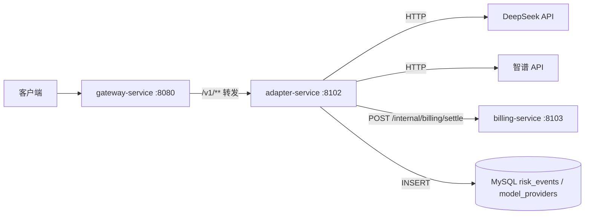
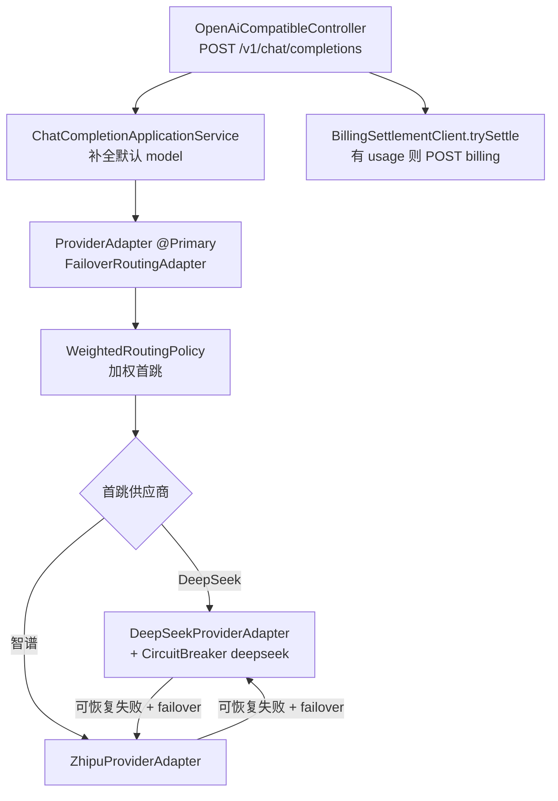

# 适配器模块总览

`adapter-service` 是 TokenHub 的**模型供应商适配层**：对外提供 OpenAI 兼容的 `/v1` HTTP 面，对内将请求转发至 DeepSeek、智谱等上游，并在成功响应后异步记账到 `billing-service`。

技术栈：**Spring MVC**（Servlet），默认端口 **`8102`**。客户端通常经 `gateway-service`（`8080`）访问，**不应**将 adapter 直接暴露公网。

---

## 1. 在平台中的位置



| 角色 | 说明 |
|------|------|
| **入口** | 网关路由 `adapter-v1`：`Path=/v1/**` → `TOKENS_GATEWAY_ADAPTER_URI`（默认 `http://127.0.0.1:8102`） |
| **鉴权** | adapter **不**解析 `Authorization`；信任网关注入的身份头 |
| **计费** | Chat 成功后由 `BillingSettlementClient` 调 billing 内部结算 |
| **可观测** | 透传/依赖 `X-Trace-Id`；故障转移写入 `risk_events` |

---

## 2. 信任网关头（必读）

与 [gateway-service/docs/09-错误响应与头约定.md](../../gateway-service/docs/09-错误响应与头约定.md) 对齐：

| 请求头 | 注入方 | adapter 消费方 |
|--------|--------|----------------|
| `X-User-Id` | JWT 验签或 API Key 解析 | `BillingSettlementClient`（结算必填） |
| `X-Api-Key-Id` | API Key 解析（Key 路径） | 结算体 `apiKeyId`（可选） |
| `X-Trace-Id` | `TraceGatewayFilter` | 结算幂等键 `traceId`（必填） |

**安全假设**：只有网关（或等价可信代理）能设置上述头；直连 adapter 且未做 mTLS/内网隔离时，存在伪造 `X-User-Id` 风险。

---

## 3. 请求处理链路（Chat）



| 步骤 | 组件 | 说明 |
|------|------|------|
| 1 | `OpenAiCompatibleController` | 接收 JSON 体，返回上游 JSON |
| 2 | `ChatCompletionApplicationService` | 空 `model` 时填入 `tokenhub.adapter.default-chat-model` |
| 3 | `FailoverRoutingAdapter` | **唯一 `@Primary` 的 `ProviderAdapter` Bean**；加权首跳 + 熔断 + 故障转移 |
| 4 | `BillingSettlementClient` | 最佳努力结算，失败仅打 warn 日志 |

---

## 4. 核心 Bean 与分层

按 `docs/architecture/LAYERS.md`：

| 层 | 包 | 职责 |
|----|-----|------|
| **presentation** | `presentation/` | `OpenAiCompatibleController` |
| **application** | `application/` | `ChatCompletionApplicationService` |
| **domain** | `domain/` | `ProviderAdapter`、`RoutingPolicy`、`ProviderRoute` |
| **infrastructure** | `infrastructure/` | 供应商 HTTP、路由、计费客户端、风控落库 |

源码根目录：

```
adapter-service/src/main/java/com/tokenhub/adapter/
├── AdapterApplication.java
├── presentation/OpenAiCompatibleController.java
├── application/ChatCompletionApplicationService.java
├── domain/
│   ├── provider/ProviderAdapter.java
│   └── routing/RoutingPolicy.java, ProviderRoute.java
└── infrastructure/
    ├── routing/AdapterRoutingConfiguration.java
    │            FailoverRoutingAdapter.java, WeightedRoutingPolicy.java
    ├── deepseek/DeepSeekProviderAdapter.java
    ├── zhipu/ZhipuProviderAdapter.java
    ├── billing/BillingSettlementClient.java
    ├── risk/RiskEventRecorder.java
    ├── provider/ModelProviderRegistry.java
    └── config/AdapterHttpConfiguration.java
```

**`@Primary ProviderAdapter`**：在 `AdapterRoutingConfiguration` 中注册 `FailoverRoutingAdapter`，应用层只注入接口，不感知具体供应商实现。

---

## 5. 对外 API 一览

| 方法 | 路径 | 说明 |
|------|------|------|
| `POST` | `/v1/chat/completions` | OpenAI 兼容对话；成功后尝试结算 |
| `GET` | `/v1/models` | 合并 DeepSeek + 智谱（若已配置 Key）目录 |

当前**未**实现：`/v1/embeddings` 等（`ProviderAdapter.embeddings` 默认抛 `UnsupportedOperationException`）。

---

## 6. 依赖与外部系统

| 依赖 | 用途 |
|------|------|
| **MySQL** | `model_providers`（上游 base_url）、`risk_events`（故障转移审计） |
| **DeepSeek / 智谱 HTTP** | 实际上游推理 |
| **billing-service** | `POST /internal/billing/settle`（`X-Internal-Token`） |
| **Resilience4j** | 实例 `deepseek` 熔断器（见 [08-路由与配置.md](./08-路由与配置.md)） |

---

## 7. 阅读地图

| 文档 | 主题 |
|------|------|
| [components/01-OpenAiCompatibleController.md](./components/01-OpenAiCompatibleController.md) | HTTP 入口 |
| [components/02-FailoverRoutingAdapter.md](./components/02-FailoverRoutingAdapter.md) | 加权首跳、熔断、故障转移 |
| [components/03-WeightedRoutingPolicy.md](./components/03-WeightedRoutingPolicy.md) | 70/30 加权随机 |
| [components/04-ProviderAdapters.md](./components/04-ProviderAdapters.md) | DeepSeek + 智谱 |
| [components/05-BillingSettlementClient.md](./components/05-BillingSettlementClient.md) | 用量记账 |
| [components/06-RiskEventRecorder.md](./components/06-RiskEventRecorder.md) | `provider_failover` 事件 |
| [08-路由与配置.md](./08-路由与配置.md) | `application.yml`、环境变量、Resilience4j |

---

## 8. 架构取舍

| 优点 | 代价 / 风险 |
|------|-------------|
| 网关注入身份，adapter 逻辑简单 | 必须保证 adapter 仅内网可达 |
| 加权 + 故障转移提高可用性 | 双供应商模型名不一致，转移时需改写 `model` |
| 结算失败不阻断响应（warn） | 可能出现「已用模型但未记账」需对账 |
| 熔断保护 DeepSeek 调用 | 智谱路径未套同一熔断实例 |

**演进方向**：流式 SSE、Retry 与代码绑定、按模型路由表、OpenTelemetry 与 W3C Trace Context。
