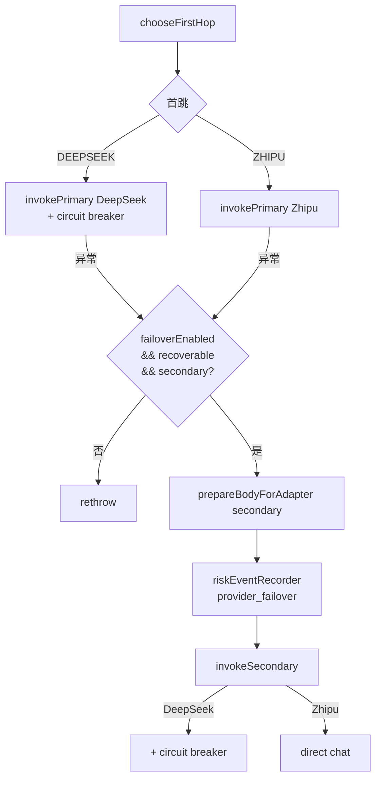

# FailoverRoutingAdapter

| 项 | 内容 |
|----|------|
| 类 | `com.tokenhub.adapter.infrastructure.routing.FailoverRoutingAdapter` |
| 注册 | `AdapterRoutingConfiguration.failoverRoutingAdapter()` |
| Spring 角色 | **`@Primary` `ProviderAdapter` Bean**（应用层唯一注入点） |
| 关联 | `WeightedRoutingPolicy`、`DeepSeekProviderAdapter`、`ZhipuProviderAdapter`、`RiskEventRecorder`、Resilience4j `CircuitBreaker("deepseek")` |

---

## 1. 背景

单一上游供应商故障会导致全站模型不可用。本组件在 **首跳加权选择**（见 [03-WeightedRoutingPolicy.md](./03-WeightedRoutingPolicy.md)）之上，对 **可恢复错误** 尝试 **对端供应商**，并对 DeepSeek 调用施加 **熔断器**，避免持续打满已故障的上游。

---

## 2. 作用

1. **加权首跳**：`routingPolicy.chooseFirstHop()` → DeepSeek 或智谱（智谱未配置 Key 时恒为 DeepSeek）。
2. **DeepSeek 熔断**：主/备路径在调用 `DeepSeekProviderAdapter` 时均经 `deepSeekCircuitBreaker.executeCallable(...)`。
3. **故障转移**：`tokenhub.adapter.failover-enabled=true` 且异常可恢复时，切换 secondary 并重试；记录 `provider_failover` 风控事件。
4. **模型名改写**：转移到智谱时强制 `model` 为 `zhipu-default-chat-model`；回 DeepSeek 时空 model 补 `default-chat-model`。
5. **模型列表合并**：`listModels()` 拼接两家 `data` 数组。

---

## 3. 触发条件

| 场景 | 行为 |
|------|------|
| 正常首跳成功 | 直接返回，无 failover 事件 |
| 首跳失败且 `failover-enabled=false` | 原样抛出 |
| 首跳失败且不可恢复 | 原样抛出（如上游 4xx → `BAD_REQUEST`） |
| 首跳失败且可恢复 + 有 secondary | 改写 body → 调 secondary → 成功则返回 |
| 熔断打开（`CallNotPermittedException`） | 视为可恢复，可 failover |

**Secondary 选择**（`pickSecondary`）：

- 主为 DeepSeek 且智谱已配置 → secondary = 智谱
- 主为智谱 → secondary = DeepSeek
- 否则 `null`（无法转移）

---

## 4. 处理流程



---

## 5. 实现要点

**Bean 注册（`@Primary`）**：

```18:41:adapter-service/src/main/java/com/tokenhub/adapter/infrastructure/routing/AdapterRoutingConfiguration.java
  @Bean
  @Primary
  public ProviderAdapter failoverRoutingAdapter(
      DeepSeekProviderAdapter deepSeekProviderAdapter,
      ZhipuProviderAdapter zhipuProviderAdapter,
      RoutingPolicy routingPolicy,
      RiskEventRecorder riskEventRecorder,
      CircuitBreakerRegistry circuitBreakerRegistry,
      ...
  ) {
    return new FailoverRoutingAdapter(...);
  }
```

**首跳与 failover 核心**：

```63:93:adapter-service/src/main/java/com/tokenhub/adapter/infrastructure/routing/FailoverRoutingAdapter.java
  public JsonNode chat(JsonNode openAiRequestBody) {
    ProviderRoute first = routingPolicy.chooseFirstHop();
    ProviderAdapter primary =
        first == ProviderRoute.ZHIPU && zhipuProviderAdapter.isConfigured()
            ? zhipuProviderAdapter
            : deepSeekProviderAdapter;
    ProviderAdapter secondary = pickSecondary(primary);
    try {
      return invokePrimary(primary, openAiRequestBody);
    } catch (Exception ex) {
      if (!failoverEnabled || secondary == null) { ... }
      if (!isRecoverable(ex)) { ... }
      JsonNode forAlt = prepareBodyForAdapter(secondary, openAiRequestBody);
      riskEventRecorder.recordProviderFailover(
          nameOf(primary), nameOf(secondary), rootCauseMessage(ex));
      return invokeSecondary(secondary, forAlt);
    }
  }
```

**转移到智谱时的 model**（`failoverTargetModel` = 配置项 `zhipu-default-chat-model`，默认 `glm-4-flash`）：

```132:144:adapter-service/src/main/java/com/tokenhub/adapter/infrastructure/routing/FailoverRoutingAdapter.java
  private JsonNode prepareBodyForAdapter(ProviderAdapter target, JsonNode openAiRequestBody) {
    ...
    if (target == zhipuProviderAdapter) {
      obj.put("model", failoverTargetModel);
    } else if (target == deepSeekProviderAdapter) {
      if (!obj.hasNonNull("model") || obj.get("model").asText().isBlank()) {
        obj.put("model", defaultChatModel);
      }
    }
    return copy;
  }
```

---

## 6. 可恢复 vs 不可恢复

`isRecoverable` 沿 cause 链最多扫描 10 层：

| 异常 / 条件 | 可恢复？ |
|-------------|----------|
| `CallNotPermittedException`（熔断 OPEN） | 是 |
| `BusinessException` + `BAD_REQUEST` | **否**（客户端/参数问题） |
| `BusinessException` + `INTERNAL` / `TOO_MANY_REQUESTS` | 是 |
| `ResourceAccessException`（网络/超时） | 是 |
| `HttpStatusCodeException` 5xx 或 429 | 是 |
| 其他 4xx | 否 |

典型场景：**DeepSeek 熔断或 5xx** → failover 到 **智谱**；**用户 prompt 违法 400** → 不转移。

---

## 7. 熔断器（deepseek）

仅包裹 **DeepSeek** 的 `chat` 调用，实例名 **`deepseek`**，参数见 [08-路由与配置.md](../08-路由与配置.md)。

熔断打开后，首跳若选 DeepSeek 会快速失败并可能触发向智谱的 failover（若已配置 `ZHIPU_API_KEY`）。

---

## 8. 配置项

| 配置键 | 环境变量 | 默认 | 说明 |
|--------|----------|------|------|
| `tokenhub.adapter.failover-enabled` | `ADAPTER_FAILOVER_ENABLED` | `true` | 是否启用故障转移 |
| `tokenhub.adapter.default-chat-model` | — | `deepseek-v4-flash` | DeepSeek 侧默认 model |
| `tokenhub.adapter.zhipu-default-chat-model` | — | `glm-4-flash` | 转移到智谱时强制 model |
| `resilience4j.circuitbreaker.instances.deepseek.*` | — | 见 08 文档 | 熔断窗口与阈值 |

---

## 9. 优劣分析

| 优点 | 缺点 |
|------|------|
| 对客户端透明（仍是一条 Chat API） | 转移后 model 与计费 model 可能变化，需 `resolveProviderForModel` 配合 |
| 熔断 + failover 双层韧性 | 智谱无熔断对称保护 |
| 审计事件可运营追溯 | failover 不保证对端一定成功 |

---

## 10. 相关文档

- [03-WeightedRoutingPolicy.md](./03-WeightedRoutingPolicy.md)
- [04-ProviderAdapters.md](./04-ProviderAdapters.md)
- [06-RiskEventRecorder.md](./06-RiskEventRecorder.md)
- [08-路由与配置.md](../08-路由与配置.md)
