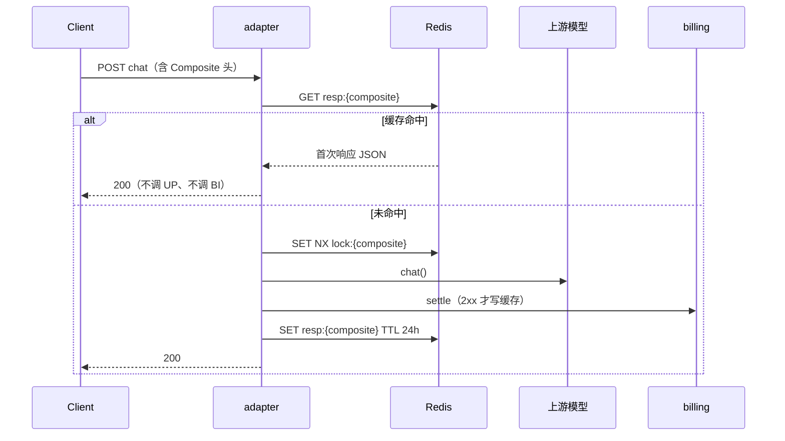

# Chat 响应幂等缓存（O-10 扩展）

| 项 | 内容 |
|----|------|
| 类 | `RedisChatIdempotencyResponseCache`、`IdempotentChatCompletionApplicationService` |
| 路径 | 仅 `POST /v1/chat/completions`，且请求带 `X-Idempotency-Key-Composite` |
| 依赖 | Redis（与 billing/gateway 同实例即可） |

---

## 1. 背景

仅 billing `settle` 幂等时：**同幂等键重试不会重复扣费**，但 adapter 仍会再次调用 DeepSeek/智谱，平台仍付上游成本。

本能力在 **结算幂等之外** 增加 **成功响应缓存**：同一复合幂等键的后续请求直接返回首次 JSON，**跳过模型与 settle**。

---

## 2. 流程



**并发同键**：第二个请求拿不到锁时轮询缓存（默认最多 30s）；超时返回 `409` / `I409001`「相同幂等键的请求正在处理中」。

---

## 3. Redis 键

| 键 | 说明 |
|----|------|
| `adapter:chat:idem:resp:{composite}` | 完整 Chat 响应 JSON |
| `adapter:chat:idem:lock:{composite}` | in-flight 锁，默认 120s |

`composite` 与网关一致：`userId:apiKeyId:clientKeyOrTrace`。

---

## 4. 何时写入缓存

- 响应可缓存：含非空 `choices`，或 `usage` 中 token &gt; 0。
- **且** `settle` HTTP 2xx，或 `tokenhub.billing.settlement-enabled=false`（仅演示/联调）。

未满足则不缓存，便于客户端用同一键重试（可能再次调模型直至结算成功）。

---

## 5. 配置

```yaml
tokenhub:
  adapter:
    idempotency-cache:
      enabled: true
      ttl-seconds: 86400
      lock-ttl-seconds: 120
      wait-ms: 30000
```

环境变量：`ADAPTER_IDEMPOTENCY_CACHE_ENABLED`、`ADAPTER_IDEMPOTENCY_CACHE_TTL` 等。

无 Redis 或 `enabled=false` 时退化为：每次 `chat` + `trySettle`（仅 billing 幂等）。

---

## 6. 与「同 Key 不同 body」

行业常见语义：**幂等键绑定首次成功结果**。本实现同 Key 始终返回缓存中的首次响应，避免用同一 Key 换 prompt 多次打模型；客户端应每次新意图使用新 `X-Idempotency-Key`。

---

## 7. 相关文档

- 网关：[08-IdempotencyGatewayFilter.md](../../../gateway-service/docs/filters/08-IdempotencyGatewayFilter.md)
- [01-OpenAiCompatibleController.md](./01-OpenAiCompatibleController.md)
- [05-BillingSettlementClient.md](./05-BillingSettlementClient.md)
