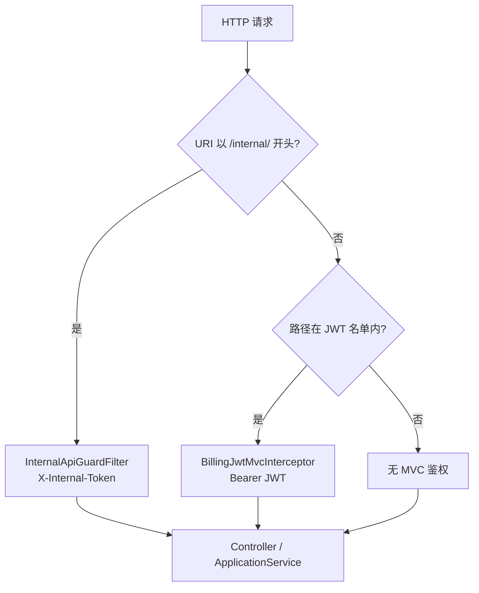

# 计费模块总览

`billing-service` 是 TokenHub 的**账务与 API Key 中心**：管理账户余额、按量结算、API Key 生命周期、控制台查询，并为网关 / 适配器提供**内部 HTTP API**（预检、结算、预占等）。

技术栈：**Spring MVC**（Servlet）、**MyBatis-Plus**、**MySQL**；可选 **Redis**（O-1 用户维度余额短锁；网关侧另有 O-5 Key 解析缓存，不在本服务实现读缓存）。

默认端口：**`8103`**（`application.yml` 中 `server.port`）。

---

## 1. 请求处理两轨：公开 API vs 内部 API

| 轨道 | 路径前缀 | 鉴权 | 典型调用方 |
|------|----------|------|------------|
| **公开（控制台）** | `/apikeys/**`、`/dashboard/**`、`/billing/**`、`/v1/usage` | `Authorization: Bearer <JWT>` → `BillingJwtMvcInterceptor` | 经网关转发的 `console-web` / 浏览器 |
| **内部（服务间）** | `/internal/**` | `X-Internal-Token` → `InternalApiGuardFilter` | `gateway-service`、`adapter-service`（不经 JWT） |

**重要**：`BillingWebConfiguration` 对公开路径注册 JWT 拦截器，并 **exclude** `/internal/**`；内部路径仅依赖 `InternalApiGuardFilter`，二者互不替代。



---

## 2. 与上下游关系

| 方向 | 服务 | 交互 |
|------|------|------|
| **入站（内部）** | `gateway-service` | `GET /internal/api-keys/by-fingerprint/{fp}`；`POST /internal/billing/preflight` |
| **入站（内部）** | `adapter-service` | `POST /internal/billing/settle`；流式场景 `reserve` / `commit` / `release`（O-3） |
| **入站（内部）** | `payment-service` | `POST /internal/billing/credit`（幂等入账） |
| **出站** | `payment-service` | 控制台充值：`PaymentRechargeClient` → `tokenhub.payment.base-url` |
| **公开** | 经网关 `8103` | `/apikeys`、`/dashboard`、`/billing/**`、`/v1/usage` |

仓库级网关文档：[gateway-service/docs/00-网关总览.md](../../gateway-service/docs/00-网关总览.md)。

---

## 3. 核心应用服务与 TDD 映射

| 组件 | 职责 | TDD |
|------|------|-----|
| `ApiKeyApplicationService` | Key 创建/禁用/指纹解析 | [O-07](../../docs/TDD/O-07-APIKey生命周期-过期与轮换.md) |
| `AccountBalanceApplicationService` | 余额读写、乐观锁扣款、幂等充值 | — |
| `BillingSettlementFacade` + `BillingSettlementApplicationService` | 按 `traceId` 幂等结算 | [O-01](../../docs/TDD/O-01-扣费并发-分布式锁与悲观锁策略.md)、[O-02](../../docs/TDD/O-02-异步账务-Outbox与MQ.md) |
| `RedisBalanceLock` | 用户维度短锁（可选） | O-01 |
| `BalanceReservationApplicationService` | 预占 / 冲正 / 释放 | [O-03](../../docs/TDD/O-03-预占额度与冲正-流式联动.md) |
| `SettlementOutboxWriter` + `SettlementOutboxScheduler` | 同事务 Outbox + 轮询发布 | O-02 |
| `ApiKeyExpirationScheduler` | 到期 Key 状态收敛 | O-07 |
| `BillingReconciliationScheduler` | 订单与流水一致性巡检 | — |

网关侧 API Key 解析缓存见 [O-05](../../docs/TDD/O-05-Redis缓存-APIKey解析与余额.md)（实现于 `gateway-service`，billing 仍为准源）。

---

## 4. Redis 在本模块的用途

| 用途 | 实现 | 默认 |
|------|------|------|
| **余额扣费短锁（O-1）** | `RedisBalanceLock`：`SET NX` + TTL，键 `lock:billing:balance:u:{userId}` | `tokenhub.billing.balance-lock.enabled=false` |
| **无 Redis 时** | 回落 JVM `synchronized`（单实例有效） | 自动 |

本服务**未**实现 O-5 所述「余额只读缓存」；余额以 MySQL `account_balance` 为准。

---

## 5. 分层与代码位置

按 `docs/architecture/LAYERS.md`：

| 层 | 包 | 说明 |
|----|-----|------|
| `presentation` | `...presentation.*` | REST Controller、DTO |
| `application` | `...application.*` | 用例编排、事务边界、`BalanceLock` 端口 |
| `domain` | `...domain.*` | 常量与纯模型（当前较轻） |
| `infrastructure` | `...infrastructure.*` | 安全过滤器、MyBatis、Redis、调度、Outbox |

```
billing-service/src/main/java/com/tokenhub/billing/
├── BillingApplication.java
├── application/          # 用例服务、Facade、Outbox 写入
├── domain/auth/            # BillingAuthConstants
├── infrastructure/
│   ├── security/         # InternalApiGuardFilter、JWT、WebMvc 配置
│   ├── redis/            # RedisBalanceLock
│   ├── outbox/           # Scheduler、Logging Publisher
│   ├── schedule/         # Key 过期、对账
│   └── persistence/      # Mapper / PO
└── presentation/         # 内外 Controller
```

---

## 6. 阅读地图

| 文档 | 主题 |
|------|------|
| [components/01-InternalApiGuardFilter.md](./components/01-InternalApiGuardFilter.md) | `/internal/**` 令牌 |
| [components/02-BillingJwtMvcInterceptor.md](./components/02-BillingJwtMvcInterceptor.md) | 控制台 JWT |
| [components/03-ApiKeyApplicationService.md](./components/03-ApiKeyApplicationService.md) | API Key |
| [components/04-AccountBalanceApplicationService.md](./components/04-AccountBalanceApplicationService.md) | 账户余额 |
| [components/05-BillingSettlementApplicationService.md](./components/05-BillingSettlementApplicationService.md) | 结算 + O-1 锁 |
| [components/06-BalanceReservationApplicationService.md](./components/06-BalanceReservationApplicationService.md) | 预占 O-3 |
| [components/07-SettlementOutboxScheduler.md](./components/07-SettlementOutboxScheduler.md) | Outbox O-2 |
| [components/08-Schedulers.md](./components/08-Schedulers.md) | Key 过期、对账 |
| [08-路由与配置.md](./08-路由与配置.md) | `application.yml`、API 表 |

---

## 7. 架构取舍

| 优点 | 代价 / 风险 |
|------|-------------|
| 内外 API 分离清晰，网关可高频调内部接口 | `BILLING_INTERNAL_TOKEN` 泄露等同账务后门；须内网 + 轮换 |
| `traceId` 幂等结算 + 乐观锁，默认可水平扩展 | 热点用户乐观锁重试；需 O-1 锁压测后开启 |
| Outbox 与结算同事务，利于 eventual 下游 | M1 仅日志 Publisher；MQ 需 P7 补齐 |
| 预占与结算解耦，适配流式尾延迟 | `commit` 不直接扣款，调用方须保证 `settle` 链路完整 |
