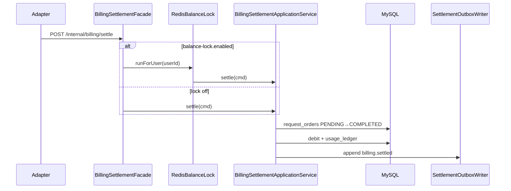

# BillingSettlementApplicationService

| 项 | 内容 |
|----|------|
| 类 | `com.tokenhub.billing.application.BillingSettlementApplicationService` |
| 入口包装 | `BillingSettlementFacade`（O-1 可选锁） |
| 锁实现 | `RedisBalanceLock` implements `BalanceLock` |
| HTTP | `POST /internal/billing/settle` → `BillingSettlementFacade#settle` |
| TDD | [O-01](../../docs/TDD/O-01-扣费并发-分布式锁与悲观锁策略.md)、[O-02](../../docs/TDD/O-02-异步账务-Outbox与MQ.md) |

---

## 1. 背景

模型调用完成后，`adapter-service` 携带 `traceId`、token 用量回调 billing **按量结算**：写 `request_orders`、扣余额、记 `usage_ledger`，并同事务追加 **Outbox** 事件供异步下游消费（O-2）。

幂等键 = **`traceId`**（与网关 Trace、预占 O-3 对齐）。已 `COMPLETED` 的订单直接返回。

---

## 2. 处理流程



---

## 3. BillingSettlementApplicationService#settle

**命令对象 `SettlementCommand`：** `traceId`, `userId`, `apiKeyId`, `providerCode`, `modelName`, `inputTokens`, `outputTokens`。

**步骤（单事务 `@Transactional`）：**

1. 若已有同 `idempotencyKey(=traceId)` 且 `billing_status=COMPLETED` → 返回。
2. 插入 `request_orders`（`PENDING`）；`DuplicateKeyException` → 返回（并发幂等）。
3. `PricingService.computeChargeMicro(...)` 计价。
4. `accountBalanceApplicationService.debit`。
5. 更新订单 `COMPLETED` + `amount`。
6. 插入 `usage_ledger`（`ENTRY_TYPE=USAGE`）。
7. `settlementOutboxWriter.append("request_order", traceId, "billing.settled", event)`。

```55:132:billing-service/src/main/java/com/tokenhub/billing/application/BillingSettlementApplicationService.java
  @Transactional
  public void settle(SettlementCommand cmd) {
    // ... 幂等检查、插单、计价、debit、流水 ...
    settlementOutboxWriter.append(
        "request_order",
        cmd.traceId(),
        "billing.settled",
        event
    );
  }
```

---

## 4. BillingSettlementFacade（O-1）

**设计意图：** 锁在 **事务外** 获取/释放，避免在 `@Transactional` 内持锁占用 DB 连接。

```31:37:billing-service/src/main/java/com/tokenhub/billing/application/BillingSettlementFacade.java
  public void settle(BillingSettlementApplicationService.SettlementCommand cmd) {
    if (!lockEnabled || cmd == null || cmd.userId() == null) {
      billingSettlementApplicationService.settle(cmd);
      return;
    }
    balanceLock.runForUser(cmd.userId(), () -> billingSettlementApplicationService.settle(cmd));
  }
```

| 配置 | 默认 |
|------|------|
| `tokenhub.billing.balance-lock.enabled` | `false` |

---

## 5. RedisBalanceLock（O-1）

| 项 | 内容 |
|----|------|
| 类 | `com.tokenhub.billing.infrastructure.redis.RedisBalanceLock` |
| Redis 键 | `lock:billing:balance:u:{userId}` |
| 机制 | `SET NX` + TTL；释放时比对 token 再 `DELETE` |
| 回落 | Redis 不可用 → JVM `synchronized`（单实例） |
| 超时 | 自旋至 `max-wait-ms` → `CONFLICT`「扣费冲突，请稍后重试」 |

```44:75:billing-service/src/main/java/com/tokenhub/billing/infrastructure/redis/RedisBalanceLock.java
  public void runForUser(long userId, Runnable action) {
    StringRedisTemplate redis = redisProvider.getIfAvailable();
    String key = "lock:billing:balance:u:" + userId;
    if (redis != null) {
      // SET NX + spin + releaseSafely
    }
    runWithJvmLock(userId, action);
  }
```

| 配置 | 默认 | 说明 |
|------|------|------|
| `tokenhub.billing.balance-lock.ttl-ms` | `5000` | 锁 TTL，防死锁 |
| `tokenhub.billing.balance-lock.max-wait-ms` | `1500` | 最长等待 |
| `tokenhub.billing.balance-lock.spin-sleep-ms` | `30` | 自旋间隔 |

详见 TDD [O-01](../../docs/TDD/O-01-扣费并发-分布式锁与悲观锁策略.md)。

---

## 6. 三层一致性组合

| 机制 | 防什么 |
|------|--------|
| `traceId` / `idempotency_key` | 重复结算 |
| `account_balance.version` 乐观锁 | 并发写余额丢更新 |
| `BalanceLock`（可选） | 热点用户重试风暴、读-算-写窗口 |

---

## 7. 优劣分析

| 优点 | 缺点 |
|------|------|
| 幂等清晰，adapter 可安全重试 | 计价与扣款同事务，长事务需控制 |
| Outbox 与业务同事务（O-2） | 默认锁关闭，生产需压测后开启 |
| Facade 分离锁与事务边界 | JVM 锁回落多实例无效 |

---

## 8. 相关文档

- [04-AccountBalanceApplicationService.md](./04-AccountBalanceApplicationService.md)
- [07-SettlementOutboxScheduler.md](./07-SettlementOutboxScheduler.md)
- [06-BalanceReservationApplicationService.md](./06-BalanceReservationApplicationService.md)
- TDD：[O-01](../../docs/TDD/O-01-扣费并发-分布式锁与悲观锁策略.md)、[O-02](../../docs/TDD/O-02-异步账务-Outbox与MQ.md)
