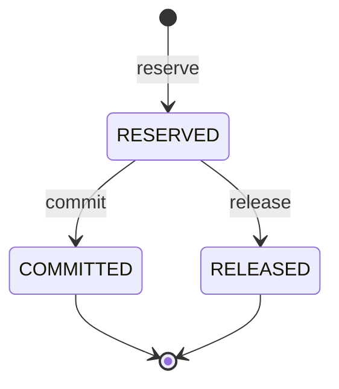

# BalanceReservationApplicationService

| 项 | 内容 |
|----|------|
| 类 | `com.tokenhub.billing.application.BalanceReservationApplicationService` |
| 表 | `balance_reservation`（`BalanceReservationPo`） |
| HTTP | `POST /internal/billing/reserve`、`/reservations/commit`、`/reservations/release` |
| TDD | [O-03 预占额度与冲正](../../docs/TDD/O-03-预占额度与冲正-流式联动.md) |

---

## 1. 背景

流式 Chat（SSE）在首包前难以知道最终 token 消耗。若仅依赖网关 **预检**（余额 &gt; 0），长连接过程中仍可能超支。O-3 引入 **预占额度**：在流开始前锁定一部分可用余额，结束后再 **commit**（审计）+ **`settle` 实扣**，异常路径 **release**。

M1 骨架：`commit` **不直接扣款**，实扣仍走已有幂等 `settle`（与 TDD 中 M2「commit + debit 合一」演进一致）。

---

## 2. 状态机



| 状态 | 含义 |
|------|------|
| `RESERVED` | 占用可用额度池，带 `expires_at` |
| `COMMITTED` | 流式成功结束；记录 `committed_amount` 审计 |
| `RELEASED` | 取消/失败，释放预占 |

`commit` / `release` 对非 `RESERVED` 状态 **幂等返回当前视图**，不抛错。

---

## 3. 方法说明

### reserve(traceId, userId, amount)

1. 校验 `traceId`、`amount > 0`。
2. 若已存在同 `traceId` 行 → **幂等返回**（不重复校验余额）。
3. `available = balance - sum(有效 RESERVED)`；不足 → `BALANCE_INSUFFICIENT`。
4. 插入 `RESERVED`，`expires_at = now + defaultTtlSeconds`（默认 120s）。

### commit(traceId, committedAmount)

- `RESERVED` → `COMMITTED`，写入 `committed_amount`。
- **不调用 `debit`**；调用方继续 `POST /internal/billing/settle`。

### release(traceId)

- `RESERVED` → `RELEASED`。

幂等键：**`trace_id`（唯一）**，与结算、`X-Trace-Id` 对齐。

---

## 4. 实现要点

```49:82:billing-service/src/main/java/com/tokenhub/billing/application/BalanceReservationApplicationService.java
  @Transactional
  public ReservationView reserve(String traceId, long userId, long amount) {
    // ... 幂等、可用余额、插入 RESERVED ...
    po.setExpiresAt(now.plusSeconds(Math.max(10, defaultTtlSeconds)));
```

```88:114:billing-service/src/main/java/com/tokenhub/billing/application/BalanceReservationApplicationService.java
  public ReservationView commit(String traceId, long committedAmount) {
    // RESERVED → COMMITTED，已终结则幂等返回
  }
  public ReservationView release(String traceId) {
    // RESERVED → RELEASED
  }
```

**Controller 映射（`InternalBillingController`）：**

| HTTP | 方法 |
|------|------|
| `POST /internal/billing/reserve` | `reserve` |
| `POST /internal/billing/reservations/commit` | `commit` |
| `POST /internal/billing/reservations/release` | `release` |

---

## 5. 与网关预检的区别

| 能力 | 网关 `BillingPreflightGatewayFilter` | O-3 reserve |
|------|--------------------------------------|-------------|
| 时机 | Chat 请求进 adapter 前 | 通常 adapter 流式开始前 |
| 检查 | `balance > 0` | `available >= amount` |
| 持久化 | 无 | `balance_reservation` 行 |
| 释放 | 无 | `release` / TTL 过期（汇总 SQL 排除过期） |

---

## 6. 优劣分析

| 优点 | 缺点 |
|------|------|
| 降低流式超支风险 | M1：`commit` 与 `debit` 分离，调用链必须完整 |
| trace 级幂等，易与结算关联 | 过期 RESERVED 依赖 SQL 汇总，需监控堆积 |
| 不锁整表，仅逻辑预占 | 高并发同用户多预占仍竞争可用额计算 |

---

## 7. 业界更好的方案

| 方案 | 说明 |
|------|------|
| **两阶段 + 单事务 commit-debit** | 减少 adapter 编排复杂度 |
| **预留账户子账本** | 财务标准「可用/冻结」分列 |
| **实时余额推送 + 硬切断** | 流中余额不足断流 |

详见 [O-03](../../docs/TDD/O-03-预占额度与冲正-流式联动.md)。

---

## 8. 配置项

| 配置 | 默认 | 说明 |
|------|------|------|
| `tokenhub.billing.reservation.default-ttl-seconds` | `120` | 预占行 TTL |

---

## 9. 相关文档

- [04-AccountBalanceApplicationService.md](./04-AccountBalanceApplicationService.md)
- [05-BillingSettlementApplicationService.md](./05-BillingSettlementApplicationService.md)
- [08-路由与配置.md](../08-路由与配置.md)
- TDD：[O-03](../../docs/TDD/O-03-预占额度与冲正-流式联动.md)
