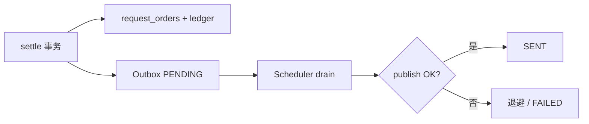

# SettlementOutboxScheduler

| 项 | 内容 |
|----|------|
| 类 | `com.tokenhub.billing.infrastructure.outbox.SettlementOutboxScheduler` |
| 写入 | `SettlementOutboxWriter`（应用层，结算事务内） |
| 发布 | `SettlementOutboxPublisher`（默认 `LoggingSettlementOutboxPublisher`） |
| 表 | `settlement_outbox` |
| TDD | [O-02 异步账务 Outbox 与 MQ](../../docs/TDD/O-02-异步账务-Outbox与MQ.md) |

---

## 1. 背景

结算成功后，分析、通知、adapter 尾处理等**不宜阻塞** HTTP `settle` 响应。Outbox 模式：业务事务内写入 `PENDING` 事件，异步进程投递 MQ，保证 **「DB 已提交 ⇔ 事件终将发出」**（至少一次）。

M1：无 RabbitMQ，`LoggingSettlementOutboxPublisher` 仅打日志；P7 替换为真实 MQ 实现（`@ConditionalOnMissingBean` 可覆盖）。

---

## 2. 写入端：SettlementOutboxWriter

在 `BillingSettlementApplicationService#settle` **同一事务**内调用：

```127:131:billing-service/src/main/java/com/tokenhub/billing/application/BillingSettlementApplicationService.java
    settlementOutboxWriter.append(
        "request_order",
        cmd.traceId(),
        "billing.settled",
        event
    );
```

| 字段 | 示例 |
|------|------|
| `aggregate_type` | `request_order` |
| `aggregate_id` | `traceId` |
| `event_type` | `billing.settled` |
| `payload_json` | userId、amount、tokens 等 |
| `status` | `PENDING` |

幂等：唯一键 `(aggregate_type, aggregate_id, event_type)`；重复 `append` 静默跳过。

`@Transactional(propagation = REQUIRED)` 复用外层结算事务。

---

## 3. 消费端：SettlementOutboxScheduler#drain

| 行为 | 说明 |
|------|------|
| 调度 | `@Scheduled(fixedDelayString = "${tokenhub.billing.outbox.fixed-delay-ms:2000}")` |
| 开关 | `tokenhub.billing.outbox.enabled=false` 时直接 return |
| 拉批 | `outboxMapper.claimPendingBatch(batchSize)` |
| 成功 | `status=SENT`，清 `last_error` |
| 失败 | `attempts++`，指数退避 `backoffBaseSeconds << min(8, attempts-1)` 写入 `next_attempt_at` |
| 放弃 | `attempts >= maxAttempts` → `FAILED` |

```47:87:billing-service/src/main/java/com/tokenhub/billing/infrastructure/outbox/SettlementOutboxScheduler.java
  @Scheduled(fixedDelayString = "${tokenhub.billing.outbox.fixed-delay-ms:2000}")
  public void drain() {
    if (!enabled) {
      return;
    }
    List<SettlementOutboxPo> batch = outboxMapper.claimPendingBatch(Math.max(1, batchSize));
    // ... publish → SENT 或退避/FAILED ...
  }
```

---

## 4. 默认 Publisher

```17:31:billing-service/src/main/java/com/tokenhub/billing/infrastructure/outbox/LoggingSettlementOutboxPublisher.java
@ConditionalOnMissingBean(SettlementOutboxPublisher.class)
public class LoggingSettlementOutboxPublisher implements SettlementOutboxPublisher {
  public void publish(...) {
    log.info("settlement-outbox publish (default logging): ...");
  }
}
```

生产替换：提供自定义 `SettlementOutboxPublisher` Bean（如 RabbitMQ），无需改 Scheduler。

---

## 5. 流程图



---

## 6. 优劣分析

| 优点 | 缺点 |
|------|------|
| 与结算原子提交，无「扣了钱没事件」 | 轮询延迟（默认 2s fixedDelay） |
| 退避 + FAILED 可运维 | M1 无真实 MQ，下游未解耦 |
| Publisher 可插拔 | 消费者幂等需下游自行保证 |

---

## 7. 业界更好的方案

| 方案 | 说明 |
|------|------|
| **Debezium CDC** | 监听 binlog 发 Kafka，免轮询 |
| **Transactional MQ** | Rabbit/Kafka 事务消息（生态各异） |
| **Relay 专用服务** | 如 Camel、Outbox Pattern 中间件 |

详见 [O-02](../../docs/TDD/O-02-异步账务-Outbox与MQ.md)。

---

## 8. 配置项

| 配置 | 默认 | 说明 |
|------|------|------|
| `tokenhub.billing.outbox.enabled` | `false` | 开启轮询 |
| `tokenhub.billing.outbox.fixed-delay-ms` | `2000` | 上次结束后间隔 |
| `tokenhub.billing.outbox.batch-size` | `50` | 每批条数 |
| `tokenhub.billing.outbox.max-attempts` | `8` | 最大重试 |
| `tokenhub.billing.outbox.backoff-base-seconds` | `30` | 退避基数（秒） |

---

## 9. 相关文档

- [05-BillingSettlementApplicationService.md](./05-BillingSettlementApplicationService.md)
- [08-Schedulers.md](./08-Schedulers.md)
- TDD：[O-02](../../docs/TDD/O-02-异步账务-Outbox与MQ.md)
