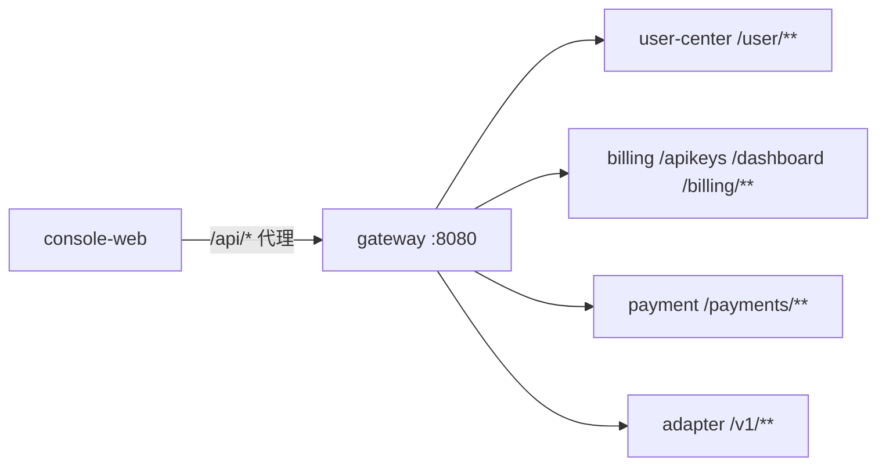

# console-web 前端总览

`console-web` 是 TokenHub 的 **C 端用户控制台**：注册登录、Dashboard、API Key 管理、Mock 充值、账单与用量、模型体验页等。

技术栈：**Vue 3** + **Vite 6** + **TypeScript** + **Pinia** + **Vue Router 4** + **Element Plus**。

开发默认：`http://localhost:5173`；API 经 Vite 代理到 **gateway-service**（`8080`）。

---

## 1. 与后端边界



| 客户端模块 | 协议 | 典型路径 |
|------------|------|----------|
| `api/client.ts` | `ApiResponse` 信封 + JWT | `/user/login`、`/apikeys`、`/billing/plans` |
| `api/gateway.ts` | OpenAI 兼容原始 JSON | `/v1/models`、`/v1/chat/completions` |

**不在浏览器保存** API Key 明文（创建时展示一次）；JWT 存 `localStorage`（`accessToken`）。模型体验页可选将 `sk_*` 存 **sessionStorage**（见 gateway API 文档）。

---

## 2. 目录结构

```
console-web/
├── src/
│   ├── main.ts              # Pinia + Router + Element Plus
│   ├── App.vue
│   ├── router/index.ts      # 路由与登录守卫
│   ├── api/
│   │   ├── client.ts        # 业务 API（信封）
│   │   └── gateway.ts       # /v1 OpenAI 兼容
│   ├── stores/
│   │   ├── session.ts       # JWT 会话
│   │   └── theme.ts         # 主题（可选）
│   ├── views/               # 页面
│   └── components/          # 顶栏、帮助浮层等
├── vite.config.ts           # 开发代理
└── .env.development         # VITE_API_BASE
```

---

## 3. 路由分区

| 分区 | 前缀 | 鉴权 |
|------|------|------|
| 营销/公开 | `/`、`/experience`、`/login`、`/register` | 否 |
| 控制台 | `/console/**` | 需要 JWT |
| 404 | 其它 | 重定向 `/` |

控制台壳布局：`ShellView.vue` + 子路由（dashboard、api-keys、recharge 等）。

---

## 4. 页面与后端映射（摘要）

| 页面 | 路由 | 主要 API |
|------|------|----------|
| 登录/注册 | `/login`、`/register` | `/user/login`、`/user/register` |
| 总览 | `/console/dashboard` | `/dashboard/summary`、`/apikeys`、`/billing/orders`、`/v1/usage` |
| KEY 管理 | `/console/api-keys` | `/apikeys` CRUD |
| 充值 | `/console/recharge` | `/payments/mock/recharge`、`/billing/plans` |
| 账单订单 | `/console/recharge-records` | `/billing/orders` |
| 用量 | `/console/usage` | `/v1/usage` |
| 工单 | `/console/support` | `/user/support/tickets` |
| 模型体验 | `/experience` | `/v1/models`、`/v1/chat/completions` |

---

## 5. 阅读地图

| 文档 | 主题 |
|------|------|
| [pages/01-路由与鉴权.md](./pages/01-路由与鉴权.md) | Router、`beforeEach` |
| [pages/02-API客户端.md](./pages/02-API客户端.md) | `client.ts`、`gateway.ts` |
| [pages/03-会话状态.md](./pages/03-会话状态.md) | Pinia session |
| [pages/04-控制台页面.md](./pages/04-控制台页面.md) | 各 View 职责 |
| [08-构建与配置.md](./08-构建与配置.md) | Vite、环境变量 |

---

## 6. 本地启动

```bash
cd console-web
npm install
npm run dev
```

需同时运行：gateway、user-center、billing、payment（按页面功能取舍）。
