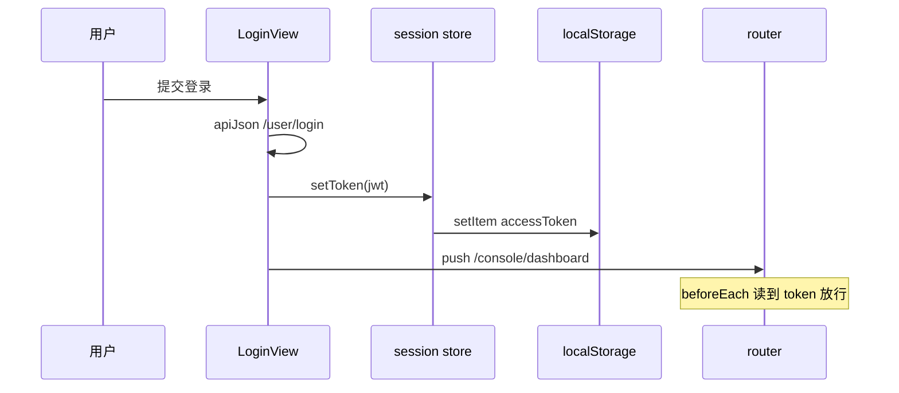

# 会话状态

源码：`console-web/src/stores/session.ts`

---

## 1. 模型

使用 Pinia **Setup Store**（Composition API 风格）：

| 状态 / 方法 | 说明 |
|-------------|------|
| `accessToken` | `ref<string>`，JWT 字符串 |
| `isAuthenticated` | `computed`，`Boolean(accessToken)` |
| `setToken(token)` | 更新 ref + `localStorage` |
| `clear()` | 清空 ref + 删除 `localStorage` |

```6:21:console-web/src/stores/session.ts
export const useSessionStore = defineStore("session", () => {
  const accessToken = ref(localStorage.getItem(STORAGE_KEY) ?? "");

  const isAuthenticated = computed(() => Boolean(accessToken.value));

  function setToken(token: string) {
    accessToken.value = token;
    localStorage.setItem(STORAGE_KEY, token);
  }

  function clear() {
    accessToken.value = "";
    localStorage.removeItem(STORAGE_KEY);
  }

  return { accessToken, isAuthenticated, setToken, clear };
});
```

存储键：`STORAGE_KEY = "accessToken"`。

---

## 2. 生命周期



| 事件 | 处理 |
|------|------|
| 登录成功 | `session.setToken` |
| 刷新页面 | store 初始化从 `localStorage` 读取 |
| 登出（顶栏） | `session.clear()` + 可选 `clearToken()` |
| 注册成功 | 通常跳转登录，不自动 setToken |

---

## 3. 与路由守卫协作

守卫同时读 **store** 与 **localStorage**：

- 避免首屏 Pinia 未就绪；
- 要求 `setToken` 始终写 localStorage（已满足）。

---

## 4. 与 API 客户端协作

`api/client.ts` 的 `authHeader()` **直接读 localStorage**，不经过 Pinia。

约定：任何改 token 的路径必须调用 `setToken` 或同时写 localStorage，否则会出现「路由认为已登录但 API 无 Bearer」的短暂不一致。

---

## 5. 安全说明（M1）

| 项 | 现状 | 生产建议 |
|----|------|----------|
| 存储位置 | `localStorage` | 考虑 httpOnly Cookie + CSRF |
| XSS | token 可被脚本读取 | CSP、依赖审计 |
| 过期 | 未在前端解析 JWT exp | 401 时统一跳转登录 |
| 多标签 | 共享 localStorage | 登出一处即全局失效 |

---

## 6. theme store（可选）

`stores/theme.ts` 管理明暗主题，与会话正交；不影响鉴权。

---

## 7. 相关文档

- [01-路由与鉴权.md](./01-路由与鉴权.md)
- [02-API客户端.md](./02-API客户端.md)
