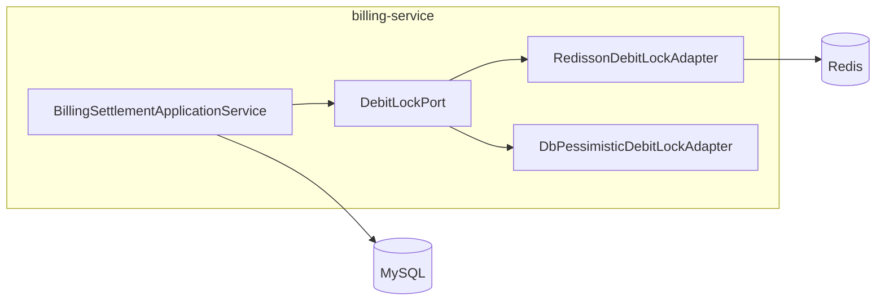
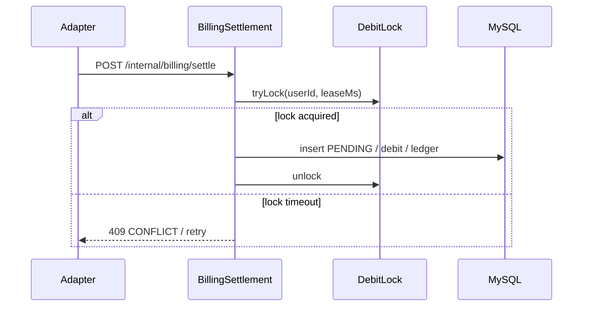

# O-1 扣费并发：分布式锁（Redisson）与悲观锁策略

## 文档信息

| 项 | 内容 |
|----|------|
| 文档版本 | v0.1 |
| 作者 | 待填写 |
| 创建日期 | 2026-05-12 |
| 业务域 | 计费（billing-service） |
| 关联 backlog | `dev-plan.md` §2.3 **O-1** |
| 评审状态 | 草案 |

---

## 1. 需求背景与目标

- **背景**：当前扣费依赖 `account_balance` **乐观锁（`@Version`）** + `request_orders` **幂等键**；热点用户高并发下可能出现大量乐观锁冲突重试，延迟上升。
- **目标**：在**不破坏**既有幂等语义前提下，评估并可选引入 **用户维度串行化**（Redisson `RLock` 或 DB `SELECT … FOR UPDATE`），使 P95 扣费延迟可控。
- **非目标**：替代 `traceId` 幂等；跨用户的全局串行。

---

## 2. 业务概述与范围

### 2.1 In Scope

- 锁粒度：`userId`（或 `userId + shard`）。
- 加锁区间：`settle` 内「插单 / 计价 / `debit` / 流水」最小临界区对比分析。
- 与多实例 billing 部署兼容性。

### 2.2 Out of Scope

- 网关层全局锁；供应商侧限流。

---

## 3. 整体架构设计

- 锁在 **billing-service** 应用层实现（`application` 包），不泄漏到 `domain` 纯模型。
- Redisson 依赖置于 `billing-service` 的 `infrastructure`；通过配置开关 `tokenhub.billing.debit-lock-mode=OPTIMISTIC|REDISSON|DB_PESSIMISTIC`。
- 若选 Redisson：与现有 **spring-data-redis** 并存需统一连接配置与线程模型。

---

## 4. 业务流程 / 时序图

**说明**：幂等仍由 `idempotency_key` 保证；锁仅缩小「读余额→写余额」竞态窗口，**不是**幂等替代物。

---

## 5. 模块拆分与职责

| 模块 | 职责 |
|------|------|
| `DebitLockPort`（domain 或 application SPI） | tryLock/unlock 抽象 |
| `RedissonDebitLockAdapter` | `RLock`：`billing:debit:{userId}`，`waitTime`/`leaseTime` 可配 |
| `BillingSettlementApplicationService` | 加锁顺序：**先幂等判断**再锁，避免死锁与无效持锁 |

---

## 6. 接口设计

- **无新增对外 HTTP**（内部 settle 不变）。
- **配置项**：`tokenhub.billing.debit-lock-mode`、`tokenhub.billing.debit-lock-wait-ms`、`tokenhub.billing.debit-lock-lease-ms`。

**错误码**：锁等待失败映射 `ErrorCode.CONFLICT` 或新码 `TOO_BUSY`，HTTP 429/409 与 `common-web` 对齐。

---

## 7. 数据库设计

- **悲观锁方案**：`SELECT … FROM account_balance WHERE user_id=? FOR UPDATE` 在同一事务内与 `debit` 更新；需控制事务持有时间。
- **Redisson 方案**：表结构不变。

---

## 8. 核心逻辑设计

- **加锁顺序**：禁止与支付回调同 key 混用；支付用 `lock:payment:callback:{orderNo}`，扣费用 `billing:debit:{userId}`。
- **leaseTime**：必须大于 settle 最坏耗时，防止锁泄漏；仍配 `tryLock`  watchdog 或 Redisson 看门狗（若启用）。
- **与乐观锁**：二选一为主路径；若 Redisson + 仍保留 `@Version`，需定义「锁内 update 必成功一次」的语义，避免双重冲突。

---

## 9. 兼容性与旧数据迁移

- 默认 `OPTIMISTIC`，与现网一致；切换锁模式仅需配置与 Redis 可用性，无数据回填。

---

## 10. 性能、容量、并发

- 热点用户：单 user 串行，吞吐下降；需配合 **分片 userId** 或 **异步队列（见 O-2）**。
- Redis 连接数与 billing 实例数线性相关。

---

## 11. 安全设计

- Redis ACL；锁 key 不包含敏感信息。

---

## 12. 异常处理与降级熔断

- Redis 不可用：降级为当前乐观锁路径或快速失败（配置策略），并打点 `debit_lock_fallback_total`。

---

## 13. 日志、监控、告警

- Metrics：`debit_lock_wait_seconds`、`debit_lock_acquire_failed_total`。
- 日志：userId、traceId、lockMode。

---

## 14. 部署方案与环境依赖

- Redis 高可用（哨兵/集群）与 billing 同网段低延迟。

---

## 15. 测试要点

- 并发 JUnit：同 user 多线程 settle 不同 traceId，余额与流水一致。
- Redis 宕机降级路径单测。

---

## 16. 风险点与备选方案

| 风险 | 缓解 | 备选 |
|------|------|------|
| 死锁（多资源顺序） | 固定加锁顺序 userId 字典序 | 仅悲观锁单表 |
| 锁泄漏 | lease + finally unlock | 不用锁，仅 MQ 串行 per user |

---

## 17. 排期与里程碑

| 里程碑 | 交付物 |
|--------|--------|
| M1 | SPI + 配置 + 压测基线（乐观锁） |
| M2 | Redisson 实现 + 混沌测试 |
| M3 | 生产灰度开关与复盘文档 |

---

## 18. 实现对照（M1：账户维度短锁骨架）

| 设计点 | 当前实现 | 文件 |
|--------|-----------|------|
| 锁端口（SPI） | `BalanceLock#runForUser(long userId, Runnable)` | `billing-service/.../application/BalanceLock.java` |
| 默认实现 | Redis `SET NX` + 短 TTL；连接失败回落 JVM `synchronized` | `billing-service/.../infrastructure/redis/RedisBalanceLock.java` |
| 与事务边界 | 锁在事务**外**获取：通过 `BillingSettlementFacade` 包裹 `BillingSettlementApplicationService#settle` | `billing-service/.../application/BillingSettlementFacade.java` |
| 入口 | `POST /internal/billing/settle` 改走 facade | `billing-service/.../presentation/InternalBillingController.java` |
| 默认行为 | 开关默认关闭，回退现有「乐观锁 + 幂等键」路径 | `application.yml` `tokenhub.billing.balance-lock.enabled` |
| 等待与重试 | 自旋 `max-wait-ms` 内未获取抛 `CONFLICT`；客户端可重试 | `RedisBalanceLock` |
| 与现有机制并存 | 仍保留 `account_balance.version` 乐观锁 + `request_orders.idempotency_key` 幂等键 | `AccountBalanceApplicationService#debit`、`BillingSettlementApplicationService#settle` |

**配置项**：

| Key | 默认值 | 含义 |
|-----|--------|------|
| `tokenhub.billing.balance-lock.enabled` | `false` | 是否启用账户维度短锁 |
| `tokenhub.billing.balance-lock.ttl-ms` | `5000` | Redis 锁 TTL（防进程异常死锁） |
| `tokenhub.billing.balance-lock.max-wait-ms` | `1500` | 拿锁最大等待时间 |
| `tokenhub.billing.balance-lock.spin-sleep-ms` | `30` | 自旋间隔 |

**仍待完成**：
- M2 引入 Redisson 看门狗续期与可重入；当前为简易 `SET NX` 自旋。
- M3 压测对照：开启 / 关闭锁两组数据，给出热点用户场景下的吞吐与冲突率。
