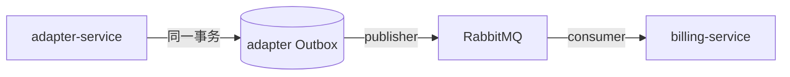
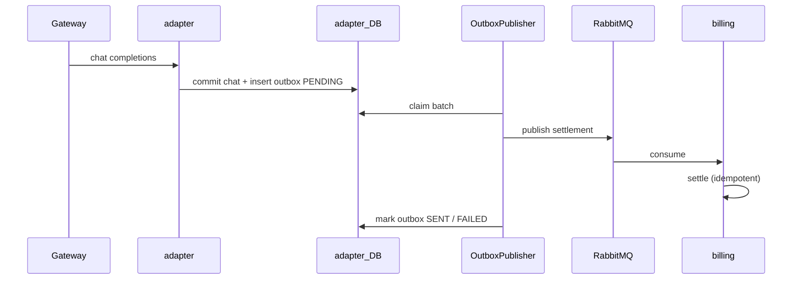

# O-2 异步账务：Outbox + RabbitMQ

## 文档信息

| 项 | 内容 |
|----|------|
| 文档版本 | v0.1 |
| 作者 | 待填写 |
| 创建日期 | 2026-05-12 |
| 业务域 | 适配器 + 计费 |
| 关联 backlog | `dev-plan.md` §2.3 **O-2** |
| 评审状态 | 草案 |

---

## 1. 需求背景与目标

- **背景**：`BillingSettlementClient` 同步 HTTP 调用 billing，adapter 线程阻塞且 billing 故障会放大尾延迟。
- **目标**：结算事件 **可靠投递**、billing **异步幂等消费**，削峰并解耦。
- **非目标**：替换实时预检（preflight）路径；首版可不改变「扣费成功才返回」的语义若产品仍要求同步扣费（需产品决策）。

---

## 2. 业务概述与范围

### 2.1 In Scope

- **Outbox 表**（adapter DB 或共享库）：`billing_settlement_outbox`（示例名）写入与 chat 响应同事务。
- **Publisher**：轮询或 Debezium（首版推荐轮询 + `FOR UPDATE SKIP LOCKED`）。
- **Consumer**：billing-service 消费 `SettlementCommand` JSON，复用 `BillingSettlementApplicationService#settle`。

### 2.2 Out of Scope

- Exactly-once 端到端（采用 **至少一次** + 幂等）；Kafka 替代方案。

---

## 3. 整体架构设计

- 与 `dev-plan.md` 全局约定 **P7 引入 RabbitMQ** 一致；开发期可用 Testcontainers 验证。

---

## 4. 业务流程 / 时序图

---

## 5. 模块拆分与职责

| 模块 | 职责 |
|------|------|
| `OutboxWriter` | adapter 在写响应路径插入 outbox |
| `OutboxPublisherJob` | 定时或即时推送 |
| `SettlementConsumer` | billing 监听队列，ACK 仅当 settle 成功或业务幂等 noop |
| `DLQHandler` | 超限重试入死信，告警 |

---

## 6. 接口设计

- **消息体**：与现有 `SettlementCommand` 对齐（traceId、userId、apiKeyId、providerCode、modelName、tokens）。
- **消息头**：`idempotency-key=traceId`（与 MQ 去重插件可选配合）。

**错误码**：消费失败重试； Poison 消息进 DLQ。

---

## 7. 数据库设计

### 7.1 Outbox 表（adapter）

| 字段 | 类型 | 说明 |
|------|------|------|
| id | BIGINT PK | |
| payload_json | TEXT | SettlementCommand |
| idempotency_key | VARCHAR(64) UNIQUE | traceId |
| status | VARCHAR | PENDING/SENT/FAILED |
| created_at / sent_at | DATETIME | |

### 7.2 索引

- `UNIQUE(idempotency_key)`、`INDEX(status, created_at)`。

---

## 8. 核心逻辑设计

- **至少一次**：billing `settle` 已幂等，重复消费安全。
- **顺序**：同 `userId` 是否要求有序？若要求，使用 **单队列 + hash 路由** 或 **per-user 单线程消费者**（吞吐权衡）。

---

## 9. 兼容性与旧数据迁移

- Feature flag：`BILLING_SETTLEMENT_ASYNC=true` 时写 outbox 并跳过同步 HTTP；回滚时恢复同步路径。
- 历史 outbox 空表无需回填。

---

## 10. 性能、容量、并发

- Publisher 批大小、退避；MQ 持久化与 prefetch。
- billing 消费并发度与 DB 连接池上限匹配。

---

## 11. 安全设计

- MQ 认证（用户名密码或 TLS）；内部消息不携带明文 API Key。

---

## 12. 异常处理与降级熔断

- MQ 堆积告警；降级为同步 HTTP（双写开关需谨慎，避免双扣——**互斥开关**）。

---

## 13. 日志、监控、告警

- Lag、publish_rate、consume_rate、`settle` 失败率。

---

## 14. 部署方案与环境依赖

- `deploy/docker-compose.yml` 取消注释 RabbitMQ 段；生产 K8s Operator。

---

## 15. 测试要点

- Outbox 与业务同事务回滚测试。
- 消费重复 3 次仅一条 `request_orders` COMPLETED。

---

## 16. 风险点与备选方案

| 风险 | 备选 |
|------|------|
| 引入双写误配双扣 | Redis Stream 单路径 |
| 运维复杂度 | 延后至 P7，与 ops 审计队列统一 |

---

## 17. 排期与里程碑

| M1 | Outbox 表 + 同步双写（仅写不入队）验证 |
| M2 | Publisher + 消费 + DLQ |
| M3 | 去掉同步 HTTP 默认路径（产品批准后） |

---

## 18. 实现对照（M1：billing 侧 Outbox 骨架）

> 与原 TDD 中「adapter 侧 Outbox」相比，本期先在 **billing-service** 落地一份等价骨架：billing `settle` 完成后同事务写一条 `billing.settled` 事件；
> P7 接入 RabbitMQ 时，把消费者也实现在 billing-service（自闭环），或迁移 outbox 至 adapter 端（如选型异步替代同步 HTTP）。

| 设计点 | 当前实现 | 文件 |
|--------|-----------|------|
| 表 | `settlement_outbox`（PENDING/SENT/FAILED + attempts + next_attempt_at） | `deploy/sql/V8__settlement_outbox.sql` |
| 同事务写入 | settle 成功后调用 `SettlementOutboxWriter#append`，复用 settle 的 `@Transactional` | `application/SettlementOutboxWriter.java`、`application/BillingSettlementApplicationService.java` |
| 幂等 | 唯一键 `(aggregate_type, aggregate_id, event_type)`，重复写入静默吞掉 | 表 + Writer |
| 发布端口 | `SettlementOutboxPublisher#publish(...)` | `application/SettlementOutboxPublisher.java` |
| 默认实现 | 仅打印结构化日志并翻转状态；`@ConditionalOnMissingBean` 允许覆盖 | `infrastructure/outbox/LoggingSettlementOutboxPublisher.java` |
| 轮询调度 | 固定延时 `fixed-delay-ms`；失败带 attempts + 指数退避（基数可配） | `infrastructure/outbox/SettlementOutboxScheduler.java` |
| 开关 | `tokenhub.billing.outbox.enabled` 默认 false | `application.yml` |

**仍待完成**：
- M2：用 RabbitMQ Publisher 替换 Logging 实现；新增消费者位置（billing 内或独立服务）；DLQ 与告警。
- M3：与产品评审后，把 adapter→billing 同步 HTTP `settle` 改为 adapter outbox + billing 消费。
