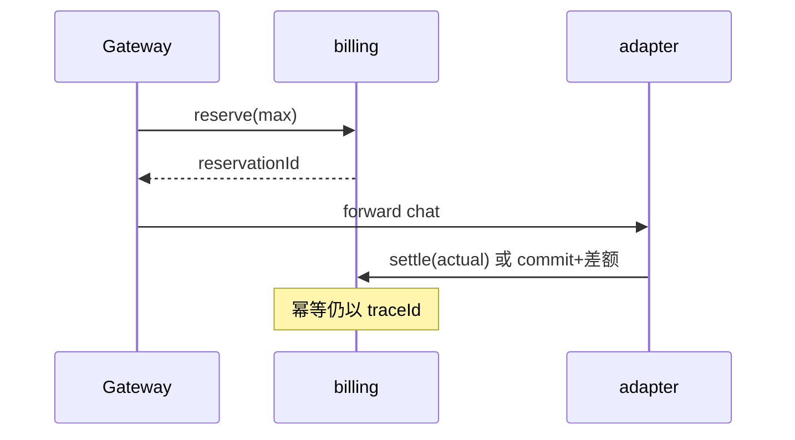

# O-3 预占额度与冲正（流式联动）

## 文档信息

| 项 | 内容 |
|----|------|
| 文档版本 | v0.1 |
| 创建日期 | 2026-05-12 |
| 业务域 | 网关 + 计费 + 适配器 |
| 关联 backlog | `dev-plan.md` §2.3 **O-3** |
| 评审状态 | 草案 |

---

## 1. 需求背景与目标

- **背景**：当前 **preflight** 仅校验余额 >0，不预留额度；长请求或流式输出完成后才真正 `settle`，存在「并发下余额在推理期间被其他请求耗尽」的边界。
- **目标**：支持 **预占（reserve）→ 确认（commit）/ 释放（release）** 与 **P8 SSE 流式计量** 对齐。
- **非目标**：首版可仅支持非流式；流式分 chunk 精确预扣可作为二期。

---

## 2. 业务概述与范围

### 2.1 In Scope

- `reserve(userId, maxMicro, traceId)`：写入 `billing_reservations` 或 `account_balance` 冻结字段（二选一方案对比）。
- `commit(traceId, actualMicro)` / `release(traceId)`。
- 网关或 adapter 在 **首包前** reserve，**尾包后** commit。

### 2.2 Out of Scope

- 跨币种；多模型混合计价预估值（可先用 `model_prices` 上界估算）。

---

## 3. 整体架构设计

- **推荐**：billing 提供 `POST /internal/billing/reserve`、`POST /internal/billing/commit`、`POST /internal/billing/release`，内部 token 鉴权。
- 网关 filter 在 preflight 之后插入 **ReserveFilter**（仅 `/v1/chat/completions`）。

---

## 4. 业务流程 / 时序图

---

## 5. 模块拆分与职责

| 模块 | 职责 |
|------|------|
| `ReservationApplicationService` | reserve/commit/release 事务 |
| `ReserveGatewayFilter` | 注入 reservation 头 `X-Reservation-Id` |
| `BillingSettlementApplicationService` | 与 settle 整合或分阶段调用 |

---

## 6. 接口设计

| 方法 | 路径 | 说明 |
|------|------|------|
| POST | `/internal/billing/reserve` | body: userId, traceId, maxAmountMicro |
| POST | `/internal/billing/commit` | body: traceId, actualAmountMicro |
| POST | `/internal/billing/release` | body: traceId |

**错误码**：预占超额 `BALANCE_INSUFFICIENT`；重复 reserve 同 traceId 幂等返回同一 reservation。

---

## 7. 数据库设计

- 表 `billing_reservations`：`trace_id` UNIQUE、`status`（ACTIVE/COMMITTED/RELEASED）、`reserved_amount`、`committed_amount`。

---

## 8. 核心逻辑设计

- **与现有 settle 关系**：方案 A：`settle` 内部先检查 ACTIVE reservation；方案 B：`commit` 直接扣减并写 `request_orders`。文档评审时二选一，避免双扣。

---

## 9. 兼容性与旧数据迁移

- 开关关闭时走现路径；无历史 reservation。

---

## 10. 性能、容量、并发

- reserve 走热路径，需 **索引 + 短事务**；可与 O-5 余额缓存只读层协调（缓存失效策略）。

---

## 11. 安全设计

- 内部接口 + `X-Internal-Token`；traceId 必须由网关生成防伪造。

---

## 12. 异常处理与降级熔断

- adapter 异常中断：网关 finally 或 reactive `doFinally` 调 **release**（需响应式 WebClient 编排）。

---

## 13. 日志、监控、告警

- `reservation_active_total`、`reservation_leak_seconds`（超时未 commit/release）。

---

## 14. 部署方案与环境依赖

- billing 先上线表与接口；网关 filter 第二周灰度。

---

## 15. 测试要点

- 异常中断自动 release；并发同 trace 幂等。

---

## 16. 风险点与备选方案

| 风险 | 备选 |
|------|------|
| 泄漏未 release | 定时 Job 扫描 ACTIVE 超时释放 |
| 双扣 | 单一 commit 入口 |

---

## 17. 排期与里程碑

| M1 | 表 + internal API + 单测 |
| M2 | 网关非流式串联 |
| M3 | SSE 尾包 commit（P8） |

---

## 18. 实现对照（M1：billing 内部端口）

| 设计点 | 当前实现 | 文件 |
|--------|-----------|------|
| 表 | `balance_reservations`（trace_id UNIQUE、状态机、TTL） | `deploy/sql/V9__balance_reservations.sql` |
| 可用余额校验 | `balance - SUM(active RESERVED.amount, 未过期)` 后插入 | `BalanceReservationApplicationService#reserve` |
| 幂等 reserve | 同 traceId 直接返回既有视图，不再二次校验 | 同上 + 唯一键 |
| commit | 仅状态翻转 + 记录 `committed_amount`，**不直接扣款**；扣款仍走 `/settle`（幂等） | `BalanceReservationApplicationService#commit` |
| release | 状态翻转 `RESERVED → RELEASED`，幂等 | `BalanceReservationApplicationService#release` |
| HTTP 入口 | `POST /internal/billing/reserve` `…/reservations/commit` `…/reservations/release` | `InternalBillingController` |
| 过期处理 | Mapper 提供 `markExpired(now)` 工具方法；定时清理任务在 M2 与网关联动时落地 | `BalanceReservationMapper#markExpired` |
| TTL 配置 | `tokenhub.billing.reservation.default-ttl-seconds`（默认 120s） | `application.yml` |

**仍待完成**：
- M2：网关 `BillingPreflightGatewayFilter` 后追加 `ReserveFilter`；adapter 调用结束（成功/失败）调 `commit/release`；定时 Job 调 `markExpired`。
- M3：SSE 流式分块计费按尾包 commit，与 `usage_ledger` 联动。
- 与 O-1 短锁共存：reserve 路径下 settle 调用频次降低，锁竞争压力相应减弱。
