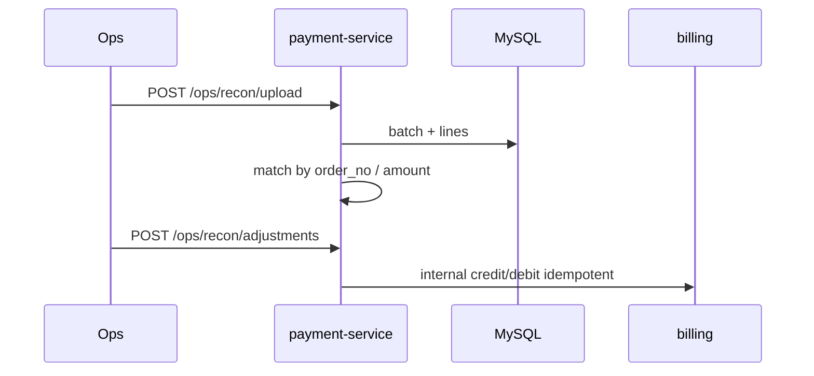

# O-4 渠道 T+1 对账与调账闭环

## 文档信息

| 项 | 内容 |
|----|------|
| 文档版本 | v0.1 |
| 创建日期 | 2026-05-12 |
| 业务域 | 支付 + 计费 + 运营 |
| 关联 backlog | `dev-plan.md` §2.3 **O-4** |
| 评审状态 | 草案 |

---

## 1. 需求背景与目标

- **背景**：现有 `BillingReconciliationScheduler` 做 **平台内** 一致性；`PaymentReconciliationScheduler` 观测 **INIT**；缺 **渠道侧账单** 比对与 **长短款调账**。
- **目标**：导入渠道日账单 → 与 `payment_orders` / `balance_topup_receipt` 对齐 → 生成差异单 → 人工或审批后调账。
- **非目标**：首版不接全税控发票自动化。

---

## 2. 业务概述与范围

### 2.1 In Scope

- 文件格式：CSV/JSON（按渠道文档占位）。
- 表：`channel_reconciliation_batches`、`channel_reconciliation_lines`、`adjustment_tickets`（命名可评审）。
- ops API：上传批次、查询差异、发起调账。

### 2.2 Out of Scope

- 实时双边对账（秒级）；跨境多币种。

---

## 3. 整体架构设计

- **payment-service**：批次导入、解析、落库；调账调用 billing **内部 credit/debit** 并记 `sourceRef=adj:{ticketId}`。
- **ops-console**：列表与审批（简化为单角色 token 可先）。

---

## 4. 业务流程 / 时序图

---

## 5. 模块拆分与职责

| 模块 | 职责 |
|------|------|
| `ReconciliationImportService` | 解析、校验、批次状态机 |
| `ReconciliationMatcher` | 订单匹配规则 |
| `AdjustmentService` | 调账幂等与审计 |

---

## 6. 接口设计

- `POST /internal/recon/batches`（或 ops 暴露）multipart 文件。
- `GET /ops/recon/batches/{id}/diffs`。
- `POST /ops/recon/adjustments/{id}/approve`。

**错误码**：重复批次号、金额不一致、已关账。

---

## 7. 数据库设计

- **batches**：`channel`、`bill_date`、`file_hash` UNIQUE、`status`。
- **lines**：`channel_txn_id`、`order_no`、`amount`、`match_status`。
- **adjustments**：关联 ticket、审批人、执行状态。

---

## 8. 核心逻辑设计

- **匹配键**：优先 `order_no`；备选渠道交易号映射表。
- **长款**：平台多收 → 调减或退款流程联动。
- **短款**：平台少收 → 补入账（需强审计与双人复核）。

---

## 9. 兼容性与旧数据迁移

- 历史订单无渠道 txn id：标记 `UNMATCHED` 人工处理。

---

## 10. 性能、容量、并发

- 大文件流式解析；批内事务分段提交。

---

## 11. 安全设计

- 文件病毒扫描（可选）；`OPS_INTERNAL_TOKEN`；调账二次确认。

---

## 12. 异常处理与降级熔断

- 解析失败整批 ROLLBACK；部分行错误记录 `line_errors`。

---

## 13. 日志、监控、告警

- 与 `BillingReconciliationScheduler` 告警对接：平台内 anomaly + 渠道 diff 联合面板。

---

## 14. 部署方案与环境依赖

- 对象存储挂载（若文件大）；定时拉取 SFTP（扩展）。

---

## 15. 测试要点

-  golden 文件对账；调账重复执行幂等。

---

## 16. 风险点与备选方案

| 风险 | 备选 |
|------|------|
| 误调账 | 审批流 + 只追加审计表 |
| 渠道格式变更 | 插件化 Parser SPI |

---

## 17. 排期与里程碑

| M1 | 表结构 + Mock 渠道文件 |
| M2 | 匹配引擎 + diff 报表 |
| M3 | 调账 API + ops UI |

---

## 18. 实现对照（M1：CSV 导入 + 平台内比对）

| 设计点 | 当前实现 | 文件 |
|--------|-----------|------|
| 表 | `channel_reconciliation_batches` / `channel_reconciliation_lines` / `adjustment_tickets` | `deploy/sql/V10__channel_reconciliation.sql` |
| 导入 | CSV `channel_order_no,local_order_no,channel_amount,channel_status,paid_at`，行级解析与状态机 | `ChannelReconciliationApplicationService#importBatch` |
| 平台内比对 | 查 `payment_orders`：金额一致且 PAID → MATCHED；金额不一致 → AMOUNT_MISMATCH；本地缺失 → MISSING_LOCAL；本地 INIT → LOCAL_INIT（应触发 retry-credit，O-8 串联）；其它 → LOCAL_OTHER | 同上 |
| 内部入口 | `POST /internal/payments/reconciliation/batches`、`GET /internal/payments/reconciliation/batches/{id}` | `InternalReconciliationController` |
| 唯一键防重复导入 | `UNIQUE (channel, bill_date, source_name)` | SQL |
| 调账工单 | 表已建（`adjustment_tickets`），API 与审批在 M3（ops-console）落地 | — |

**仍待完成**：
- M2：流式 CSV 解析（大文件分块提交）；与 `BillingReconciliationScheduler` 告警联动看板。
- M3：`POST /ops/reconciliation/adjustments` + 审批流；apply 时调 billing 内部 `credit`/`debit`，`source_ref = adj:{ticket_no}` 幂等。
- 与 O-8：`LOCAL_INIT` 行可作为 `retry-credit` 调度的输入候选。
