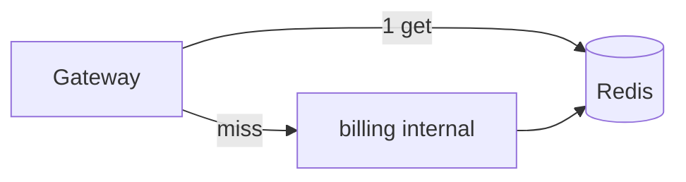
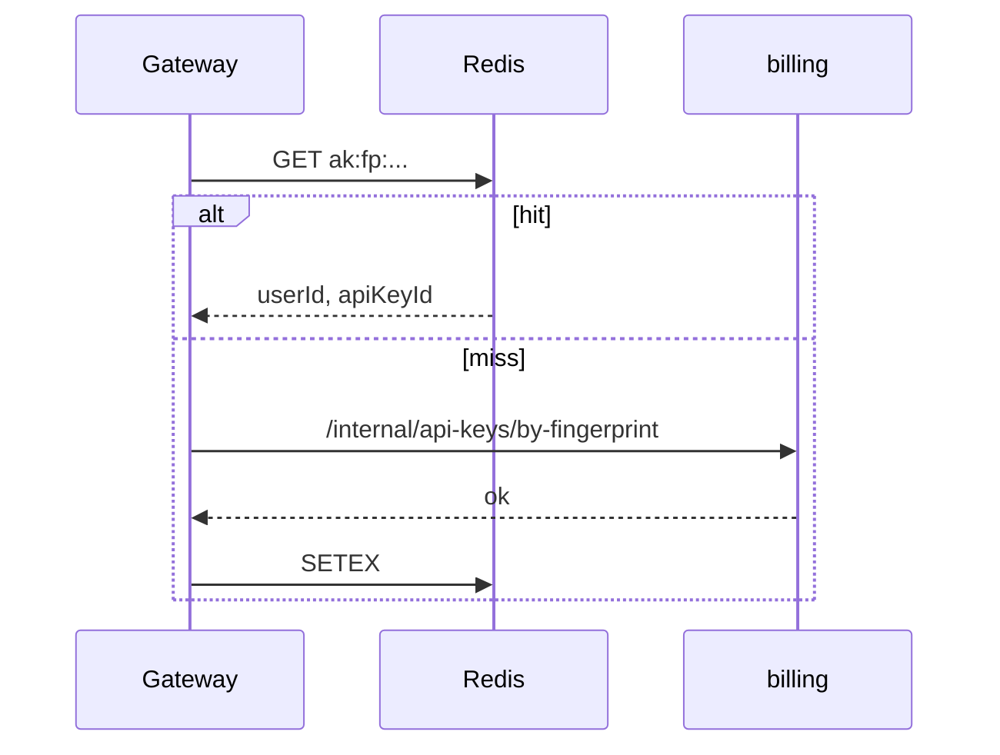

# O-5 Redis 缓存：API Key 解析与余额只读缓存

## 文档信息

| 项 | 内容 |
|----|------|
| 文档版本 | v0.1 |
| 创建日期 | 2026-05-12 |
| 业务域 | 网关 + 计费 |
| 关联 backlog | `dev-plan.md` §2.3 **O-5** |
| 评审状态 | 草案 |

---

## 1. 需求背景与目标

- **背景**：`BillingApiKeyResolveGatewayFilter` 每次请求 **HTTP 调 billing** 解析 fingerprint；preflight 亦打 billing，QPS 高时 billing 成为瓶颈。
- **目标**：**读多写少** 路径引入 **短 TTL 缓存**（Redis），降低平均延迟；写路径（创建/禁用 Key、余额变更）正确 **失效**。
- **非目标**：强一致读；缓存 miss 仍回落 DB。

---

## 2. 业务概述与范围

### 2.1 In Scope

- Key：`ak:fp:{sha256}` → JSON `{userId, apiKeyId, status}` TTL 60s～300s 可配。
- Key：`bal:rd:{userId}` → 余额只读镜像 TTL 1s～5s；**扣费/充值后删除**或 **版本戳**。

### 2.2 Out of Scope

- 本地 Caffeine 一级缓存（可作为二期）。

---

## 3. 整体架构设计

- **写入**：仍在 billing；发布 **缓存失效事件**（O-2 MQ）或 **同步 del**（简单首版）。
- **读取**：网关 ReactiveRedis 或 billing 内封装 `CachedApiKeyResolver`。

---

## 4. 业务流程 / 时序图

---

## 5. 模块拆分与职责

| 模块 | 职责 |
|------|------|
| `GatewayApiKeyCacheFilter` | get/set，与现有 Resolve filter 顺序：先 cache 再 miss 调 billing |
| `BillingCacheInvalidator` | create/disable key、debit/credit 后 del 模式 |

---

## 6. 接口设计

- 无对外新接口；billing 内部方法 `invalidateApiKeyByFingerprint`、`invalidateBalanceRead(userId)` 供自身 controller 调用。

---

## 7. 数据库设计

- 无新表；可选 `api_keys` 增加 `cache_version BIGINT` 做 stampede 防护（二期）。

---

## 8. 核心逻辑设计

- **禁用立即生效**：写 DB 后 **同步 del** `ak:fp:*`；若只做 TTL，需接受最长 TTL 内不一致 → 禁用时必须 del。
- **余额**：只读缓存 **绝不**用于扣款决策；扣款仍在 billing 事务读主库。

---

## 9. 兼容性与旧数据迁移

- 开关 `GATEWAY_APIKEY_CACHE_ENABLED=false` 默认关。

---

## 10. 性能、容量、并发

- 估算 key 空间；Redis maxmemory 策略 `volatile-ttl`。
- 防止缓存击穿：singleflight 或分布式锁 brief（网关侧）。

---

## 11. 安全设计

- Value 不含 sk；仅 id；TLS 到 Redis。

---

## 12. 异常处理与降级熔断

- Redis 超时 → 直打 billing（与现行为一致）。

---

## 13. 日志、监控、告警

- `cache_hit_ratio`、`billing_resolve_latency_p95`。

---

## 14. 部署方案与环境依赖

- 网关与 billing 共用 Redis 逻辑库隔离（key 前缀）。

---

## 15. 测试要点

- 禁用 Key 后下一请求必须 401（在 TTL 内）。

---

## 16. 风险点与备选方案

| 风险 | 备选 |
|------|------|
| 脏读 | 极短 TTL + 禁用强一致 del |
| Redis 故障 | 无缓存路径 |

---

## 17. 排期与里程碑

| M1 | billing 失效钩子 |
| M2 | 网关读缓存 + 压测 |
| M3 | 余额只读缓存（可选） |

---

## 18. 实现对照（M2 提前到 M1：网关读缓存）

| 设计点 | 当前实现 | 文件 |
|--------|-----------|------|
| 缓存层位置 | 网关 `BillingApiKeyResolveGatewayFilter` 之内（命中跳过 billing HTTP） | `gateway-service/.../infrastructure/web/BillingApiKeyResolveGatewayFilter.java` |
| Key | `cache:gw:apikey:fp:{fingerprint}` | `ApiKeyResolutionCache#keyOf` |
| Value | JSON `{userId, apiKeyId, negative}` 或 `NEG`（防穿透短 TTL） | `ApiKeyResolutionCache.Entry` |
| 正向 TTL | `tokenhub.gateway.apikey-cache.positive-ttl-seconds`（默认 60s） | `application.yml` |
| 负向 TTL | `tokenhub.gateway.apikey-cache.negative-ttl-seconds`（默认 10s） | 同上 |
| 失败降级 | Redis 异常时静默退回 HTTP；不影响请求路径 | `ApiKeyResolutionCache#get/put*` |
| 开关 | `tokenhub.gateway.apikey-cache.enabled` 默认 false | `application.yml` |
| 资金安全 | **仅缓存解析关系**，余额校验仍走 billing；与「扣款」无关 | 设计原则 |

**仍待完成**：
- 即时失效：billing 在 `disable(...)` 后通过 Redis `PUBLISH` 或写入 invalidation key，网关订阅或在请求侧 `DEL`；当前仅依赖 TTL 上界（最长 60s 不一致），不影响资金安全。
- 余额只读缓存（M3）：仅用于 dashboard 展示；preflight 与 settle 永远读主库，避免脏读引发资金错误。
