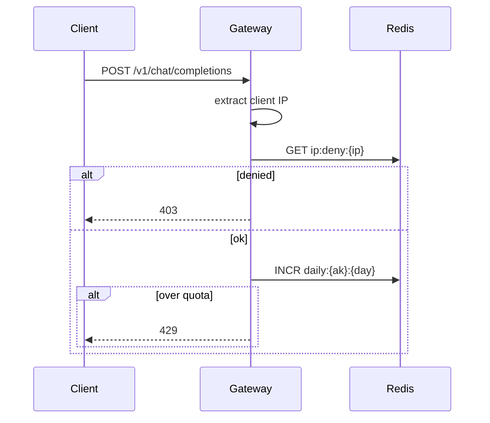

# O-6 网关风控：IP 允许列表与日/月配额

## 文档信息

| 项 | 内容 |
|----|------|
| 文档版本 | v0.1 |
| 创建日期 | 2026-05-12 |
| 业务域 | 网关 + 计费/运营配置 |
| 关联 backlog | `dev-plan.md` §2.3 **O-6** |
| 评审状态 | 草案 |

---

## 1. 需求背景与目标

- **背景**：现有 `ApiKeyRedisRateLimitGatewayFilter` 仅 **秒级 QPS**；缺 **IP 维度的允许/封禁** 与 **日/月消耗配额**（与 dev-plan P3「日配额顺延」一致）。
- **目标**：可配置 **IP 白名单/黑名单**、**按 apiKeyId 或 userId 的日/月 token 或金额累计** 超限拒绝（HTTP 429/402）。
- **非目标**：内容安全审核（另见 P7 风控引擎）。

---

## 2. 业务概述与范围

### 2.1 In Scope

- 配置来源：首版 **Redis Hash** 或 **ops-console 写 DB + 网关定时刷新**（二选一在评审定）。
- 维度：`apiKeyId` + `calendar day`（UTC 或业务时区配置）。

### 2.2 Out of Scope

- 全局限速（已有 per-key 秒级）；GeoIP 精准风控。

---

## 3. 整体架构设计

- 新过滤器 `RiskIpGatewayFilter`（Order 在 ApiKey 解析之后、限流之前或之后——需防刷策略评审）。
- 计数：`rl:daily:{apiKeyId}:{yyyyMMdd}` INCR + EXPIRE 到次日。

---

## 4. 业务流程 / 时序图

---

## 5. 模块拆分与职责

| 模块 | 职责 |
|------|------|
| `RiskIpGatewayFilter` | IP 检查 |
| `QuotaGatewayFilter` | 日/月累计 |
| `ops-console`（可选） | 配置 CRUD |

---

## 6. 接口设计

- 运营：`PUT /ops/risk/ip-rules`（草案）；或仅 DB + 刷新。
- **错误码**：`I403001` IP 拒绝、`I429002` 日配额耗尽。

---

## 7. 数据库设计

- 表 `risk_ip_rules`：`cidr`、`action`、`scope`（global/api_key）。
- 表 `api_key_quotas`：`daily_token_limit` 等（与 `api_keys` 1:1 或 1:N）。

---

## 8. 核心逻辑设计

- **时区**：统一 `Asia/Shanghai` 或 `UTC`，配置项 `tokenhub.gateway.quota-time-zone`。
- **流式**：配额扣减在 **最终 settle 的 token 数** 上增量 INCR（与 O-3 联动），首版可先按 **请求次数** 近似（文档需声明误差）。

---

## 9. 兼容性与旧数据迁移

- 默认不启用配额；无规则则跳过。

---

## 10. 性能、容量、并发

- INCR O(1)；keys 数量监控；pipeline 批量（若多规则）。

---

## 11. 安全设计

- 防止 `X-Forwarded-For` 伪造：仅信任受信反向代理注入的 IP 链；网关配置 `trustedProxies`。

---

## 12. 异常处理与降级熔断

- Redis 故障：配置 **fail-open** 或 **fail-close**（默认 fail-open 保可用性）。

---

## 13. 日志、监控、告警

- `quota_reject_total` by reason；突增告警。

---

## 14. 部署方案与环境依赖

- 与现网关 Redis 共用实例；key 前缀隔离。

---

## 15. 测试要点

- 边界：23:59 跨日重置；夏令时（若用 UTC 则无）。

---

## 16. 风险点与备选方案

| 风险 | 备选 |
|------|------|
| 配额与真实计费不一致 | 仅以 billing 汇总为准做异步校正 |
| 配置错误全站 403 | 金丝雀 apiKey 维度先上线 |

---

## 17. 排期与里程碑

| M1 | IP deny/allow + 单测 |
| M2 | 日配额 + 运营配置最小集 |
| M3 | 与流式计量对齐（P8） |

---

## 18. 实现对照（M1+M2 合并：IP 名单 + 日配额一体过滤器）

| 设计点 | 当前实现 | 文件 |
|--------|-----------|------|
| 过滤器 | `IpRiskAndQuotaGatewayFilter`，Order 12（API Key 解析后、QPS 限流前） | `gateway-service/.../infrastructure/web/IpRiskAndQuotaGatewayFilter.java` |
| IP 黑名单 | `SISMEMBER risk:ip:deny <ip>` 命中 → `403 I403002` | 同上 |
| IP 白名单（可选） | `enforce-allowlist=true` 时 `SISMEMBER risk:ip:allow <ip>` 失败 → `403 I403003` | 同上 |
| 日配额 | `INCR rl:daily:{apiKeyId}:{yyyyMMdd}` + `EXPIRE 2d`；超过 `daily-quota` → `429 I429002` | 同上 |
| IP 来源 | 优先 `X-Forwarded-For` 首段；否则 `RemoteAddress` | `resolveClientIp` |
| 错误码 | I403002 IP 拒绝；I403003 不在白名单；I429002 日配额耗尽 | 与 ErrorCode 协调（gateway 自定义 code） |
| 降级 | Redis 异常 fail-open（继续放行）；日志可在 P7 接 metrics 后告警 | 同上 |
| 开关 | `tokenhub.gateway.risk.enabled` 默认 false | `application.yml` |

**仍待完成**：
- IP 规则改为 ops-console DB 配置 + 网关定时拉取（避免人为操作 Redis 易错）。
- 按 apiKeyId/userId 维度的差异化配额（Redis Hash 表 `risk:quota:override:{apiKeyId}` 覆盖默认值）。
- 与 O-3 流式计量对齐：配额按 token 增量而非请求次数；P8 SSE 联动。
- 防伪造 `X-Forwarded-For`：在网关与 LB 之间约定 `trustedProxies`，仅信任 LB 写入的链路最后一跳。
