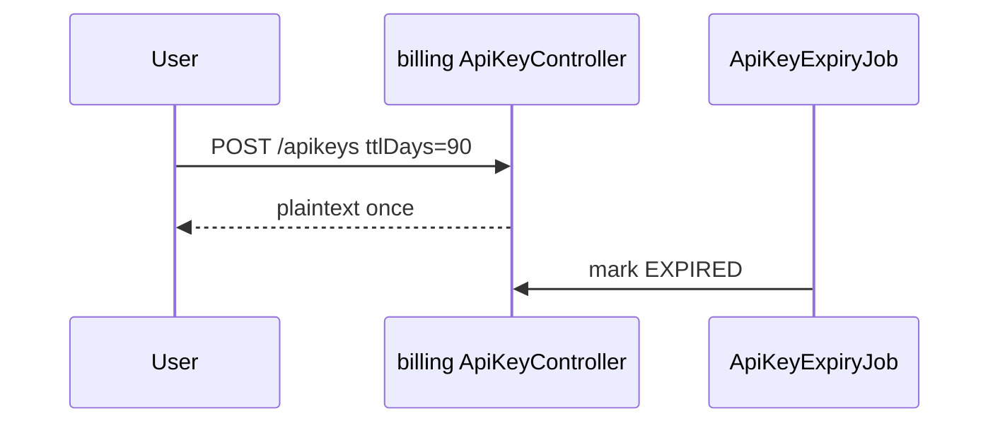

# O-7 API Key 生命周期：过期与轮换

## 文档信息

| 项 | 内容 |
|----|------|
| 文档版本 | v0.1 |
| 创建日期 | 2026-05-12 |
| 业务域 | 计费 |
| 关联 backlog | `dev-plan.md` §2.3 **O-7** |
| 评审状态 | 草案 |

---

## 1. 需求背景与目标

- **背景**：`api_keys` 仅有状态 **ACTIVE/DISABLED**，无 **expires_at**；企业客户需 **定期轮换** 与 **到期自动失效**。
- **目标**：支持到期时间、轮换流程（双活窗口）、审计。
- **非目标**：HSM 托管密钥（可后续对接）。

---

## 2. 业务概述与范围

### 2.1 In Scope

- DDL：`api_keys.expires_at DATETIME NULL`、`rotated_from_id BIGINT NULL`。
- 创建 Key 时可填 `ttlDays` 或绝对 `expiresAt`。
- Job：`ApiKeyExpiryJob` 每小时扫描 `ACTIVE AND expires_at < now()` → `EXPIRED` 状态。

### 2.2 Out of Scope

- OAuth2 client credentials 替代 API Key。

---

## 3. 整体架构设计

- 解析路径：`findActiveByFingerprint` 增加 `expires_at IS NULL OR expires_at > NOW()`。
- 网关与 billing 行为一致（若缓存见 O-5，过期必须 del）。

---

## 4. 业务流程 / 时序图

---

## 5. 模块拆分与职责

| 模块 | 职责 |
|------|------|
| `ApiKeyApplicationService` | 创建校验、列表脱敏 |
| `ApiKeyExpiryScheduler` | 批量更新状态 |
| `console-web` | 展示到期日、提醒邮件（后续） |

---

## 6. 接口设计

- `POST /apikeys` 扩展可选字段 `ttlDays`、`expiresAt`（互斥校验）。
- `GET /apikeys` 返回 `expiresAt`（不脱敏）。

**错误码**：过期后解析返回 `UNAUTHORIZED` 与明确子码（可选）。

---

## 7. 数据库设计

| 字段 | 说明 |
|------|------|
| expires_at | 可空；空表示永不过期 |
| status | 扩展枚举 `EXPIRED` |
| INDEX | `(status, expires_at)` 供 Job |

---

## 8. 核心逻辑设计

- **轮换**：新 Key `rotated_from_id` 指向旧 Key；旧 Key 在窗口内仍 ACTIVE，窗口结束 DISABLED（产品规则配置 `rotationGraceHours`）。

---

## 9. 兼容性与旧数据迁移

- `UPDATE api_keys SET expires_at = NULL WHERE expires_at IS NULL` 保持兼容；新列默认 NULL。

---

## 10. 性能、容量、并发

- Job 批处理 + `LIMIT` 分页；避免长锁表。

---

## 11. 安全设计

- 过期 Key **不可**再启用（或需管理员审计接口）。

---

## 12. 异常处理与降级熔断

- Job 失败重试；死信告警。

---

## 13. 日志、监控、告警

- `api_key_expired_total`；即将到期（7 天）metrics 可选。

---

## 14. 部署方案与环境依赖

- 仅 MySQL + billing；无额外依赖。

---

## 15. 测试要点

- 边界时刻鉴权；轮换窗口双 Key 可用。

---

## 16. 风险点与备选方案

| 风险 | 备选 |
|------|------|
| 时钟漂移 | NTP 监控；使用 DB `NOW()` 判定 |
| 大量过期 | 分片 Job |

---

## 17. 排期与里程碑

| M1 | DDL + 创建/解析改造 |
| M2 | Expiry Job + 单测 |
| M3 | 控制台展示 + 轮换 UX |

---

## 18. 实现对照（M1+M2 合并）

| 设计点 | 当前实现 | 文件 |
|--------|-----------|------|
| DDL | `api_keys` 新增 `expires_at` / `last_used_at` 与索引 `(status, expires_at)` | `deploy/sql/V11__api_keys_lifecycle.sql` |
| PO 字段 | `ApiKeyPo.expiresAt / lastUsedAt` | `ApiKeyPo.java` |
| 创建支持 TTL | `ApiKeyApplicationService#create(userId, name, ttlDays)`；旧入口默认 TTL=null（永不过期），保持兼容 | `ApiKeyApplicationService.java` |
| 解析校验 | `findActiveByFingerprint / requireActiveByFingerprint` 检查 `ACTIVE + (expires_at IS NULL OR > NOW())` | `ApiKeyApplicationService#isActiveAndUnexpired` |
| 状态收敛 | `ApiKeyExpirationScheduler` 定时 `UPDATE … SET status='EXPIRED' WHERE ACTIVE AND expires_at<=NOW()` | `infrastructure/schedule/ApiKeyExpirationScheduler.java`、`ApiKeyLifecycleMapper#markExpired` |
| 开关 | `tokenhub.billing.apikey-expiration.enabled` 默认 false | `application.yml` |

**仍待完成**：
- M3：控制台暴露 `expires_at` 字段与创建表单（`console-web`）；运营端「即将到期 7 天」提醒。
- 轮换 UX：新 Key 指向 `rotated_from_id`、grace 窗口内双活；旧 Key 优雅停用。
- `last_used_at` 触摸：在 billing 解析时 best-effort 更新（高频写需评估，或改 P7 通过 Outbox 异步落地）。
