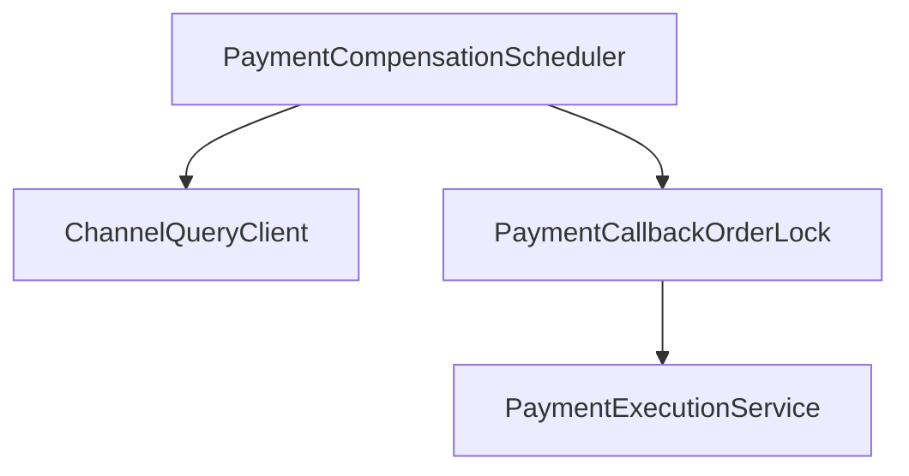
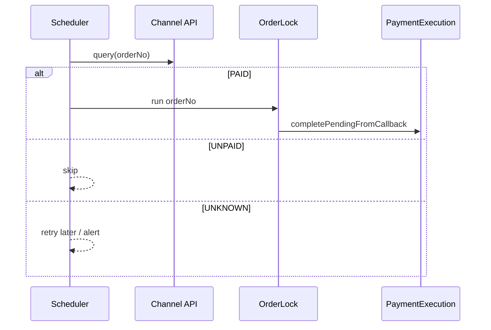

# O-8 支付补偿：渠道查单与重试入账

## 文档信息

| 项 | 内容 |
|----|------|
| 文档版本 | v0.1 |
| 创建日期 | 2026-05-12 |
| 业务域 | 支付 |
| 关联 backlog | `dev-plan.md` §2.3 **O-8** |
| 评审状态 | 草案 |

---

## 1. 需求背景与目标

- **背景**：已有 **`POST /internal/payments/orders/retry-credit`**（人工/运维确认后幂等入账）；**不能**对未支付 `INIT` 自动入账。需 **渠道客观状态** 驱动自动补偿。
- **目标**：对接 **PSP 查单 API**，仅当返回「已支付」时调用现有 `completePendingFromCallback` 或等价逻辑。
- **非目标**：替代签名校验回调；首版 Mock 渠道可模拟查单接口。

---

## 2. 业务概述与范围

### 2.1 In Scope

- `PaymentChannelQueryClient` SPI：`queryPaid(orderNo) -> Enum { PAID, UNPAID, UNKNOWN }`。
- `PaymentCompensationScheduler`：`INIT` 且 `created_at` 超过 N 分钟 → 查单 → 若 PAID 则入账（与 `PaymentCallbackOrderLock` 同锁 key）。
- **幂等**：仍依赖 billing `sourceRef=orderNo`。

### 2.2 Out of Scope

- 部分支付、拆单、合单。

---

## 3. 整体架构设计

---

## 4. 业务流程 / 时序图

---

## 5. 模块拆分与职责

| 模块 | 职责 |
|------|------|
| `MockChannelQueryClient` | 开发联调 |
| `WxChannelQueryClient`（占位） | 生产接入模板 |
| `PaymentCompensationScheduler` | 批处理 + 指标 |

---

## 6. 接口设计

- 配置：`tokenhub.payment.compensation-enabled`、`compensation-min-order-age-minutes`、`compensation-batch-size`。
- 内部不变：`/internal/payments/orders/retry-credit` 保留给不可查单渠道的人工兜底。

---

## 7. 数据库设计

- 可选 `payment_orders.last_query_at`、`query_state` 减少 PSP 调用频率。

---

## 8. 核心逻辑设计

- **退避**：UNKNOWN 指数退避；PAID 失败进入 DLQ 表或告警。
- **与观测任务关系**：`PaymentReconciliationScheduler` 继续 **WARN** stale INIT；补偿调度 **独立开关**。

---

## 9. 兼容性与旧数据迁移

- 默认 `compensation-enabled=false`；Mock 渠道可 true。

---

## 10. 性能、容量、并发

- PSP QPS 限额；本地速率限制器（bucket per channel）。

---

## 11. 安全设计

- 查单使用 **商户密钥** 签名；日志不打签名明文。

---

## 12. 异常处理与降级熔断

- PSP 超时：计入 UNKNOWN，不入账。

---

## 13. 日志、监控、告警

- `payment_compensation_paid_total`、`psp_query_fail_total`。

---

## 14. 部署方案与环境依赖

- 出网白名单到 PSP；时钟同步。

---

## 15. 测试要点

- 模拟 PAID/UNPAID/超时；确保 UNPAID **永不**入账。

---

## 16. 风险点与备选方案

| 风险 | 备选 |
|------|------|
| PSP 状态延迟 | 最小 order age 阈值 |
| 误补偿 | 双人复核 + 人工 retry 路径保留 |

---

## 17. 排期与里程碑

| M1 | SPI + Mock 查单 + 单测 |
| M2 | Scheduler + 指标 |
| M3 | 微信/支付宝查单接入 |

---

## 18. 实现对照（M1：查单端口 + 串联 retry-credit）

| 设计点 | 当前实现 | 文件 |
|--------|-----------|------|
| SPI | `ChannelQueryPort#query(channel, orderNo)` → `{status, channelAmount, raw}` | `payment-service/.../application/ChannelQueryPort.java` |
| 默认实现 | `MockChannelQueryPort`：默认返回 UNKNOWN；开发开关 `mock-returns-paid=true` 时返回 PAID（仅供联调） | `infrastructure/channel/MockChannelQueryPort.java` |
| 串联 | `ChannelReconcileApplicationService#reconcileByOrderNo` 校验本地 INIT + 渠道 PAID + 金额匹配后，**持订单短锁**调 `completePendingFromCallback`（与 mock 回调路径共锁，避免双扣） | `application/ChannelReconcileApplicationService.java` |
| 入口 | `POST /internal/payments/orders/{orderNo}/channel-reconcile` | `presentation/InternalPaymentController.java` |
| 安全原则 | UNKNOWN/UNPAID/AMOUNT_MISMATCH → 抛 `CONFLICT`；**永不**对未确认订单入账 | `ChannelReconcileApplicationService` |
| 与 retry-credit 关系 | `retry-credit` 保留：用于「确认已支付但无查单接口」的人工兜底；新端点用于「自动查单确认后入账」 | 同上 |

**仍待完成**：
- M2：`PaymentCompensationScheduler` 周期性调用上述端点处理 stale INIT；接 metrics（`compensation_paid_total`、`psp_query_fail_total`）；与 O-4 渠道对账「LOCAL_INIT」行联动。
- M3：接微信 / 支付宝官方查单 API（签名、超时、限速）；按渠道差异化退避策略。
