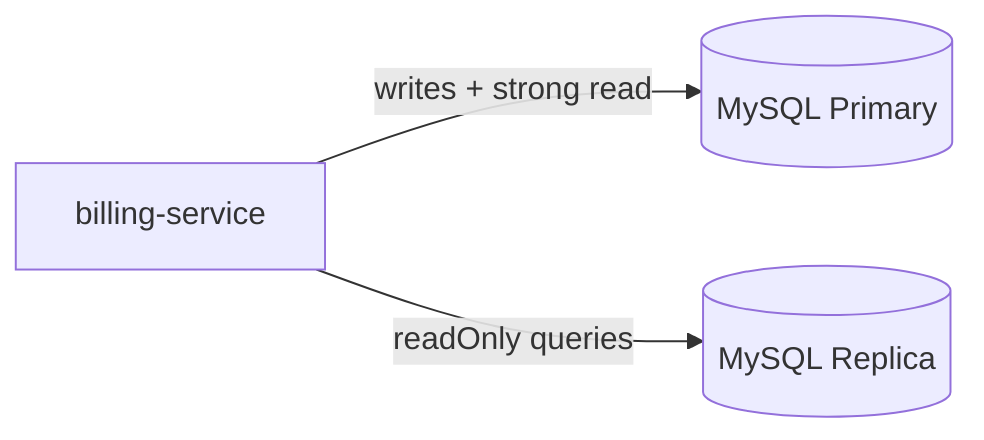
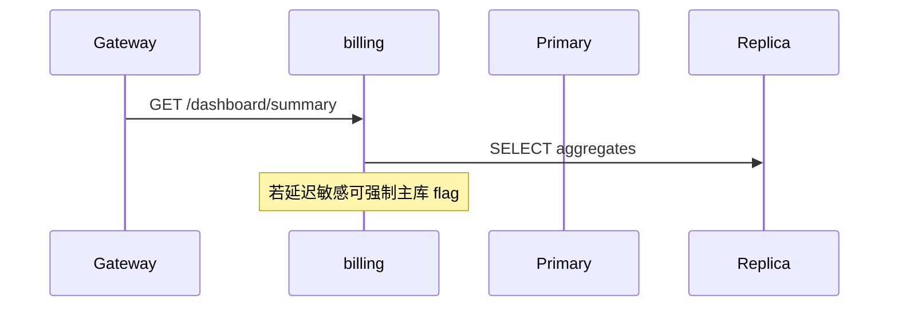

# O-9 读扩展：读写分离与热点账户缓存

## 文档信息

| 项 | 内容 |
|----|------|
| 文档版本 | v0.1 |
| 创建日期 | 2026-05-12 |
| 业务域 | 计费 + 基础设施 |
| 关联 backlog | `dev-plan.md` §2.3 **O-9** |
| 评审状态 | 草案 |

---

## 1. 需求背景与目标

- **背景**：`account_balance`、`usage_ledger` 查询随控制台与报表增长；单库读压力上升。与 **O-5** 短 TTL 缓存互补，本设计面向 **结构化读扩展**。
- **目标**：MyBatis **路由只读查询** 到副本；热点用户 **cache-aside** 可选；主从延迟可接受场景下的 **Dashboard** 类接口降级策略。
- **非目标**：分库分表（sharding）首版不做。

---

## 2. 业务概述与范围

### 2.1 In Scope

- Spring `AbstractRoutingDataSource` 或 MyBatis 插件：`@Transactional(readOnly=true)` 走 replica。
- 路由范围：**仅** `GET /dashboard/**`、`GET /v1/usage`、`GET /billing/orders` 等；**禁止** settle/debit/credit 走从库。

### 2.2 Out of Scope

- 跨地域多活；Cockroach 等 NewSQL。

---

## 3. 整体架构设计



---

## 4. 业务流程 / 时序图



---

## 5. 模块拆分与职责

| 模块 | 职责 |
|------|------|
| `DatasourceRoutingConfiguration` | Bean 定义 |
| `BillingQueryApplicationService` | 只读方法打 `@Transactional(readOnly=true)` |
| 运维 | 复制延迟监控 |

---

## 6. 接口设计

- 可选请求头 `X-Read-Consistency=strong` 强制主库（内部/运维）；默认弱一致。

---

## 7. 数据库设计

- 无逻辑表变更；运维侧 **复制账号** 最小权限（SELECT only）。

---

## 8. 核心逻辑设计

- **延迟**：Dashboard 展示「约 N 秒延迟」提示（产品可选）。
- **热点缓存**：与 O-5 协调；写后删缓存 + 主库读校验关键路径。

---

## 9. 兼容性与旧数据迁移

- 单库环境：Primary=Replica 同实例（开发）；生产拆实例。

---

## 10. 性能、容量、并发

- 副本延迟 > 阈值自动切回主库读（熔断式）。

---

## 11. 安全设计

- 从库账号无 DML；防误操作。

---

## 12. 异常处理与降级熔断

- 副本不可用 → 回主；metrics `replica_fallback_total`。

---

## 13. 日志、监控、告警

- 复制 lag（Seconds_Behind_Master 或等价）；P95 查询对比主从。

---

## 14. 部署方案与环境依赖

- MySQL 8 半同步复制（推荐生产）；连接串 `jdbc:mysql:replication://...`。

---

## 15. 测试要点

- 写后立刻读：验证默认走从时的短暂不一致是否在可接受范围；强一致头测试。

---

## 16. 风险点与备选方案

| 风险 | 备选 |
|------|------|
| 主从延迟导致误显示 | 强一致头 / 关键读主库 |
| 路由错误写从库 | 集成测试 + 启动自检 |

---

## 17. 排期与里程碑

| M1 | 路由 + 开发同机双数据源 mock |
| M2 | 只读接口改造 + 压测 |
| M3 | 生产副本 + 告警 |

---

## 18. 实现对照（M1：注解 + AOP + 动态数据源装配）

| 设计点 | 当前实现 | 文件 |
|--------|-----------|------|
| 方法级路由提示 | `@ReadOnly` 注解 | `common/common-mybatis/.../routing/ReadOnly.java` |
| 线程上下文（支持嵌套） | `RoutingContext` ThreadLocal Deque | `routing/RoutingContext.java` |
| AOP 切入 | `@Around("@annotation(ReadOnly)")` 入口压栈 READER、出口弹栈 | `routing/ReadOnlyRoutingAspect.java` |
| 动态数据源 | `DynamicRoutingDataSource extends AbstractRoutingDataSource`，未配置 reader 时全部回 writer | `routing/DynamicRoutingDataSource.java` |
| 装配 | `DataSourceRoutingConfiguration` 仅在 `tokenhub.routing.enabled=true` 时启用，注册 `writerDataSource` / `readerDataSource` / `dataSource(Primary)` | `routing/DataSourceRoutingConfiguration.java` |
| 依赖 | common-mybatis 引入 `spring-boot-starter-aop` 与 `spring-boot-starter-jdbc` | `common/common-mybatis/pom.xml` |

**示例**：

```yaml
tokenhub:
  routing:
    enabled: true
    reader:
      url: jdbc:mysql://reader.host:3306/token_charge?useUnicode=true&characterEncoding=utf8
      username: reader_ro
      password: ...
      driver-class-name: com.mysql.cj.jdbc.Driver
```

```java
@Service
public class UsageQueryService {
  @ReadOnly
  public List<UsagePoint> daily(long userId, LocalDate from, LocalDate to) { ... }
}
```

**仍待完成**：
- M2：把 dashboard / usage / api-keys list 等只读接口加 `@ReadOnly`；压测主从切换正确率与延迟容忍度。
- M3：副本健康度探测 + 自动 fallback；延迟阈值熔断；接 metrics `replica_fallback_total`。
- 与事务交互：当前 AOP Order 高于事务，确保连接获取时已设 READER；写事务严禁使用 `@ReadOnly`（评审约束）。
