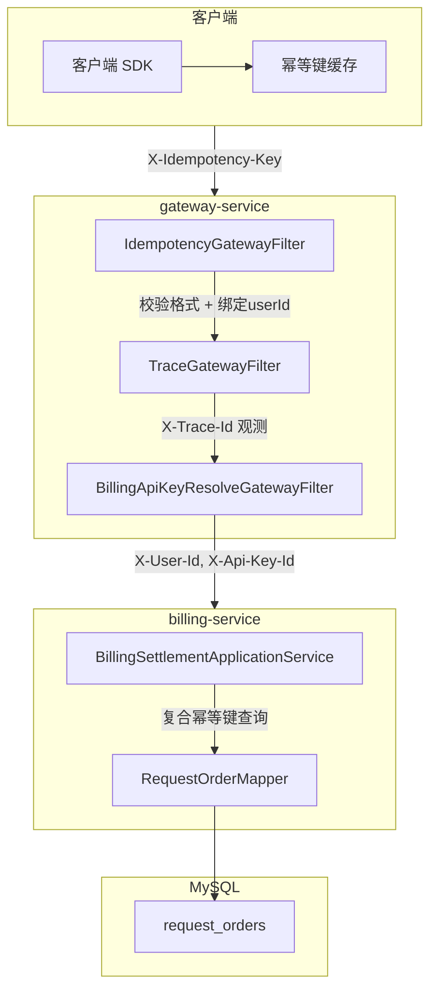
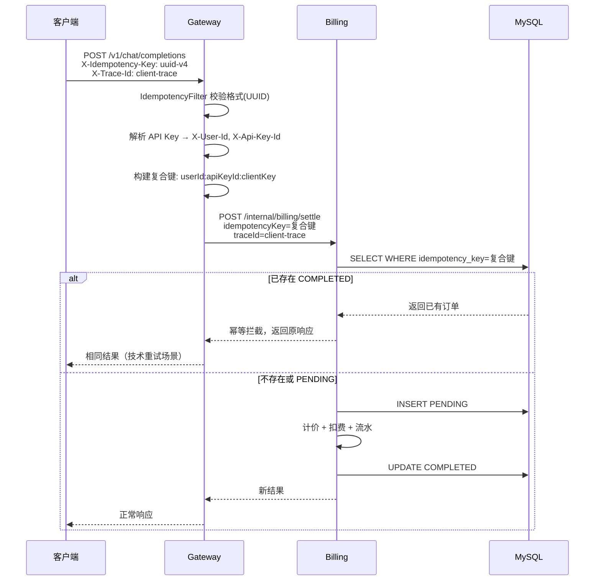
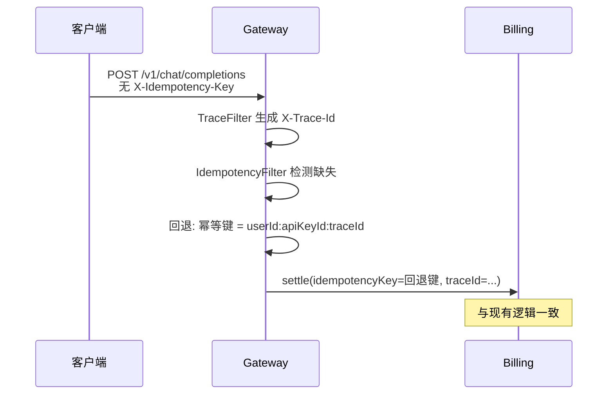

# O-10 客户端幂等键设计

## 文档信息

| 项 | 内容 |
|----|------|
| 文档标题 | 客户端幂等键设计：解决traceId职责混淆与客户端重试控制 |
| 文档版本 | v0.1 |
| 作者 | 待填写 |
| 创建日期 | 2026-05-17 |
| 最后更新 | 2026-05-17 |
| 业务域 | 网关（gateway-service）+ 计费（billing-service） |
| 关联 backlog | `dev-plan.md` §2.3 **O-10**（新增） |
| 评审状态 | 草案 |

---

## 1. 需求背景与目标

### 1.1 背景

当前系统存在以下问题：

1. **traceId 职责混淆**：`X-Trace-Id` 同时承担两种职责：
   - **观测职责**：日志关联、链路追踪、问题排查
   - **业务职责**：扣费幂等键、记账唯一标识
   
   这种设计违反单一职责原则，导致：
   - 技术重试（网络故障）和业务重试（用户不满意想重新生成）无法区分
   - traceId 语义模糊，运维人员难以理解其业务含义

2. **客户端无法控制重试语义**：
   - 客户端网络超时后自动重试，应被幂等拦截（返回相同结果）
   - 用户不满意想要新回答，应正常处理（生成新结果）
   - 当前设计无法区分这两种场景

3. **客户端生成幂等键的风险**：
   - 幂等键泄露后可被恶意滥用（跨用户重复扣费）
   - 格式不规范导致数据库索引效率下降
   - 客户端实现幂等缓存困难

### 1.2 目标

- **职责分离**：traceId 仅用于观测，新增 `X-Idempotency-Key` 专门用于业务幂等
- **客户端控制**：客户端可通过提供或不提供幂等键来控制重试语义
- **安全防护**：防止幂等键泄露滥用、格式校验、TTL 清理

### 1.3 非目标

- 不解决业务重试的「相似请求」缓存问题（超出当前范围）
- 不改变现有 traceId 的生成与传递机制（仅调整其业务用途）

---

## 2. 业务概述与范围

### 2.1 In Scope

- Gateway 层新增 `IdempotencyGatewayFilter`：校验 `X-Idempotency-Key` 格式、绑定用户身份
- Billing 层修改幂等检查逻辑：使用复合幂等键 `userId:apiKeyId:clientKey`
- 数据库新增字段与索引：`idempotency_source`、`idempotency_expires_at`
- TTL 清理调度器：定时清理已过期幂等键
- OpenAPI 契约更新：新增 `X-Idempotency-Key` 请求头声明
- 向后兼容：客户端未提供幂等键时回退使用 traceId

### 2.2 Out of Scope

- 客户端 SDK 实现（仅提供设计参考，不纳入仓库代码）
- 业务重试的「相似请求」智能缓存
- 跨请求的幂等键持久化（超出单次请求范围）

---

## 3. 整体架构设计



**关键设计点**：

1. **复合幂等键**：`userId:apiKeyId:clientKey`，绑定用户身份防止泄露滥用
2. **网关校验**：IdempotencyGatewayFilter 在 TraceGatewayFilter 之后执行，确保 traceId 已生成
3. **向后兼容**：`X-Idempotency-Key` 缺失时，幂等键 = `X-User-Id:X-Api-Key-Id:X-Trace-Id`

---

## 4. 业务流程 / 时序图

### 4.1 主成功路径（客户端提供幂等键）



### 4.2 向后兼容路径（客户端未提供幂等键）



### 4.3 重试语义控制

| 场景 | 客户端行为 | 幂等键处理 | 结果 |
|------|-----------|-----------|------|
| **技术重试**（网络超时） | 使用缓存的幂等键重试 | 相同幂等键 → 幂等拦截 | 返回相同结果 |
| **业务重试**（不满意） | 生成新幂等键重新请求 | 新幂等键 → 正常处理 | 返回新结果 |
| **首次请求** | 生成新幂等键 | 新幂等键 → 正常处理 | 正常响应 |

---

## 5. 模块拆分与职责

| 模块 | 职责 | 仓库路径 |
|------|------|----------|
| `IdempotencyGatewayFilter` | 校验幂等键格式、构建复合键、注入 Header | `gateway-service/.../presentation/filter/IdempotencyGatewayFilter.java` |
| `BillingSettlementApplicationService` | 使用复合幂等键查询、向后兼容逻辑 | `billing-service/.../application/BillingSettlementApplicationService.java` |
| `IdempotencyCleanupScheduler` | 定时清理过期幂等键 | `billing-service/.../infrastructure/scheduler/IdempotencyCleanupScheduler.java` |
| `RequestOrderPo` | 新增 `idempotencySource`、`idempotencyExpiresAt` 字段 | `billing-service/.../infrastructure/persistence/RequestOrderPo.java` |

---

## 6. 接口设计

### 6.1 HTTP 请求头

| Header | 类型 | 必填 | 说明 |
|--------|------|------|------|
| `X-Idempotency-Key` | String | 否 | 客户端提供的幂等键，格式必须为 UUID v4 |
| `X-User-Id` | Long | 是（Gateway 注入） | 用户 ID，由 BillingApiKeyResolveGatewayFilter 解析 |
| `X-Api-Key-Id` | Long | 是（Gateway 注入） | API Key ID，由 BillingApiKeyResolveGatewayFilter 解析 |
| `X-Trace-Id` | String | 是 | 观测追踪 ID，仅用于日志关联 |

### 6.2 内部接口变更

**`POST /internal/billing/settle`** 请求体新增字段：

```json
{
  "traceId": "string",
  "idempotencyKey": "string",  // 复合幂等键 userId:apiKeyId:clientKey
  "idempotencySource": "CLIENT | TRACE_ID_FALLBACK",
  "userId": "long",
  "apiKeyId": "long"
}
```

### 6.3 错误码

| HTTP 状态 | ErrorCode | 说明 |
|-----------|-----------|------|
| 400 | `IDEMPOTENCY_KEY_INVALID_FORMAT` | 幂等键格式不符合 UUID v4 规范 |
| 409 | `REQUEST_ALREADY_COMPLETED` | 幂等拦截，请求已完成 |

---

## 7. 数据库设计

### 7.1 表结构变更

**`request_orders` 表新增字段**：

| 字段 | 类型 | 默认值 | 说明 |
|------|------|--------|------|
| `idempotency_source` | VARCHAR(20) | `TRACE_ID_FALLBACK` | 幂等键来源：CLIENT / TRACE_ID_FALLBACK |
| `idempotency_expires_at` | DATETIME | NULL | 幂等键过期时间（仅 CLIENT 来源设置） |

### 7.2 索引

- **现有索引**：`uk_request_orders_idem (idempotency_key)` 保持不变
- **新增索引**：`idx_request_orders_idem_expires (idempotency_expires_at)` 用于 TTL 清理查询

### 7.3 迁移脚本

`deploy/sql/V12__idempotency_enhancement.sql`：

```sql
ALTER TABLE request_orders 
  ADD COLUMN idempotency_source VARCHAR(20) DEFAULT 'TRACE_ID_FALLBACK' 
    COMMENT '幂等键来源: CLIENT | TRACE_ID_FALLBACK',
  ADD COLUMN idempotency_expires_at DATETIME DEFAULT NULL 
    COMMENT '幂等键过期时间(仅CLIENT来源设置)',
  ADD INDEX idx_request_orders_idem_expires (idempotency_expires_at);
```

---

## 8. 核心逻辑设计

### 8.1 复合幂等键构建规则

```
复合幂等键 = userId + ":" + apiKeyId + ":" + clientKey

其中：
- userId: 用户 ID（Gateway 解析）
- apiKeyId: API Key ID（Gateway 解析）
- clientKey: 客户端提供的 X-Idempotency-Key（UUID v4 格式）

向后兼容：
- 若 clientKey 缺失，则 clientKey = X-Trace-Id
```

### 8.2 Gateway Filter 执行顺序

```
1. TraceGatewayFilter        → 生成/传递 X-Trace-Id
2. IdempotencyGatewayFilter  → 校验 X-Idempotency-Key，构建复合键
3. BillingApiKeyResolveGatewayFilter → 解析 API Key，注入 X-User-Id/X-Api-Key-Id
4. BillingPreflightGatewayFilter → 余额预检
```

### 8.3 幂等检查逻辑

```java
// BillingSettlementApplicationService.java
public BillingResult settle(SettleCommand cmd) {
    // 1. 幂等检查（使用复合幂等键）
    RequestOrderPo existing = requestOrderMapper.selectOne(
        new LambdaQueryWrapper<RequestOrderPo>()
            .eq(RequestOrderPo::getIdempotencyKey, cmd.idempotencyKey())
    );
    
    if (existing != null && "COMPLETED".equals(existing.getBillingStatus())) {
        // 幂等拦截
        return BillingResult.idempotent(existing);
    }
    
    // 2. 正常处理流程
    // ...
}
```

### 8.4 TTL 清理逻辑

```java
// IdempotencyCleanupScheduler.java
@Scheduled(cron = "0 0 3 * * ?")  // 每天凌晨 3 点
public void cleanupExpiredIdempotencyKeys() {
    // 清理条件：
    // 1. idempotency_source = 'CLIENT'
    // 2. idempotency_expires_at < NOW()
    // 3. billing_status = 'COMPLETED'
    
    int deleted = requestOrderMapper.delete(
        new LambdaQueryWrapper<RequestOrderPo>()
            .eq(RequestOrderPo::getIdempotencySource, "CLIENT")
            .lt(RequestOrderPo::getIdempotencyExpiresAt, LocalDateTime.now())
            .eq(RequestOrderPo::getBillingStatus, "COMPLETED")
    );
    
    log.info("Cleaned up {} expired idempotency keys", deleted);
}
```

---

## 9. 兼容性与旧数据迁移

### 9.1 向后兼容策略

- **客户端未提供幂等键**：回退使用 `userId:apiKeyId:traceId` 作为幂等键
- **现有订单**：`idempotency_source` 默认为 `TRACE_ID_FALLBACK`，无过期时间
- **无数据回填**：新增字段有默认值，无需回填历史数据

### 9.2 Feature Flag

暂不引入开关，直接部署。理由：
- 向后兼容设计确保现有客户端不受影响
- 新功能为增强型，非破坏性变更

---

## 10. 性能、容量、并发

### 10.1 性能影响

| 操作 | 影响 | 缓解措施 |
|------|------|----------|
| Gateway 格式校验 | 微小（正则匹配） | 无需特殊处理 |
| 复合键构建 | 微小（字符串拼接） | 无需特殊处理 |
| 幂等查询 | 与现有一致 | 复合键长度约 60 字符，索引效率良好 |

### 10.2 索引效率

- 复合幂等键格式固定：`数字:数字:UUID`
- 长度约 60 字符，符合 VARCHAR(191) 最佳实践
- 唯一索引 `uk_request_orders_idem` 保持不变

### 10.3 TTL 清理

- 每日凌晨 3 点执行，避开业务高峰
- 仅清理 `COMPLETED` 状态订单，不影响业务

---

## 11. 安全设计

### 11.1 幂等键泄露防护

| 风险 | 防护措施 |
|------|----------|
| 跨用户滥用 | 复合键绑定 `userId:apiKeyId`，泄露后仅能用于原用户 |
| 格式不规范 | Gateway 校验 UUID v4 格式，拒绝非法输入 |
| 长期有效 | TTL 24 小时过期，定时清理 |

### 11.2 格式校验规则

```java
// UUID v4 格式校验
private static final Pattern UUID_V4_PATTERN = 
    Pattern.compile("^[0-9a-f]{8}-[0-9a-f]{4}-4[0-9a-f]{3}-[89ab][0-9a-f]{3}-[0-9a-f]{12}$");

public boolean isValidIdempotencyKey(String key) {
    return key != null && key.length() == 36 && UUID_V4_PATTERN.matcher(key).matches();
}
```

### 11.3 日志脱敏

- traceId 正常打印（观测用途）
- 幂等键打印时仅显示后 8 位：`...{last8}`

---

## 12. 异常处理与降级熔断

### 12.1 异常分类

| 异常 | 处理 |
|------|------|
| 幂等键格式非法 | 返回 400 `IDEMPOTENCY_KEY_INVALID_FORMAT` |
| 幂等键过长 | 返回 400（Gateway 截断或拒绝） |
| 幂等查询失败 | 记录日志，继续正常处理（降级） |

### 12.2 降级策略

- 幂等查询失败时，继续正常扣费流程，依赖事务保证一致性
- 不因幂等检查失败而阻断业务

---

## 13. 日志、监控、告警

### 13.1 日志字段

- `traceId`：观测追踪
- `idempotencyKey`：脱敏后打印（仅后 8 位）
- `idempotencySource`：CLIENT / TRACE_ID_FALLBACK

### 13.2 Metrics

| Metric | 说明 |
|--------|------|
| `idempotency_key_client_provided_total` | 客户端提供幂等键的请求计数 |
| `idempotency_key_fallback_total` | 回退 traceId 的请求计数 |
| `idempotency_intercept_total` | 幂等拦截计数 |
| `idempotency_cleanup_deleted_total` | TTL 清理删除计数 |

### 13.3 告警规则

- 幂等拦截率异常高（> 5%）：可能存在客户端重试风暴
- TTL 清理失败：调度器异常

---

## 14. 部署方案与环境依赖

### 14.1 环境变量

无新增环境变量。

### 14.2 配置项

| 配置项 | 默认值 | 说明 |
|--------|--------|------|
| `tokenhub.gateway.idempotency.ttl-hours` | 24 | 客户端幂等键过期时间（小时） |
| `tokenhub.billing.idempotency.cleanup-cron` | `0 0 3 * * ?` | TTL 清理调度时间 |

---

## 15. 测试要点

### 15.1 单元测试

- `IdempotencyGatewayFilterTest`：格式校验、复合键构建、向后兼容
- `BillingSettlementApplicationServiceTest`：幂等检查、复合键查询

### 15.2 集成测试

- 客户端提供幂等键 → 重复请求 → 幂等拦截
- 客户端未提供幂等键 → 回退 traceId → 正常处理
- TTL 清理调度器 → 过期订单被清理

### 15.3 边界测试

| 场景 | 预期 |
|------|------|
| 幂等键格式非法 | 400 错误 |
| 幂等键超长 | 400 错误 |
| 同一用户不同 API Key | 不同幂等键，不冲突 |
| 不同用户相同幂等键 | 不同复合键，不冲突 |

---

## 16. 风险点与备选方案

| 风险 | 影响 | 缓解 | 备选 |
|------|------|------|------|
| 客户端幂等键泄露 | 被恶意重试扣费 | 复合键绑定 userId | IP 白名单（O-6） |
| TTL 清理失败 | 幂等键堆积 | 监控告警 | 手动清理脚本 |
| 客户端不理解幂等键用途 | 误用或滥用 | 文档说明 | 服务端强制生成 |

---

## 17. 排期与里程碑

| 里程碑 | 交付物 | 目标日期 |
|--------|--------|----------|
| M1 | TDD 文档 + OpenAPI 契约更新 | W1 |
| M2 | Gateway Filter + Billing 幂等逻辑 + 数据库迁移 | W2 |
| M3 | TTL 清理调度器 + 单元/集成测试 | W3 |
| M4 | 生产部署 + 监控验证 | W4 |

---

## 18. 实现对照（可选，上线后维护）

| 设计点 | 代码位置 | 状态 |
|--------|----------|------|
| IdempotencyGatewayFilter | `gateway-service/.../filter/` | 待开发 |
| BillingSettlementApplicationService 幂等检查 | `billing-service/.../application/` | 待开发 |
| V12 数据库迁移 | `deploy/sql/` | 待开发 |
| IdempotencyCleanupScheduler | `billing-service/.../scheduler/` | 待开发 |
| OpenAPI 契约更新 | `docs/openapi/unified-api.yaml` | 待开发 |