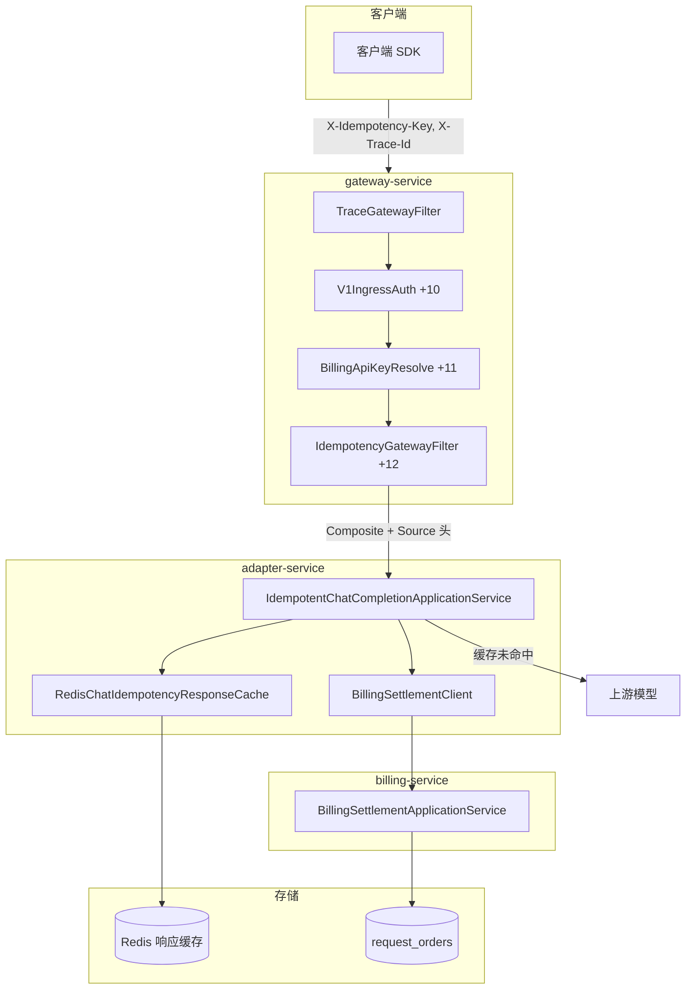
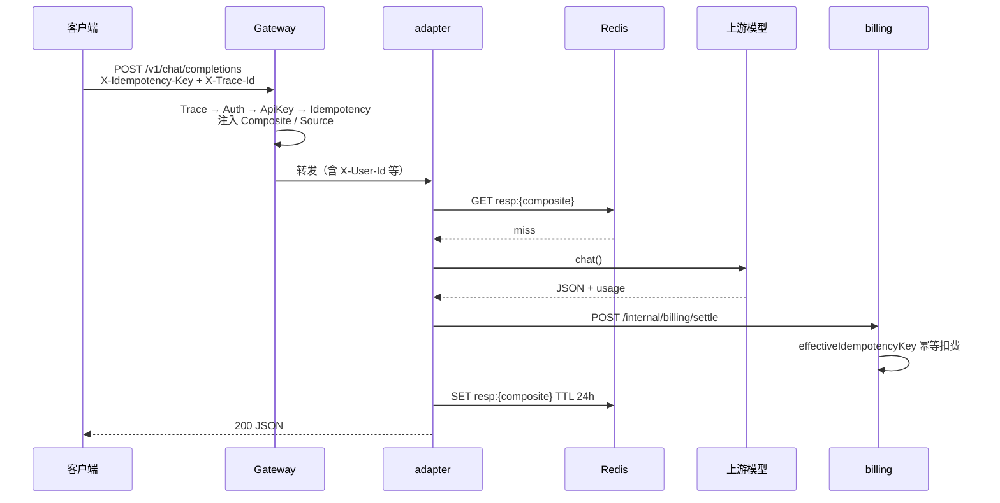
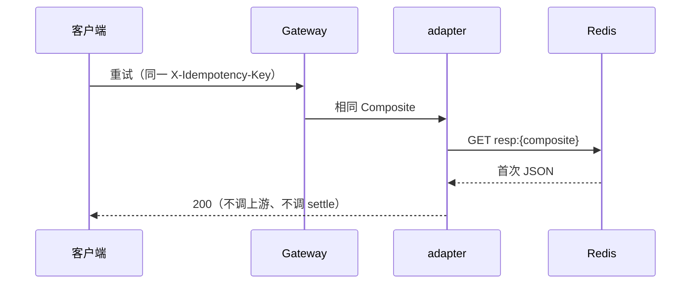
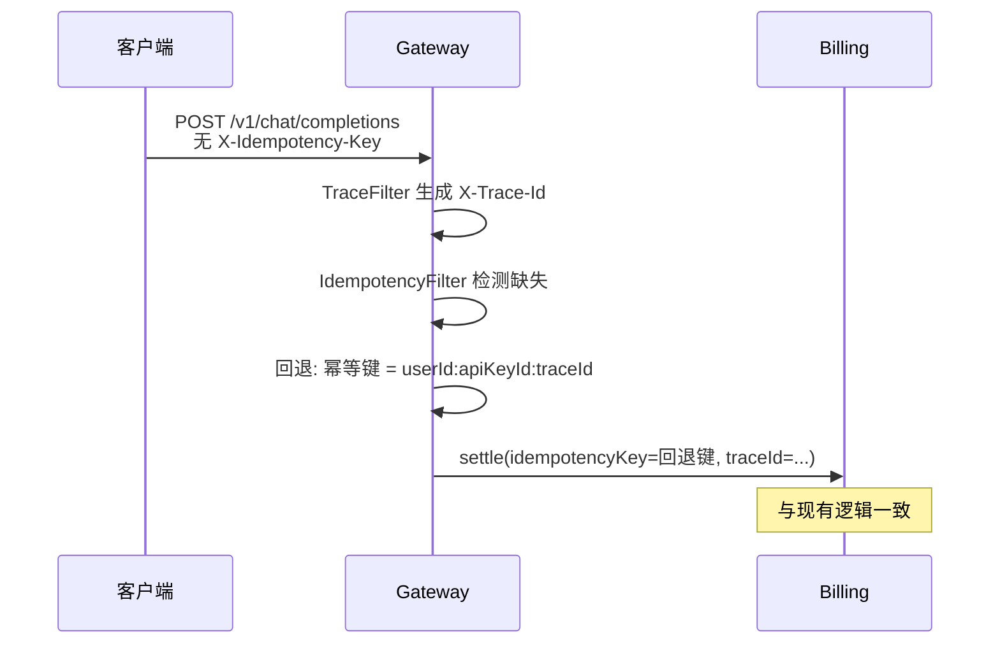

# O-10 客户端幂等键设计

## 文档信息

| 项 | 内容 |
|----|------|
| 文档标题 | 客户端幂等键设计：解决traceId职责混淆与客户端重试控制 |
| 文档版本 | v0.2（与实现对齐） |
| 作者 | 待填写 |
| 创建日期 | 2026-05-17 |
| 最后更新 | 2026-05-16 |
| 业务域 | 网关（gateway-service）+ 适配器（adapter-service）+ 计费（billing-service） |
| 关联 backlog | `dev-plan.md` §2.3 **O-10** |
| 评审状态 | 草案（M1 核心链路已落地，见 §18） |

---

## 1. 需求背景与目标

### 1.1 背景

当前系统存在以下问题：

1. **traceId 职责混淆**：`X-Trace-Id` 同时承担两种职责：
   - **观测职责**：日志关联、链路追踪、问题排查
   - **业务职责**：扣费幂等键、记账唯一标识
   
   这种设计违反单一职责原则，导致：
   - 技术重试（网络故障）和业务重试（用户不满意想重新生成）无法区分
   - traceId 语义模糊，运维人员难以理解其业务含义

2. **客户端无法控制重试语义**：
   - 客户端网络超时后自动重试，应被幂等拦截（返回相同结果）
   - 用户不满意想要新回答，应正常处理（生成新结果）
   - 当前设计无法区分这两种场景

3. **客户端生成幂等键的风险**：
   - 幂等键泄露后可被恶意滥用（跨用户重复扣费）
   - 格式不规范导致数据库索引效率下降
   - 客户端实现幂等缓存困难

### 1.2 目标

- **职责分离**：`X-Trace-Id` 仅用于观测与订单 `trace_id`；业务幂等使用 `X-Idempotency-Key`（网关合成复合键）。
- **用户侧不重复扣费**：billing `settle` 以 `effectiveIdempotencyKey`（优先复合键，否则 `traceId`）幂等。
- **平台侧不重复调上游**：adapter 对同一复合键缓存 Chat **成功响应**（Redis），命中则跳过模型与 `settle`。
- **客户端控制**：固定幂等键 = 技术重试；新幂等键 = 新业务意图。
- **安全防护**：复合键绑定 `userId:apiKeyId`、UUID v4 格式校验、`CLIENT` 来源订单 24h 过期字段（清理调度待 M3）。

### 1.3 非目标

- 不实现「语义相似但不同 Key」的智能去重（需新 Key）。
- 不改变 `X-Trace-Id` 的生成/透传机制（仅不再单独依赖其防重复扣费）；超长 trace 由 `TraceGatewayFilter` 拒绝（`I400002`）。
- SSE 流式 Chat 的幂等与缓存（仍待 P8 / 后续迭代）。

---

## 2. 业务概述与范围

### 2.1 In Scope（已实现 / 部分实现）

| 能力 | 状态 | 说明 |
|------|------|------|
| `IdempotencyGatewayFilter` | **已落地** | 仅 `POST /v1/chat/completions`；UUID v4 校验；注入 `X-Idempotency-Key-Composite` / `X-Idempotency-Source` |
| `TraceGatewayFilter` 长度校验 | **已落地** | `X-Trace-Id` 最长 128，`I400002` |
| billing `settle` 复合幂等键 | **已落地** | `SettlementRequest` + `effectiveIdempotencyKey` |
| adapter 响应缓存 | **已落地** | Redis `adapter:chat:idem:resp:{composite}`，见 `07-ChatIdempotencyResponseCache.md` |
| DB `V12__idempotency_enhancement.sql` | **已提供脚本** | `idempotency_source`、`idempotency_expires_at` 及索引 |
| `TRACE_ID_FALLBACK` | **已落地** | 无客户端键时 `userId:apiKeyId:traceId`（不推荐生产依赖） |
| TTL 清理调度器 | **未实现** | 见 §8.4，M3 |
| OpenAPI 头声明 | **待补** | `unified-api.yaml` 仍待同步 |

### 2.2 Out of Scope

- 客户端 SDK 实现（仓库外）
- 同 Key 不同 body 返回 409（当前：**返回首次成功响应**，防薅平台）
- 跨用户/跨租户的幂等键共享

---

## 3. 整体架构设计



**关键设计点**：

1. **复合幂等键**：`userId:apiKeyId:clientKey`（JWT 无 API Key 时 `apiKeyId=0`）。
2. **过滤器顺序**：Trace → 鉴权 → API Key 解析 → **幂等合成**（依赖 `X-User-Id` 与 `gateway.traceId`）→ 风控/限流/预检。
3. **双端幂等**：billing 防重复扣费；adapter Redis 防重复调上游（命中不调 `settle`）。
4. **向后兼容**：无 `X-Idempotency-Key` 时用 `traceId` 参与 `TRACE_ID_FALLBACK` 复合键。

---

## 4. 业务流程 / 时序图

### 4.1 主成功路径（客户端提供幂等键，首次请求）



### 4.1b 技术重试（相同幂等键，缓存命中）



### 4.2 向后兼容路径（客户端未提供幂等键）



### 4.3 重试语义控制

| 场景 | 客户端行为 | 结算（billing） | 模型（adapter 缓存） |
|------|-----------|----------------|----------------------|
| **技术重试** | 固定 `X-Idempotency-Key` | 同复合键 → 不重复扣费 | 缓存命中 → 不调上游 |
| **业务重试**（要新回答） | **新** UUID v4 幂等键 | 新单正常扣费 | 新键 → 调上游 |
| **首次请求** | 新幂等键 | 正常扣费 | 调上游并写缓存 |
| **同 Key 不同 body**（滥用） | 恶意复用 Key | 不重复扣费 | 返回**首次**响应（不调上游） |

### 4.4 并发同键（in-flight）

第二个请求在第一个尚未写缓存时：`SET NX lock:{composite}` 失败 → 轮询 Redis（默认 30s）→ 仍无缓存则 **409** / `I409001`「相同幂等键的请求正在处理中」。

---

## 5. 模块拆分与职责

| 模块 | 职责 | 仓库路径 | 状态 |
|------|------|----------|------|
| `TraceGatewayFilter` | `X-Trace-Id` 生成/透传；超长 128 → `I400002` | `gateway-service/.../web/TraceGatewayFilter.java` | 已落地 |
| `IdempotencyGatewayFilter` | UUID v4 校验、复合键、注入头 | `gateway-service/.../web/IdempotencyGatewayFilter.java` | 已落地 |
| `IdempotentChatCompletionApplicationService` | Chat 编排：缓存 / 锁 / 模型 / 结算 | `adapter-service/.../application/IdempotentChatCompletionApplicationService.java` | 已落地 |
| `RedisChatIdempotencyResponseCache` | Redis 响应与 in-flight 锁 | `adapter-service/.../cache/RedisChatIdempotencyResponseCache.java` | 已落地 |
| `BillingSettlementClient` | 转发 `idempotencyKey` / `idempotencySource` | `adapter-service/.../billing/BillingSettlementClient.java` | 已落地 |
| `BillingSettlementApplicationService` | `effectiveIdempotencyKey` 幂等 settle | `billing-service/.../application/BillingSettlementApplicationService.java` | 已落地 |
| `RequestOrderPo` | `idempotencySource`、`idempotencyExpiresAt` | `billing-service/.../persistence/RequestOrderPo.java` | 已落地 |
| `IdempotencyCleanupScheduler` | 清理过期 `CLIENT` 订单行 | `billing-service/.../scheduler/` | **未实现** |

---

## 6. 接口设计

### 6.1 HTTP 请求头

**客户端 → 网关（Chat）**

| Header | 必填 | 说明 |
|--------|------|------|
| `X-Idempotency-Key` | 否（**生产建议必填**） | UUID v4；非法 → `400` / `I400001` |
| `X-Trace-Id` | 否 | 观测用；缺省由网关生成；长度 ≤ 128 |

**网关 → adapter / billing（内部透传）**

| Header | 说明 |
|--------|------|
| `X-User-Id` | 鉴权 / API Key 解析后注入 |
| `X-Api-Key-Id` | API Key 路径；JWT 路径可能缺失（复合键用 `0`） |
| `X-Trace-Id` | 与观测一致 |
| `X-Idempotency-Key-Composite` | `userId:apiKeyId:clientKeyOrTrace` |
| `X-Idempotency-Source` | `CLIENT` \| `TRACE_ID_FALLBACK` |

### 6.2 内部接口变更

**`POST /internal/billing/settle`** 请求体新增字段：

```json
{
  "traceId": "string",
  "idempotencyKey": "string",  // 复合幂等键 userId:apiKeyId:clientKey
  "idempotencySource": "CLIENT | TRACE_ID_FALLBACK",
  "userId": "long",
  "apiKeyId": "long"
}
```

### 6.3 错误码（与实现对齐）

| HTTP | code | 位置 | 说明 |
|------|------|------|------|
| 400 | `I400001` | 网关 | `X-Idempotency-Key` 非 UUID v4 |
| 400 | `I400002` | 网关 | `X-Trace-Id` 长度 &gt; 128 |
| 409 | `I409001` | adapter | 同幂等键 in-flight 超时（`BusinessException` / `CONFLICT`） |

> billing 对已 `COMPLETED` 的 settle 为**静默 return**（HTTP 2xx），不向客户端返回 409。

---

## 7. 数据库设计

### 7.1 表结构变更

**`request_orders` 表新增字段**：

| 字段 | 类型 | 默认值 | 说明 |
|------|------|--------|------|
| `idempotency_source` | VARCHAR(20) | `TRACE_ID_FALLBACK` | 幂等键来源：CLIENT / TRACE_ID_FALLBACK |
| `idempotency_expires_at` | DATETIME | NULL | 幂等键过期时间（仅 CLIENT 来源设置） |

### 7.2 索引

- **现有索引**：`uk_request_orders_idem (idempotency_key)` 保持不变
- **新增索引**：`idx_request_orders_idem_expires (idempotency_expires_at)` 用于 TTL 清理查询

### 7.3 迁移脚本

`deploy/sql/V12__idempotency_enhancement.sql`：

```sql
ALTER TABLE request_orders 
  ADD COLUMN idempotency_source VARCHAR(20) DEFAULT 'TRACE_ID_FALLBACK' 
    COMMENT '幂等键来源: CLIENT | TRACE_ID_FALLBACK',
  ADD COLUMN idempotency_expires_at DATETIME DEFAULT NULL 
    COMMENT '幂等键过期时间(仅CLIENT来源设置)',
  ADD INDEX idx_request_orders_idem_expires (idempotency_expires_at);
```

---

## 8. 核心逻辑设计

### 8.1 复合幂等键构建规则

```
复合幂等键 = userId + ":" + apiKeyId + ":" + clientKey

其中：
- userId: 用户 ID（Gateway 解析）
- apiKeyId: API Key ID（Gateway 解析）
- clientKey: 客户端提供的 X-Idempotency-Key（UUID v4 格式）

向后兼容：
- 若 clientKey 缺失，则 clientKey = X-Trace-Id
```

### 8.2 Gateway Filter 执行顺序（已实现）

| Order | 过滤器 |
|-------|--------|
| `HIGHEST` | `TraceGatewayFilter` |
| +10 | `V1IngressAuthGatewayFilter` |
| +11 | `BillingApiKeyResolveGatewayFilter`（注入 `X-User-Id` / `X-Api-Key-Id`） |
| +12 | `IdempotencyGatewayFilter`（需 `X-User-Id`；读 `gateway.traceId` 做回退） |
| +13 | `IpRiskAndQuotaGatewayFilter` |
| +14 | `ApiKeyRedisRateLimitGatewayFilter` |
| +15 | `BillingPreflightGatewayFilter` |

### 8.3 幂等检查逻辑

```java
// BillingSettlementApplicationService.java
public BillingResult settle(SettleCommand cmd) {
    // 1. 幂等检查（使用复合幂等键）
    RequestOrderPo existing = requestOrderMapper.selectOne(
        new LambdaQueryWrapper<RequestOrderPo>()
            .eq(RequestOrderPo::getIdempotencyKey, cmd.idempotencyKey())
    );
    
    if (existing != null && "COMPLETED".equals(existing.getBillingStatus())) {
        // 幂等拦截
        return BillingResult.idempotent(existing);
    }
    
    // 2. 正常处理流程
    // ...
}
```

### 8.4 adapter 响应缓存（已实现）

| 项 | 约定 |
|----|------|
| 响应键 | `adapter:chat:idem:resp:{composite}` |
| 锁键 | `adapter:chat:idem:lock:{composite}` |
| 写缓存条件 | 响应含 `choices` 或 `usage` token；且 `trySettle` 2xx 或 `settlement-enabled=false` |
| TTL | 默认 86400s（`tokenhub.adapter.idempotency-cache.ttl-seconds`） |
| 无 Redis | 退化为每次 `chat` + `trySettle`（仅 billing 幂等） |

详见 `adapter-service/docs/components/07-ChatIdempotencyResponseCache.md`。

### 8.5 TTL 清理逻辑（**设计保留，代码未实现**）

`BillingSettlementApplicationService` 在 `idempotencySource=CLIENT` 时已写入 `idempotencyExpiresAt = now + 24h`。  
计划由 `IdempotencyCleanupScheduler` 按 `idempotency_expires_at` 清理历史 `COMPLETED` 行（**不删除** Redis 缓存键，缓存靠 TTL 自行过期）。

---

## 9. 兼容性与旧数据迁移

### 9.1 向后兼容策略

- **客户端未提供幂等键**：回退使用 `userId:apiKeyId:traceId` 作为幂等键
- **现有订单**：`idempotency_source` 默认为 `TRACE_ID_FALLBACK`，无过期时间
- **无数据回填**：新增字段有默认值，无需回填历史数据

### 9.2 Feature Flag

暂不引入开关，直接部署。理由：
- 向后兼容设计确保现有客户端不受影响
- 新功能为增强型，非破坏性变更

---

## 10. 性能、容量、并发

### 10.1 性能影响

| 操作 | 影响 | 缓解措施 |
|------|------|----------|
| Gateway 格式校验 | 微小（正则匹配） | 无需特殊处理 |
| 复合键构建 | 微小（字符串拼接） | 无需特殊处理 |
| 幂等查询 | 与现有一致 | 复合键长度约 60 字符，索引效率良好 |

### 10.2 索引效率

- 复合幂等键格式固定：`数字:数字:UUID`
- 长度约 60 字符，符合 VARCHAR(191) 最佳实践
- 唯一索引 `uk_request_orders_idem` 保持不变

### 10.3 TTL 清理

- 每日凌晨 3 点执行，避开业务高峰
- 仅清理 `COMPLETED` 状态订单，不影响业务

---

## 11. 安全设计

### 11.1 幂等键泄露防护

| 风险 | 防护措施 |
|------|----------|
| 跨用户滥用 | 复合键绑定 `userId:apiKeyId`，泄露后仅能用于原用户 |
| 格式不规范 | Gateway 校验 UUID v4 格式，拒绝非法输入 |
| 长期有效 | TTL 24 小时过期，定时清理 |

### 11.2 格式校验规则

```java
// UUID v4 格式校验
private static final Pattern UUID_V4_PATTERN = 
    Pattern.compile("^[0-9a-f]{8}-[0-9a-f]{4}-4[0-9a-f]{3}-[89ab][0-9a-f]{3}-[0-9a-f]{12}$");

public boolean isValidIdempotencyKey(String key) {
    return key != null && key.length() == 36 && UUID_V4_PATTERN.matcher(key).matches();
}
```

### 11.3 日志脱敏

- traceId 正常打印（观测用途）
- 幂等键打印时仅显示后 8 位：`...{last8}`

---

## 12. 异常处理与降级熔断

### 12.1 异常分类

| 异常 | 处理 |
|------|------|
| 幂等键格式非法 | 网关 `400` / `I400001` |
| TraceId 超长 | 网关 `400` / `I400002` |
| 同键 in-flight 超时 | adapter `409` / `I409001` |
| 幂等查询失败 | 记录日志，继续正常处理（降级） |

### 12.2 降级策略

- 幂等查询失败时，继续正常扣费流程，依赖事务保证一致性
- 不因幂等检查失败而阻断业务

---

## 13. 日志、监控、告警

### 13.1 日志字段

- `traceId`：观测追踪
- `idempotencyKey`：脱敏后打印（仅后 8 位）
- `idempotencySource`：CLIENT / TRACE_ID_FALLBACK

### 13.2 Metrics

| Metric | 说明 |
|--------|------|
| `idempotency_key_client_provided_total` | 客户端提供幂等键的请求计数 |
| `idempotency_key_fallback_total` | 回退 traceId 的请求计数 |
| `idempotency_intercept_total` | 幂等拦截计数 |
| `idempotency_cleanup_deleted_total` | TTL 清理删除计数 |

### 13.3 告警规则

- 幂等拦截率异常高（> 5%）：可能存在客户端重试风暴
- TTL 清理失败：调度器异常

---

## 14. 部署方案与环境依赖

### 14.1 环境变量

| 变量 | 服务 | 说明 |
|------|------|------|
| `REDIS_HOST` / `REDIS_PORT` | adapter（及 gateway/billing 已有） | 响应缓存依赖 Redis |
| `ADAPTER_IDEMPOTENCY_CACHE_ENABLED` | adapter | 默认 `true` |
| `ADAPTER_IDEMPOTENCY_CACHE_TTL` | adapter | 响应缓存 TTL（秒），默认 86400 |

### 14.2 配置项

| 配置项 | 默认值 | 说明 | 状态 |
|--------|--------|------|------|
| `tokenhub.adapter.idempotency-cache.enabled` | true | 开关 | 已落地 |
| `tokenhub.adapter.idempotency-cache.ttl-seconds` | 86400 | Redis 响应 TTL | 已落地 |
| `tokenhub.adapter.idempotency-cache.lock-ttl-seconds` | 120 | in-flight 锁 | 已落地 |
| `tokenhub.adapter.idempotency-cache.wait-ms` | 30000 | 并发等待 | 已落地 |
| `tokenhub.billing.idempotency.cleanup-cron` | `0 0 3 * * ?` | DB 行清理 | **未实现** |

---

## 15. 测试要点

### 15.1 单元测试

- `IdempotencyGatewayFilterTest`：格式校验、复合键构建、向后兼容
- `BillingSettlementApplicationServiceTest`：幂等检查、复合键查询

### 15.2 集成测试

- 固定 `X-Idempotency-Key` 双次 Chat：第二次不调上游、`request_orders` 仅一条
- 非法幂等键 → 网关 `400` / `I400001`
- 并发同键 → 409 或等待后缓存命中
- 无幂等键 + 换新 `X-Trace-Id`：可能重复扣费/调模型（回归用例）
- TTL DB 清理调度器（待实现后补充）

### 15.3 边界测试

| 场景 | 预期 |
|------|------|
| 幂等键格式非法 | 400 错误 |
| 幂等键超长 | 400 错误 |
| 同一用户不同 API Key | 不同幂等键，不冲突 |
| 不同用户相同幂等键 | 不同复合键，不冲突 |

---

## 16. 风险点与备选方案

| 风险 | 影响 | 缓解 | 备选 |
|------|------|------|------|
| 客户端幂等键泄露 | 被恶意重试扣费 | 复合键绑定 userId | IP 白名单（O-6） |
| TTL 清理失败 | 幂等键堆积 | 监控告警 | 手动清理脚本 |
| 客户端不理解幂等键用途 | 误用或滥用 | 文档说明 | 服务端强制生成 |

---

## 17. 排期与里程碑

| 里程碑 | 交付物 | 状态 |
|--------|--------|------|
| M1 | TDD + 网关/adapter/billing 核心链路 + 组件文档 | **已完成** |
| M2 | `V12` 迁移脚本 + `idempotency_source` 写入 | **脚本已提供**（需环境执行 V12） |
| M3 | `IdempotencyCleanupScheduler` + 集成测试 + OpenAPI 头 | **待做** |
| M4 | 生产强制客户端幂等键 + 监控指标 + SSE 幂等 | **待做** |

---

## 18. 实现对照（上线后维护）

| 设计点 | 代码 / 文档位置 | 状态 |
|--------|-----------------|------|
| `TraceGatewayFilter`（含 128 校验） | `gateway-service/.../TraceGatewayFilter.java` | 已落地 |
| `IdempotencyGatewayFilter` | `gateway-service/.../IdempotencyGatewayFilter.java` | 已落地 |
| 过滤器文档 | `gateway-service/docs/filters/{01-Trace,08-Idempotency}.md` | 已落地 |
| `IdempotentChatCompletionApplicationService` | `adapter-service/.../application/` | 已落地 |
| `RedisChatIdempotencyResponseCache` | `adapter-service/.../cache/` | 已落地 |
| adapter 文档 | `adapter-service/docs/components/07-ChatIdempotencyResponseCache.md` | 已落地 |
| `BillingSettlementClient` → settle 字段 | `adapter-service/.../billing/BillingSettlementClient.java` | 已落地 |
| `BillingSettlementApplicationService` | `billing-service/.../BillingSettlementApplicationService.java` | 已落地 |
| `SettlementRequest` DTO | `billing-service/.../dto/SettlementRequest.java` | 已落地 |
| `V12__idempotency_enhancement.sql` | `deploy/sql/V12__idempotency_enhancement.sql` | 已提供 |
| `IdempotencyCleanupScheduler` | — | **未实现** |
| OpenAPI `X-Idempotency-Key` | `docs/openapi/unified-api.yaml` | 待补 |
| 阶段总结 | `PROGRESS.md` § P-Opt O-10 | 已更新 |

**验收命令（开发机）**：`mvn -pl gateway-service,billing-service,adapter-service -am compile`；`python scripts/check_boundaries.py`。联调见 `PROGRESS.md` O-10 验收条目。