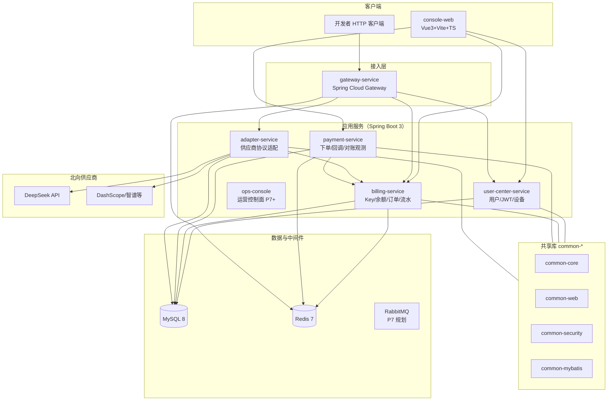
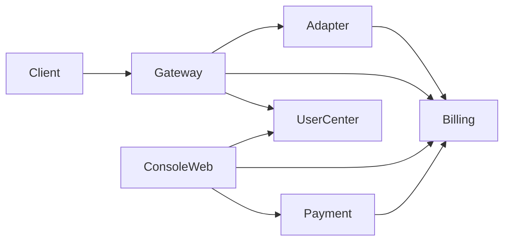
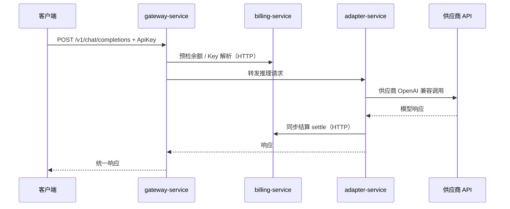
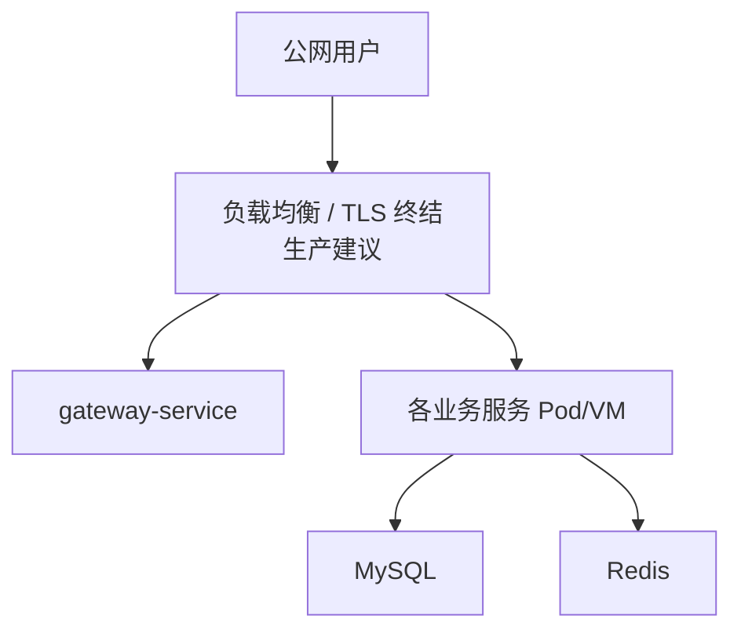
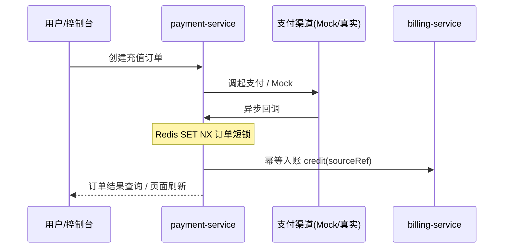

# 整体技术架构

> 本文档描述 **Token Hub（模型 API 中转平台）** 当前工程态下的技术架构全景，并与路线图（[`docs/dev-plan.md`](../dev-plan.md)）中「已实现 / 规划中」能力对齐。  
> 精简版逻辑架构见根目录 [`ARCHITECTURE.md`](../../ARCHITECTURE.md)；分层机械规则见 [`LAYERS.md`](./LAYERS.md)。

---

## 一、基础概览（约 1 分钟）

### 1.1 项目背景与业务目标

构建面向 **C 端用户** 与 **开发者** 的统一模型 API 中转平台：对外暴露 **OpenAI 兼容** 协议（如 `/v1/chat/completions`），对内适配多家国内供应商，并提供注册登录、API Key、余额与套餐、支付回调、调用计费与流水、控制台与后续运营能力。

### 1.2 核心业务范围与边界（不做什么）

| 做 | 首期不做 / 弱化为后续 |
|----|------------------------|
| 开发者 API 调用 + 普通用户 Web 控制台场景 | 复杂代理分销体系 |
| 多供应商聚合与路由（路线图 P2/P4） | 企业私有化重交付 |
| 余额 + 套餐支付闭环（Mock → 真实通道） | 重 BI / 数仓报表系统 |
| 网关鉴权、限流、计费预检与结算 | 部分 MQ、分布式锁扣费、读写分离（见第十三节与 dev-plan §2.2） |

### 1.3 目标用户 / 角色

| 角色 | 典型诉求 |
|------|-----------|
| C 端用户 | 网页对话、账户与充值、账单与用量感知 |
| 开发者 | API Key、统一端点调用、模型与价格可预期 |
| 运营（P7+） | 供应商/价格/风控配置、审计与告警入口（`ops-console` 路线图） |
| 内部管理员 / 运维 | 内部接口补偿入账、环境密钥注入、Compose/K8s 运维 |

### 1.4 项目定位与上下游依赖

- **系统作用**：北向承接客户端（浏览器 / SDK），南向对接 **模型供应商 HTTP API**；横向连接 **用户、计费、支付** 等业务能力。
- **上游**：终端用户、控制台前端、第三方登录（若扩展）。
- **下游**：DeepSeek / DashScope / 智谱等供应商 API；未来微信/支付宝等支付渠道。

---

## 二、整体架构总览

### 2.1 架构设计原则

- **高可用**：网关无状态；供应商侧熔断/重试/故障切换（adapter，路线图逐步加强）。
- **可扩展**：Maven 多服务拆分；领域与基础设施分离，便于替换实现。
- **多租户**：当前以「用户 + API Key + 账户余额」为隔离主线；运营级多租户在 P7 后增强。
- **安全**：JWT、Key 指纹存储、内部 Token、支付幂等与短锁、密钥不入库（见 [`docs/SECURITY.md`](../SECURITY.md)）。
- **易运维**：Docker Compose 拉起 MySQL/Redis；契约与 SQL 版本化随仓；CI 边界检查。

### 2.2 整体分层与模块总图（核心一图）

说明：实线表示当前主路径已存在或路线图明确的方向；`RabbitMQ` 在 Compose 中为注释占位，**P7 引入**。

### 2.3 部署形态

- **当前工程默认**：**微服务风格多模块** + **Docker Compose** 管理基础设施（MySQL、Redis）；各 Java 服务独立 `Dockerfile`，应用容器在镜像就绪后按需接入同一 Compose 文件（见 `deploy/docker-compose.yml` 注释段）。
- **生产预留**：Kubernetes 编排（dev-plan 约定）。

### 2.4 技术栈总览

| 分层 | 技术选型 |
|------|-----------|
| 前端 | Vue 3、Vite、TypeScript、Pinia、Vue Router、Element Plus（`console-web`） |
| 后端 | JDK 21、Spring Boot 3.3.x、Spring Cloud 2023.0.x、Spring Cloud Gateway；各业务服务以 **WebMVC** 为主（网关为 Reactive） |
| 数据访问 | MyBatis-Plus |
| 数据库 | MySQL 8.0（utf8mb4） |
| 缓存 / 限流 | Redis 7（网关限流桶、支付回调短锁等） |
| 消息 | RabbitMQ（P7；P0–P6 以同步 HTTP + DB 为主） |
| 契约 | `docs/openapi/unified-api.yaml` |
| 容器 | Docker、Docker Compose；镜像多阶段构建随各服务维护 |
| CI | GitHub Actions；`scripts/check_boundaries.py`、`scripts/gc_scan.py` |

---

## 三、业务领域与模块拆分

### 3.1 领域划分（DDD 视角）

| 子域 | 聚合能力 | 主要承载模块 |
|------|-----------|----------------|
| 身份与访问 | 注册登录、JWT、设备、密码重置 | `user-center-service` |
| 模型接入与路由 | 协议转换、供应商调用、路由权重 | `gateway-service`、`adapter-service` |
| 计费与账务 | API Key、余额、计价、请求订单、用量流水、幂等结算 | `billing-service` |
| 支付与充值 | 下单、回调、入账幂等、对账观测与内部重试 | `payment-service` |
| 运营与风控 | RBAC、配置、告警（路线图） | `ops-console`（P7+） |

### 3.2 核心模块清单与职责

| 模块 | 职责摘要 |
|------|-----------|
| `gateway-service` | 统一入口、鉴权、限流、路由、计费预检、转发至 adapter |
| `user-center-service` | 用户生命周期、JWT、用户设备与密码重置链路 |
| `adapter-service` | 供应商 API 适配、错误归一、与计费结算客户端协作 |
| `billing-service` | Key 解析、余额、模型价格、`request_orders` / `usage_ledger`、内部 API |
| `payment-service` | 支付订单、Mock/未来真实回调、Redis 短锁、内部 `retry-credit`、调度观测 |
| `ops-console` | 运营后台（路线图 P7 起） |
| `console-web` | C 端 SPA 控制台 |
| `common-*` | 统一返回体、异常、Trace、安全工具、MyBatis 对齐 |

### 3.3 模块依赖与调用流向（简图）

### 3.4 核心主流程时序（推理 + 计费）

> 异步 MQ 入账、预扣冲正等为路线图扩展，见第十三节与 [`docs/dev-plan.md`](../dev-plan.md) §2.1。

---

## 四、应用架构

### 4.1 服务拆分清单

| 服务 | 职责 | 负责人 |
|------|------|--------|
| `gateway-service` | 接入、安全策略、路由、限流、与 billing/adapter 协作 | 待团队指定 |
| `user-center-service` | 身份与用户数据 | 待团队指定 |
| `adapter-service` | 供应商适配与韧性 | 待团队指定 |
| `billing-service` | 计费账务域 | 待团队指定 |
| `payment-service` | 支付与平台内对账辅助 | 待团队指定 |
| `ops-console` | 运营控制面 | 待团队指定 |

### 4.2 前后端架构模式

- **C 端**：**SPA**（`console-web`），通过 OpenAPI 契约对接后端。
- **运营后台**：SPA 或 BFF 模式以最终选型为准（P7）。

### 4.3 接口规范

- **对外**：RESTful/OpenAI 兼容 HTTP；流式 SSE 在 P8 强化。
- **服务间**：HTTP 内部路径（如 `/internal/**`）；**事件驱动（MQ）** 为 P7 规划。
- **契约**：统一 OpenAPI 文档维护于 `docs/openapi/`。

### 4.4 应用分层结构

与 [`LAYERS.md`](./LAYERS.md) 一致：`presentation` → `application` → `domain` ← `infrastructure`；禁止 domain 依赖框架与外层。

---

## 五、技术架构细节

### 5.1 前端架构（console-web）

| 主题 | 现状 / 规划 |
|------|-------------|
| 框架与工程化 | Vue 3 + Vite + TypeScript |
| 状态与路由 | Pinia、Vue Router |
| 权限 | 登录态与路由守卫对接 JWT 流程（随 P6 页面丰富） |
| 组件库 | Element Plus |
| 构建与部署 | `npm run build` 静态资源；CDN 策略按生产环境配置 |

### 5.2 后端架构

| 主题 | 现状 / 规划 |
|------|-------------|
| 语言与框架 | Java 21、Spring Boot 3.3.x |
| 网关 | Spring Cloud Gateway；过滤器链完成鉴权、限流、预检等 |
| 韧性 | adapter 侧 Resilience4j（熔断/重试/切换，随 P4 加强） |
| 注册中心 / 配置中心 | 当前以 **静态路由 + 环境变量** 为主；大规模环境可引入 Nacos/Consul（未在仓库强制） |
| 链路追踪 | `TraceContext`、TraceId 拦截/过滤器（`common-core` / `common-web`） |
| 任务调度 | Spring `@Scheduled`：支付 INIT 观测、billing 平台内对账统计等 |

### 5.3 数据架构

| 主题 | 说明 |
|------|------|
| 主库 | MySQL 8.0；初始化与迁移脚本在 `deploy/sql/` |
| 分库分表 / 读写分离 | **未实施**；见路线图 O-9 |
| 模型设计 | 账户余额带 `version` 乐观锁；订单幂等键、`sourceRef` 入账防重 |
| 缓存 | Redis：限流、支付回调短锁；业务侧 Key/余额热点缓存为 **规划**（O-5） |
| 穿透/击穿 | 限流在网关；热点缓存落地后需配合空值 TTL 与互斥（待设计） |

### 5.4 中间件架构

| 组件 | 用途 | 部署说明 |
|------|------|-----------|
| MySQL | 全业务持久化 | Compose 单实例；生产建议主从或云 RDS |
| Redis | 限流、回调锁、未来缓存 | Compose 单节点 AOF |
| RabbitMQ | 异步账务、日志、风控事件 | **P7**；`docker-compose.yml` 中已注释模板 |
| Prometheus/Grafana | 指标与看板 | Compose 注释模板，P7 可启用 |

---

## 六、网络与部署架构

### 6.1 网络拓扑（逻辑）

### 6.2 环境划分

建议：**开发（本地 Compose）** → **测试（共享环境）** → **预发（生产等价配置）** → **生产**。密钥仅通过环境变量或密钥管理系统注入（`deploy/env.example` 为模板）。

### 6.3 资源与编排

- **开发**：`docker compose -f deploy/docker-compose.yml --env-file deploy/.env up`（见 `deploy/README.md`）。
- **生产**：容器 CPU/内存按网关 QPS、adapter 并发与 JVM 堆调整；预留 HPA（K8s）。

### 6.4 域名与入口

- 对外统一 API 域名指向网关；控制台独立域名或子路径部署静态资源。
- **Nginx / 防火墙**：TLS、WAF、源 IP 限制按基础设施团队规范。

### 6.5 CI/CD 与发布

- PR 合并前跑 CI：边界检查、熵扫描、测试（见 `.github/workflows/`）。
- **灰度**：网关按权重路由或按 Header 染色（视发布平台能力启用）。

---

## 七、核心能力与公共组件

| 能力 | 实现位置 / 说明 |
|------|-----------------|
| 统一返回与错误码 | `common-core`（`ApiResponse`、`ErrorCode`、`BusinessException`） |
| 全局异常与请求日志 | `common-web` |
| JWT / API Key 工具 | `common-security` |
| 日志与 TraceID | 过滤器 + MDC；禁止打印密钥与完整敏感信息 |
| 内部服务认证 | 如 `X-Internal-Token`（支付重试入账等，见 SECURITY） |
| 多环境 | Spring Profile + 环境变量；**禁止**将生产密钥写入仓库 |

---

## 八、关键业务流程与时序

### 8.1 充值支付与入账（简）

### 8.2 回调丢失与人工/运维补偿

- **不**对长期 `INIT` 自动入账（防伪造与无法区分未支付）。
- 确认渠道已支付后：调用内部 **`POST /internal/payments/orders/retry-credit`**（`X-Internal-Token`），与 `PaymentReconciliationScheduler` 观测配合。

### 8.3 同步 / 异步边界（当前）

- **同步**：网关 ↔ billing 预检；adapter ↔ 供应商；adapter → billing 结算。
- **异步（规划）**：MQ 削峰、Outbox、死信重试（P7 及 `docs/TDD/O-02` 等）。

---

## 九、非功能设计

| 维度 | 目标与手段 |
|------|------------|
| 性能 | 网关无状态水平扩展；DB 乐观锁重试控制热点；后续读写分离与缓存（O-9、O-5） |
| 可用性 | 供应商 failover；支付补偿路径明确；避免误入账 |
| 安全 | 见 [`docs/SECURITY.md`](../SECURITY.md)；防重放、幂等、最小日志 |
| 可扩展 | 新增供应商 adapter 模块、价格表驱动 |
| 可观测 | Micrometer 埋点；Prometheus/Grafana 路线图 P7 |

---

## 十、外部依赖与第三方集成

| 依赖类型 | 说明 |
|-----------|------|
| 模型供应商 | DeepSeek（首发）、DashScope 或智谱（P4 二选一落地） |
| 支付 | Mock → 微信/支付宝等；签名校验、超时重试、熔断按通道文档 |
| 消息通知 | 密码重置等当前可落日志；生产替换为邮件/短信 |
| 密钥 | 环境变量 / KMS；供应商与支付密钥不入库 |

---

## 十一、数据字典与存储说明

- **权威结构**：以 `deploy/sql/` 下 Flyway 风格脚本为准（`V1__`…`V7__` 等）。
- **核心表（语义级）**：`users`、`user_devices`、密码重置相关表；`account_balance`；`api_keys`；`request_orders`、`usage_ledger`；`model_prices`、`model_providers`；`payment_orders`、`balance_topup_receipt` 等。
- **枚举与状态机**：支付订单状态、请求订单 `PENDING/COMPLETED` 等与代码枚举对齐；详细字段以 SQL 与实体为准。
- **数仓**：未在本期范围；若后续接入，需独立同步管道与留存策略。

---

## 十二、运维与故障预案（要点）

| 场景 | 建议路径 |
|------|-----------|
| 服务不健康 | 查 TraceID → 网关日志 → 下游服务日志；验 Redis/MySQL 连通 |
| 扣费异常 / 流水缺失 | 关注 `BillingReconciliationScheduler` 日志；核对 `request_orders` 与 `usage_ledger` |
| 支付重复回调 | Redis 锁 + billing 幂等；仍重复则查 `payment_orders` 状态机 |
| 数据恢复 | MySQL 定期快照 + binlog；Redis  mostly 缓存/锁，以 DB 为准恢复业务 |
| 变更规范 | 先改契约与 SQL，再改代码；阶段完成同步 `PROGRESS.md` 与 dev-plan |

---

## 十三、待优化点与技术负债

### 13.1 权威与专篇

- **路线图勾选**：[`docs/dev-plan.md`](../dev-plan.md) §2.3 **O-1～O-9**（唯一权威）。
- **设计展开**：[`docs/TDD/`](../TDD/README.md) 各 `O-xx` 技术设计文档。
- **状态总表、验收要点、收口流程（推荐日常查阅）**：[`技术负债与路线图.md`](./技术负债与路线图.md)。

### 13.2 摘要（详细列与阶段见专篇）

| 编号 | 主题 | 方向 |
|------|------|------|
| O-1 | 扣费并发 | Redisson 或悲观锁与现有乐观锁、`idempotency_key` 并存评估 |
| O-2 | 异步账务 | Outbox + MQ，消费幂等与 DLQ |
| O-3 | 预占额度 | 预扣 + 冲正/确认，与流式计量联动 |
| O-4 | 对账闭环 | 渠道账单、长短款工单与调账审计 |
| O-5 | Redis 缓存 | Key 解析与只读余额短 TTL、失效策略 |
| O-6 | 风控配额 | IP 白/黑名单、日/月限额 |
| O-7 | Key 生命周期 | 过期、轮换 |
| O-8 | 支付补偿 | 渠道查单确认后触发 `retry-credit` |
| O-9 | 读扩展 | 读写分离、热点账户缓存与降级 |

### 13.3 演进节奏

以 dev-plan **P7/P8** 与压测结果驱动定稿；任一 O-x **交付**后须同步：专篇总表状态、`dev-plan` 勾选、对应 TDD「实现对照」小节，阶段收口时更新根目录 **`PROGRESS.md`**。

---

## 文档维护

- **变更触发**：新增服务、改变调用链、引入中间件或改变部署拓扑时，同步更新本文、`ARCHITECTURE.md` 与 `LAYERS.md`。
- **安全相关**：同步 [`docs/SECURITY.md`](../SECURITY.md)。
