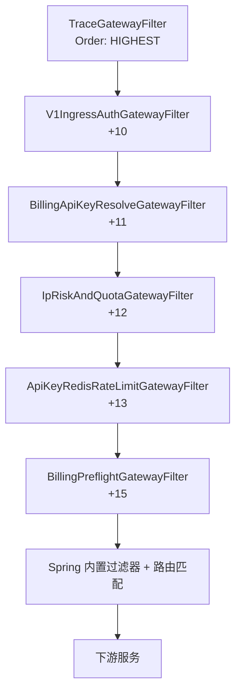

# 网关总览

`gateway-service` 是 TokenHub 的**统一入口**：对外暴露单一端口（默认 `8080`），对内按路径将流量路由到 `user-center`、`adapter`、`billing`、`payment`、`ops-console` 等下游服务。

技术栈：**Spring Cloud Gateway**（WebFlux / Reactive），与业务服务主流的 **Spring MVC** 不同——网关侧 I/O 模型为事件驱动，适合高并发代理与过滤器链。

---

## 1. 两阶段处理模型

Spring Cloud Gateway 对每条请求大致经历两阶段：

| 阶段 | 时机 | 本仓库主要逻辑 |
|------|------|----------------|
| **Pre-Route（全局过滤器）** | 匹配路由、转发**之前** | Trace、鉴权、API Key 解析、风控、限流、余额预检 |
| **Route + Proxy** | 按 `application.yml` 的 `routes` 选下游 URI，HTTP 转发 | 超时、连接池由 `httpclient` 配置 |
| **Post-Route** | 下游响应返回后 | 当前无自定义 Post 过滤器；Trace 在 `beforeCommit` 写回响应头 |

**重要**：全局过滤器（`GlobalFilter`）对**所有路由**都会执行，但每个过滤器内部用 `path`、`method` 等条件**自行短路**（直接 `chain.filter`），避免误伤 `/user/**`、`/billing/**` 等非模型 API 路径。

---

## 2. 过滤器执行顺序

`Ordered` 数值越小越先执行。当前链（仅列出本仓库自定义项）：



| Order 偏移 | 组件 | 主要作用 |
|------------|------|----------|
| `HIGHEST_PRECEDENCE` | `TraceGatewayFilter` | 生成/透传 `X-Trace-Id` |
| +10 | `V1IngressAuthGatewayFilter` | `/v1/**` 要求 Bearer；JWT 验签并注入 `X-User-Id` |
| +11 | `BillingApiKeyResolveGatewayFilter` | 非 JWT Bearer → API Key 指纹 → 注入 `X-User-Id` / `X-Api-Key-Id` |
| +12 | `IpRiskAndQuotaGatewayFilter` | IP 黑白名单、日配额（O-6，默认关） |
| +13 | `ApiKeyRedisRateLimitGatewayFilter` | 秒级 QPS（Redis 计数） |
| +15 | `BillingPreflightGatewayFilter` | `POST /v1/chat/completions` 余额预检 |

**设计意图**：

1. **先 Trace**：后续任何拒绝都能带上同一 `traceId`。
2. **先鉴权形态、再 Key 解析**：JWT 与 API Key 共用 `Authorization: Bearer`，用「是否像 JWT（两个 `.`）」分流。
3. **先解析 Key、再风控/限流**：日配额与 QPS 依赖 `X-Api-Key-Id` / `X-User-Id`。
4. **预检放最后**：需要已解析的 `userId`，且仅针对最贵的 Chat 路径。

---

## 3. 请求分类（走哪条链路）

| 路径前缀 | 典型用途 | 网关过滤器参与度 |
|----------|----------|------------------|
| `/v1/**`（除 `/v1/usage`） | OpenAI 兼容模型 API → `adapter-service` | **全套** `/v1` 过滤器（见各篇「触发条件」） |
| `/v1/usage` | 用量查询 → `billing-service` | Trace + 部分鉴权；**不走** Chat 预检 |
| `/user/**` | 注册登录 → `user-center-service` |  mainly Trace |
| `/apikeys/**`、`/dashboard/**`、`/billing/**` | 控制台/账务 → billing | mainly Trace |
| `/payments/**` | 支付 → payment | mainly Trace |
| `/ops/**` | 运营后台 → ops-console | mainly Trace |

路由**匹配顺序**在 `application.yml` 中写死：**更具体的路径必须写在 `/v1/**` 之前**（例如 `/v1/usage` 单独一条），否则会被宽泛的 `/v1/**` 抢走。

---

## 4. 鉴权双轨：JWT vs API Key

客户端对 `/v1/**` 统一使用：

```http
Authorization: Bearer <token>
```

| Bearer 形态 | 处理过滤器 | 结果 |
|-------------|------------|------|
| 空 / 缺失 | `V1IngressAuthGatewayFilter` | `401`，`I401001` |
| 含两个 `.`（启发式 JWT） | `V1IngressAuthGatewayFilter` 验签（需 `JWT_SECRET`） | 成功 → 注入 `X-User-Id`；失败 → `401` |
| 非 JWT 形态（平台 `sk_*` API Key） | `V1IngressAuthGatewayFilter` 放行 → `BillingApiKeyResolveGatewayFilter` | 调 billing 内部接口解析指纹 → 注入 `X-User-Id`、`X-Api-Key-Id` |
| JWT 但**未配置** `JWT_SECRET` | `V1IngressAuthGatewayFilter` **放行**（开发便利，生产应配置） | 依赖下游或 Key 解析 |

下游 `adapter-service` **不应**再解析原始 API Key，应信任网关注入的头（内网或 mTLS 由部署层保证）。

---

## 5. 依赖与外部系统

| 依赖 | 用途 |
|------|------|
| **Redis** | API Key 解析缓存（O-5）、秒级限流、IP 名单、日配额 |
| **billing-service**（HTTP） | Key 指纹解析、`/internal/billing/preflight` |
| **环境变量** | `JWT_SECRET`、`BILLING_INTERNAL_TOKEN`、各 `TOKENS_GATEWAY_*_URI` |

---

## 6. 分层与代码位置

按 `docs/architecture/LAYERS.md`：

- 过滤器、缓存、JSON 响应均在 **`infrastructure`** 包。
- **`domain` / `application`** 当前仅有 `package-info`，**不在网关承载业务领域逻辑**——计费规则、Key 生命周期在 `billing-service`。

源码根目录：

```
gateway-service/src/main/java/com/tokenhub/gateway/
├── GatewayApplication.java
└── infrastructure/
    ├── cache/ApiKeyResolutionCache.java
    ├── json/GatewayJsonResponses.java
    └── web/*GatewayFilter.java, GatewayIngressHeaders.java
```

---

## 7. 阅读地图

| 文档 | 主题 |
|------|------|
| [filters/01-TraceGatewayFilter.md](./filters/01-TraceGatewayFilter.md) | 链路追踪 |
| [filters/02-V1IngressAuthGatewayFilter.md](./filters/02-V1IngressAuthGatewayFilter.md) | 入口 Bearer / JWT |
| [filters/03-BillingApiKeyResolveGatewayFilter.md](./filters/03-BillingApiKeyResolveGatewayFilter.md) | API Key 解析 |
| [filters/04-ApiKeyResolutionCache.md](./filters/04-ApiKeyResolutionCache.md) | 解析缓存 O-5 |
| [filters/05-IpRiskAndQuotaGatewayFilter.md](./filters/05-IpRiskAndQuotaGatewayFilter.md) | 风控 O-6 |
| [filters/06-ApiKeyRedisRateLimitGatewayFilter.md](./filters/06-ApiKeyRedisRateLimitGatewayFilter.md) | 秒级限流 |
| [filters/07-BillingPreflightGatewayFilter.md](./filters/07-BillingPreflightGatewayFilter.md) | 余额预检 |
| [08-路由与配置.md](./08-路由与配置.md) | `application.yml` |
| [09-错误响应与头约定.md](./09-错误响应与头约定.md) | 错误码与注入头 |

仓库级 TDD：`docs/TDD/O-05-*.md`、`docs/TDD/O-06-*.md`。

---

## 8. 架构取舍（网关层）

| 优点 | 代价 / 风险 |
|------|-------------|
| 边缘统一鉴权、限流、预检，下游简单 | 网关成为关键路径；Redis/billing 故障影响面大 |
| Reactive 适合代理与异步 Redis/WebClient | 团队需熟悉 Reactor；调试栈较深 |
| 过滤器可独立开关（`risk.enabled`、`apikey-cache.enabled`） | 配置组合多，需文档与集成测试覆盖 |

**业界常见演进**：专用 API Gateway（Kong / APISIX / Envoy + WASM）、WAF、分布式限流（Sentinel）、Service Mesh 侧车——见各过滤器文档「业界方案」一节。
