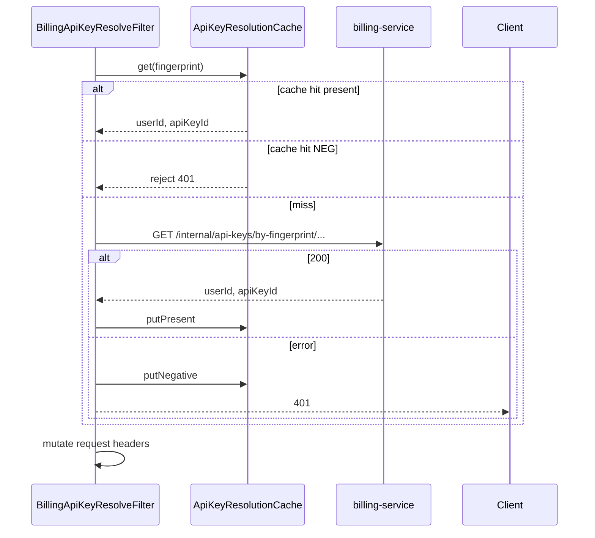

# BillingApiKeyResolveGatewayFilter

| 项 | 内容 |
|----|------|
| 类 | `com.tokenhub.gateway.infrastructure.web.BillingApiKeyResolveGatewayFilter` |
| Order | `HIGHEST_PRECEDENCE + 11` |
| 协作 | `ApiKeyResolutionCache`（O-5）、billing 内部 HTTP |

---

## 1. 背景

开发者使用平台发放的 **API Key**（明文仅创建时可见一次）调用 `/v1/**`。数据库存储的是 **SHA-256 指纹**，不能在网络中反复查询明文。

每次请求若在 adapter 或 billing 再查库，高 QPS 下 billing 成为瓶颈（见 TDD [O-05](../../../docs/TDD/O-05-Redis缓存-APIKey解析与余额.md)）。网关应在转发前完成「指纹 → userId + apiKeyId」，并以**内部头**传给下游。

---

## 2. 作用

1. 仅处理 `/v1/**` 且 GET/POST/PATCH（与入口鉴权一致）。
2. 从 `Authorization` 提取 Bearer；**像 JWT 则跳过**（已由上一过滤器处理 `X-User-Id`）。
3. `ApiKeySupport.sha256HexUtf8(bearer)` 得指纹。
4. 先查 Redis 缓存（可选）；miss 则 `GET {billing}/internal/api-keys/by-fingerprint/{fp}`，头 `X-Internal-Token`。
5. 成功：注入 `X-User-Id`、`X-Api-Key-Id`；失败：`401`，`I401001`，「无效的 API Key」。

---

## 3. 时序



---

## 4. 实现要点

**内部接口**（网关构造 URL）：

```
GET {tokenhub.gateway.billing-base-url}/internal/api-keys/by-fingerprint/{sha256Hex}
Header: X-Internal-Token: {tokenhub.gateway.internal-token}
```

**响应体**（JSON）：

```json
{ "userId": 1, "apiKeyId": 42 }
```

对应 `ApiKeyResolveBody` record。

**指纹算法**（`common-security`）：

```38:48:common/common-security/src/main/java/com/tokenhub/common/security/apikey/ApiKeySupport.java
  public static String sha256HexUtf8(String raw) {
    Objects.requireNonNull(raw, "raw");
    MessageDigest digest;
    try {
      digest = MessageDigest.getInstance("SHA-256");
    } catch (NoSuchAlgorithmException e) {
      throw new IllegalStateException("SHA-256 not available", e);
    }
    byte[] hashed = digest.digest(raw.getBytes(StandardCharsets.UTF_8));
    return HexFormat.of().formatHex(hashed);
  }
```

**安全注意**：原始 Key 仅存在于本过滤器内存与到 billing 的 HTTPS 请求中；日志应使用 `ApiKeySupport.maskForLogging`。

---

## 5. 优劣分析

| 优点 | 缺点 |
|------|------|
| 下游不接触明文 Key | 每次 miss 增加一次 HTTP RTT |
| 指纹与 billing 存储一致 | billing 不可用则 Key 路径全失败 |
| 负缓存可缓解无效 Key 击穿 | 禁用 Key 后最长 TTL 内仍可能命中正缓存（O-5） |
| 与 JWT 路径解耦 | 内部接口依赖共享 secret，需网络隔离 |

---

## 6. 业界更好的方案

| 方案 | 说明 |
|------|------|
| **本地 LRU + Redis 二级** | 极低延迟；见 O-5 TDD「Caffeine 二期」 |
| **API Gateway Key Auth** | Kong/APISIX 自带 key 存储与插件 |
| **OAuth2 Client Credentials** | 用短期 access_token 代替长期 sk_ |
| **HMAC 请求签名** | 类似 AWS SigV4，无 Bearer 明文重复传输 |
| **gRPC metadata** | 内网服务间传递 principal，仍建议在边缘解析一次 |

---

## 7. 配置项

| 配置键 | 环境变量 | 默认 |
|--------|----------|------|
| `tokenhub.gateway.billing-base-url` | `TOKENS_GATEWAY_BILLING_URI` | `http://127.0.0.1:8103` |
| `tokenhub.gateway.internal-token` | `BILLING_INTERNAL_TOKEN` | `dev-internal-token` |
| 缓存见 [04-ApiKeyResolutionCache.md](./04-ApiKeyResolutionCache.md) | | |

---

## 8. 相关文档

- [04-ApiKeyResolutionCache.md](./04-ApiKeyResolutionCache.md)
- [docs/TDD/O-05-Redis缓存-APIKey解析与余额.md](../../../docs/TDD/O-05-Redis缓存-APIKey解析与余额.md)
