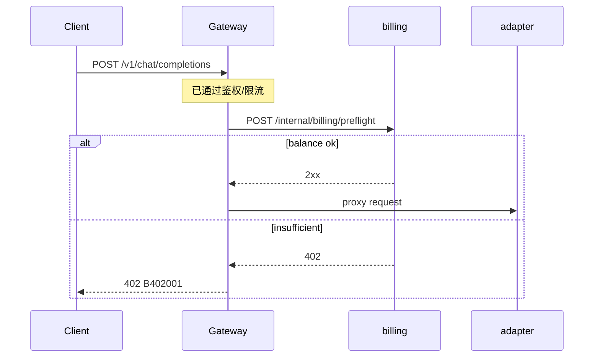

# BillingPreflightGatewayFilter

| 项 | 内容 |
|----|------|
| 类 | `com.tokenhub.gateway.infrastructure.web.BillingPreflightGatewayFilter` |
| Order | `HIGHEST_PRECEDENCE + 15` |

---

## 1. 背景

`POST /v1/chat/completions` 会触发大模型调用，成本高。若用户余额为 0，仍转发到 adapter 再失败，浪费供应商配额与平台资源。

在**转发前**调用 billing 做 **余额预检（preflight）**，余额不足直接 `402 Payment Required`，体验与 OpenAI「insufficient_quota」类似。

---

## 2. 作用

| 条件 | 行为 |
|------|------|
| 非 `POST` | 放行 |
| 路径不是精确 `/v1/chat/completions` | 放行 |
| 无 `X-User-Id` 或非法数字 | 放行（无法预检） |
| 预检 HTTP 成功 | 继续 `chain.filter` |
| billing 返回 `402` | 网关 `402`，`B402001`，「余额不足，请先充值」 |
| 其它 HTTP 错误 | **向上抛出**（`Mono.error`），由 Gateway 默认处理 |

---

## 3. 实现要点

```61:82:gateway-service/src/main/java/com/tokenhub/gateway/infrastructure/web/BillingPreflightGatewayFilter.java
    return webClient
        .post()
        .uri(url)
        .header("X-Internal-Token", internalToken)
        .contentType(MediaType.APPLICATION_JSON)
        .bodyValue(Map.of("userId", uid))
        .retrieve()
        .toBodilessEntity()
        .then(chain.filter(exchange))
        .onErrorResume(WebClientResponseException.class, ex -> {
          String traceId = Objects.toString(exchange.getAttribute(TraceGatewayFilter.TRACE_ATTR), "");
          if (ex.getStatusCode() == HttpStatus.PAYMENT_REQUIRED) {
            return GatewayJsonResponses.writeBusiness(
                exchange.getResponse(),
                HttpStatus.PAYMENT_REQUIRED.value(),
                traceId,
                "B402001",
                "余额不足，请先充值"
            );
          }
          return Mono.error(ex);
        });
```

内部 URL：`POST {billing-base-url}/internal/billing/preflight`，Body：`{"userId": <long>}`。

**与 O-5 关系**：TDD 规划余额短 TTL 只读缓存；**当前实现每次 Chat 仍 HTTP 预检**（未缓存）。

**与 O-3 关系**：TDD [O-03](../../../docs/TDD/O-03-预占额度与冲正-流式联动.md) 规划在预检后增加 **额度预占（Reserve）** 过滤器，尚未实现。

---

## 4. 时序



---

## 5. 优劣分析

| 优点 | 缺点 |
|------|------|
| 避免无效模型调用 | 每个 Chat 多 1 次 RTT |
| 错误码与业务语义清晰 | 竞态：预检通过后余额被另一请求扣光仍可能超扣（需 O-3 预占） |
| 仅针对最贵路径 | billing 超时会导致整路失败 |
| 使用内部 token | 依赖 billing 与网关部署信任边界 |

---

## 6. 业界更好的方案

| 方案 | 说明 |
|------|------|
| **预占 + 结算（Reserve/Commit）** | 见 O-3；流式结束按 token 冲正 |
| **余额缓存 1～5s** | O-5 只读镜像；写路径失效 |
| **adapter 内同步扣费** | 减少一跳，但违反「网关统一策略」分层 |
| **异步拒绝 + 队列** | 适合批处理，不适合交互 Chat |
| **信用额度 / 后付费** | 预检改为额度模型而非余额 |

---

## 7. 配置项

与 API Key 解析共用：

| 配置键 | 环境变量 |
|--------|----------|
| `tokenhub.gateway.billing-base-url` | `TOKENS_GATEWAY_BILLING_URI` |
| `tokenhub.gateway.internal-token` | `BILLING_INTERNAL_TOKEN` |

---

## 8. 相关文档

- [03-BillingApiKeyResolveGatewayFilter.md](./03-BillingApiKeyResolveGatewayFilter.md)
- [docs/TDD/O-03-预占额度与冲正-流式联动.md](../../../docs/TDD/O-03-预占额度与冲正-流式联动.md)
