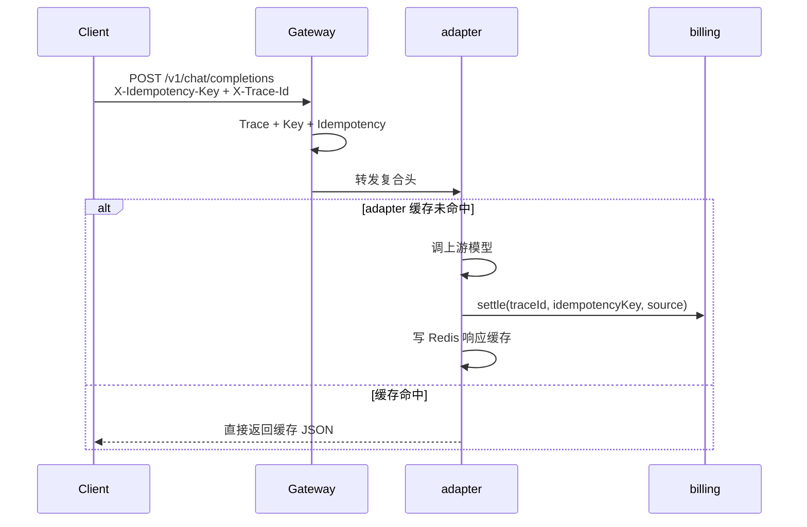

# IdempotencyGatewayFilter（O-10）

| 项 | 内容 |
|----|------|
| 类 | `com.tokenhub.gateway.infrastructure.web.IdempotencyGatewayFilter` |
| Order | `HIGHEST_PRECEDENCE + 12`（在 API Key 解析 +11 之后） |
| 路径 | 仅 `POST /v1/chat/completions` |

---

## 1. 背景

`X-Trace-Id` 用于**日志关联**；若同时作为**扣费幂等键**，客户端重试不带头时会每次生成新 UUID，导致 `settle` 重复扣款。

O-10 引入 **`X-Idempotency-Key`**（客户端 UUID v4），网关合成 **`X-Idempotency-Key-Composite`** 传给下游，billing 以复合键为 `request_orders.idempotency_key`。

---

## 2. 作用

| 步骤 | 行为 |
|------|------|
| 客户端提供 `X-Idempotency-Key` | 校验 UUID v4；复合键 `userId:apiKeyId:clientKey`；来源 `CLIENT` |
| 未提供 | 复合键 `userId:apiKeyId:traceId`；来源 `TRACE_ID_FALLBACK`（**不推荐生产依赖**） |
| 仅 JWT（无 `X-Api-Key-Id`） | `apiKeyId` 使用占位 `0`：`userId:0:clientKey` |
| 无 `X-User-Id` | 跳过（无法合成） |

注入头：

- `X-Idempotency-Key-Composite`
- `X-Idempotency-Source`（`CLIENT` | `TRACE_ID_FALLBACK`）

---

## 3. 与 Trace 的分工

| 头 | 用途 |
|----|------|
| `X-Trace-Id` | 观测、错误 JSON、订单 `trace_id` 字段 |
| `X-Idempotency-Key` / Composite | **结算幂等**（`idempotency_key`） |

**客户端重试**：应固定 `X-Idempotency-Key`；`X-Trace-Id` 可相同或每次新建，但**扣费以复合幂等键为准**。

---

## 4. 全链路（改造后）

---

## 5. 错误码

| HTTP | code | 场景 |
|------|------|------|
| 400 | `I400001` | `X-Idempotency-Key` 非 UUID v4 |

---

## 6. 客户端幂等键「出问题」时会怎样？

| 客户端行为 | 网关 | 是否可能重复扣费 |
|------------|------|------------------|
| **未传** `X-Idempotency-Key` | `TRACE_ID_FALLBACK`（复合键含当次 `traceId`） | **会**。重试若换新 `X-Trace-Id` 且无幂等键 → 新单 |
| **格式非法**（非 UUID v4） | `400` / `I400001`，**不进 adapter** | **不会**（请求被拒） |
| **每次重试生成新 UUID**（SDK bug） | 每次新复合键 | **会**。与没传幂等键类似 |
| **两次不同业务共用同一 Key** | 第二次命中 adapter **响应缓存** → 不调模型、不重复 settle | **不会重复扣**；返回**首次**成功响应（同 Key 不同 body 亦如此，防薅平台） |
| **正确：同一逻辑请求固定同一 Key** | 复合键不变 | **不会**（结算 + 模型均幂等） |

结论：网关负责合成复合键；**用户侧不重复扣费**靠 billing `settle` 幂等；**平台侧不重复调模型**靠 adapter Redis 响应缓存（见 adapter `07-ChatIdempotencyResponseCache.md`）。生产环境应固定 `X-Idempotency-Key`；不要依赖 `TRACE_ID_FALLBACK`。

---

## 7. 与 adapter 响应缓存的分工

| 层 | 键 | 作用 |
|----|-----|------|
| 网关 | `X-Idempotency-Key-Composite` | 鉴权后注入，供下游共用 |
| billing | 同上 → `request_orders.idempotency_key` | 不重复扣费 |
| adapter | Redis `adapter:chat:idem:resp:{composite}` | 不重复调上游；命中直接返回 JSON |

---

## 8. 相关文档

- [01-TraceGatewayFilter.md](./01-TraceGatewayFilter.md)
- [09-错误响应与头约定.md](../09-错误响应与头约定.md)
- adapter：[05-BillingSettlementClient.md](../../../adapter-service/docs/components/05-BillingSettlementClient.md)、[07-ChatIdempotencyResponseCache.md](../../../adapter-service/docs/components/07-ChatIdempotencyResponseCache.md)
