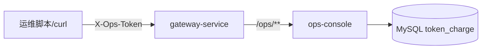

# ops-console 模块总览

`ops-console` 是 TokenHub 的 **运营控制面**（P7 起）：提供模型供应商配置查询、审计事件列表等只读/轻量运营 API。与 C 端 `console-web` 分离部署，采用 **共享令牌** 鉴权，**不使用** 用户 JWT。

技术栈：**Spring Boot MVC** + `JdbcTemplate`（直查 MySQL）。

默认端口：**8105**；经网关路径前缀 **`/ops/**`**。

---

## 1. 在平台中的位置



| 对比项 | console-web（C 端） | ops-console |
|--------|---------------------|-------------|
| 用户 | 注册开发者 | 运营/平台管理员 |
| 鉴权 | JWT Bearer | `X-Ops-Token` |
| 典型数据 | 自己的 Key、余额 | 全平台供应商、审计 |

---

## 2. 安全模型

1. **单因子共享令牌**：请求头 `X-Ops-Token` 必须等于 `tokenhub.ops.internal-token`（环境变量 `OPS_INTERNAL_TOKEN`）。
2. **全路径拦截**：`OpsWebConfiguration` 对 `/ops/**` 注册 `OpsTokenMvcInterceptor`，无公开匿名接口。
3. **无 Servlet Filter**：与 payment 的 Internal Token 不同命名（`X-Ops-Token` vs `X-Internal-Token`），避免误用同一密钥跨服务。
4. **网络边界**：生产应仅内网或 VPN 可达；令牌不入库、不写前端仓库。

---

## 3. 当前能力范围

| 控制器 | 路径 | 能力 |
|--------|------|------|
| `OpsModelProviderController` | `GET /ops/model-providers` | 列出 `model_providers` 表 |
| `OpsAuditEventController` | `GET /ops/audit-events` | 分页查询 `audit_events`（limit 1–500） |

**未包含**（后续阶段）：对账审批、调账工单、供应商 CRUD 写接口等（见 payment 对账文档 M2 说明）。

---

## 4. 分层与代码位置

```
ops-console/src/main/java/com/tokenhub/ops/
├── OpsConsoleApplication.java
├── infrastructure/web/
│   ├── OpsTokenMvcInterceptor.java
│   └── OpsWebConfiguration.java
└── presentation/
    ├── OpsModelProviderController.java
    └── OpsAuditEventController.java
```

`application` / `domain` 包当前为 `package-info` 占位，业务逻辑以 **presentation + JdbcTemplate** 为主（M1 快速交付）。

---

## 5. 阅读地图

| 文档 | 主题 |
|------|------|
| [components/01-OpsTokenMvcInterceptor.md](./components/01-OpsTokenMvcInterceptor.md) | 令牌拦截 |
| [components/02-OpsControllers.md](./components/02-OpsControllers.md) | 运营 API |
| [08-路由与配置.md](./08-路由与配置.md) | 配置与网关 |
