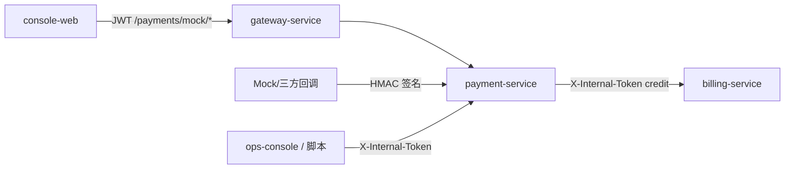
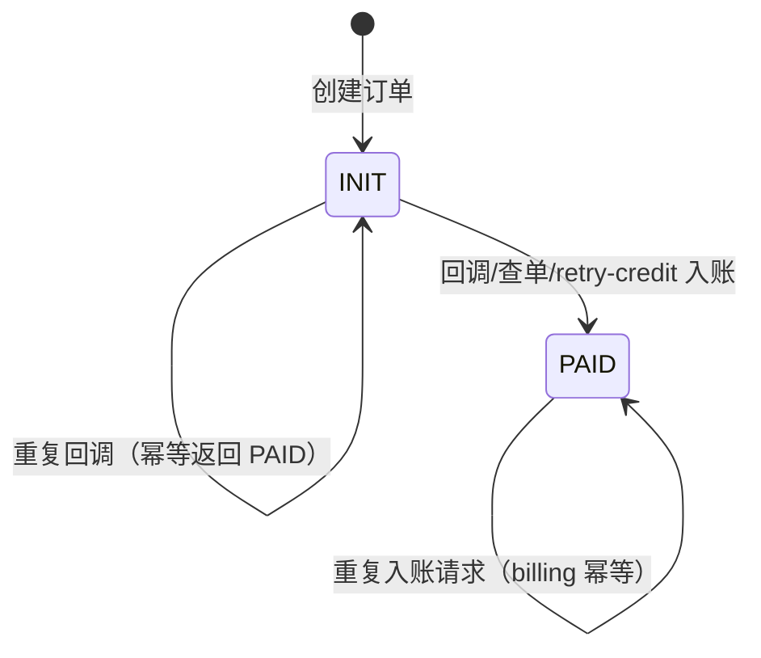
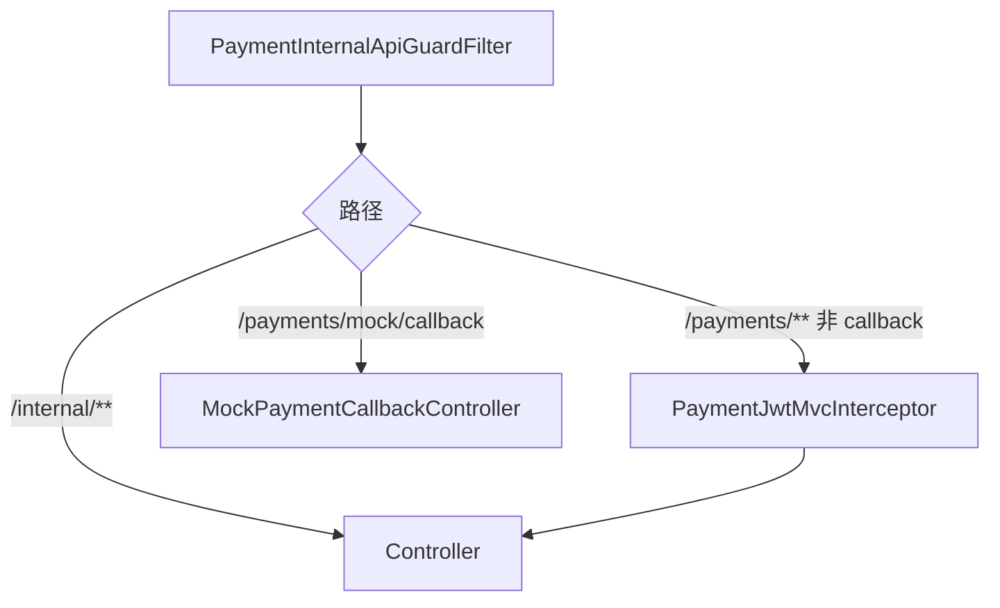

# payment-service 模块总览

`payment-service` 负责 **充值与支付**：创建支付订单、接收渠道回调、幂等调用 `billing-service` 入账，并提供内部对账与 INIT 订单观测能力。

技术栈：**Spring Boot MVC** + MyBatis-Plus + MySQL + Redis（回调短锁，可选）。

默认端口：**8104**；经网关对外路径前缀 **`/payments/**`**、内部 **`/internal/payments/**`**。

---

## 1. 在平台中的位置



| 协作方 | 关系 |
|--------|------|
| **console-web** | `POST /payments/mock/recharge`（即时到账）或 checkout + 回调流程 |
| **billing-service** | `POST /internal/billing/credit`，`sourceRef` = 订单号，幂等 |
| **gateway-service** | 将 `/payments/**` 路由到本服务（主要 Trace） |
| **ops / 自动化** | 内部 API：对账导入、retry-credit、channel-reconcile |

---

## 2. 订单状态机

支付订单持久化于表 `payment_orders`，核心字段：`order_no`、`user_id`、`amount`、`channel`、`status`。

| 状态 | 含义 | 典型进入方式 |
|------|------|----------------|
| **INIT** | 已下单，未入账 | `createPendingOrder` / `mockCheckout` |
| **PAID** | 已调 billing 入账 | `payRecharge`、`completePendingFromCallback` |
| 其它 | 预留（REFUND/CLOSED 等） | 对账时记为 `LOCAL_OTHER` |



**安全原则**：未在渠道侧确认「已支付」前，**禁止**自动把 INIT 改为 PAID。定时任务仅打日志观测，不自动入账（见 `PaymentReconciliationScheduler`）。

---

## 3. 请求处理分层

| 层级 | 路径模式 | 鉴权 |
|------|----------|------|
| **Servlet Filter** | `/internal/**` | `X-Internal-Token`（`PaymentInternalApiGuardFilter`） |
| **MVC Interceptor** | `/payments/**`（除回调） | JWT Bearer → `tokenhubUserId` |
| **无 JWT** | `/payments/mock/callback` | HMAC 签名校验 |
| **Application** | 业务编排 | 订单锁、签验、查单、入账 |

执行顺序（简化）：



---

## 4. 两条 Mock 充值路径

| API | 行为 | 用途 |
|-----|------|------|
| `POST /payments/mock/recharge` | 创建订单并**立即** billing 入账 → `PAID` | 控制台一键充值 |
| `POST /payments/mock/checkout` | 仅创建 `INIT` 订单 | 模拟异步支付 |
| `POST /payments/mock/callback` | 签名校验 + 订单锁 + 入账 | 模拟 PSP 异步通知 |

---

## 5. 内部能力（O-4 / O-8）

| 能力 | 入口 | 说明 |
|------|------|------|
| **渠道 CSV 对账** | `POST /internal/payments/reconciliation/batches` | 导入渠道明细，与本地订单比对 |
| **retry-credit** | `POST /internal/payments/orders/retry-credit` | 人工确认已支付后幂等入账 |
| **channel-reconcile** | `POST /internal/payments/orders/{orderNo}/channel-reconcile` | 查单端口确认 PAID 后入账 |
| **INIT 观测** | 定时任务（可关） | 统计超时 INIT，打 warn 日志 |

---

## 6. 分层与代码位置

```
payment-service/src/main/java/com/tokenhub/payment/
├── PaymentApplication.java
├── domain/auth/PaymentAuthConstants.java
├── application/
│   ├── PaymentExecutionService.java
│   ├── PaymentCallbackApplicationService.java
│   ├── MockPaymentApplicationService.java
│   ├── ChannelReconciliationApplicationService.java
│   ├── ChannelReconcileApplicationService.java
│   └── MockCallbackSignatureVerifier.java
├── infrastructure/
│   ├── security/   # Filter、JWT、WebMvc 配置
│   ├── billing/    # BillingCreditClient
│   ├── redis/      # PaymentCallbackOrderLock
│   ├── schedule/   # PaymentReconciliationScheduler
│   └── persistence/
└── presentation/   # Mock / Internal Controllers
```

---

## 7. 阅读地图

| 文档 | 主题 |
|------|------|
| [components/01-PaymentInternalApiGuardFilter.md](./components/01-PaymentInternalApiGuardFilter.md) | 内部 API 令牌 |
| [components/02-PaymentJwtMvcInterceptor.md](./components/02-PaymentJwtMvcInterceptor.md) | 用户 JWT |
| [components/03-PaymentExecutionService.md](./components/03-PaymentExecutionService.md) | 订单与入账 |
| [components/04-PaymentCallbackApplicationService.md](./components/04-PaymentCallbackApplicationService.md) | 回调签验与锁 |
| [components/05-ChannelReconciliation.md](./components/05-ChannelReconciliation.md) | CSV 对账 + 查单入账 |
| [components/06-PaymentReconciliationScheduler.md](./components/06-PaymentReconciliationScheduler.md) | INIT 观测 |
| [08-路由与配置.md](./08-路由与配置.md) | API 与环境变量 |

仓库级 TDD：`docs/TDD/O-04-*.md`、`docs/TDD/O-08-*.md`（若存在）。
