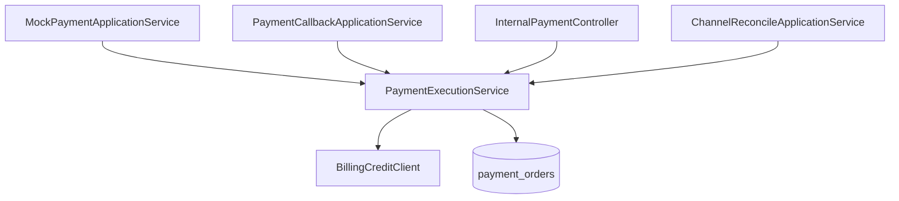

# PaymentExecutionService

| 项 | 内容 |
|----|------|
| 类 | `com.tokenhub.payment.application.PaymentExecutionService` |
| 层 | `application` |
| 依赖 | `PaymentOrderMapper`、`BillingCreditClient` |
| 表 | `payment_orders` |

---

## 1. 背景

支付领域的核心不变式：**订单状态**与 **账务入账** 应通过单一服务方法收敛，供 Mock 充值、回调、内部 retry、渠道查单等多入口复用，并依赖 billing 的 `sourceRef` 幂等。

---

## 2. 作用

| 方法 | 行为 |
|------|------|
| `createPendingOrder` | 插入 `INIT` 订单，**不入账** |
| `payRecharge` | 插入 `INIT` → 调 billing → 更新 `PAID`（同步路径） |
| `findByOrderNo` | 按订单号查单（回调前校验用） |
| `completePendingFromCallback` | 幂等：`INIT` 时入账并改 `PAID`；已 `PAID` 直接返回 |

返回类型 `PaidOrder(orderNo, amount, currency, status)`。

---

## 3. 订单号规则

- 前缀由调用方传入：`pay_`（Mock 用户面）、`bill_`（内部充值）。
- 后缀：`UUID` 去横线，例如 `pay_a1b2c3d4e5f6...`。

币种固定为 **`TOKEN`**（平台内部计量单位）。

---

## 4. 实现要点

### 4.1 仅创建 INIT

```30:41:payment-service/src/main/java/com/tokenhub/payment/application/PaymentExecutionService.java
  @Transactional
  public PaidOrder createPendingOrder(long userId, long amount, String channel, String orderPrefix) {
    String orderNo = orderPrefix + UUID.randomUUID().toString().replace("-", "");
    PaymentOrderPo row = new PaymentOrderPo();
    row.setUserId(userId);
    row.setOrderNo(orderNo);
    row.setChannel(channel != null ? channel : "mock");
    row.setAmount(amount);
    row.setCurrency("TOKEN");
    row.setStatus("INIT");
    paymentOrderMapper.insert(row);
    return new PaidOrder(orderNo, amount, "TOKEN", "INIT");
  }
```

### 4.2 同步入账

```47:61:payment-service/src/main/java/com/tokenhub/payment/application/PaymentExecutionService.java
  @Transactional
  public PaidOrder payRecharge(long userId, long amount, String channel, String orderPrefix) {
    // ... insert INIT ...
    billingCreditClient.creditBalance(userId, amount, orderNo);
    row.setStatus("PAID");
    paymentOrderMapper.updateById(row);
    return new PaidOrder(orderNo, amount, "TOKEN", "PAID");
  }
```

### 4.3 回调幂等入账

```74:92:payment-service/src/main/java/com/tokenhub/payment/application/PaymentExecutionService.java
  @Transactional
  public PaidOrder completePendingFromCallback(String orderNo) {
    // ...
    if ("PAID".equals(row.getStatus())) {
      return new PaidOrder(..., "PAID");
    }
    if (!"INIT".equals(row.getStatus())) {
      return new PaidOrder(..., row.getStatus());
    }
    billingCreditClient.creditBalance(row.getUserId(), row.getAmount(), row.getOrderNo());
    row.setStatus("PAID");
    paymentOrderMapper.updateById(row);
    return new PaidOrder(..., "PAID");
  }
```

`BillingCreditClient` 请求：

- URL：`{billingBaseUrl}/internal/billing/credit`
- Body：`userId`、`amount`、`sourceRef`（= `orderNo`）
- 头：`X-Internal-Token`

---

## 5. 调用关系



---

## 6. 事务与并发

- 方法标注 `@Transactional`；与 `PaymentCallbackOrderLock` 配合时，锁在**事务外层**（见回调文档）。
- 重复 `completePendingFromCallback`：本地已 `PAID` 则不再调 billing（billing 侧仍应对 `sourceRef` 幂等）。

---

## 7. 相关文档

- [04-PaymentCallbackApplicationService.md](./04-PaymentCallbackApplicationService.md)
- [05-ChannelReconciliation.md](./05-ChannelReconciliation.md)
- [00-模块总览.md](../00-模块总览.md)
