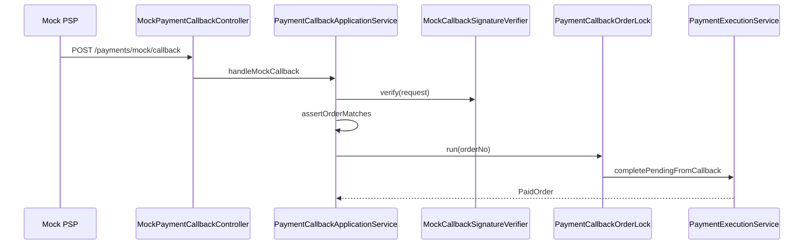

# PaymentCallbackApplicationService

| 项 | 内容 |
|----|------|
| 类 | `com.tokenhub.payment.application.PaymentCallbackApplicationService` |
| 入口 | `MockPaymentCallbackController` → `POST /payments/mock/callback` |
| 协作 | `MockCallbackSignatureVerifier`、`PaymentExecutionService`、`PaymentCallbackOrderLock` |

---

## 1. 背景

真实支付渠道（微信/支付宝等）通过 **异步 HTTP 回调** 通知支付结果。Mock 渠道用 HMAC 模拟该行为：回调**不经用户 JWT**，但必须防伪造、防重放、防并发双入账。

---

## 2. 处理流程



---

## 3. handleMockCallback

```26:31:payment-service/src/main/java/com/tokenhub/payment/application/PaymentCallbackApplicationService.java
  public PaymentExecutionService.PaidOrder handleMockCallback(MockCallbackRequest request) {
    signatureVerifier.verify(request);
    assertOrderMatches(request);
    PaymentExecutionService.PaidOrder[] out = new PaymentExecutionService.PaidOrder[1];
    callbackOrderLock.run(request.orderNo(), () -> out[0] = paymentExecutionService.completePendingFromCallback(request.orderNo()));
    return out[0];
  }
```

步骤：

1. **签名校验**（见下节）
2. **订单一致性**：本地订单存在、`userId`/`amount` 与回调体一致
3. **订单锁** 内执行幂等入账

---

## 4. MockCallbackSignatureVerifier

| 项 | 说明 |
|----|------|
| 算法 | HMAC-SHA256，输出 **hex** |
| 密钥 | `MOCK_CALLBACK_SECRET` |
| 仅支持状态 | `status=PAID`（忽略大小写） |
| 时间窗 | `ts` 为秒级 Unix 时间，与服务器差 **≤ 15 分钟** |

**Canonical 串**（字段名按字典序）：

```
amount={amount}&orderNo={orderNo}&status={status}&ts={ts}&userId={userId}
```

请求体 `MockCallbackRequest`：

| 字段 | 约束 |
|------|------|
| `orderNo` | 非空 |
| `userId` | 正整数 |
| `amount` | 正整数 |
| `status` | 非空（须为 PAID） |
| `ts` | 非空 Long |
| `signature` | 非空 hex |

比较签名使用 **常数时间** `constantTimeEquals`，降低时序攻击面。

---

## 5. assertOrderMatches

| 校验 | 失败错误 |
|------|----------|
| 订单不存在 | `NOT_FOUND` |
| `userId` 不匹配 | `BAD_REQUEST` |
| `amount` 不匹配 | `BAD_REQUEST` |

回调方在验签前已声明金额；与本地 INIT 订单对齐后才允许入账，防止错单。

---

## 6. PaymentCallbackOrderLock

| 项 | 内容 |
|----|------|
| 类 | `com.tokenhub.payment.infrastructure.redis.PaymentCallbackOrderLock` |
| Redis Key | `lock:payment:callback:{orderNo}` |
| TTL | 50 秒（`SET NX`） |
| 无 Redis | `ConcurrentHashMap` + `synchronized`（单机开发） |

```23:46:payment-service/src/main/java/com/tokenhub/payment/infrastructure/redis/PaymentCallbackOrderLock.java
  public void run(String orderNo, Runnable action) {
    StringRedisTemplate redis = redisProvider.getIfAvailable();
    String key = "lock:payment:callback:" + orderNo;
    if (redis != null) {
      if (Boolean.TRUE.equals(redis.opsForValue().setIfAbsent(key, "1", Duration.ofSeconds(50)))) {
        try {
          action.run();
        } finally {
          redis.delete(key);
        }
        return;
      }
      sleepBriefly();
      action.run();
      return;
    }
    // JVM fallback ...
  }
```

**共享锁**：Mock 回调、`ChannelReconcileApplicationService`、`InternalPaymentController.retryCredit` 使用**同一 key 前缀**，避免回调与查单/retry 并发双扣。

未抢到 Redis 锁时：短暂 sleep 后仍执行 action（依赖 billing `sourceRef` 幂等兜底，但应尽量避免常态竞争）。

---

## 7. 与 checkout 联调

1. 用户 `POST /payments/mock/checkout` → 返回 `INIT` + `orderNo`
2. 构造 canonical + HMAC，模拟 PSP `POST /payments/mock/callback`
3. 响应 `status=PAID`，billing 余额增加

---

## 8. 配置项

| 变量 | 默认 | 说明 |
|------|------|------|
| `MOCK_CALLBACK_SECRET` | `dev-mock-callback-secret-change` | 与模拟 PSP 共享 |
| `REDIS_HOST` / `REDIS_PORT` | 127.0.0.1:6379 | 生产建议启用 Redis 锁 |

---

## 9. 演进（生产渠道）

| Mock 现状 | 生产替换 |
|-----------|----------|
| HMAC 自建 canonical | 微信/支付宝平台验签与证书 |
| 单一路径 `/payments/mock/callback` | 按渠道拆分 Controller + 适配器 |
| 15 分钟 ts 窗 | 渠道规范 + 服务端时钟同步 |

---

## 10. 相关文档

- [03-PaymentExecutionService.md](./03-PaymentExecutionService.md)
- [05-ChannelReconciliation.md](./05-ChannelReconciliation.md)
- [08-路由与配置.md](../08-路由与配置.md)
