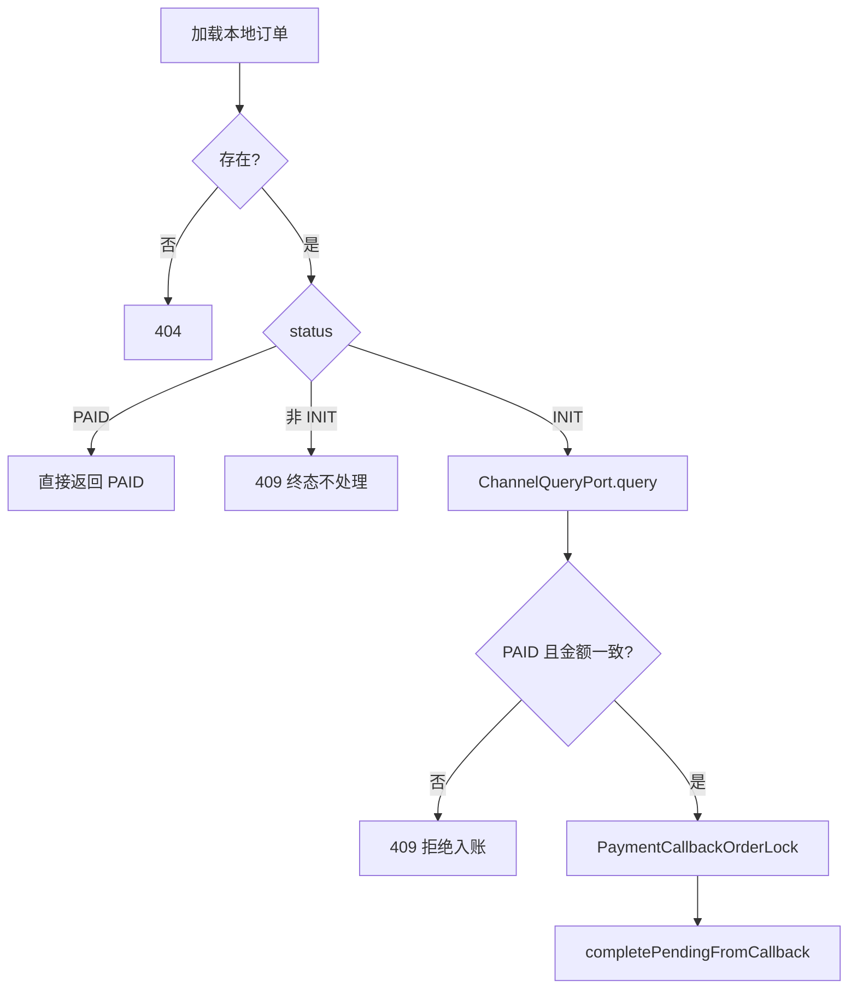

# 渠道对账（Channel Reconciliation）

本文涵盖两个应用服务：

| 类 | 职责 |
|----|------|
| `ChannelReconciliationApplicationService` | **O-4** CSV 导入，平台内逐行比对 |
| `ChannelReconcileApplicationService` | **O-8** 单笔查单 + 条件入账 |

---

## 1. ChannelReconciliationApplicationService（CSV 对账）

### 1.1 背景

运营需将渠道日账单与平台 `payment_orders` 对齐，发现金额不符、本地漏单、或「渠道已成功但本地仍 INIT」等差异。M1 支持 **CSV 文本导入**（非文件上传），结果落库供查询。

### 1.2 API

| 方法 | 路径 | 鉴权 |
|------|------|------|
| POST | `/internal/payments/reconciliation/batches` | Internal Token |
| GET | `/internal/payments/reconciliation/batches/{id}` | Internal Token |

请求体 `ReconciliationImportRequest`：`channel`、`billDate`、`sourceName`、`csv`。

### 1.3 CSV 格式

首行若包含 `channel_order_no` 视为 **header 跳过**。

数据行（逗号分隔，至少 4 列）：

```text
channel_order_no,local_order_no,channel_amount,channel_status,paid_at
```

| 列 | 说明 |
|----|------|
| 0 | 渠道订单号 |
| 1 | 本地订单号提示（可空，优先按此查本地） |
| 2 | 渠道金额（long） |
| 3 | 渠道状态字符串 |
| 4 | 可选，`YYYY-MM-DDTHH:mm:ss` |

### 1.4 diff_kind 语义

| diff_kind | 含义 | 典型后续动作 |
|-----------|------|----------------|
| `MATCHED` | 金额一致且本地 `PAID` | 无 |
| `AMOUNT_MISMATCH` | 金额不一致 | 人工核查 |
| `MISSING_LOCAL` | 渠道有、本地无 | 补单或拒付 |
| `LOCAL_INIT` | 渠道 SUCCESS 类但本地仍 INIT | **retry-credit** 或 channel-reconcile |
| `LOCAL_OTHER` | 本地非 PAID/INIT 终态 | 人工 |

导入结束批次状态：`IMPORTED` → 行写入后 → `RECONCILED`。

返回 `ImportResult(batchId, total, matched, mismatched)`。

`getBatchSummary` 额外返回最多 **100** 条非 MATCHED 样本行。

### 1.5 本地订单查找

1. 若 `local_order_no` 非空，先按该 `order_no` 查；
2. 否则按 `channel_order_no` 当作 `order_no` 查。

---

## 2. ChannelReconcileApplicationService（查单入账）

### 2.1 背景

CSV 对账发现 `LOCAL_INIT` 后，需在**确认渠道已收款**的前提下触发入账。`retry-credit` 由人工背书；`channel-reconcile` 则通过 **`ChannelQueryPort`** 自动查单（Mock 或未来微信/支付宝实现）。

### 2.2 API

```
POST /internal/payments/orders/{orderNo}/channel-reconcile
```

### 2.3 流程



核心逻辑：

```41:79:payment-service/src/main/java/com/tokenhub/payment/application/ChannelReconcileApplicationService.java
  public PaymentExecutionService.PaidOrder reconcileByOrderNo(String orderNo) {
    // ... 本地 PAID / 非 INIT 校验 ...
    ChannelQueryPort.QueryResult q = channelQueryPort.query(local.getChannel(), orderNo);
    if (q == null || q.status() != ChannelQueryPort.ChannelStatus.PAID) {
      throw new BusinessException(ErrorCode.CONFLICT, "渠道未返回已支付，拒绝入账: ...");
    }
    if (q.channelAmount() != null && !q.channelAmount().equals(local.getAmount())) {
      throw new BusinessException(ErrorCode.CONFLICT, "渠道金额与本地不一致，禁止入账");
    }
    callbackOrderLock.run(orderNo, () -> out[0] = paymentExecutionService.completePendingFromCallback(orderNo));
    // ...
  }
```

**安全**：`UNKNOWN` / `UNPAID` / 金额不一致 **一律拒绝入账**。

### 2.4 ChannelQueryPort

| 枚举 | 含义 |
|------|------|
| `PAID` | 允许入账（仍需金额校验） |
| `UNPAID` | 拒绝 |
| `UNKNOWN` | 拒绝 |

默认实现：`MockChannelQueryPort`

| 配置 | 行为 |
|------|------|
| `mock-returns-paid=false`（默认） | 始终 `UNKNOWN`，禁止自动入账 |
| `mock-returns-paid=true` | 开发/集成测试：对存在订单返回 `PAID` |

真实通道应提供独立 `@Component` 覆盖（`@ConditionalOnMissingBean`）。

---

## 3. retry-credit 与 channel-reconcile 对比

| 项 | `POST .../retry-credit` | `POST .../channel-reconcile` |
|----|-------------------------|------------------------------|
| 渠道确认 | **人工/运营** 已确认 | **查单端口** 返回 PAID |
| 入账方法 | `completePendingFromCallback` | 同左 |
| 订单锁 | `PaymentCallbackOrderLock` | 同左 |
| 误用风险 | 高（未支付也可被误触发） | 中（依赖查单实现质量） |

定时任务 **不会** 自动调用二者，仅打 INIT 积压日志。

---

## 4. 数据表（对账批次）

| 表 | 用途 |
|----|------|
| `channel_reconciliation_batches` | 批次元数据、统计 |
| `channel_reconciliation_lines` | 逐行 diff |

调账工单（`adjustment_tickets`）计划在 M2 与 ops-console 审批流对接。

---

## 5. 相关文档

- [04-PaymentCallbackApplicationService.md](./04-PaymentCallbackApplicationService.md)
- [06-PaymentReconciliationScheduler.md](./06-PaymentReconciliationScheduler.md)
- [08-路由与配置.md](../08-路由与配置.md)
