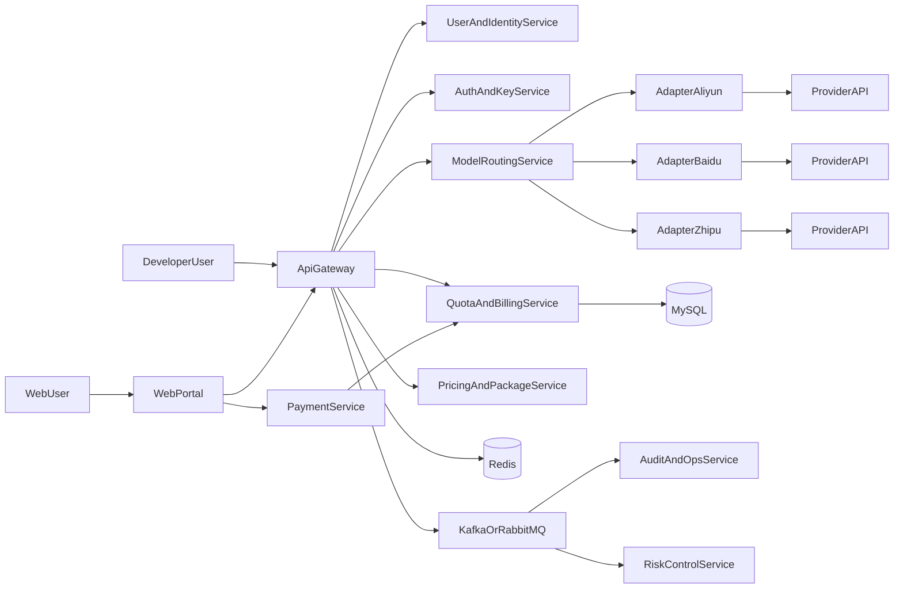

# Java C端模型中转平台实施计划（对标 TaoToken）

## 1. 目标与边界（产品对标）

- 面向两类用户：开发者（API 调用）+ 普通用户（网页对话）。
- 对外统一 OpenAI 风格接口：`/v1/chat/completions`、`/v1/embeddings`、`/v1/models`。
- 平台具备 C 端必需能力：注册登录、充值购包、账单中心、Key 管理、在线调试台。
- 对内聚合国内供应商并做策略路由，保障可用率、成本和响应时延。
- 首期不做：复杂代理分销体系、企业私有化交付、重 BI 报表系统。

## 2. 技术方案（Java）

- **后端框架**：Spring Boot 3 + Spring WebFlux。
- **网关**：Spring Cloud Gateway（鉴权、限流、流式转发）。
- **账户与支付**：MySQL + Redis，支付回调采用幂等消费与补偿任务。
- **异步链路**：Kafka（或 RabbitMQ）承载调用日志、账务入账、风控事件。
- **观测与告警**：Micrometer + Prometheus + Grafana + 日志平台。
- **安全基线**：JWT + API Key、密钥加密存储、IP/设备风控、敏感字段脱敏。

## 3. 目标架构（C端增强）

## 4. 模块拆分与职责

- `api-gateway`：统一入口、协议兼容、SSE流式透传、基础限流。
- `user-center`：注册登录、JWT会话、用户资料、安全设置。
- `provider-adapter`：供应商适配、参数映射、错误归一与降级重试。
- `routing-engine`：按可用率/成本/延迟进行模型路由和故障切换。
- `billing-core`：余额账户、套餐订阅、请求扣费、账务流水。
- `payment-service`：充值下单、支付回调、对账与异常补单。
- `c-end-console`：充值购包、API Key 管理、账单、调用统计、Playground。
- `ops-console`：供应商配置、风控规则、告警与审计查询。

## 4.1 必补模块（C端）

- `用户体系`：邮箱/手机/三方登录、找回密码、设备管理、用户等级（免费/付费/企业）。
- `钱包与账单`：余额账户、充值、扣费、退款、可视化账单、调用订单中心（每次调用可追溯）。
- `套餐与定价`：按量计费 + 套餐包并存，支持按 token、按请求、按模型倍率差异化定价。
- `C端控制台`：API Key 自助创建/禁用、调用统计、错误分析、余额预警、文档中心、在线调试台。
- `风控与反滥用`：设备/IP 风险识别、验证码、人机验证、异常调用封禁、内容安全审查。
- `支付与财务`：微信/支付宝/银行卡支付、支付回调、发票、对账、财务导出。
- `客服与运营`：工单系统、公告、活动、邀请码/返佣、问题单到赔付闭环。

建议仓库结构：

- [pom.xml](pom.xml)
- [gateway-service/src/main/java](gateway-service/src/main/java)
- [user-center-service/src/main/java](user-center-service/src/main/java)
- [adapter-service/src/main/java](adapter-service/src/main/java)
- [billing-service/src/main/java](billing-service/src/main/java)
- [payment-service/src/main/java](payment-service/src/main/java)
- [console-web/](console-web/)
- [ops-console/src/main/java](ops-console/src/main/java)
- [docs/openapi/unified-api.yaml](docs/openapi/unified-api.yaml)
- [docs/adr/](docs/adr/)

## 5. 核心数据模型（首期）

- `users`：用户账户、状态、登录安全信息。
- `user_devices`：用户设备指纹、登录轨迹、风险标签。
- `api_keys`：调用凭证、可访问模型、QPS限制、过期时间。
- `pricing_plans`：套餐定义、额度、有效期、价格。
- `user_subscriptions`：用户订阅记录、周期、状态。
- `model_providers`：供应商配置、可用模型列表、成本参数、优先级。
- `model_prices`：模型单价规则（token/请求/倍率）与生效区间。
- `request_logs`：请求体摘要、响应码、token 统计、耗时、追踪ID。
- `request_orders`：调用订单主表（与账务、日志一一关联）。
- `usage_ledger`：计费流水（请求级别）、扣费状态、重试标识。
- `account_balance`：余额与冻结金额。
- `payment_orders`：充值订单、回调状态、渠道单号。
- `refund_orders`：退款申请、审核状态、退款流水号。
- `invoices`：发票抬头、开票状态、关联订单。
- `support_tickets`：工单内容、流转状态、处理人、赔付记录。
- `risk_events`：风控命中事件、处置动作、解封记录。
- `rate_limit_counters`（Redis）：分钟级、日级配额计数。

## 6. 接口规划（统一对外 + C端）

- `POST /v1/chat/completions`：支持非流式与 SSE 流式。
- `POST /v1/embeddings`：统一输入与向量输出结构。
- `GET /v1/models`：返回平台可用模型及供应商状态。
- `GET /v1/usage`：按 key / 时间范围查询使用量与费用。
- `POST /user/register`、`POST /user/login`：用户注册与登录。
- `POST /user/password/forgot`、`POST /user/password/reset`：找回与重置密码。
- `POST /billing/recharge`、`POST /billing/subscribe`：充值与套餐购买。
- `POST /billing/refund/apply`：退款申请。
- `GET /billing/orders`、`GET /billing/invoices`：订单与发票查询。
- `GET /dashboard/summary`：余额、额度、调用趋势聚合。
- `POST /apikeys`、`PATCH /apikeys/{id}/disable`：Key 创建与禁用。
- `GET /console/errors`：错误码聚合与失败调用分析。
- `POST /support/tickets`：提交工单。
- `POST /admin/providers`：后台配置供应商密钥与模型映射。

## 7. 实施里程碑（10~12 周）

- **第 1~2 周（技术底座）**
  - 多模块工程搭建、统一错误码、统一 OpenAPI。
  - 接入 1 家供应商，打通 `chat/completions` 非流式。
- **第 3~4 周（开发者闭环）**
  - API Key、限流、请求日志、余额扣费。
  - 接入第 2 家供应商，路由与故障切换上线。
- **第 5~6 周（C端闭环）**
  - 用户注册登录、充值、套餐购买、账单明细。
  - C端控制台（Key管理、调用统计、在线调试台）。
- **第 7~8 周（稳定性与风控）**
  - SSE流式透传、重试熔断、风控策略（IP/设备/频控）。
  - 运维后台（供应商管理、告警、审计查询）。
- **第 9~10 周（支付财务与客服）**
  - 发票、对账导出、退款流程、支付对账任务。
  - 工单系统、公告系统、基础运营活动配置。
- **第 11~12 周（治理与增长，可选）**
  - 会员分级SLA、邀请码/返佣、灰度路由、容量压测与成本优化。

## 8. 关键风险与对策

- 厂商协议频繁变化：适配器层做版本隔离与契约测试。
- 流式响应不稳定：统一超时、心跳与断流重试策略。
- 账务不一致：请求日志与账务流水双写校验，异步补偿任务。
- 密钥泄露风险：平台侧密钥加密存储 + 最小权限 + 定期轮换。
- 支付回调异常：幂等键 + 消息补偿 + 日终自动对账。
- 内容与合规风险：敏感内容审查、审计留痕、违规处置闭环。

## 8.1 平台治理能力（必补）

- `SLA与服务等级`：普通用户与会员用户采用不同速率、并发、优先级队列。
- `多区域与高可用`：供应商故障自动切换，区域级降级策略确保用户无感。
- `法务与合规`：用户协议、隐私政策、数据保留策略、未成年人保护策略。
- `境内运营要求`：预留实名/KYC、内容合规审查与监管报备接口能力。

## 9. 验收标准（MVP）

- 支持开发者 + 普通用户双入口，完成“注册->充值/购包->调用->查账单”闭环。
- 至少 2 家供应商可切换，统一接口对调用方无感。
- 支持余额+套餐混合扣费、QPS 限流、可追溯调用日志。
- 流式与非流式成功率 >= 99%（压测基线下）。
- 支持订单、退款、发票、工单四类核心运营流程最小闭环。
- 完成会员分级SLA和基础合规文档上线。

## 10. 后续扩展

- 多租户计费与对账单导出。
- 代理分销体系与多级渠道结算。
- 企业私有部署版本与区域化合规策略。

## 11. PRD（C端首发版）

### 11.1 产品定位

- 产品名称：`TokenHub`（暂定）。
- 目标：提供“国内多模型统一调用 + C端自助使用”的一站式平台。
- 用户类型：
  - 开发者用户：创建 API Key，接入统一接口。
  - 普通用户：在网页端直接对话和使用模型能力。
- 价值主张：稳定、便宜、易用、可追溯。

### 11.2 核心用户旅程

- 路径A（开发者）：注册登录 -> 充值/购包 -> 创建 Key -> 调用 API -> 查看账单与错误分析。
- 路径B（普通用户）：注册登录 -> 充值/购包 -> 网页对话 -> 查看历史记录与消费明细。
- 路径C（异常处理）：支付失败/调用失败 -> 工单 -> 排查 -> 退款或补偿。

### 11.3 页面与功能清单（首发）

- `首页`
  - 平台介绍、可用模型、价格摘要、状态页入口、注册/登录入口。
- `注册/登录页`
  - 邮箱手机登录、验证码、人机验证、找回密码。
- `控制台-首页`
  - 余额、套餐剩余额度、今日调用量、错误率、余额预警。
- `API Key 管理页`
  - 创建/禁用/删除 Key、权限模型绑定、QPS 限制设置、最近调用情况。
- `在线调试台（Playground）`
  - 选择模型、设置参数、流式预览、复制请求代码片段。
- `充值与套餐页`
  - 余额充值、套餐购买、支付状态跟踪、失败重试。
- `账单与订单页`
  - 调用订单明细、充值订单、退款订单、发票记录、导出。
- `错误分析页`
  - 错误码分布、失败接口、供应商异常趋势、重试建议。
- `文档中心`
  - API 文档、SDK 示例、限流策略、错误码说明。
- `客服工单页`
  - 提交问题、查看进度、补偿记录、公告通知。

### 11.4 页面到接口映射

- `注册/登录页`
  - `POST /user/register`
  - `POST /user/login`
  - `POST /user/password/forgot`
  - `POST /user/password/reset`
- `控制台-首页`
  - `GET /dashboard/summary`
  - `GET /v1/usage`
- `API Key 管理页`
  - `POST /apikeys`
  - `GET /apikeys`
  - `PATCH /apikeys/{id}/disable`
- `在线调试台`
  - `POST /v1/chat/completions`
  - `POST /v1/embeddings`
  - `GET /v1/models`
- `充值与套餐页`
  - `POST /billing/recharge`
  - `POST /billing/subscribe`
  - `GET /billing/payment-orders`
- `账单与订单页`
  - `GET /billing/orders`
  - `GET /billing/invoices`
  - `POST /billing/refund/apply`
- `错误分析页`
  - `GET /console/errors`
  - `GET /console/failures/trend`
- `客服工单页`
  - `POST /support/tickets`
  - `GET /support/tickets`

### 11.5 页面到数据表映射

- `注册/登录页` -> `users`、`user_devices`
- `控制台-首页` -> `account_balance`、`usage_ledger`、`request_logs`
- `API Key 管理页` -> `api_keys`
- `在线调试台` -> `request_logs`、`request_orders`
- `充值与套餐页` -> `payment_orders`、`pricing_plans`、`user_subscriptions`
- `账单与订单页` -> `usage_ledger`、`request_orders`、`refund_orders`、`invoices`
- `错误分析页` -> `request_logs`、`risk_events`
- `客服工单页` -> `support_tickets`

### 11.6 非功能需求（NFR）

- 可用性：月可用性目标 >= 99.9%。
- 性能：P95 响应时间 < 2s（非流式）；流式首包时间 < 1.5s。
- 安全：密钥加密存储、审计日志保留、敏感字段脱敏。
- 风控：登录与支付链路强制验证码与风险评分。
- 可观测：统一 TraceID，核心链路指标可视化。

### 11.7 SLA 分级规则（首发）

- 免费用户：低并发、较低 QPS、普通优先级队列。
- 付费用户：中并发、中高 QPS、较高优先级队列。
- 企业用户：高并发、高 QPS、专属路由策略与优先保障。

### 11.8 运营与合规需求

- 法务页面：用户协议、隐私政策、数据保留政策、未成年人保护说明。
- 合规能力预留：实名/KYC 接口占位、内容审查策略、监管审计导出。
- 运营功能：公告、活动券、邀请码/返佣、问题单赔付流程。

### 11.9 MVP 验收清单（PRD口径）

- 用户可独立完成：注册 -> 支付 -> 调用 -> 查账单 -> 提工单。
- 开发者可在 10 分钟内完成接入并成功调用至少 1 个模型接口。
- 订单、账单、退款、发票、工单均可在控制台闭环追踪。
- 当某供应商故障时，平台可自动切换且用户侧错误率可控。

## 12. V1 原型信息架构（IA）

### 12.1 全局导航

- `顶部导航`：产品、价格、文档、公告、控制台、登录/注册。
- `控制台侧边栏`：总览、API Keys、在线调试、模型市场、账单订单、充值套餐、错误分析、工单中心、账号安全。
- `管理员侧边栏`：供应商管理、路由策略、价格配置、风控中心、支付对账、告警中心、审计日志。

### 12.2 页面层级树

```mermaid
flowchart TD
  publicSite[PublicSite] --> homePage[HomePage]
  publicSite --> pricingPage[PricingPage]
  publicSite --> docsPage[DocsPage]
  publicSite --> statusPage[StatusPage]
  publicSite --> loginPage[LoginRegisterPage]
  userConsole[UserConsole] --> dashboardPage[DashboardPage]
  userConsole --> apiKeysPage[ApiKeysPage]
  userConsole --> playgroundPage[PlaygroundPage]
  userConsole --> billingPage[BillingAndOrdersPage]
  userConsole --> packagePage[RechargeAndPackagePage]
  userConsole --> errorsPage[ErrorAnalyticsPage]
  userConsole --> ticketsPage[SupportTicketsPage]
  userConsole --> accountPage[AccountSecurityPage]
  adminConsole[AdminConsole] --> providerPage[ProviderManagePage]
  adminConsole --> routingPage[RoutingPolicyPage]
  adminConsole --> pricingAdminPage[PricingConfigPage]
  adminConsole --> riskPage[RiskControlPage]
  adminConsole --> paymentOpsPage[PaymentReconcilePage]
  adminConsole --> alertPage[AlertCenterPage]
```

### 12.3 页面核心组件

- `DashboardPage`
  - 余额卡片、套餐剩余额度、调用趋势图、错误率图、告警提示。
- `ApiKeysPage`
  - Key 列表、创建弹窗、权限模型选择器、禁用开关、QPS 配置。
- `PlaygroundPage`
  - 模型选择器、参数面板、Prompt 编辑器、SSE 输出窗、代码示例生成器。
- `BillingAndOrdersPage`
  - 调用订单表、充值订单表、退款记录、发票状态、CSV 导出。
- `SupportTicketsPage`
  - 工单提交表单、会话式回复、处理状态时间线、赔付记录卡片。

### 12.4 关键交互规则

- 当余额不足且套餐额度为 0 时，调用请求直接失败并引导充值页。
- 当触发风控（设备/IP 异常）时，登录或调用需二次验证。
- 当供应商不可用时，前端显示“已自动切换线路”，避免用户误判。
- Playground 请求默认打上“测试调用”标签，便于账单筛选。

## 13. 研发排期表（按角色）

### 13.1 团队角色建议

- `后端A（网关与适配）`
- `后端B（用户与计费）`
- `后端C（支付与运营后台）`
- `前端A（官网与用户控制台）`
- `前端B（管理后台）`
- `测试QA（功能+接口+回归）`
- `DevOps（部署、监控、告警、压测）`

### 13.2 周度排期（12周）

- `W1-W2`
  - 后端A：网关骨架、统一鉴权链路、首家供应商适配。
  - 后端B：用户注册登录、JWT、基础账户表。
  - 前端A：官网与登录页框架、控制台骨架。
  - DevOps：开发/测试环境、CI 基线、日志采集。
- `W3-W4`
  - 后端A：第二家供应商接入、路由切换策略。
  - 后端B：API Key 管理、调用计量、余额扣费链路。
  - 前端A：Key 页面、Dashboard 页面、模型列表接入。
  - 测试QA：接口联调测试、冒烟回归。
- `W5-W6`
  - 后端B：套餐订阅、价格策略、账单聚合接口。
  - 后端C：支付下单、回调幂等、充值订单流。
  - 前端A：充值套餐页、账单订单页、Playground。
  - 前端B：管理员供应商配置页。
- `W7-W8`
  - 后端A：SSE 稳定性优化、熔断重试、超时治理。
  - 后端C：风控事件流、工单与公告接口。
  - 前端B：风控中心、告警中心、审计日志页。
  - 测试QA：风控/支付异常场景回归。
- `W9-W10`
  - 后端C：退款、发票、对账导出。
  - 前端A：错误分析页、工单页、账户安全页。
  - DevOps：压测、容量评估、告警阈值调优。
  - 测试QA：端到端回归与上线验收。
- `W11-W12`
  - 后端全员：SLA 分级、灰度路由、遗留问题清理。
  - 前端全员：体验优化、文档中心完善。
  - 测试QA：全链路回归、生产演练。
  - DevOps：发布演练、回滚预案验证。

### 13.3 里程碑交付物

- `M1（W4）`：开发者调用闭环可用。
- `M2（W8）`：C端充值与控制台闭环可用。
- `M3（W10）`：支付财务与工单闭环可用。
- `M4（W12）`：SLA/风控/合规基线达标并可上线。

## 14. 数据库字段级设计草案（核心表）

### 14.1 users

- `id`（bigint, pk）
- `email`（varchar, unique）
- `phone`（varchar, unique, nullable）
- `password_hash`（varchar）
- `user_level`（tinyint, 免费/付费/企业）
- `status`（tinyint, 正常/冻结）
- `last_login_at`（datetime）
- `created_at`、`updated_at`（datetime）
- 索引：`idx_users_email`、`idx_users_phone`、`idx_users_level_status`

### 14.2 api_keys

- `id`（bigint, pk）
- `user_id`（bigint, fk->users.id）
- `key_prefix`（varchar）
- `key_hash`（varchar）
- `name`（varchar）
- `model_scope`（json）
- `qps_limit`（int）
- `status`（tinyint, 启用/禁用）
- `expires_at`（datetime, nullable）
- `created_at`、`updated_at`（datetime）
- 索引：`idx_api_keys_user`、`idx_api_keys_status`、`uniq_api_keys_prefix`

### 14.3 pricing_plans

- `id`（bigint, pk）
- `plan_code`（varchar, unique）
- `plan_name`（varchar）
- `plan_type`（tinyint, 月包/年包/一次性）
- `quota_tokens`（bigint）
- `price_amount`（decimal）
- `currency`（varchar）
- `status`（tinyint）
- `effective_start`、`effective_end`（datetime）
- 索引：`uniq_pricing_plans_code`、`idx_pricing_plans_status_time`

### 14.4 model_prices

- `id`（bigint, pk）
- `model_code`（varchar）
- `billing_mode`（tinyint, token/请求/倍率）
- `input_unit_price`（decimal）
- `output_unit_price`（decimal）
- `request_unit_price`（decimal, nullable）
- `multiplier`（decimal, nullable）
- `provider_code`（varchar）
- `effective_start`、`effective_end`（datetime）
- 索引：`idx_model_prices_model_provider`、`idx_model_prices_effective`

### 14.5 request_orders

- `id`（bigint, pk）
- `trace_id`（varchar, unique）
- `user_id`（bigint）
- `api_key_id`（bigint）
- `model_code`（varchar）
- `provider_code`（varchar）
- `request_type`（tinyint, chat/embedding）
- `input_tokens`、`output_tokens`（int）
- `total_cost`（decimal）
- `status_code`（int）
- `latency_ms`（int）
- `created_at`（datetime）
- 索引：`idx_request_orders_user_time`、`idx_request_orders_model_time`、`idx_request_orders_status`

### 14.6 usage_ledger

- `id`（bigint, pk）
- `user_id`（bigint）
- `request_order_id`（bigint）
- `ledger_type`（tinyint, 扣费/退款/补偿）
- `amount`（decimal）
- `balance_before`、`balance_after`（decimal）
- `idempotency_key`（varchar）
- `created_at`（datetime）
- 索引：`idx_usage_ledger_user_time`、`uniq_usage_ledger_idempotency`

### 14.7 payment_orders

- `id`（bigint, pk）
- `user_id`（bigint）
- `order_no`（varchar, unique）
- `channel`（varchar, wx/alipay/bank）
- `amount`（decimal）
- `currency`（varchar）
- `status`（tinyint, 待支付/成功/失败/关闭）
- `channel_trade_no`（varchar, nullable）
- `callback_raw`（json, nullable）
- `paid_at`（datetime, nullable）
- `created_at`、`updated_at`（datetime）
- 索引：`uniq_payment_orders_no`、`idx_payment_orders_user_time`、`idx_payment_orders_status`

### 14.8 support_tickets

- `id`（bigint, pk）
- `ticket_no`（varchar, unique）
- `user_id`（bigint）
- `category`（varchar, 支付/调用/退款/其他）
- `priority`（tinyint）
- `status`（tinyint, 待处理/处理中/已解决/已关闭）
- `title`（varchar）
- `content`（text）
- `owner_id`（bigint, nullable）
- `compensation_amount`（decimal, nullable）
- `created_at`、`updated_at`（datetime）
- 索引：`uniq_support_tickets_no`、`idx_support_tickets_user_status`、`idx_support_tickets_owner_status`

## 15. Figma UI 高保真设计稿规范（首批页面）

### 15.1 设计目标

- 设计范围：`首页`、`登录/注册`、`控制台总览`、`API Key 管理`、`在线调试台`、`充值/套餐/账单`。
- 视觉方向：`浅色为主 + 暗黑模式`，面向开发者与普通用户混合场景。
- 交付标准：可直接在 Figma 建立页面、组件、变量与自动布局体系。

### 15.2 Figma 文件结构建议

- `00_Foundation`
  - Color Tokens
  - Typography
  - Spacing / Radius / Shadow
  - Grid System
- `01_Components`
  - Buttons / Inputs / Select / Tabs
  - Cards / Table / Modal / Toast
  - NavBar / SideBar / Breadcrumb / EmptyState
  - Chart Widgets / StatusBadge / CodeBlock
- `02_Pages_Light`
  - Home
  - Auth
  - Dashboard
  - ApiKeys
  - Playground
  - Billing
- `03_Pages_Dark`
  - 与 `02_Pages_Light` 同构页面
- `04_Prototype`
  - 关键跳转与交互演示流

### 15.3 设计令牌（Design Tokens）

- `颜色（Light）`
  - `bg.page`: `#F7F8FA`
  - `bg.card`: `#FFFFFF`
  - `text.primary`: `#0F172A`
  - `text.secondary`: `#475569`
  - `brand.primary`: `#4F46E5`
  - `brand.primary.hover`: `#4338CA`
  - `success`: `#16A34A`
  - `warning`: `#D97706`
  - `danger`: `#DC2626`
  - `border.default`: `#E2E8F0`
- `颜色（Dark）`
  - `bg.page`: `#0B1220`
  - `bg.card`: `#111827`
  - `text.primary`: `#E5E7EB`
  - `text.secondary`: `#9CA3AF`
  - `brand.primary`: `#6366F1`
  - `brand.primary.hover`: `#818CF8`
  - `success`: `#22C55E`
  - `warning`: `#F59E0B`
  - `danger`: `#EF4444`
  - `border.default`: `#1F2937`
- `字体`
  - 中文：`PingFang SC`
  - 英文/数字/代码：`Inter` + `JetBrains Mono`
- `字号层级`
  - H1: 32/40
  - H2: 24/32
  - H3: 20/28
  - Body: 14/22
  - Caption: 12/18
- `布局`
  - 栅格：1440 宽，12 栏，Gutter 24，Margin 80
  - 控制台内容区最大宽：1280
  - 间距系统：4/8/12/16/24/32
  - 圆角系统：8/12/16

### 15.4 核心组件规范

- `按钮 Button`
  - 尺寸：S(32) / M(40) / L(48)
  - 状态：Default / Hover / Pressed / Disabled / Loading
  - 类型：Primary / Secondary / Ghost / Danger
- `输入 Input`
  - 状态：Default / Focus / Error / Disabled
  - 附件：前后缀图标、清除按钮、验证码倒计时
- `表格 Table`
  - 支持：排序、筛选、分页、列显隐、行内状态标签
- `图表卡片`
  - 指标卡（余额、调用量、错误率）
  - 趋势图（7天/30天切换）
- `代码块 CodeBlock`
  - 语言标签、复制按钮、行号、滚动区

### 15.5 页面级高保真说明

- `首页 Home`
  - Hero 区：价值主张、CTA（立即注册 / API 文档）
  - 模型与价格区：卡片式模型能力与起步价格
  - 可用性区：状态页摘要、供应商线路健康度
  - 信任区：核心指标（成功率、延迟、接入时长）
- `登录/注册 Auth`
  - 双栏布局：左侧品牌与卖点，右侧登录注册卡片
  - 支持邮箱/手机切换、验证码、人机验证、找回密码
- `控制台总览 Dashboard`
  - 顶部：账户状态、用户等级、余额预警
  - 中部：调用趋势、费用趋势、错误率图表
  - 底部：最近调用、系统公告、快捷入口
- `API Key 管理`
  - 列表：名称、前缀、权限模型、QPS、状态、创建时间
  - 操作：创建、禁用、删除、复制（仅首次可见完整 Key）
- `在线调试台 Playground`
  - 左侧参数面板（模型、温度、max_tokens、stream）
  - 中间 Prompt 编辑区（模板快捷插入）
  - 右侧响应区（流式输出 + token 消耗 + 耗时）
  - 底部：多语言代码片段（curl/Java/Python/JS）
- `充值/套餐/账单 Billing`
  - 顶部钱包卡片：余额、冻结、本月消费
  - 中部套餐卡：月包/年包/企业包
  - 底部账单表：调用订单/充值订单/退款/发票 Tab

### 15.6 交互与动效规范

- 页面切换：150ms-200ms，淡入上移。
- 弹窗：遮罩 40%，缩放进入 180ms。
- 悬停反馈：按钮和卡片统一 120ms。
- 图表刷新：数据过渡动画 300ms，避免突变。

### 15.7 可用性与无障碍

- 对比度满足 WCAG AA。
- 表单错误提示必须明确到字段。
- 主要操作支持键盘可达（Tab 顺序明确）。
- 关键状态配文案，不仅依赖颜色区分。

### 15.8 原型链路（Figma Prototype）

- `链路1（开发者）`：首页 -> 注册 -> 控制台 -> 创建 Key -> Playground 测试 -> 账单页。
- `链路2（普通用户）`：首页 -> 登录 -> 充值购包 -> 网页调试 -> 查看消费明细。
- `链路3（异常）`：调用失败 -> 错误分析 -> 提交工单 -> 查看处理进度。

### 15.9 设计验收标准

- 六个首批页面具备 Light/Dark 双主题完整高保真稿。
- 基础组件覆盖率 >= 90%，页面组件复用率 >= 70%。
- 原型可完整演示三条关键业务链路。
- UI 文案、状态、错误提示与接口返回语义一致。

