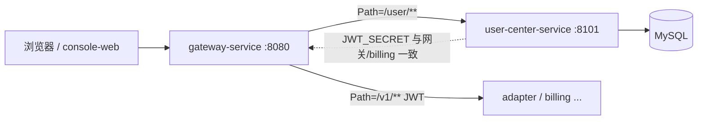
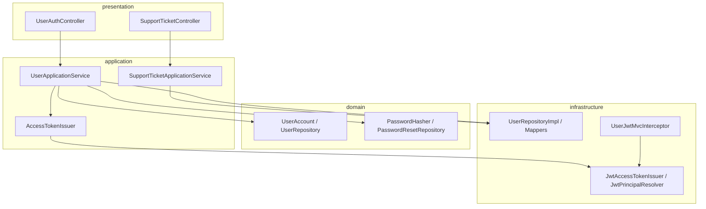

# 用户中心总览

`user-center-service` 是 TokenHub 的**身份与 C 端账户服务**：负责邮箱注册、登录、JWT 签发、密码重置、当前用户资料，以及用户侧客服工单（Support Ticket）的 CRUD。

技术栈：**Spring Boot + Spring MVC**（同步 Servlet 模型），默认端口 **`8101`**。对外路径统一为 `/user/**`，由 `gateway-service`（`8080`）按路由转发，客户端通常只访问网关地址。

---

## 1. 在平台中的位置



| 角色 | 说明 |
|------|------|
| **注册 / 登录** | 匿名接口；成功登录返回 `accessToken`（Bearer JWT） |
| **受保护接口** | `/user/me`、`/user/support/**` 由本服务 `UserJwtMvcInterceptor` 验 JWT |
| **网关 `/v1/**`** | 网关用同一 `JWT_SECRET` 验签，将 `sub` 注入 `X-User-Id`（见 gateway 文档） |
| **计费 / Key** | 不在本服务；用户 ID 由 JWT `sub` 在各服务间传递 |

---

## 2. 分层架构

按 `docs/architecture/LAYERS.md`，本模块为**完整四层**（与网关「仅 infrastructure」不同）：

| 层 | 包路径 | 职责 |
|----|--------|------|
| **presentation** | `...presentation` | `UserAuthController`、`SupportTicketController`、请求 DTO、`ApiResponse` 包装 |
| **application** | `...application` | `UserApplicationService`、`SupportTicketApplicationService`、端口 `AccessTokenIssuer` |
| **domain** | `...domain` | `UserAccount`、`UserRepository`、`PasswordHasher` 等（无 Spring/MyBatis 注解） |
| **infrastructure** | `...infrastructure` | MyBatis PO/Mapper、BCrypt、JWT 签发与解析、邮件适配器、MVC 拦截器 |



**边界说明**：

- `SupportTicketApplicationService` 当前直接依赖 MyBatis `Mapper`（在 `application` 包引用 `infrastructure.persistence`），属于已知简化；长期可抽 `SupportTicketRepository` 端口以严格分层。
- 启动类 `UserCenterApplication` 扫描 `com.tokenhub` 全包，以便复用 `common-core`、`common-security`。

---

## 3. 典型请求流

### 3.1 注册 / 登录（经网关）

1. 客户端 `POST http://gateway:8080/user/register` 或 `/user/login`。
2. 网关 `user-center` 路由转发至 `http://127.0.0.1:8101`（`TOKENS_GATEWAY_USER_URI`）。
3. 网关仅做 Trace 等轻量处理，**不**替本服务验 JWT。
4. `UserApplicationService` 写 `users` / `user_devices`，登录成功由 `JwtAccessTokenIssuer` 签发 JWT。

### 3.2 受保护资源

1. 客户端携带 `Authorization: Bearer <jwt>` 访问 `/user/me` 或 `/user/support/**`。
2. `UserJwtMvcInterceptor` → `JwtPrincipalResolver` 验签，将 `userId` 写入 `request` attribute。
3. Controller 从 `AuthConstants.REQUEST_USER_ID` 读取并调用应用服务。

### 3.3 JWT 与网关 / 计费共享密钥

| 配置 | 位置 | 说明 |
|------|------|------|
| `JWT_SECRET` | 环境变量 | 网关 `V1IngressAuthGatewayFilter`、本服务 `tokenhub.jwt.secret` **须一致** |
| `sub` claim | 签发时 | `String.valueOf(userId)`，网关解析为 `X-User-Id` |
| TTL | `tokenhub.jwt.ttl-seconds` | 默认 `86400`（24h） |

---

## 4. 数据表（本服务主责）

| 表名 | 用途 | 迁移脚本 |
|------|------|----------|
| `users` | 账户：邮箱、BCrypt `password_hash`、展示名、状态 | `deploy/sql/V1__core_schema.sql` |
| `user_devices` | 每次登录记录设备指纹、UA、IP | 同上 |
| `password_reset_codes` | 重置验证码哈希、过期、是否已消费 | `deploy/sql/V2__password_reset_codes.sql` |
| `support_tickets` | 工单标题、状态、优先级、最后消息预览 | `V1__core_schema.sql` |
| `support_ticket_messages` | 工单消息（`USER` / `AGENT` 角色） | `deploy/sql/V7__p5_p7_p8_extensions.sql` |

本服务**不**管理 `api_keys`、`account_balance` 等表（属 `billing-service`）。

---

## 5. 认证模型速查

| 路径 | 是否需要 JWT | 说明 |
|------|----------------|------|
| `POST /user/register` | 否 | 注册成功返回用户资料，无 token |
| `POST /user/login` | 否 | 返回 `TokenResponse` |
| `POST /user/logout` | 否 | 当前为无状态占位（未吊销 token） |
| `POST /user/password/forgot` | 否 | 防邮箱枚举：未知邮箱也返回 200 |
| `POST /user/password/reset` | 否 | 验证码 + 新密码 |
| `GET /user/me` | **是** | 拦截器保护 |
| `/user/support/**` | **是** | 拦截器保护 |

---

## 6. 依赖与外部系统

| 依赖 | 用途 |
|------|------|
| **MySQL** | 用户、设备、重置码、工单 |
| **common-security** | `JwtSupport`、`ApiKeySupport`（Bearer 提取、SHA-256） |
| **common-core** | `BusinessException`、`ApiResponse`、`ErrorCode` |
| **VerificationMailPort** | 默认 `LoggingVerificationMailAdapter`（开发环境打日志含验证码） |

---

## 7. 源码入口

```
user-center-service/src/main/java/com/tokenhub/usercenter/
├── UserCenterApplication.java
├── presentation/
│   ├── UserAuthController.java
│   ├── SupportTicketController.java
│   └── dto/*
├── application/
│   ├── UserApplicationService.java
│   ├── SupportTicketApplicationService.java
│   └── port/AccessTokenIssuer.java
├── domain/
│   ├── user/UserAccount.java, UserRepository.java, ...
│   └── auth/PasswordHasher.java, AuthConstants.java
└── infrastructure/
    ├── web/UserJwtMvcInterceptor.java, UserCenterWebConfiguration.java
    ├── security/JwtAccessTokenIssuer.java, JwtPrincipalResolver.java
    ├── persistence/*Mapper, *Po, *RepositoryImpl
    └── mail/LoggingVerificationMailAdapter.java
```

配置：`src/main/resources/application.yml`

---

## 8. 阅读地图

| 文档 | 主题 |
|------|------|
| [components/01-UserJwtMvcInterceptor.md](./components/01-UserJwtMvcInterceptor.md) | MVC 拦截器与受保护路径 |
| [components/02-UserApplicationService.md](./components/02-UserApplicationService.md) | 注册、登录、重置密码 |
| [components/03-JwtAccessTokenIssuer.md](./components/03-JwtAccessTokenIssuer.md) | HMAC JWT 签发 |
| [components/04-SupportTicketApplicationService.md](./components/04-SupportTicketApplicationService.md) | 用户工单 CRUD |
| [08-路由与配置.md](./08-路由与配置.md) | `application.yml` 与 API 表 |

相关：`gateway-service/docs/00-网关总览.md`（`/user/**` 路由）、`docs/architecture/LAYERS.md`。

---

## 9. 架构取舍（用户中心层）

| 优点 | 代价 / 风险 |
|------|-------------|
| 领域模型与 BCrypt/JWT 端口清晰，便于单测 | 工单服务暂未完全隔离 persistence |
| 与网关共用 JWT，控制台与 `/v1` 可同一登录态 | 无 token 吊销 / refresh；`logout` 仅为占位 |
| 密码重置不泄露邮箱是否存在 | 开发环境验证码进日志，生产须换真实邮件通道 |
| 设备登录留痕，便于风控扩展 | 每次登录 `insert` 设备行，未做去重合并 |

**业界常见演进**：OAuth2/OIDC（Keycloak、Auth0）、Refresh Token + Redis 会话、Passkey/WebAuthn、专用 IAM 微服务——见各组件文档「业界方案」一节。
