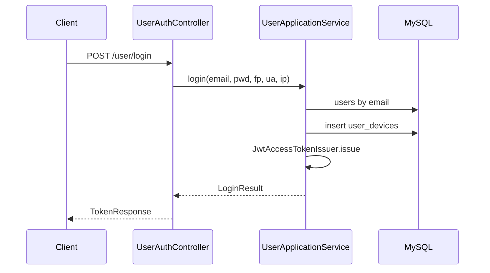

# UserApplicationService

| 项 | 内容 |
|----|------|
| 类 | `com.tokenhub.usercenter.application.UserApplicationService` |
| 事务 | 类级 `@Transactional` |
| 端口 | `UserRepository`、`UserDeviceRepository`、`PasswordHasher`、`PasswordResetRepository`、`AccessTokenIssuer`、`VerificationMailPort` |

---

## 1. 背景

C 端用户需要**邮箱 + 密码**账户体系：注册、登录拿 JWT、查看资料、忘记/重置密码。业务规则（邮箱格式、密码长度、统一错误文案、防邮箱枚举）应集中在应用服务，持久化与邮件发送通过端口/基础设施实现。

---

## 2. 作用

| 用例 | 方法 | HTTP（经 Controller） |
|------|------|-------------------------|
| 注册 | `register` | `POST /user/register` |
| 登录 + 设备留痕 + 发 token | `login` | `POST /user/login` |
| 发起重置（可能不发邮件） | `requestPasswordReset` | `POST /user/password/forgot` |
| 验证码换新密码 | `resetPassword` | `POST /user/password/reset` |
| 当前用户资料 | `getProfile` | `GET /user/me` |

---

## 3. 实现要点

### 3.1 注册 `register`

1. `normalizeEmail`：trim + 小写。
2. `requireEmail`：正则 `^[\w.+-]+@[\w.-]+\.[A-Za-z]{2,}$`。
3. `requirePassword`：至少 **8** 位。
4. 邮箱已存在 → `CONFLICT`「邮箱已注册」。
5. `passwordHasher.encode`（BCrypt cost **12**）→ `UserAccount.registered` → `users` 表。

注册**不**自动登录、不返回 JWT（由客户端再调 `login`）。

### 3.2 登录 `login` 与设备跟踪

1. 用户不存在或密码不匹配 → 统一 `UNAUTHORIZED`「邮箱或密码错误」（不区分原因，防用户枚举）。
2. 成功：`devices.recordLogin(userId, fingerprint, userAgent, ip)` 写入 `user_devices`。
3. 请求头（Controller 层采集）：
   - `X-Device-Fingerprint` → fingerprint
   - `User-Agent`
   - `X-Forwarded-For` 首段或 `remoteAddr` → IP
4. `accessTokenIssuer.issueForUser(userId)` 返回 `LoginResult(token, user, expiresInSeconds)`。

### 3.3 密码重置与防邮箱枚举

**`requestPasswordReset`**：

- 邮箱格式校验后，若 `users.findByEmail` 为空 → **直接 return**（无异常、无邮件）。
- 存在用户：生成 **6** 位数字验证码，`ApiKeySupport.sha256HexUtf8(code)` 存 `password_reset_codes.code_hash`，**30 分钟**有效。
- `verificationMailPort.sendLoginOrVerificationHint`；默认实现把验证码打在**日志**里（仅开发）。

**`resetPassword`**：

- 用户必须存在；`passwordResets.tryConsumeLatest(email, code, now)` 校验哈希、未消费、未过期，成功后标记 `consumed`。
- 失败 → `BAD_REQUEST`「验证码无效或已过期」。
- 新密码 BCrypt 写回 `users.password_hash`。

这与「忘记密码接口始终返回成功」配合，避免攻击者通过 HTTP 差异判断邮箱是否注册。

### 3.4 BCrypt

`BcryptPasswordHasher` 使用 `BCryptPasswordEncoder(12)`，实现领域端口 `PasswordHasher`，domain 层不依赖 Spring Security 类型。

### 3.5 校验常量（应用层）

| 常量 | 值 |
|------|-----|
| `MIN_PASSWORD_LEN` | 8 |
| `RESET_CODE_LEN` | 6 |
| `RESET_TTL_MINUTES` | 30 |

---

## 4. 数据流示意

---

## 5. 优劣分析

| 优点 | 缺点 |
|------|------|
| 登录/重置错误文案统一，利于安全与 UX | `logout` 未实现服务端吊销 |
| 重置码存哈希不落明文 | 多次 `forgot` 会插入多行码，仅 `tryConsumeLatest` 取最新匹配 |
| 设备表为风控/审计预留 | 无登录失败次数限制、无 CAPTCHA |
| 端口便于单测（见 `UserApplicationServiceTest`） | 邮件通道为占位实现 |

---

## 6. 业界更好的方案

| 方案 | 说明 |
|------|------|
| **Magic Link / OTP 应用** | 无密码或弱密码场景 |
| **Have I Been Pwned + 密码强度** | 注册/重置时检查泄露密码 |
| **Rate limit + CAPTCHA** | `forgot`/`login` 按 IP/邮箱限流（可在网关或本服务） |
| **Keycloak / Cognito** | 托管注册、MFA、邮件模板 |
| **Argon2id** | 较 BCrypt 更抗 GPU（需评估 Spring 支持） |

**建议**：生产将 `VerificationMailPort` 换为 SMTP/短信供应商；`forgot` 接口保持 200 + 固定文案；考虑对 `password_reset_codes` 按邮箱限速。

---

## 7. 配置项

| 项 | 说明 |
|----|------|
| `MYSQL_*` | 数据源（见 [08-路由与配置.md](../08-路由与配置.md)） |
| `tokenhub.jwt.*` | 登录签发 TTL（见 [03-JwtAccessTokenIssuer.md](./03-JwtAccessTokenIssuer.md)） |
| 邮件 | 无独立配置；替换 `LoggingVerificationMailAdapter` Bean |

---

## 8. 相关文档

- [03-JwtAccessTokenIssuer.md](./03-JwtAccessTokenIssuer.md)
- [01-UserJwtMvcInterceptor.md](./01-UserJwtMvcInterceptor.md)
- [08-路由与配置.md](../08-路由与配置.md)
- SQL：`deploy/sql/V1__core_schema.sql`、`deploy/sql/V2__password_reset_codes.sql`
