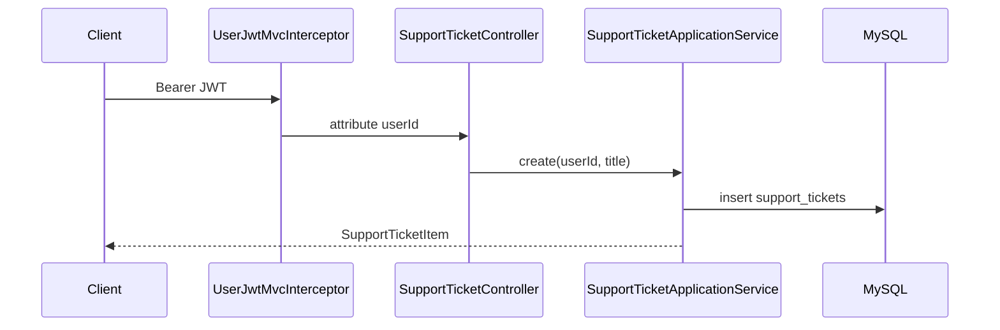

# SupportTicketApplicationService

| 项 | 内容 |
|----|------|
| 类 | `com.tokenhub.usercenter.application.SupportTicketApplicationService` |
| HTTP 入口 | `SupportTicketController`（`/user/support/tickets`） |
| 持久化 | `SupportTicketMapper`、`SupportTicketMessageMapper`（MyBatis-Plus） |
| 认证 | 依赖 `UserJwtMvcInterceptor` 注入的 `userId` |

---

## 1. 背景

P8 阶段需要 C 端用户提交客服工单、查看列表、在工单下留言。运营侧（`ops-console`）的 AGENT 回复、状态流转、赔付等**不在本服务当前范围**；本服务仅实现**用户侧** CRUD 与 `role=USER` 消息。

表结构来自 `support_tickets`（V1）与 `support_ticket_messages`（V7）。

---

## 2. 作用

| 用例 | 方法 | HTTP |
|------|------|------|
| 列出当前用户工单 | `listForUser` | `GET /user/support/tickets` |
| 创建工单 | `create` | `POST /user/support/tickets` |
| 列出工单消息 | `listMessages` | `GET /user/support/tickets/{ticketId}/messages` |
| 用户追加回复 | `appendUserMessage` | `POST /user/support/tickets/{ticketId}/messages` |

所有操作均校验 **工单归属**（`ticket.userId == 当前 userId`），否则 `NOT_FOUND`「工单不存在」（不暴露他人工单 ID）。

---

## 3. 实现要点

### 3.1 列表与创建

- **列表**：`user_id = ?`，按 `updated_at` 降序，映射为 `SupportTicketItem`（id、title、status、priority、时间戳）。
- **创建**：插入 `support_tickets`，默认 `status=OPEN`、`priority=NORMAL`，返回 `SupportTicketItem`。

### 3.2 消息

- **列表**：`ticket_id` 匹配，按 `created_at` 升序 → `SupportTicketMessageItem`。
- **回复**（`@Transactional`）：
  1. `assertTicketOwned`
  2. 插入 `support_ticket_messages`：`role=USER`，`body` 为正文
  3. 更新工单 `last_message_preview`（trim 后最多 **500** 字符）

```61:81:user-center-service/src/main/java/com/tokenhub/usercenter/application/SupportTicketApplicationService.java
  public SupportTicketMessageItem appendUserMessage(long userId, long ticketId, String body) {
    assertTicketOwned(userId, ticketId);
    // ... insert message ...
    String preview = body.trim();
    if (preview.length() > 500) {
      preview = preview.substring(0, 500);
    }
    supportTicketMapper.update(
        null,
        new LambdaUpdateWrapper<SupportTicketPo>()
            .eq(SupportTicketPo::getId, ticketId)
            .set(SupportTicketPo::getLastMessagePreview, preview)
    );
    return toMessageItem(loaded != null ? loaded : row);
  }
```

### 3.3 归属校验

```84:88:user-center-service/src/main/java/com/tokenhub/usercenter/application/SupportTicketApplicationService.java
  private void assertTicketOwned(long userId, long ticketId) {
    SupportTicketPo t = supportTicketMapper.selectById(ticketId);
    if (t == null || !t.getUserId().equals(userId)) {
      throw new BusinessException(ErrorCode.NOT_FOUND, "工单不存在");
    }
  }
```

### 3.4 数据模型（库表）

| 表 | 关键字段 |
|----|----------|
| `support_tickets` | `user_id`, `title`, `status`, `priority`, `last_message_preview` |
| `support_ticket_messages` | `ticket_id`, `user_id`, `role` (`USER`\|`AGENT`), `body` |

---

## 4. 请求流



---

## 5. 优劣分析

| 优点 | 缺点 |
|------|------|
| 用户只能访问自己的工单 | Application 直接依赖 Mapper，分层不纯 |
| 列表带 `last_message_preview` 减少 N+1 | 无分页、无全文搜索 |
| 消息角色字段为 AGENT 预留 | 无用户侧关闭工单、无附件 |
| 事务保证消息与预览一致 | `updated_at` 依赖 DB ON UPDATE，非显式 touch |

---

## 6. 业界更好的方案

| 方案 | 说明 |
|------|------|
| **Zendesk / Intercom / Freshdesk API** | 托管工单、SLA、客服工作台 |
| **事件驱动** | `TicketCreated` → 通知 ops、WebSocket 推送 |
| **CQRS + 读模型** | 列表页专用投影，支持分页与搜索 |
| **对象存储附件** | 截图/日志上传 presigned URL |

**建议**：运营回复走 `ops-console` 写 `role=AGENT`；本服务保持用户 API 稳定；后续抽 `SupportTicketRepository` 并增加 `page`/`size` 查询参数。

---

## 7. 配置项

无独立业务配置；依赖 MySQL 与 JWT（见 [08-路由与配置.md](../08-路由与配置.md)）。

---

## 8. 相关文档

- [01-UserJwtMvcInterceptor.md](./01-UserJwtMvcInterceptor.md)
- [08-路由与配置.md](../08-路由与配置.md)
- SQL：`deploy/sql/V1__core_schema.sql`、`deploy/sql/V7__p5_p7_p8_extensions.sql`
